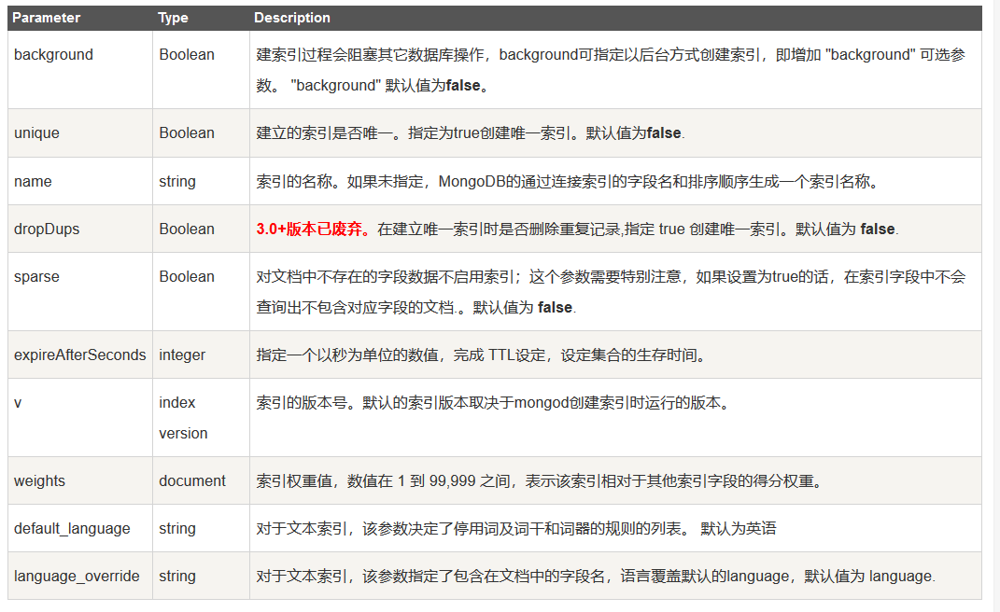
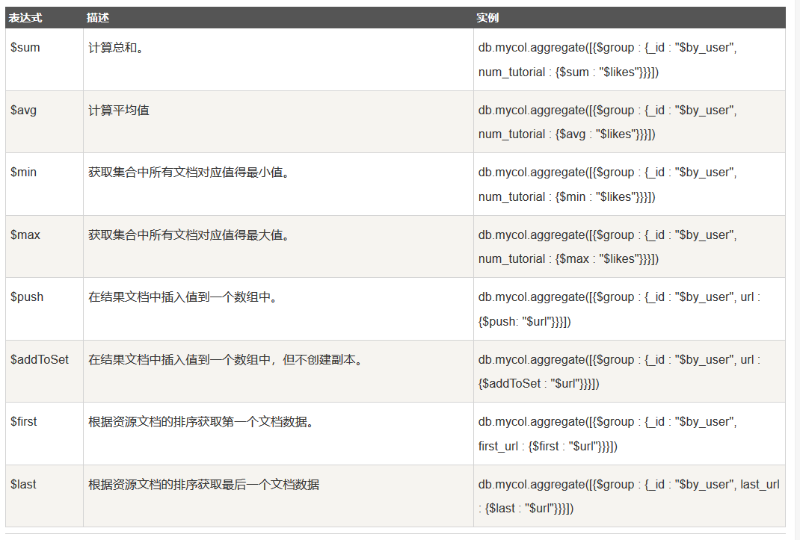
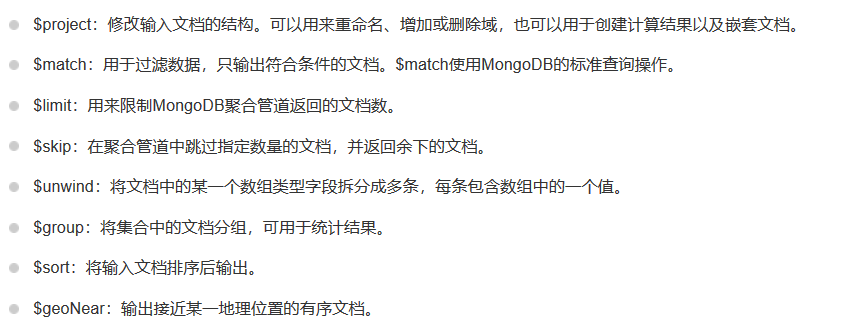

# MongoDB使用
## MongoDB概念解析
| sql术语 | mongodb术语 | 解释 |
| :---: | :---: | :---: |
| datebase | database | 数据库 |
| table | collection | 表/集合 |
| row | document | 行记录/文档 |
| column | field | 列/字段 |

## MongoDB语法
### 创建/删除数据库
```
show dbs;//查看所有数据库
use databasename;//如果数据库不存在创建数据库，若存在则直接切换到该数据库
db.dropDatabase();//删除当前数据库
```
### 创建/删除集合
```
show collections;//查看所有集合
db.createCollection(name,options);//创建集合
db.collectionName.drop();//删除集合
```
### 增删改查

```
db.collectionName.insert({});
db.collectionName.delete({});
db.collectionName.update({});
db.collection.find({});
```
### 查询语法
|操作|格式|示例|
|---|---|---|
|等于|key:value|db.col.find({key:value})|
|大于|key:{$gt:value}|db.col.find{key:{$gt:value}}|
|大于等于|key:{$gte:value}|db.col.find{key:{$gte:value}}|
|小于|key:{$lt:value}|db.col.find{key:{$lt:value}}|
|小于等于|key:{$lte:value}|db.col.find{key:{$lte:value}}|

#### AND
```
db.col.find({key1:value1, key2:value2}).pretty();
```
#### OR
```
db.col.find({$or:[{key1:value1},{key2:value2}]);
```

#### limit-skip
```
db.col.find({key:value}).skip(1).limit(10);
```

#### sort
```
db.col.find({key:value}).sort({key:1/-1});//1：表示升序;-1：表示降序
```

### 索引


```
db.col.createIndex({key:1/-1});//1：表示升序建索引;-1：表示降序建索引。当然还有其他参数
```

### MapReduce
```
db.collection.mapReduce(
   map,          // 即map函数。映射函数(生成键值对序列,作为reduce的参数)。
   reduce,       // 即reduce函数。统计函数。
   options       // 一些选项
)

```
#### map部分
函数：function map(){
　　　　emit(param1, param2);
　　}
作用：用于分组
参数说明：
　　param1：需要分组的字段，this.字段名
　　param2：需要进行统计的字段，this.字段名  

#### reduce部分
作用：处理需要统计的字段
函数：function reduce(key, values){
　　　　// 统计字段处理
　　}
参数说明：
　　key： 指分组字段（emit的param1）对应的值
　　values：指需要统计的字段（emit的param2）值组成的数组  

#### option部分
out：将统计结果存放到集合中 (不指定则使用临时集合,在客户端断开后自动删除)
query：一个筛选条件，只有满足条件的文档才会调用map函数（query，limit，sort可以随意组合）
sort：和limit结合的sort排序参数（也是在发往map函数前给文档排序），可以优化分组机制
limit：发往map函数的文档数量的上限（要是没有limit，单独使用sort的用处不大）

#### mapReduce示例
```
db.col.mapReduce{
    function map(){
        emit(this.key,this.value);
    },
    function reduce(key,values){
        //doSomething
        return Array.sum(values);
    },
    {
        out:"total",
        query:{"time":"2019"}
    }
}
```
### 管道
  



#### $lookup
```
db.product.aggregate([
      {
       $lookup:
         {
            from: "orders",
            localField: "_id",
            foreignField: "pid",
            as: "inventory_docs"
         }
    }
 ])
```  
from: "要连接的表",
localField: "当前Collection中需要连接的字段",
foreignField: "外连Collection中连接查询的字段",
as: "把获取到的的值赋值给这个字段
#### 管道示例
```
    db.getCollection("topics").aggregate([
		{
			$match:{
			    "race_time" : {"$gte":1522512000000,"$lte":1525103999000},
			    "type":3
			}
		},
		{
		    $group:{
		        _id:{"teacherId":"$teach_id","tipId":"$tips._id"},
		        evaluationTypes:{
		            $push:"$evaluation_type"
		        },
		        sum: {$sum: 1}
		    }
		},
		{
		    $group:{
		        _id: null,
		        list:{
		            $push:"$$ROOT"
		        },
		        total: {$sum: 1}
		    }
		},
		{
		    $unwind:"$list"
		},
		{
            $sort: {"list.sum": -1}
		},
		{
		    $skip: 0
		},
		{
		    $limit: 100
		}
	])
```

#### 管道示例
```
db.getCollection("user_learning_record").aggregate([
{
  $project:{
  	userId:1,
  	courseId:1,
  	videoClassTime:1,
  	time:{"$dateToString":{"format":"%Y-%m-%d","date":'$learningStartTime'}}
  }
},
{
  $match:{
  	userId:"1262231516059045890",
  	videoClassTime:{$gt:0}
  }
},
{
  $group:{
  	_id:{time:"$time",cid:"$courseId"},
  	sum:{$sum:"$videoClassTime"}
  }
},
{
  $project:{
  	courseClassTime:'$sum',
  	time:'$_id.time',
  	courseId:'$_id.cid'
  }
},
{
  $sort:{
  	"time":-1
  }
}
]);
```