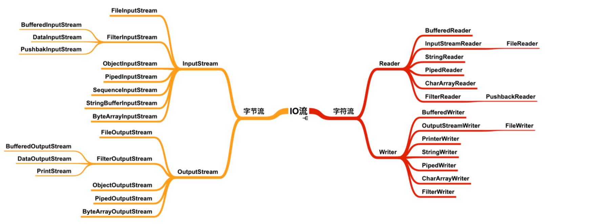
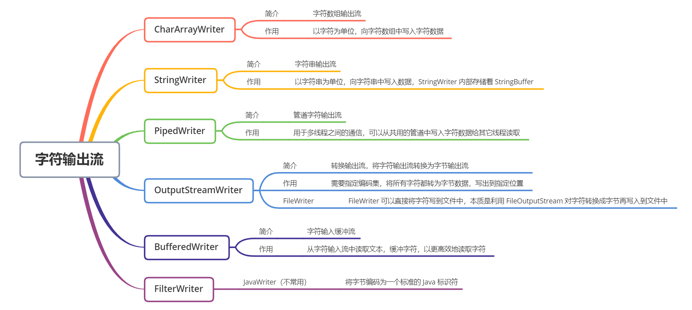

# IO
    IO分为文件IO，网络IO。IO中传输的则是流，在BIO中，根据数据流向分为输入流(InputStream/Reader)，输出流(OutputStream/Writer)。
    根据数据类型，则分为字节流，字符流。字符流的本质其实还是字节流，只不过将字节流的数据进行字符编码解码后(即InputStreamReader转换，
    内部维护了一个StreamDecoder)，转换为对应字符。所以对于字符类型的数据我们应当采用字节流，而对于音频/视频/图片等数据采用字节流。

## 字节输入流

## 字节输出流

## 字符输入流

## 字符输出流

