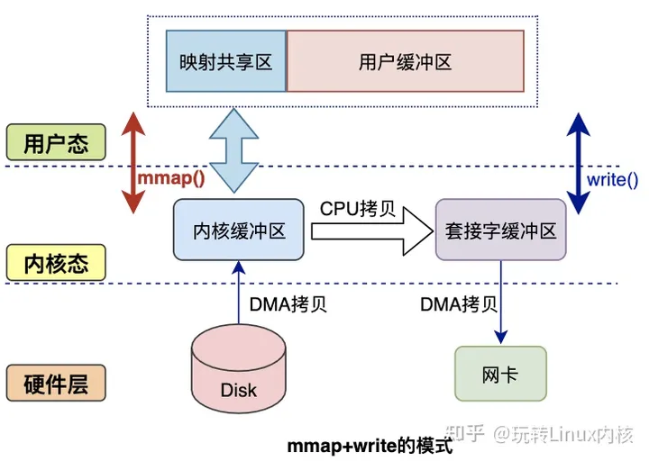

# ByteBuffer


## 重要参数

> 0 <= position < limit <= capacity

|name|value|description|
|---|---|:---|
|mark|-1|标记位置|
|position|0|当前下标|
|limit|int|限制大小|
|capacity|int|容量|
|address|long|堆外内存地址：仅由直接内存缓冲区使用|
|hb|byte[]|堆内存储：heap buffer|
|offset|int|偏移量|
|isReadOnly|boolean|true只读：仅对堆缓冲区有效|

## 构造

```java
// 堆缓冲器
public static ByteBuffer allocate(int capacity) {
    if (capacity < 0)
        throw new IllegalArgumentException();
    return new HeapByteBuffer(capacity, capacity);
}
// 直接内存缓冲器
public static ByteBuffer allocateDirect(int capacity) {
    return new DirectByteBuffer(capacity);
}

public static ByteBuffer wrap(byte[] array,
                                int offset, int length)
{
    try {
        return new HeapByteBuffer(array, offset, length);
    } catch (IllegalArgumentException x) {
        throw new IndexOutOfBoundsException();
    }
}
```

## 重要方法

  

## 读写模式

> ByteBuffer中读写模式不能随意切换：  
> 在写入数据后，调用`flip`切换为读模式，此时将`limit`指向`position`的位置，`position`指向0，表示从`0`开始读到`limit - 1`的位置。  
> 在读完数据后，调用`clear`清除数据，此时`position`指向`0`，`limit`指向`capacity`，从头开始写入数据。  


## 堆外内存

堆外内存（DirectBuffer）是Java虚拟机（JVM）堆以外的内存，也称为直接内存。这种内存直接受操作系统管理，而不是由JVM虚拟机管理。

堆外内存的主要特点包括：

1. 零拷贝：减少复制次数，并非真的0次复制。当进行网络I/O 操作、文件读写时，堆内内存都需要转换为堆外内存，然后再与底层设备进行交互。
2. 降低JVM GC 对应用程序影响：因为堆外内存不受 JVM 管理。
3. 堆外内存可以实现进程之间、JVM 多实例之间的数据共享。
4. 因为是堆外内存需要手动释放（它的缺点）

### 内核

    用户态和内核态是操作系统的两种运行状态。

>内核态：处于内核态的 CPU 可以访问任意的数据，包括外围设备，比如网卡、硬盘等，处于内核态的 CPU 可以从一个程序切换到另外一个程序，并且占用 CPU 不会发生抢占情况，一般处于特权级 0 的状态我们称之为内核态。  
>  
>用户态：处于用户态的 CPU 只能访问受限资源，不能直接访问内存等硬件设备，不能直接访问内存等硬件设备，必须通过「系统调用」陷入到内核中，才能访问这些特权资源。


在 CPU 的所有指令中，有一些指令是非常危险的，如果错用，将导致整个系统崩溃，比如：清空内存，修改时钟等。如果所有的程序代码都能够直接使用这些指令，那么很有可能我们的系统一天将会死 n 次。  
所以，CPU将指令分为 特权指令 和 非特权指令 ，对于较为危险的指令，只允许操作系统本身及其相关模块进行调用，普通的、用户自行编写的应用程序只能使用那些不会造成危险的指令。  
基于安全的考虑，CPU 提供了特权分级机制，把区域分成了四个 Ring，越往里权限越高，越往外权限越低。


**用户态转为内核态**

1. 系统调用：这是用户态进程主动要求切换到内核态的一种方式，用户态进程通过系统调用申请使用操作系统提供的服务程序完成工作。
2. 异常：当CPU在执行运行在用户态下的程序时，发生了某些事先不可知的异常，这时会触发由当前运行进程切换到处理此异常的内核相关程序中，也就转到了内核态，比如缺页异常。
3. 外围设备的中断：当外围设备完成用户请求的操作后，会向CPU发出相应的中断信号，这时CPU会暂停执行下一条即将要执行的指令转而去执行与中断信号对应的处理程序，如果先前执行的指令是用户态下的程序，那么这个转换的过程自然也就发生了由用户态到内核态的切换。比如硬盘读写操作完成，系统会切换到硬盘读写的中断处理程序中执行后续操作等。

这3种方式是系统在运行时由用户态转到内核态的最主要方式，其中系统调用可以认为是用户进程「主动」发起的，异常和外围设备中断则是「被动」的。


### 零拷贝

#### 传统数据拷贝


#### 减少拷贝




