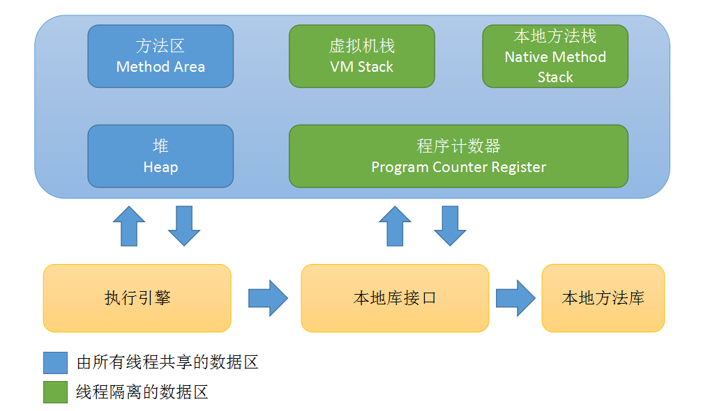

# jvm内存区域
</img>

## jvm运行时数据区域
1. **程序计数器**：当前线程所执行的字节码的行号指示器。java虚拟机中多线程就是通过线程轮流切换并分配处理器执行时间来实现的，每条线程都需要一个独立的程序计数器，此区域属于线程私有。如果线程正在执行的时java方法，则计数器记录的时字节码指令地址，如果执行的时native方法，则计数器为空。此内存取余时java虚拟机中唯一没有规定OutOfMemorryError的区域。
2. **Java虚拟机栈**：属于线程私有，生命周期与线程相同。虚拟机栈描述的是Java方法执行的内存模型：每个方法执行的同时，会创建一个栈帧用于存储局部变量表，操作数栈，动态连接，方法出口等等信息。一个方法从调用到结束，对应一个栈帧在虚拟机栈中入栈和出栈。此区域包含两种异常情况：a：如果线程请求的栈深度大于虚拟机所允许的深度，将抛出StackOverflowError异常；b：如果虚拟机可以动态扩展，在扩展时无法申请到足够的内存，将抛出OutOfMemorryError异常。
    1. *局部变量表*：存放了编译器可知的各种基本数据类型，对象引用，returnAddress类型。
3. **本地方法栈**：此处与虚拟机相似，其区别：虚拟机栈为虚拟机执行java方法，而本地方法栈则为虚拟机执行Native方法服务。
4. **java堆**：线程共享，用于存放对象实例。Java堆中可分为：新生代和老年代；再细致：分为Eden空间，From Survivor空间，To Survivor空间等。从内存分配角度来看，线程共享的java堆中可能划分处多个线程私有的分配缓冲区（Thread Local Allocation Buffer TLAB）。
5. **方法区**：与java堆一样属于线程共享，用于存储已被加载的类信息，常量，静态变量，即时编译器编译后的代码等数据。如果方法区无法分配足够内存，将抛出OutOfMemorryError异常。
6. **运行时常量池**：Class文件中除了有类的版本，字段，方法，接口等描述信息外，还有一项信息时常量池，用于存放编译器生成的各种字面量和符号引用，这本分内容将在类加载后进入方法区的运行时常量池中存放。运行时常量池相对于Class文件常量池的另外一个重要特征时具备动态性，运行时期间也可以将新的常量放入运行时常量池。内存不足时，也会抛出OutOfMemorryError异常。
    1. *字面量*：字面量比较接近java语言层面的常量概念，如字符串，声明为final的常量值等等。
    2. *符号引用*：类和接口的全限定名；字段的名称和描述符；方法的名称和描述符。
7. **直接内存**：在jdk1.4中加入了NIO类，引入了一种基于通道Channel与缓冲区Buffer的I/O方式，它可以使用native函数库直接分配堆外内存，然后通过一个存储在java堆中的DirectByteBuffer对象作为这块内存的引用进行操作。这样在一些场景中，避免了在java堆和native堆中来回复制数据。内存不足时，也会抛出OutOfMemorryError异常。