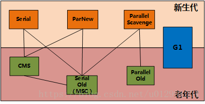
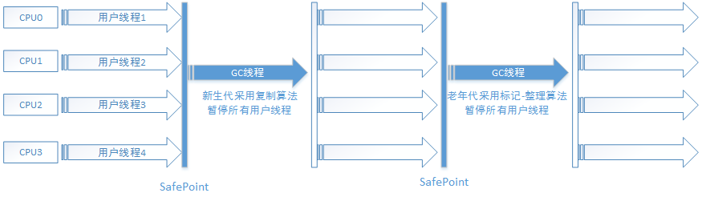
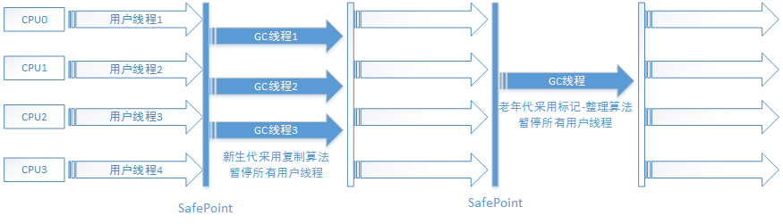
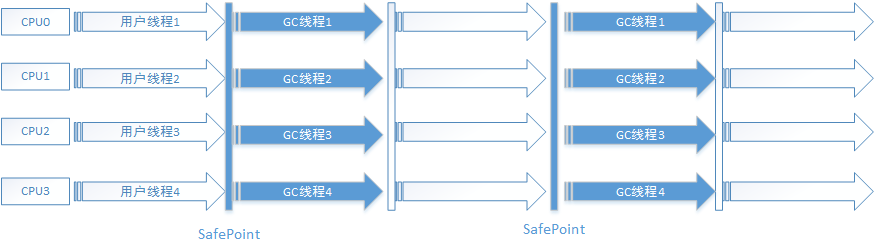
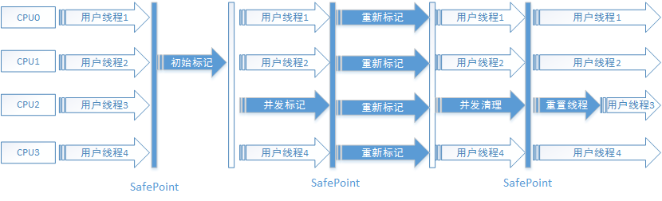
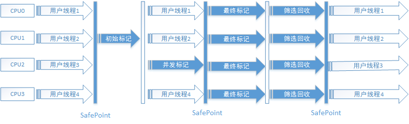

# 垃圾收集器和内存分配
## 对象是否需要被回收
### 引用计数法
引用计数法：给对象添加一个引用计数器，每当有一个地方引用它时，计数器+1；当引用失效时，计数器-1；任何时刻计数器=0，则表示对象不再被使用。但是其缺陷：很难解决对象之间的相互循环引用的问题。
### 可达性分析算法
通过可达性分析算法判定对象是否存活。其基本思路：通过一系列称为“GC Roots”的对象作为起始点，从这些节点开始向下搜索，搜索走过的路径称为引用链，当一个对象到GC Roots没有任何引用链相连，则证明改对象不可达，该对象可被回收。
在java语言中，可作为GC Roots对象包括一下几种：
1. 虚拟机栈中引用的对象
2. 方法区中的类静态属性引用对象
3. 方法区中常量引用的对象
4. 本地方法栈中引用的对象  
## 引用
判定对象是否存活都与引用有关。而引用则分为强引用，软引用，弱引用，虚引用。
1. 强引用：程序代码中普遍存在的，类似new 的对象的引用，只要强引用存在，垃圾收集器就永远不会回收
2. 软引用：用来描述一些还有用但非必需的对象。在系统将要发生内存溢出异常之前，将会对这些对象列入回收范围之中进行第二次回收。如果这次还没有足够内存，则抛出内存溢出异常。SoftReference类实现软引用。
3. 弱引用：也是用来描述非必需的对象，但是它的强度比软引用更弱一些。被弱引用关联的对象只能生存到下一次垃圾回收之前。当垃圾回收不管当前内存是否足够，都会回收掉弱引用关联的对象。WeakReference类实现弱引用。
4. 虚引用：它是最弱的一种引用关系，一个对象是否有虚引用的存在，不会对其生存时间构成影响，也无法通过虚引用来取得一个对象实例。但是设置虚引用的目的是在这个对象被回收时，将收到一个通知。PhantomReference类实现虚引用。
  
## 垃圾收集算法
### 标记-清除算法
首先标记出所有的需要回收的对象，标记完成后统一回收所有标记的对象。主要不足之处：a：标记和清除两个过程效率都不高；b：空间问题，标记清除后会产生大量不连续的内存碎片，空间碎片太多可能会导致以后程序运行中的大对象，在无法找到足够连续内存而不得不提前触发另一次垃圾收集动作。 
</img>
### 复制算法
将可用内存容量分为大小相等两块，每次使用其中一块，当其中一块使用完了，就将存活的对象复制到另一块中，然后再把已使用过的内存空间清理掉。主要不足之处：将可使用内存缩小为原来的一半。 
</img>
### 标记-整理算法
复制算法再对象存活率较高的进行复制效率低下，更关键的是内存空间被占用。 
根据老年代的特点，有人提出了标记-整理：标记过程与标记清除算法一致，但是后续步骤不是直接对可回收对象进行清理，而是将所有存活对象都向一端移动，然后清理掉边界之外的内存。 
</img>
### 分代收集算法
根据不同代使用不同算法

## 垃圾收集器
jdk1.7 默认垃圾收集器Parallel Scavenge（新生代）+Parallel Old（老年代）

jdk1.8 默认垃圾收集器Parallel Scavenge（新生代）+Parallel Old（老年代）

jdk1.9 默认垃圾收集器G1 

新生代收集器：Serial、ParNew、Parallel Scavenge；

老年代收集器：Serial Old、Parallel Old、CMS；

整堆收集器：G1； 
</img>

### Serial收集器（新生代）
Serial收集器是一个单线程收集器，再收集垃圾时，会暂停其他所有的工作线程，直到收集结束。 
**优势**：简单而高效（与其他单线程收集器比），对于单个CPU的环境来说，Serial收集器没有线程交互的开销，专心做垃圾回收自然可以获得最高的单线程收集效率。 
</img>

Serial/Serial Old收集器运行示意图

### ParNew收集器（新生代）
ParNew收集器其实就是Serial收集器的多线程版本，除了使用多条线程进行垃圾收集之外，其余行为包括收集器可用的所有控制参数，收集算法，Stop The World，对象分配规则，回收策略等都与Serial一致。 
</img>

ParNew/Serial Old收集器运行示意图

ParNew收集器除了能与Serial Old收集器配合之外，只能与CMS收集器进行合作。

### Parallel Scavenge收集器（新生代）
Parallel Scavenge收集器是一个新生代收集器，采用的是”复制算法“，又是并行的多线程收集器。Parallel Scavenge收集器的目标是达到一个可控制的吞吐量。（吞吐量=运行用户代码时间/（运行用户代码时间+垃圾收集时间））而且Parallel Scavenge收集器在用户手动优化存在困难时，还可以提供使用自带的自适应调节策略。
</img>

Parallel Scavenge/Parallel Old收集器运行示意图

### Serial Old收集器
Serial Old是Serail的老年代收集器，它同样也是一个单线程收集器，使用”标记-整理“算法。在server模式下，有两种用途：1.在jdk1.5以及之前的版本中与Parallel Scavenge收集器进行搭配使用。2.作为CMS收集器的后备预案，在并发收集发生Concurrent Mode Failure时使用。
</img>

Serial/Serial Old收集器运行示意图

### Parallel Old收集器
Parallel Old收集器是Parallel Scavenge收集器的老年代版本，使用多线程和”标记-整理“算法。“吞吐量优先“收集器应用组合。
</img>

Parallel Scavenge/Parallel Old收集器运行示意图

### CMS收集器
CMS收集器是一种以获取最短回收停顿时间为目标的收集器。CMS收集器是基于”标记-清除“算法。
运行步骤如下4步：
1. 初始标记（Stop The World）
2. 并发标记
3. 重新标记（Stop The World）
4. 并发清除

整个过程耗时最长的是并发标记 和 并发清除。

</img>

CMS收集器运行示意图

缺陷：  

1. CMS收集器对CPU资源非常敏感。
2. CMS收集器无法处理浮动垃圾（在并发清除过程中产生的垃圾，在本次GC中无法处理，需要等到下一次）。由于垃圾收集阶段用户线程还需要运行，那就需要预留足够的内存空间给用户线程使用，因此CMS收集器不能像其他收集器那样等到老年代几乎填满再清理，需要预留一部分内存提供并发收集时程序运行使用。如果预留内存不足，则会出现”Concurrent Mode Failure“，这是虚拟机将启动后备预案：临时启用Serial Old收集器。
3. CMS基于 ”标记-清除“算法。会有很多内存碎片，可能导致频繁的GC。

### G1收集器
G1是一款面向服务端的收集器。其具备以下特点：  

1. 并行与并发
2. 分代收集
3. 空间整合
4. 可预测的停顿

G1运行步骤大致如下：

1. 初始标记
2. 并发标记
3. 最终标记
4. 筛选回收  
  
 </img>

G1收集器运行示意图

## 内存分配与回收策略
对象的内存分配，往大方向将，就是再堆上进行分配，对象主要分配在新生代的Eden区上，如果启动了本地线程分配缓冲，将按线程优先在TLAB上分配。少数情况下也可能直接分配在老年代中，分配的规则并不是百分之百固定的，其细节取决于收集器组合，还有虚拟机的参数设置。
### 对象优先在Eden分配
大多数情况下，对象是在新生代Eden区中分配。当Eden区没有足够空间进行分配时，虚拟机将发起一次Minor GC。Eden：Survivor=8：1。
>新生代GC ： Minor GC，指发生在新生代的垃圾收集动作，因为java对象大多都具备朝生夕灭的特性，所以Minor GC非常频繁，一般回收速度较快。 
>老年代GC：Major GC/Full GC，指发生在老年代的GC，出现了Full GC，一般会伴随着至少一次Minor GC（并不绝对），比较慢。

### 大对象直接进入老年代
### 长期存活的对象进入老年代
既然虚拟机采用了分代收集管理内存。如果对象在Eden出生并经过一次Minor GC后仍然存活，并且能被Survivor容纳的话，将被移动到Survivor空间中，年龄=1。对象在Survivor空间每熬过一次GC ，年龄就+1，当它的年龄达到一定程度（默认15），就会晋升到老年代。