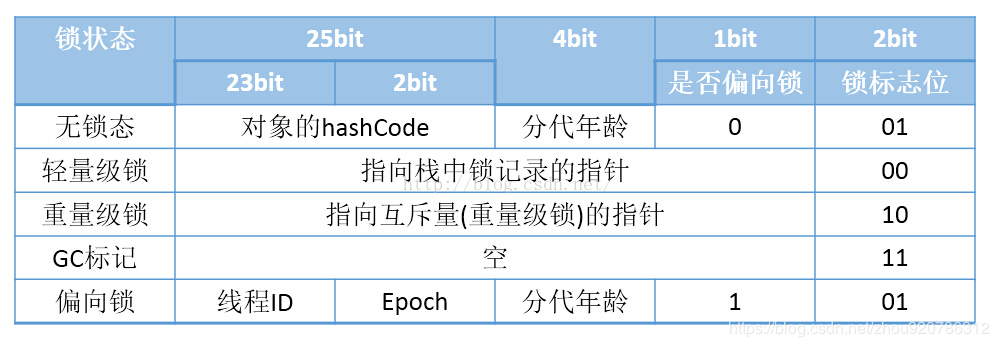

# 对象创建及内存布局
## 对象创建
    创建对象的方式：new关键字，反射，反序列化，clone。
### new创建对象
1. 虚拟机在遇到new指令时，首先将去检查这个指令的参数能否在常量池中定位到类的符号引用，并且检查这个符号引用代表的类是否被加载，解析和初始化过。如果没有，那么必须执行类加载过程。
2. 类加载检查通过后，虚拟机将为新生对象分配内存。对象所需内存大小在类加载完成后便可完全确定，为对象分配空间等同于把一块确定大小的内存从java堆中划分出来。Java堆是否规整取决于所采用的垃圾收集器是否带有压缩整理功能。
    1. 假设java堆中内存时绝对规整的，所有用过的内存都放在一边，未使用的放在一边，中间放着一个指针作为分界点的指示器，那分配内存即把指示器移动一段与新生对象大小相等的距离即可，这种分配方式称为“指针碰撞”。
    2. 假设java堆中内存不是规整的，已使用过的和未使用过的交叉，这时虚拟机就无法使用指针碰撞，虚拟机必须维护一个表，记录哪些内存可用，分配的时候从表中筛选处足够大的空间给新生对象，并更新列表记录。这种分配方式称为“空闲列表”。
3. 对象创建在虚拟机中是非常频繁的行为，即使是修改一个指针所指向的位置，并发情况下也并非安全的，可能出现在给对象a分配内存，指针还没来得及修改，对象b又同时使用了原来的指针来分配内存的情况。解决这个问题有两个方案：
    1. 对分配内存空间的动作进行同步处理--实际上虚拟机采用的CAS配上失败重试方式保证更新操作的原子性；
    2. 把内存分配的动作按照线程划分在不同的空间之中进行，即在每个线程在java堆中预先分配一小块内存，称为本地线程分配缓冲（TLAB），哪个线程需要分配，即在哪个线程的TLAB上进行分配，只有TLAB使用完并分配新的TLAB时，才需要同步。
4. 内存分配完成后，虚拟机需要将分配到的内存空间都初始化为0值，如果使用TLAB，这一工作可以提前至TLAB分配时运行。
5. 接下来，虚拟机要对对象进行必要的设置，例如这个对象是哪个类的实例，如何才能找到类的元数据信息，对象的哈希码，对象的GC分代年龄等信息。这些信息存放在对象的对象头中，根据虚拟机当前的运行状态的不同，如是否启用偏向锁等，对象头都会有不同的设置方式。
6. 上面工作完成后，从虚拟机角度上，对象已经创建完成，但是从java程序来看，对象创建才刚刚开始--init方法还没有执行，所有字段都为0，当对象执行init方法后，把对象按照程序员的意愿进行初始化，对象才算完成创建。

## 对象的内存布局
对象在内存中存储的布局分为3块：对象头，实例数据和对齐填充。
### 对象头
对象头包括两部分信息：第一部分用于存储对象自身的运行时数据，如哈希码，GC分代年龄，锁状态标志，线程持有的锁，偏向线程的ID，偏向时间戳等。这部分数据长度在32位和64位虚拟机中分别为32bit和64bit，官方称为“Mark Word”。Mark Word 被设计成一个非固定的数据结构以便在极小的空间内存储尽量多的信息，它会根据自己的状态复用自己的存储空间。  

32位虚拟机中对象头分配

对象头mark word

### 对齐填充
对齐填充并不是必要的，也没有特别的含义，它仅仅起着占位符的作用，由于hotspot vm的自动内存管理系统要求对象的起始地址必须是8字节的整数倍，换句话说就是对象的大小必须是8字节的整数倍，而对象头部分正好是8字节的倍数，因此，当对象实例数据部分没有对齐时，就需要通过对齐填充来补全。

## 对象的访问定位
目前主流的访问方式有使用句柄和直接指针两种方式。
### 使用句柄
如果使用句柄的话，那么java堆中将会划分处一块内存来作为句柄池，reference中存储的就是对象的句柄地址，而句柄中包含了对象的实例数据与类型数据各自的地址信息。其好处：reference中存放的是稳定的句柄地址，对象移动时只会改变句柄中的地址而reference不需要修改。如下图：

### 使用直接指针
使用直接指针访问，那么java堆对象的布局中必须考虑如何访问类型数据的相关信息，而reference中存储的直接就是对象地址。其好处就是：节省一次指针定位的时间开销，速度更快。hotspot中使用的就是直接指针方式。如下图所示：
