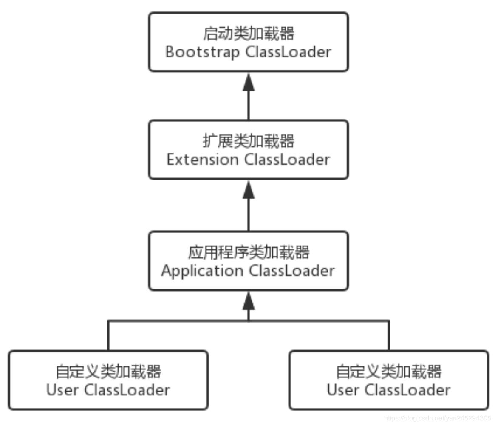

# 虚拟机类加载机制
## 1  类加载时机
<p>类从被加载到虚拟机内存中开始，到卸载出内存为止。整个生命周期：加载，验证，准备，解析，初始化，使用和卸载。其中验证，准备，解析3个部分统称为连接。</p>
</img>
<p>其中解析阶段并不是按部就班开始的。它在某些情况下可以在初始化阶段之后再开始，这是为了支持java语言的运行时绑定。</p>
<p>什么时候开始第一个阶段：“加载”？虚拟机并没有强制约束，但是对于初始化阶段，虚拟机规范则是严格规定了5种情况必须立即对类进行“初始化”（而加载，验证，准备自然要在之前进行）</p>  

1. 遇到new，getstatic，putstatic，invokestatic这四条指令，将触发初始化。生成这四条指令常见的java场景：
    1. 使用new关键字实例化对象；
    2. 读取或设置一个类的静态字段（被final修饰，已在编译期把结果放入常量池的静态字段除外）；
    3. 调用一个类的静态方法的时候。  
2. 使用java.lang.reflect包的方法对类进行反射调用的时候，如果类没有进行初始化，则需要先触发其初始化过程。
3. 当初始化一个类，发现其父类还没有进行初始化，则需要先触发其父类的初始化。
4. 当虚拟机启动时，需要一个执行主类，虚拟机会先初始化整个主类。
5. 当使用jdk1.7的动态语言支持时，如果一个java.lang.invoke.MethodHandle实例最后的解析结果REF_getStatic,REF_putStatic,REF_invokeStatic的方法句柄，并且整个方法句柄所对应的类没有进行初始化，则需要触发初始化。

## 2  类加载过程
### 2.1  加载
“加载”是类加载过程中的一个阶段，虚拟机需要完成以下三件事：  

1. 通过一个类的全限定名来获取定义此类的二进制字节流。
2. 将整个字节流所代表的静态存储结构转化为方法区的运行时数据结构。
3. 在内存中生成一个代表整个类的java.lang.Class对象，作为方法区整个类的各种数据的访问入口。

### 2.2 验证
确保Class文件的字节流中包含的信息符合当前虚拟机的要求，并且不会危害虚拟机自身的安全。
1. <font color="#FFA500">文件格式验证</font>
2. <font color="#FFA500">元数据验证</font>
3. <font color="#FFA500">字节码验证</font>
4. <font color="#FFA500">符号引用验证</font>

### 2.3  准备
准备阶段是正式为类变量（static修饰变量）分配内存并设置类变量初始值的阶段，这些变量所使用的内存都将在方法区中进行分配。

### 2.4  解析
解析阶段是虚拟机将常量池内的符号引用替换为直接引用的过程。
><font color="#FFA500">**符号引用**</font>：<font color="#43CD80">符号引用以一组符号来描述所引用的目标，符号可以是任何形式的字面量，只要使用时能无歧义的定位到目标即可。符号引用与虚拟机实现的内存布局无关，引用的目标并不一定已经加载到内存中。各种虚拟机实现的内存布局可以各不相同，但是它们能接受的符号引用必须一致，因为符号引用的字面量形式明确定义在java虚拟机规范的Class文件格式中。</font><br/>

><font color="#FFA500">**直接引用**</font>：<font color="#43CD80">直接引用时可以直接指向目标的指针，相对偏移量或是一个能间接定位到目标的句柄。直接引用与虚拟机的内存布局相关，同一个符号引用在不同虚拟机实例上翻译出来的直接引用一般不会相同。如果有了直接引用，那引用的目标必定已经在内存中存在。</font>
  
1. <font color="#FFA500">类或接口的解析</font>
2. <font color="#FFA500">字段解析</font>
3. <font color="#FFA500">类方法解析</font>
4. <font color="#FFA500">接口方法解析</font>

### 2.5  初始化
初始化阶段是执行类构造器clinit方法的过程。

类的初始化过程<clinit>是Java虚拟机（JVM）在类加载过程中的一个重要阶段。这个阶段主要负责初始化类的静态变量、执行静态代码块以及进行一些必要的验证和准备工作。以下是<clinit>过程的具体内容：

#### 2.5.1 静态变量的初始化

1. **显式赋值**：类中定义的静态变量在<clinit>过程中会被赋予显式指定的值。如果静态变量在声明时没有进行显式赋值，那么它们会被赋予Java语言规定的默认值（例如，int类型的默认值为0，引用类型的默认值为null）。
2. **静态代码块**：类中定义的静态代码块（static block）也会在<clinit>过程中被执行。静态代码块中的代码通常用于进行静态变量的复杂初始化操作，或者执行一些在类加载时需要完成的静态设置。

#### 2.5.2 执行顺序

1. **父类优先**：在子类的<clinit>方法执行之前，父类的<clinit>方法会先被执行。这是为了确保在子类使用父类的静态变量或静态方法之前，父类的静态成员已经被正确初始化。
2. **顺序一致性**：在同一个类中，静态变量的显式赋值和静态代码块的执行顺序是按照它们在源文件中出现的顺序进行的。这意味着，先出现的静态变量和静态代码块会先被初始化和执行。

#### 2.5.3 <clinit>方法的特性

1. **唯一性**：每个类在JVM中都有一个唯一的<clinit>方法，用于完成该类的静态初始化工作。
2. **线程安全**：<clinit>方法是线程安全的。在JVM中，对于同一个类的<clinit>方法的执行是互斥的，即多个线程同时尝试初始化同一个类时，只有一个线程能够执行<clinit>方法，其他线程必须等待该线程执行完成后才能继续。
3. **懒加载**：<clinit>方法是在类第一次被使用时触发的。这意味着，如果一个类在程序运行过程中从未被使用过（即没有创建过该类的实例，也没有访问过该类的静态变量或静态方法），那么该类的<clinit>方法就不会被执行。


## 3  类加载器
对于任何一个类，都需要由加载它的类加载器和这个类本身一同确立其在java虚拟机中的唯一性，每一个类加载器，都拥有一个独立的类名称空间。通俗的讲：比较两个类是否相等，只有这两个类是由同一个类加载器加载的前提下才有意义，否则，即使这两个类来源于同一个Class文件，被同一个虚拟机加载，只要加载他们的类加载器不同，那这两个类就必定不相等。
### 3.1  双亲委派模型
绝大部分java程序都会使用到以下3中系统提供的类加载器：  

1. <font color="#FFA500">启动类加载器（Bootstrap ClassLoader）</font>：<font color="#43CD80">这个类加载器负责加载`java_home`/lib目录中</font>
2. <font color="#FFA500">扩展类加载器（Extension ClassLoader）</font>：<font color="#43CD80">这个类加载器负责加载`java_home`/lib/ext目录中的</font>
3. <font color="#FFA500">应用程序类加载器（Application ClassLoader）</font>：<font color="#43CD80">它负责加载用户类路径（ClassPath）上的类  </font>
  
</img>

<p><font color="#FFA500">双亲委派模式破坏</font>：<font color="#43CD80">线程上下文类加载器（Thread Context ClassLoader），这个类加载器可以通过java.lang.Thread类的setContextClassLoader方法进行设置，如果创建线程时还未设置，它将会从父线程中继承一个，如果在应用程序的全局范围内都没有设置过的话，那这个类加载器默认就是应用程序类加载器。</font></p>


### **3.2 ✅ 可以互相识别的情况**

在 **双亲委派机制** 下，如果某个类是由 **同一个类加载器** 或其 **父类加载器** 加载的，那么它们是**可以互相识别的**。  


如果两个类的**类加载器相同**，或者**一个类的加载器是另一个类的父类加载器**，那么 JVM 认为它们是**相同的类**，可以正常进行类型转换 (`instanceof` 和强转不会抛出 `ClassCastException`)。

**示例**：
```java
public class ParentDelegationTest {
    public static void main(String[] args) throws Exception {
        // 获取系统类加载器（应用类加载器）
        ClassLoader appClassLoader = ClassLoader.getSystemClassLoader();

        // 由系统类加载器加载 SampleClass
        Class<?> class1 = appClassLoader.loadClass("SampleClass");

        // 由于 class1 是由 appClassLoader 加载的，所以它可以和 SampleClass 互相识别
        System.out.println(class1 == SampleClass.class); // true
    }
}

class SampleClass {
}
```
**解释**：
- `SampleClass.class` 由 **系统类加载器（Application ClassLoader）** 加载。
- `appClassLoader.loadClass("SampleClass")` 也是通过 **系统类加载器** 加载的。
- 因此，`class1 == SampleClass.class` 为 `true`，它们可以互相识别。

---

### **3.2 ❌ 无法互相识别的情况**
如果两个类的**类加载器不同**，并且**没有继承关系**，那么 JVM 认为它们是**不同的类**，即使它们来自相同的 `.class` 文件。

**示例：不同类加载器加载同一个类**
```java
public class ClassLoaderIsolationTest {
    public static void main(String[] args) throws Exception {
        MyClassLoader loader1 = new MyClassLoader();
        MyClassLoader loader2 = new MyClassLoader();

        Class<?> class1 = loader1.loadClass("SampleClass");
        Class<?> class2 = loader2.loadClass("SampleClass");

        System.out.println(class1 == class2);  // false，不是同一个类
        System.out.println(class1.newInstance() instanceof SampleClass); // ClassCastException
    }
}

class MyClassLoader extends ClassLoader {
    @Override
    protected Class<?> findClass(String name) throws ClassNotFoundException {
        // 这里应该读取字节码，但为了演示，我们直接返回一个默认实现
        return super.findClass(name);
    }
}
```
**解释**：
- `loader1` 和 `loader2` 各自加载了 `SampleClass`，JVM 认为它们是**不同的类**，所以 `class1 == class2` 为 `false`。
- `newInstance()` 生成的对象无法与 `SampleClass` 进行类型匹配，因此会抛出 `ClassCastException`。

---

### **3.3 🚀 关键点总结**
| **情况** | **是否可识别** | **原因** |
|---------|-------------|---------|
| **相同类加载器** 加载的类 | ✅ 是 | JVM 认为它们是同一个类 |
| **双亲委派机制下的类** | ✅ 是 | 父类加载器加载的类可以被子类加载器识别 |
| **不同类加载器加载的同名类** | ❌ 否 | JVM 认为它们是不同的类，即使字节码相同 |
| **破坏双亲委派机制的类** | ❌ 否 | 例如 Tomcat、OSGi 需要自定义类加载逻辑，导致类隔离 |

如果你想实现 **类之间可以互相识别**，确保：
1. **使用相同的类加载器**。
2. **使用双亲委派机制**，不要随意创建新的类加载器来加载相同的类。
3. **共享父加载器**，如 `ThreadContextClassLoader` 方案。

如果你有更具体的应用场景，比如插件机制、热加载等，我可以提供更细的优化方案！ 😊


## 4 困惑

    举个例子：ArrayList有个以Collection为参数的构造方法
    public ArrayList(Collection<? extends E> c)
    ArrayList肯定是BootstrapClassLoader 加载的

    如果我此时自定义了一个Collection子类，那么该类肯定是AppClassLoader或其子类加载的。
    这种情况下，ArrayList为什么可以识别出该类是Collection子类呢？

这是一个很好的问题！我们一步步分析 **为什么 `ArrayList` 可以识别出自定义的 `Collection` 子类**，即**父类加载器（BootstrapClassLoader）加载的类（ArrayList）为什么可以识别子类加载器（AppClassLoader）加载的类（自定义 Collection）**。  

---

### **🔹 4.1 `ArrayList` 的加载情况**
- `ArrayList` 属于 `java.util` 包，它是 **Java 核心类库**，由 **引导类加载器（BootstrapClassLoader）** 加载。
- 你自定义的 `MyCollection` 继承自 `Collection`，它的类加载器通常是 **应用类加载器（AppClassLoader）** 或 **自定义类加载器**。

🔹 **关键点**：
- `ArrayList` 在 `BootstrapClassLoader` 里加载，它本身只认 **由 `BootstrapClassLoader` 或更高级的类加载器加载的类**。
- 但是 `ArrayList` **不需要主动识别 `MyCollection`**，它只需要操作 **`Collection` 接口**，而 `Collection` 也是由 `BootstrapClassLoader` 加载的。

---

### **🔹 4.2 为什么 `ArrayList` 可以识别 `MyCollection`？**
因为 **`MyCollection` 是 `Collection` 的子类，而 `Collection` 是由 `BootstrapClassLoader` 加载的**，所以 `ArrayList` **可以通过 `Collection` 这个中间层访问它**。

**✅ 关键机制：Java 的类型检查基于父类**
当你调用 `new ArrayList(myCollection)` 时：
1. **`ArrayList(Collection<? extends E> c)` 这个构造方法的参数类型是 `Collection`**。
2. **`MyCollection` 继承自 `Collection`**，所以它的对象可以被赋值给 `Collection` 类型。
3. **`ArrayList` 只关心它的参数 `c` 是不是 `Collection` 类型**，不关心 `c` 是哪个类加载器加载的。
4. **`Collection` 是由 `BootstrapClassLoader` 加载的，而 `MyCollection` 是由 `AppClassLoader` 加载的**。
5. **JVM 允许子加载器加载的类向上转型为父加载器加载的类**，因为 **父加载器可以访问子加载器加载的类**。

**✅ 具体示例**
```java
import java.util.ArrayList;
import java.util.Collection;

public class ClassLoaderTest {
    public static void main(String[] args) {
        MyCollection myCollection = new MyCollection();
        ArrayList<String> list = new ArrayList<>(myCollection); // 这里不会报错

        System.out.println("List size: " + list.size());
        System.out.println("MyCollection's class loader: " + myCollection.getClass().getClassLoader());
        System.out.println("ArrayList's class loader: " + ArrayList.class.getClassLoader());
    }
}

// 自定义 Collection 子类
class MyCollection implements Collection<String> {
    @Override
    public int size() { return 0; }

    @Override
    public boolean isEmpty() { return true; }

    @Override
    public boolean contains(Object o) { return false; }

    @Override
    public java.util.Iterator<String> iterator() { return null; }

    @Override
    public Object[] toArray() { return new Object[0]; }

    @Override
    public <T> T[] toArray(T[] a) { return null; }

    @Override
    public boolean add(String s) { return false; }

    @Override
    public boolean remove(Object o) { return false; }

    @Override
    public boolean containsAll(Collection<?> c) { return false; }

    @Override
    public boolean addAll(Collection<? extends String> c) { return false; }

    @Override
    public boolean removeAll(Collection<?> c) { return false; }

    @Override
    public boolean retainAll(Collection<?> c) { return false; }

    @Override
    public void clear() {}
}
```

**运行结果**：
```
List size: 0
MyCollection's class loader: jdk.internal.loader.ClassLoaders$AppClassLoader@...
ArrayList's class loader: null
```

---

### **🔹 4.3 关键点总结**
**✅ 为什么 `ArrayList` 可以识别 `MyCollection`？**
1. **父加载器（BootstrapClassLoader）加载的 `ArrayList` 直接依赖 `Collection` 接口**，而 `Collection` 也是由 **BootstrapClassLoader** 加载的。
2. **子类加载器（AppClassLoader）可以加载 `Collection` 的子类 `MyCollection`**，因为它能访问 **父加载器加载的类**（即 `Collection`）。
3. **Java 允许子加载器加载的类向上转型为父加载器加载的类**，因此 `MyCollection` 可以作为 `Collection` 传递给 `ArrayList`。

**✅ 为什么父加载器（BootstrapClassLoader）不会报错？**
- `ArrayList` 并没有直接访问 `MyCollection`，它访问的是 **`Collection`**，而 `Collection` 是 **由 BootstrapClassLoader 加载的**，所以 `ArrayList` 认识 `Collection` 。
- `MyCollection` 被 `AppClassLoader` 加载，但它继承了 **BootstrapClassLoader 加载的 `Collection`**，所以 `ArrayList` 依然可以正常识别它。

---

### **🔹 4.4 可访问性原则**
| **情况** | **是否可识别** | **原因** |
|---------|-------------|---------|
| **子加载器加载的类** 访问 **父加载器加载的类** | ✅ 可以 | 子加载器默认会委托父加载器加载父类 |
| **父加载器加载的类** 访问 **子加载器加载的类** | ❌ 不行 | 父加载器不会主动查找子类加载的类 |
| **子类加载器加载的类，向上转型为父加载器加载的类** | ✅ 可以 | JVM 允许子类加载器加载的类向上转型为父类 |

---

### **🚀 4.5 结论**
- **`ArrayList(Collection<? extends E> c)` 可以接受 `MyCollection`，是因为 `MyCollection` 继承自 `Collection`，而 `Collection` 是由 `BootstrapClassLoader` 加载的。**
- **子类加载器（AppClassLoader）可以加载 `Collection` 的子类 `MyCollection`，并且 Java 允许向上转型，所以 `ArrayList` 可以识别 `MyCollection`。**
- **关键原则：子类加载器加载的类可以向上转型为父加载器加载的类，而父类加载器并不会主动查找子类加载器的类。**

这就是 `ArrayList` 可以正常接受 `MyCollection` 的原因！希望这个解释对你有帮助 😊