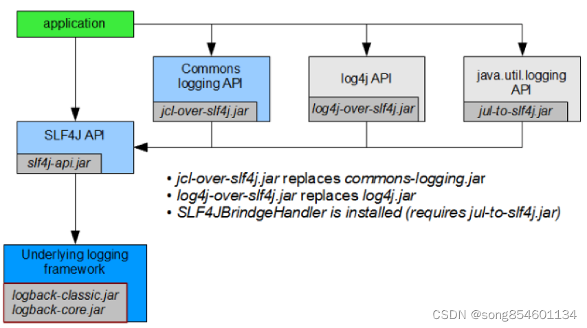
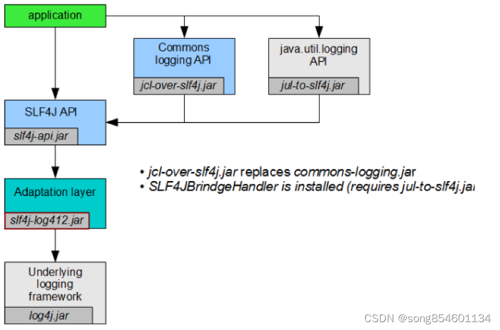
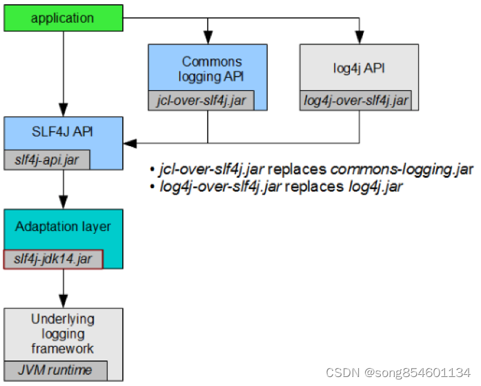

# 日志框架

## 常用框架

### 日志门面
1. JCL（Jakarta Commons Logging - apache）
2. slf4j

### 日志实现
1. JUL（java util logging）
2. logback
3. log4j
4. log4j2

### 关系图

>常用框架实现及桥接

>SLF4J各类实现

## 使用

>把Commons logging,log4j和java.util.logging桥接到SLF4J，底层使用logback的case

>把commons-logging和java.util.logging桥接到SLF4J，底层用log4j

>把commons-logging和log4j桥接到SLF4J，底层用java.util.logging

## 解决冲突

解决日志框架共存/冲突问题其实很简单，只要遵循几个原则： 
1. 统一使用一套日志实现 
2. 删除多余的无用日志依赖 
3. 如果有引用必须共存的话，那么就移除原始包，替换成`over/to`类型的包（over类型的包复制了一份原始接口，重新实现） 
4. 不能over的，使用日志抽象提供的指定方式，例如`jboss-logging`中，可以通过`org.jboss.logging.provider`环境变量指定一个具体的日志框架实现   

项目里统一了日志框架之后，无论用那种日志框架打印，最终还是走向我们中转/适配后的唯一一个日志框架。 
解决了共存/冲突之后，项目里就只剩一款日志框架。再也不会出现“日志打不出”，“日志配置不生效”之类的各种恶心问题，下班都能早点了！

## 参考文章
- [1] [空无](https://juejin.cn/post/6945220055399399455)