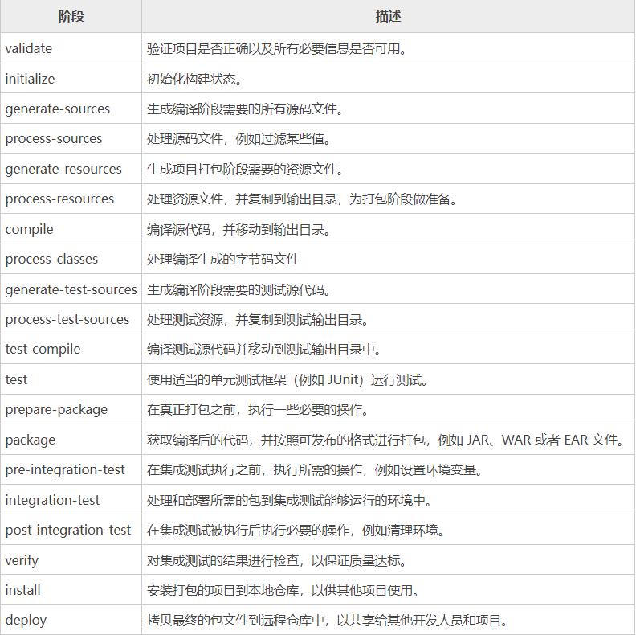
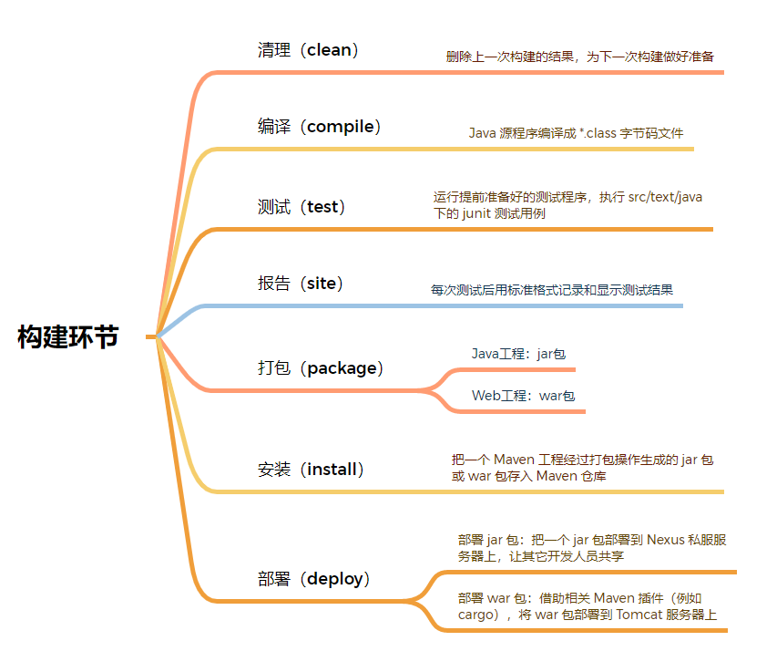

# maven


## 目录结构

```
project
|---src
|---|---main
|---|---|---java
|---|---|---resources
|---|---test
|---|---|---java
|---|---|---resources
|---pom.xml
```

## 仓库
> 项目POM配置仓库分为两种：项目profile仓库(profiles.profile.repositories.repository)；项目仓库(repositories.repository)
```xml
<repositories>
    <repository>
        <id>aliyun-releases</id>
        <url>https://maven.aliyun.com/repository/public</url>
        <releases>
            <enabled>true</enabled>
        </releases>
        <snapshots>
            <enabled>false</enabled>
        </snapshots>
    </repository>
</repositories>
```

> MAVEN全局配置仓库
```xml
<profile>
     <id>nexus</id>
     <repositories>
        <repository>
            <id>releases</id>
            <name>releases_info</name>
            <url>http://localhost:8081/nexus/repository/maven-releases/</url>
            <releases><enabled>true</enabled></releases>
            <snapshots><enabled>false</enabled></snapshots>
        </repository>
 
        <repository>
            <id>snapshot</id>
            <name>snapshot_info</name>
            <url>http://localhost:8081/nexus/repository/maven-snapshots/</url>
            <releases><enabled>false</enabled></releases>
            <snapshots><enabled>true</enabled></snapshots>
        </repository>
     </repositories>
</profile>
```

local_repo > settings_profile_repo > pom_profile_repo > pom_repositories > settings_mirror > central  


1. 多个mirror会按照顺序执行；第一个没有jar包或者mirrorOf没拦住，才会执行第二个；

2. 在mirrorOf与repositoryId相同的时候优先是使用mirror的地址

3. mirrorOf等于*的时候覆盖所有repository配置

4. 存在多个mirror配置的时候mirrorOf等于*放到最后，如果多个*，那就按照顺序执行；

5. 只配置mirrorOf为central的时候可以不用配置repository

多个私服，根据定义从上到下起作用，跟激活配置顺序无关。有很多 spring 包，在阿里云仓库可能有元数据，但是就是下载不了，需要调整相关仓库顺序

## 镜像

mirror相当于一个拦截器，它会拦截maven对remote repository的相关请求，把请求里的remote repository地址，重定向到mirror里配置的地址

```xml
<mirrors>
  <mirror>
    <id>nexus</id>
    <mirrorOf>!rdc-releases,!rdc-snapshots</mirrorOf>
    <url>http://maven.aliyun.com/nexus/content/groups/public/</url>
  </mirror>
  <mirror>
    <id>nexus-public-snapshots</id>
    <mirrorOf>public-snapshots</mirrorOf> 
    <url>http://maven.aliyun.com/nexus/content/repositories/snapshots/</url>
  </mirror>
</mirrors>
```
属性标签：
1. id：镜像源的标示
1. name：镜像名称
1. mirrorOf：被镜像的repository的ID，central表示中央仓库
1. url：镜像地址

|mirrorOf|description|
|---|:---|
|`<mirrorOf>*</mirrorOf>`|匹配所有远程仓库|
|`<mirrorOf>external:*</mirrorOf>`|匹配所有远程仓库，使用localhost的除外，使用file://协议的除外。也就是说，匹配所有不在本机上的远程仓库。|
|`<mirrorOf>repo1,repo2</mirrorOf>`|匹配仓库repo1和repo2，使用逗号分隔多个远程仓库。|
|`<mirrorOf>*,!repo1</miiroOf>`|匹配所有远程仓库，repo1除外，使用感叹号将仓库从匹配中排除|
|`<mirrorOf>central</miiroOf>`|匹配中央仓库|

## 私服

>如果在公司中多个项目模块中的的公共类用的都是一样的，那么不可能将这些一样的代码写两遍。所以将其中一个项目中的代码打包成私服，然后在另外一个模块中去进行引用。  
>除此之外，如果大公司中开发人员较多，大家同时去远程仓库将依赖下载到本地，那么对公司的带宽会造成很大的压力。很有可能会造成其他的问题。所以可以在公司的局域网内部去搭建一台服务器，开发人员所有的依赖去这台服务器中去访问，如果该台服务器中也没有该依赖，那么该服务器就去远程仓库查找，然后下载到该服务器，最后在返给开发者。  
>1. 加速下载速度
>2. 加速带宽，加速项目构建速度
>3. 方便公共使用
>4. 提高maven稳定性，中央仓库需要连外网才能访问，私服只需要连内网就可以访问。

### Nexus私服

>注意：nexus是java开发，所以需要保证电脑安装了java环境。

[Nexus Download](https://help.sonatype.com/repomanager3/product-information/download/download-archives---repository-manager-3)  
[Nexus 配置](https://blog.csdn.net/qq_50652600/article/details/131066029)


## 依赖
```xml
<dependency>
  <groupId>org.springframework.boot</groupId>
  <artifactId>spring-boot-starter-parent</artifactId>
  <version>2.3.12.RELEASE</version>
  <packaging>jar</packaging>
  <scope>compile/provided/runtime/test/system/import</scope>
  <optional>true/false</optional>
  <exclusions>
    <exclusion>
      <groupId></groupId>
      <artifactId></artifactId>
      <version></version>
    </exclusions>
  </exclusions>
</dependency>
```

### 坐标

Maven中的坐标使用三个『向量』在『Maven的仓库』中唯一的定位到一个『jar』包。
1. groupId：公司或组织的 id，即公司或组织域名的倒序，通常也会加上项目名称。示例：org.springframework.boot
2. artifactId：一个项目或者是项目中的一个模块的 id，即模块的名称，将来作为 Maven 工程的工程名。示例：spring-boot-starter-parent
3. version：版本号。示例：2.3.12.RELEASE
4. packaging：默认jar
```
<dependency>
  <groupId>org.springframework.boot</groupId>
  <artifactId>spring-boot-starter-parent</artifactId>
  <version>2.3.12.RELEASE</version>
</dependency>
```

### optional

    false：传递依赖（默认）  
    true：不传递依赖

>举例：A引用了B的依赖，而B又引用了C依赖。  
>1. 假如B引用C依赖的时候没有设置optional，那么A是可以使用C依赖的。  
>2. 假如B引用C依赖的时候将optional标签设置为了true，那么在A当中就无法使用C依赖相关的方法，并且A调用B依赖的方法，而B依赖方法使用到了C，这时候会报找不到C依赖下的类，因为C不参与A的打包。


### scope

|name|有效范围|依赖传递|是否打入jar包|示例|
|---|---|---|---|---|
|compile|all|是|是|spring-core|
|provided|compile,test|否|否|servlet-api|
|system|compile,test|是|||
|runtime|compile,test|是|是|JDBC驱动|
|test|test|否|否|JUnit|
|import||是|||


>1. compile：使用此依赖范围的Maven 依赖，对于编译、测试、运行三种classpath 都有效。典型的例子是spring-core,在编译、测试和运行的时候都需要使用该依赖。
>1. provided：对于编译和测试classpath有效，但在运行时无效。典型的例子是 servlet-api,，编译和测试项目的时候需要该依赖，假如需要打包成war然后放到tomcat当中运行，由于tomcat已经提供，就不需要Maven重复地引入一遍。所以将 scope 设置为 provided 的依赖不会参与项目的war打包。假如打包为jar，设置与不设置provided并不会影响maven将依赖打包到jar当中。
>1. system：system 元素与 provided 元素类似，但是被依赖项不会从 maven 仓库中查找，而是从本地系统中获取，systemPath 元素用于制定本地系统中 jar 文件的路径
>1. runtime：运行时依赖范围：对于测试和运行class-path有效，但在编译主代码时无效（对编译的classpath无效）。典型的例子是JDBC驱动实现，项目主代码的编译只需要JDK提供的JDBC接口，只有在执行测试或者运行项目的时候才需要实现上述接口的具体JDBC驱动。
>1. test：只对于测试classpath有效，在编译主代码或者运行项目的使用时将无法使用此类依赖。典型的例子是junit,它只有在编译测试代码及运行测试的时候才需要。
>1. import：导入依赖范围，该依赖范围只能与 dependencyManagement 元素配合使用，其功能是将目标 pom.xml 文件中 dependencyManagement 的配置导入合并到当前 pom.xml 的 dependencyManagement 中。

### 依赖传递

>Maven 依赖传递是指在一个 Maven 项目中，当一个依赖项（例如 A）依赖于另一个依赖项（例如 B），Maven 会自动将 B 的依赖项传递给 A。这意味着，当 A 引入了 B，Maven 会自动将 B 所依赖的所有其他依赖项也引入到 A 中。

### 依赖排除

  Optional和Exclusions都是用来排除jar包依赖使用的，两者在使用上却是不同的。Optional表示可选择的，Exclusions表示排除

  Optional定义true后，则不会传递任何依赖，项目需要主动引用依赖项

  Exclusions则是主动排除特定的依赖。

```xml
<dependencies>
    <dependency>
      <groupId>sample.ProjectA</groupId>
      <artifactId>Project-A</artifactId>
      <version>1.0</version>
      <scope>compile</scope>
      <exclusions>
        <exclusion>
          <groupId>sample.ProjectB</groupId>
          <artifactId>Project-B</artifactId>
        </exclusion>
      </exclusions> 
    </dependency>
</dependencies>
```

## 构建

### 生命周期

>maven拥有三套相互独立的生命周期，分别是clean，default和site



1. clean：clean生命周期的目的是清理项目
    1. pre-clean 执行一些清理前需要完成的工作；
    2. clean 清理上一次构建生成的文件；
    3. post-clean 执行一些清理后需要完成的工作；

2. default：default生命周期定义了真正构建项目需要执行的所有步骤，它是所有生命周期中最核心的部分。最主要的环节如下：
    1. compile ：编译项目的源码，一般来说编译的是src/main/java目录下的java文件至项目输出的主classpath目录中；
    2. test ：使用单元测试框架运行测试，测试代码不会被打包或部署；
    3. package ：接收编译好的代码，打包成可以发布的格式，如jar和war；
    4. install： 将包安装到本地仓库，供其他maven项目使用；
    5. deploy ：将最终的包复制到远程仓库，供其他开发人员或maven项目使用；

3. site：site生命周期的目的是建立和发布项目站点，maven能够基于pom文件所包含的项目信息，自动生成一个友好站点，方便团队交流和发布项目信息
    1. site ：生成项目站点文档；

### 指令




## 插件

[MAVEN官方插件](https://maven.apache.org/plugins/index.html)

### 内置插件

1. [maven-surefire-plugin](https://maven.apache.org/surefire/maven-surefire-plugin/)  

2. [maven-compiler-plugin](https://maven.apache.org/plugins/maven-compiler-plugin/)  

3. [maven-jar-plugin](https://maven.apache.org/plugins/maven-jar-plugin/)  

4. [maven-resources-plugin](https://maven.apache.org/plugins/maven-resources-plugin/)  

### 常见插件

1. [spring-boot-maven-plugin](https://docs.spring.io/spring-boot/docs/2.2.1.RELEASE/maven-plugin/)  
Spring Boot Maven Plugin是Spring Boot的一个插件，它以Maven的方式为Spring Boot应用提供支持，主要用来打包项目。使用该插件打包的JAR或WAR文件中包含了所有的依赖和资源文件，可以直接在命令行或者WEB服务器上启动运行。该插件可以指定要执行的类，如果未指定也能够自动检测项目中的main函数，并启动SPRING BOOT容器。

3. [maven-jar-plugin](https://maven.apache.org/plugins/maven-jar-plugin/)  
仅负责将源码打成jar包，不能独立运行。另外，可以根据你的设置，将依赖jar包路径和程序的主入口定义在所打jar包中的 MANIFEST.MF 文件里

3. [maven-dependency-plugin](https://maven.apache.org/plugins/maven-dependency-plugin/)  
maven-dependency-plugin最大的用途是帮助分析项目依赖，dependency:list能够列出项目最终解析到的依赖列表，dependency:tree能进一步的描绘项目依赖树，dependency:analyze可以告诉你项目依赖潜在的问题，如果你有直接使用到的却未声明的依赖，该目标就会发出警告。maven-dependency-plugin还有很多目标帮助你操作依赖文件，例如dependency:copy-dependencies能将项目依赖从本地Maven仓库复制到某个特定的文件夹下面。  
通常maven-dependency-plugin与maven-jar-plugin一块使用，可以打出当前项目包及其依赖包，但是要配置maven-dependency-plugin的输出路径，否则target无法看到依赖包。

6. [maven-release-plugin](https://maven.apache.org/maven-release/maven-release-plugin/)  
maven-release-plugin的用途是帮助自动化项目版本发布，它依赖于POM中的SCM信息。release:prepare用来准备版本发布，具体的工作包括检查是否有未提交代码、检查是否有SNAPSHOT依赖、升级项目的SNAPSHOT版本至RELEASE版本、为项目打标签等等。release:perform则是签出标签中的RELEASE源码，构建并发布。版本发布是非常琐碎的工作，它涉及了各种检查，而且由于该工作仅仅是偶尔需要，因此手动操作很容易遗漏一些细节，maven-release-plugin让该工作变得非常快速简便，不易出错。maven-release-plugin的各种目标通常直接在命令行调用，因为版本发布显然不是日常构建生命周期的一部分。

7. [maven-resources-plugin](https://maven.apache.org/plugins/maven-resources-plugin/)  
为了使项目结构更为清晰，Maven区别对待Java代码文件和资源文件，maven-compiler-plugin用来编译Java代码，maven-resources-plugin则用来处理资源文件。默认的主资源文件目录是src/main/resources，很多用户会需要添加额外的资源文件目录，这个时候就可以通过配置maven-resources-plugin来实现。此外，资源文件过滤也是Maven的一大特性，你可以在资源文件中使用${propertyName}形式的Maven属性，然后配置maven-resources-plugin开启对资源文件的过滤，之后就可以针对不同环境通过命令行或者Profile传入属性的值，以实现更为灵活的构建。

8. [maven-surefire-plugin](https://maven.apache.org/surefire/maven-surefire-plugin/)  
在default生命周期当中有一个test阶段，也就是只要我们执行mvn package或者mvn install都会经过test阶段，该阶段内置绑定了maven-surefire-plugin插件。
可能是由于历史的原因，Maven 2/3中用于执行测试的插件不是maven-test-plugin，而是maven-surefire-plugin。其实大部分时间内，只要你的测试类遵循通用的命令约定（以Test结尾、以TestCase结尾、或者以Test开头），就几乎不用知晓该插件的存在。然而在当你想要跳过测试、排除某些测试类、或者使用一些TestNG特性的时候，了解maven-surefire-plugin的一些配置选项就很有用了。例如 mvn test -Dtest=FooTest 这样一条命令的效果是仅运行FooTest测试类，这是通过控制maven-surefire-plugin的test参数实现的。

1. [versions-maven-plugin](https://www.mojohaus.org/versions/versions-maven-plugin/)  
versions-maven-plugin插件可以管理项目版本，特别是当Maven工程项目中有大量子模块时，可以批量修改pom版本号，插件会把父模块更新到指定版本号，然后更新子模块版本号与父模块相同，可以避免手工大量修改和遗漏的问题。

1. [maven-archetype-plugin](https://maven.apache.org/archetype/maven-archetype-plugin/)  
Archtype指项目的骨架，Maven初学者最开始执行的Maven命令可能就是mvn archetype:generate，这实际上就是让maven-archetype-plugin生成一个很简单的项目骨架，帮助开发者快速上手。可能也有人看到一些文档写了mvn archetype:create，但实际上create目标已经被弃用了，取而代之的是generate目标，该目标使用交互式的方式提示用户输入必要的信息以创建项目，体验更好。maven-archetype-plugin还有一些其他目标帮助用户自己定义项目原型，例如你由一个产品需要交付给很多客户进行二次开发，你就可以为他们提供一个Archtype，帮助他们快速上手

2. [maven-assembly-plugin](https://maven.apache.org/plugins/maven-assembly-plugin/)  
maven-assembly-plugin的用途是制作项目分发包，该分发包可能包含了项目的可执行文件、源代码、readme、平台脚本等等。maven-assembly-plugin支持各种主流的格式如zip、tar.gz、jar和war等，具体打包哪些文件是高度可控的，例如用户可以按文件级别的粒度、文件集级别的粒度、模块级别的粒度、以及依赖级别的粒度控制打包，此外，包含和排除配置也是支持的。maven-assembly-plugin要求用户使用一个名为assembly.xml的元数据文件来表述打包，它的single目标可以直接在命令行调用，也可以被绑定至生命周期。

4. [maven-enforcer-plugin](https://maven.apache.org/enforcer/maven-enforcer-plugin/)  
在一个稍大一点的组织或团队中，你无法保证所有成员都熟悉Maven，那他们做一些比较愚蠢的事情就会变得很正常，例如给项目引入了外部的SNAPSHOT依赖而导致构建不稳定，使用了一个与大家不一致的Maven版本而经常抱怨构建出现诡异问题。maven-enforcer-plugin能够帮助你避免之类问题，它允许你创建一系列规则强制大家遵守，包括设定Java版本、设定Maven版本、禁止某些依赖、禁止SNAPSHOT依赖。只要在一个父POM配置规则，然后让大家继承，当规则遭到破坏的时候，Maven就会报错。除了标准的规则之外，你还可以扩展该插件，编写自己的规则。maven-enforcer-plugin的enforce目标负责检查规则，它默认绑定到生命周期的validate阶段。

5. [maven-help-plugin](https://maven.apache.org/plugins/maven-help-plugin/)  
maven-help-plugin是一个小巧的辅助工具，最简单的help:system可以打印所有可用的环境变量和Java系统属性。help:effective-pom和help:effective-settings最为有用，它们分别打印项目的有效POM和有效settings，有效POM是指合并了所有父POM（包括Super POM）后的XML，当你不确定POM的某些信息从何而来时，就可以查看有效POM。有效settings同理，特别是当你发现自己配置的settings.xml没有生效时，就可以用help:effective-settings来验证。此外，maven-help-plugin的describe目标可以帮助你描述任何一个Maven插件的信息，还有all-profiles目标和active-profiles目标帮助查看项目的Profile。


## JAR包冲突
jar包依赖冲突：
> A->B->C->D1(version1)
> a->b->D2(version2)

此时引用jar包D的不同版本，可能会导致一些问题NoSuchMethodError，ClassNotFoundEexception，NoClassDefFoundException，LinkageError

### 依赖优先级

* 最短路径优先
> maven在面对jar包不同版本时，会优先选择jar包依赖路径最短的jar包，即如上示例，则会选择D2版本
* 最先声明优先
> 如果路径一致，则会优先选择声明在前的jar包。
>> a->b->C1
>> A->B->C2
>> 此时会选择 C1

### 处理冲突

* 手动移除jar包
```xml
 <dependency>
   <groupId>groupId</groupId>
   <artifactId>artifactId</artifactId>
   <version>version</version>
   <exclusions>
       <exclusion>
           <groupId>groupId</groupId>
           <artifactId>artifactId</artifactId>        
       </exclusion>
   </exclusions>
 </dependency>
```
* 冲突jar包，声明版本
最好将所有的jar包版本在父pom中声明jar包及版本，子pom在需要的时候，引入jar包
```xml
<dependencyManagement>
   <groupId>groupId</groupId>
   <artifactId>artifactId</artifactId>
   <version>version</version>
</dependencyManagement>
```

## install
```
mvn install:install-file -DgroupId=alipay -DartifactId=alipay-sdk-java20170829142630 -Dversion=1.0 -Dpackaging=jar   -Dfile=C:\Users\smallhe\Desktop\alipay-sdk-java20170829142630-1.0.jar

mvn org.apache.maven.plugins:maven-install-plugin:2.5.2:install-file "-Dfile=C:\Users\smallhe\Desktop\alipay-sdk-java20170829142630-1.0.jar"
```