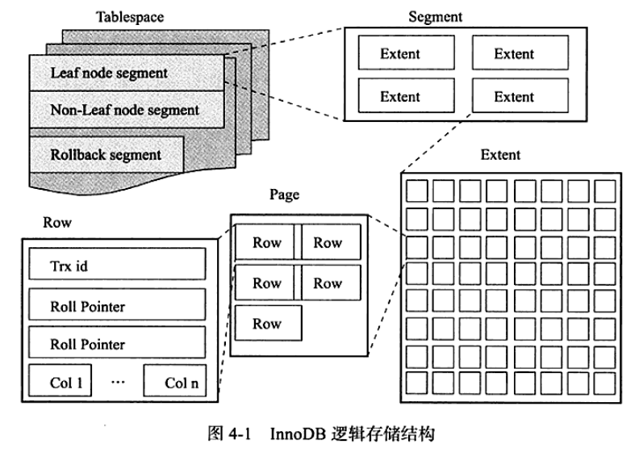

# 1 InnoDB-表
## 1.1 索引组织表
在InnoDB存储引擎中，表都是根据主键顺序存放的，这种存储方式成为索引组织表。在InnoDB存储引擎中，所有的表都有个主键，如果创建表时，没有设置主键，则InnoDB引擎会选择如下方式进行设置：

1. 首先判断表中是否有非空的唯一索引，如果有，则该列即为主键，如果表中有多个非空唯一索引，则会选择建表时定义索引的第一个索引。
2. 如果不符合上述条件，则InnoDB引擎会隐式的创建一个6字节大小的主键。
## 1.2 InnoDB逻辑存储结构
从InnoDB存储引擎的逻辑存储结构来看，所有的数据都被逻辑地存放在一个空间中，称之为表空间(tablespace)。表空间又由段(segmeng)，区(extent)，页(page)组成。如下图：

### 1.2.1 表空间
默认情况下，InnoDB存储引擎有一个共享表空间ibdata1，即所有数据都存放在这个表空间中。如果用户启用参数：innodb_file_per_table，则每张表内的数据可以单独存放在一个表空间中。但是需要注意的是，每张表的表空间内存放的只是数据，索引和插入缓冲Bitmap页，其他的数据，如回滚信息，插入缓冲索引页，系统事务信息，二次写缓冲等还是存放在原来的共享表空间中。
### 1.2.2 段
表空间是由各个段组成，常见的段有：数据段，索引段，回滚段等。由于InnoDB是索引组织的，因此数据即索引，索引即数据。数据段就是B+树的叶子节点，索引段即为B+树的非叶子节点。
### 1.2.3 区
区是由连续页组成的空间，在任何情况下区的大小均为1MB。为了保证区中页的连续性，InnoDB存储引擎一次性从磁盘中申请4-5个区。在默认情况下，InnoDB存储引擎页的大小为16KB，即一个区中有64个连续的页。页的大小可以通过innodb_page_size来控制。
### 1.2.4 页
InnoDB中常见的页的类型有：
1. 数据页
2. undo页
3. 系统页
4. 事务数据页
5. 插入缓冲位图页
6. 插入缓冲空闲列表页
7. 未压缩的二进制大对象页
8. 压缩的二进制大对象页
### 1.2.5 行
InnoDB存储引擎是面向行的。每个页存放的行记录有硬性规定，最多允许存放16KB/2-200行的记录。
## 1.3 InnoDB行记录格式
InnoDB存储引擎提供了Compact和Redundant两种格式来存放行记录数据。
### 1.3.1 Compact行记录格式
Compact格式的特点:一个页中存放的行数据越多，其性能越高。存储方式如下：

1. 变长字段长度列表：按照列的顺序逆序放置，其长度小于255字节，则长度用1字节表示，超过255字节，则用2字节表示。变长字段的长度不能大于2字节，因为varchar类型的最大长度为2^16-1=65535。
2. NULL标志位：该位指示了该行数据中是否存在NULL值，有则用1表示，占用1字节。
3. 记录头信息：固定占用5字节，含义如下图：

4. 最后的部分就是存储每列的数据。需要注意的是：NULL不占用该部分任何空间，即NULL除了占有NULL标志位，实际存储不占有任何空间。
5. 除了用户创建的列，还有两个隐藏列：事务id列，回滚指针列，分别占用6字节，7字节。若InnoDB表没有设置主键，每行还会增加一个6字节的rowid列。
### 1.3.2 Redundant行记录格式


### 1.3.3 新的行记录存储格式

### 1.3.4 char的行结构存储
char所指的固定长度，不是指字节长度，而是字符的长度。


# 2 表分区
mysql数据库支持的分区类型：
* range分区：根据列值的范围进行分区。mysql5.5后支持range columns分区
* list分区：与range分区类似，list分区面向的是离散的值。mysql5.5后支持list columns分区
* hash分区：根据用户自定义的表达式的返回值进行分区，返回值不能为负数
* key分区：根据mysql数据库提供的hash函数进行分区
```
不论创建何种类型的分区，如果表中存在主键或者唯一索引，分区列必须是唯一索引的一个组成部分。
```
## 2.1 range分区

## 2.2 list分区

## 2.3 hash分区
在range，list分区模式中，必须明确指定一个给定的列值或列值集合应该保存在哪个分区中；而在hash分区中，msyql将自动完成这些工作，用户索要做的就是基于将要进行hash分区的列指定一个列值或表达式，以及指定分区数量。如果没有指定分区数量，则默认为1。

## 2.4 key分区


## 2.5 columns分区
range，list，hash，key分区都是基于整数数据，如果不是整型，则需要转换为整型数据。columns分区可以使用非整型数据来分区。支持的类型：
* 所有的整型类型：INT,SMALLINT,TINYINT,BIGINT。FLOAT，DOUBLE不支持
* 日期类型：DATE，DATETIME。其余类型不支持
* 字符串类型：CHAR,VARCHAR,BINARY,VARBINARY。BLOB和TEXT不支持

# 3 索引与算法
InnoDB常见的索引：
* B+树索引
* 全文索引
* 自适应hash索引：自适应hash索引是自动生成的，无法人为生成
## 3.1 B+树索引
### 3.1.1 聚集索引
InnoDB引擎是索引组织表，即表中所有数据按照主键顺序存放。而聚集索引就是按照每张表的主键构建B+树，同时叶子节点存放行记录数据，也将聚集索引的叶子节点成为数据页。每个数据页都通过一个双向链表进行链接。<br/>
由于实际数据页只能按照一颗B+树排列，因此每张表中只有一个聚集索引。聚集索引的存储并不是物理上连续的，而是逻辑上连续的。  
* 页通过双向链表链接，页按照主键顺序排序。
* 物理存储上不按照主键存储
```
聚集索引对主键的排序查询，范围查询速度非常快。
```
### 3.1.2 非聚集索引
对于非聚集索引，叶子节点并不包含行记录的全部数据。叶子节点除了包含键值以外，每个叶子节点中的索引行中还包含了一个书签，该书签对应聚集索引键（即主键）。

### 3.1.3 Cardinality
Cardinality值表示索引中不重复记录数量的预估值。在实际应用中，Cardinality/n_rows_in_table应尽可能的接近1。如果非常小，那么则需要考虑是否该创建此索引。
```
使用 SHOW INDEX FROM tableName;可以看到该索引的Cardinality值
```
### 3.1.4 覆盖索引
InnoDB引擎支持覆盖索引，即从辅助索引中就可以得到查询的记录，而不需要查询聚集索引中的记录。覆盖索引的好处在于，辅助索引不包含整个行数据，所以大小远小于聚集索引，所以可以减少大量的IO操作。

### 3.1.5 索引提示
mysql数据库支持索引提示（INDEX HINT），显式地告诉优化器使用哪个索引。一下两种情况下可能需要使用索引提示：
1. mysql数据库错误的选择了索引，导致sql运行慢。
2. 某sql可选择的索引非常多，这时优化器选择执行计划时间的开销可能会大于sql语句本身。

例子： `select * from table use index(indexName) where ...`
