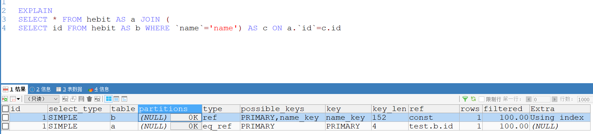

# explain详解

## 1  id
select查询的序列号，包含一组数字，表示查询中执行select子句或操作表的顺序 
三种情况：   

1. id相同：执行顺序自上往下
2. id不同：如果是子查询，id的序号会递增，id值越大，越先被执行。

## 2  select_type
查询类型，主要用于区分普通查询，联合查询，子查询等复杂查询  

1. SIMPLE：简单的select查询，查询中不包含子查询或union查询
2. PRIMARY：查询中包含任何复杂的子部分，则外层查询会被标记为PRIMARY
3. SUBQUERY：在select或where中包含子查询
4. DERIVED：在from列表中包含的子查询被标记为derived（衍生），mysql或递归执行这些子查询，把结果放在临时表里
5. UNION：若第二个select出现在union之后，则被标记为union；若union包含在from子句的子查询中，外层select将被标记为derived
6. UNION RESULT：从union表中获取结果的select

## 3  type
访问类型，sql查询优化中，很重要的一个指标，结果从好到坏的排序：
**system > const > eq_ref > ref > fulltext > ref_or_null > index_merge > unique_subquery > index_subquery > range > index > ALL**
  
1. system：表中只有一行记录，这是const类型的特例。
2. const：表示通过索引一次就找到了，const一般用于主键或者unique索引。
3. eq_ref：唯一性索引扫描，对于每个索引键，表中只有一条记录与之匹配。常见于主键或者unique索引
4. ref：非唯一性索引扫描，返回匹配某个单独值的所有行
5. range：只检索给定范围的行，使用一个索引来选择行
6. index：index也是读全表，index和ALL的区别在于index类型只遍历索引树。
7. all：遍历全表找到匹配的行

## 4  possible_keys
查询涉及到的字段上存在索引，则该索引将被列出，但不一定被查询实际使用
## 5  key
实际使用的索引，如果为null，则表示没有使用索引
## 6  key_len
表示索引中使用的字节数，查询中使用的索引的长度，并非实际使用的长度，理论上越短越好，key_len是根据表定义计算而得的，不是通过表内检索出的
## 7  ref
表示上述表的连接匹配条件，即哪些列或常量被用于查找索引列上的值

## 8  rows
表示根据表统计信息及索引选用情况，大致估算出的记录所需读取的行数

## 9  Extra
表示其他重要信息
  
1. Using filesort：mysql对数据使用一个外部的索引排序，而不是按照表内的索引进行排序。也就是说mysql无法使用索引完成排序，而是用“文件排序”
2. Using temporary：使用临时表保存结果，常见于order by ，group by
3. Using index：查询使用了覆盖索引
4. Using where：使用where过滤查询
5. Using join buffer：使用了连接缓存
6. Impossible where：表示where语句中不可能找到符号条件的行
7. Select tables optimized away：这个值意味着仅通过使用索引，优化器可能仅从聚合函数结果中返回一行
8. Distinct：优化distinct操作