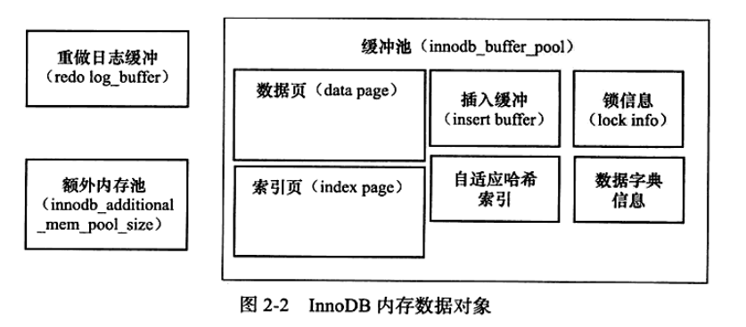

# mysql-innodb体系架构
InnoDB存储引擎有多个内存块，这些内存块组成了一个大的内存池，负责工作如下：
* 维护所有进程/线程需要访问的多个内部数据结构
* 缓存磁盘上的数据，方便快速读取，同时对磁盘文件的数据修改之前在这里缓存
* 重做日志（redo log）缓存

后台线程的工作主要是负责刷新内存池中的数据，保证缓存池中的内存缓存的是最近的数据。此外将已修改的数据文件刷新到磁盘，同时保证数据库在发生异常时，InnoDB能恢复到正常运行状态。

## 后台线程
### 1Master Thread
Master Thread线程主要负责将缓冲池中的数据异步刷新到磁盘中，保证数据的一致性，包括脏页的更新，合并插入缓冲，UNDO页的回收等。
### 2 IO Thread
InnoDB引擎中使用了大量的AIO来处理写IO请求，这样可以极大的提高数据库的性能，而IO Thread的主要工作是负责这些IO请求的回调处理。
### 3 Purge Thread
事务提交后，其所使用的undolog可能不再需要，因此需要Purge Thread来回收已经使用并分配的undo页。
### 4 Page Cleaner Thread
该线程主要工作是将之前版本中的脏页的刷新操作都放到单独的线程中来完成，其目的是减轻master thread的工作以及对于用户查询线程的阻塞，进一步提高性能。
## 内存
### 1 缓存池
缓存池是一块内存区域，用于弥补磁盘速度慢对数据库的影响。 
缓存池中包含的数据页类型：索引页，数据页 ，undo页，插入缓冲，自适应hash索引，InnoDB存储的锁的信息，数据字典等。 

## InnoDB关键特性
### 1 插入缓冲
### 2 两次写
### 3 自适应哈希索引
### 4 异步IO
### 5 刷新邻接页