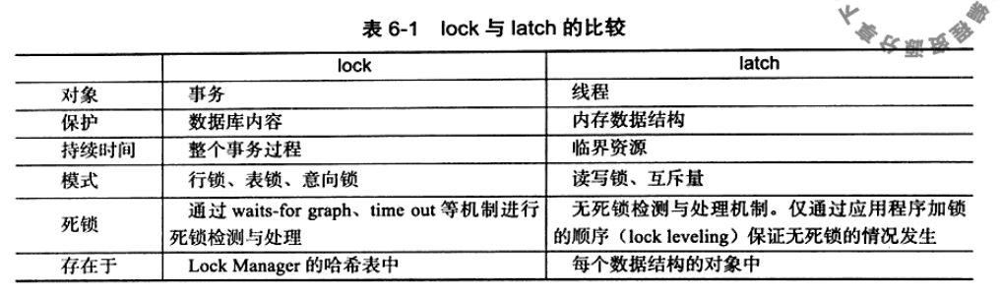
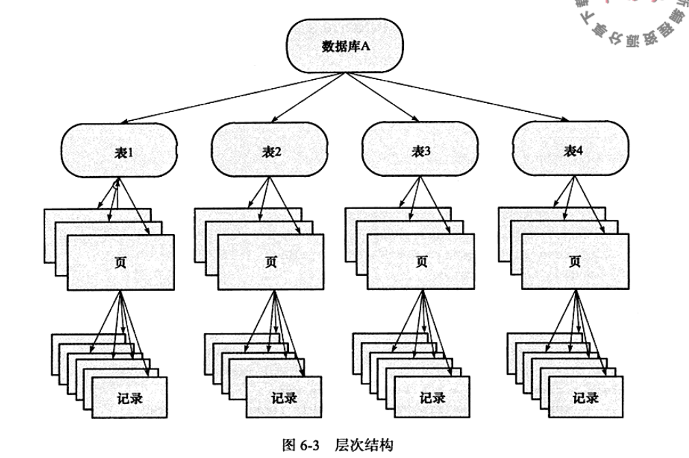
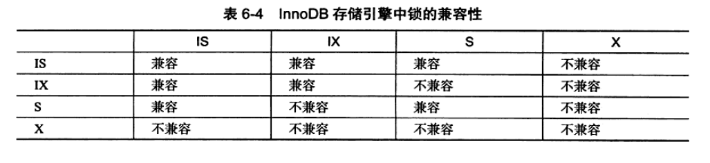
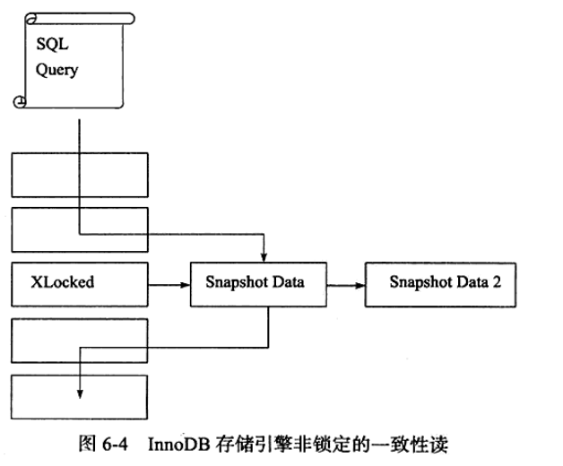
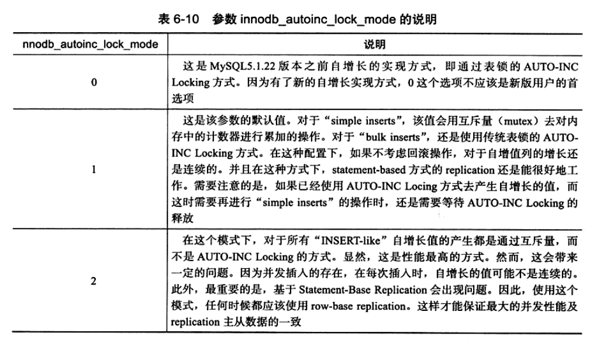
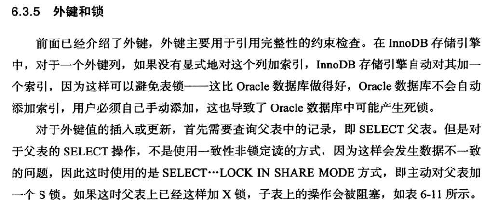

# mysql-锁
数据库中存在lock，latch两种不同类型的锁。
* latch：属于轻量级锁，其要求锁定时间短，若持续时间长，则应用的性能会非常差。在InnoDB引擎中，latch又可以分为mutex（互斥锁）和rwlock（读写锁）。其目的用于保证并发下操作临界资源的正确性，并且通常没有死锁检测机制。
* lock：lock的对象是事务，用来锁定的是数据库中的对象，如表，页，行。并且lock的对象仅在事务commit/rollback时释放锁（不同事务隔离级别释放时间可能不同）。lock有死锁检测机制。

## InnoDB存储引擎中的锁
### 行级锁
InnoDB存储引擎实现了如下两种标准的行级锁：
* 共享锁（S LOCK）：允许事务读一行数据
* 排他锁（X LOCK）：允许事务删除或更新一条数据

### 意向锁
InnoDB支持多粒度锁定，这种锁定允许事务在行级上锁和表级上锁同时存在。为了支持不同粒度的锁，innodb支持一种额外的锁：意向锁（Intention Lock）。意向锁是将锁定的对象分为多个层次，意向锁意味着事务希望在更细粒度上进行加锁。

意向锁：
* 意向共享锁（IS LOCK）：事务想获得一张表中某几行的共享锁
* 意向排他锁（IX LOCK）：事务想获得一张表中某几行的排他锁

### 一致性非锁定读
一致性非锁定读是指InnoDB存储引擎通过行多版本控制的方式来读取当前执行时间数据库中行的数据。如果此时正在执行UPDATE/DELETE操作，这时读操作不会因此等待锁的释放，而是会去读取行的一个快照数据。快照数据是指改行之前版本的数据，通过undo段来实现。undo用来在事务中回滚数据，因此快照数据没有额外的开销。  
非锁定读极大地提高了数据库的并发性。在InnoDB的默认情况下，这是默认的读取方式，即读取不会占用和等待表上的锁。但是在不同的隔离级别下，读取的方式不同，并不是在每个事务隔离级别下都是采用的非锁定的一致性读。此外即使是都使用非锁定一致性读，但是对于快照数据的定义也是不同的。  

在事务READ COMMITED和REPEATABLE READ下，InnoDB引擎使用非锁定一致性读。然而对于快照数据的定义却不同。在READ COMMITED事务隔离级别下，对于快照数据，非一致性读总是读取锁定的最新一份快照数据。而REPEATABLE READ事务隔离级别下，对于快照数据，非一致性读总是读取事务开始时的快照数据。

### 一致性锁定读
InnoDB引擎支持两种一致性锁定读：
* SELECT ...  FOR UPDATE ：此时对读取的行记录加了一个X锁，其他事务必须等待锁释放。
* SELECT ...  LOCK IN SHARE MODE：对读取的行记录加了一个S锁，其他事务可以向被锁定的行加S锁，如果需要X锁，则必须等待释放。

### 自增长与锁

### 外键和锁

## 锁的算法
InnoDB有三种行锁的算法：
* Record Lock：单个行记录上的锁
* Gap Lock：间隙锁，锁定一个范围，但不包含记录本身
* Next-Key Lock：Gap Lock+Record Lock，锁定一个范围，并且锁定记录本身

InnoDB引擎在REPEATABLE READ隔离级别下，采用Next-Key Lock来避免Phantom Problem（即幻读，在同一事务下，连续两次执行相同sql，结果不一致，第二次读取到第一次没有读取到的数据）

## 锁问题
### 脏读
脏读：未提交读，即一个事务读取到了另一个事务中未提交的数据。 
脏读发生在事务隔离级别：READ UNCOMMITED

### 不可重复读
不可重复读：在一个事务中多次读取同一个数据集合。在这个事务还未结束时，另一个事务也访问同一数据集合，并做了一些DML操作。因此在第一个事务的两次读数据之间，由于第二个事务的修改，那么第一个事务两次读到的数据可能不同。 
不可重复读发生在事务隔离级别：READ COMMITED

## 死锁
死锁是指两个或两个以上的事务在执行过程中，因争夺锁资源而造成的一种相互等待的现象。
死锁的解决方案：
* 超时机制
* wait-for graph(等待图)
* 锁资源的获取路径应保持一致

## 锁升级
锁升级：是指将当前锁粒度降低。InnoDB不存在锁升级的问题，因为其不是根据每个记录来产生行锁，相反，其根据每个事务访问的每个页对锁进行管理，采用的时位图的方式。因此一个事务锁住页中的一个记录还是多个记录，开销通常都是一样的。

# msyql-事务
InnoDB引擎中的事务完全符合ACID的特性：原子性(atomicity)，一致性(consistency)，隔离性(isolation)，持久性(durability)；
## 事务的实现
事务的隔离性是锁实现的，而事务的原子性，一致性，持久性则是通过数据库的redo log和undo log实现的。redo log：重做日志，用来保证事务的原子性和持久性；undo log用来保证事务的一致性。
