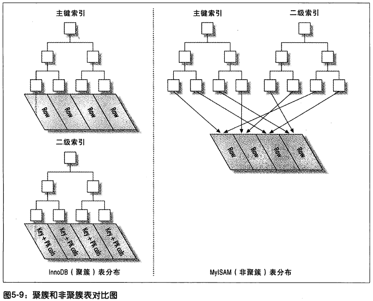
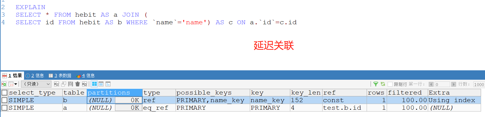
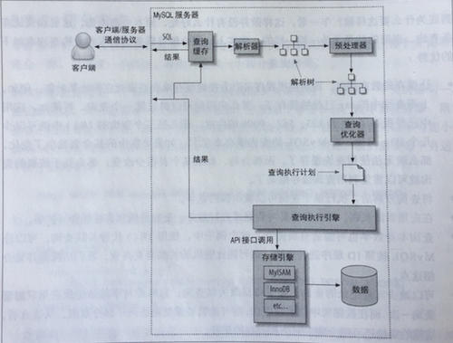

# 高性能索引
## 1  索引类型
### 1.1  B-Tree索引
在未指定索引类型时，大部分时候说的就是B-Tree索引，它使用B-Tree（从技术上说是B+Tree）数据结构来存储数据。  

B-Tree索引适用于全键值，键值范围或键前缀查找。其中键前缀查找只适用于根据最左前缀的查找。适用类型：  

1. 全值匹配：全值匹配指的是索引中的所有列进行匹配。
2. 匹配最左前缀：查找时可以只使用索引的部分列，但是必须是索引的左边开始，中间不允许间隔。
3. 匹配列前缀：也可以匹配列的值的开头部分。
4. 匹配范围值：索引列中的值的范围进行查询。
5. 精确匹配某一列并范围匹配另外一列：精确匹配某一列并范围匹配另外一列。
6. 只访问索引的查询：即查询时只需要访问索引列，无须访问其他数据行。这种属于“索引覆盖”。

B-Tree索引的限制：    

1. 如果不是按照索引的最左列开始查找，无法使用索引。
2. 不能跳过索引中的列
3. 如果查询中有某个列的范围查询，则其右边的列无法使用索引优化查找  
  
### 1.2  哈希索引
哈希索引是基于哈希表实现，只有精确匹配索引所有列的查询才有效。对于每一行数据，存储引擎都会对所有的索引列计算一个哈希码，哈希码是一个较小的值，并且不同键值的行计算出来的哈希码也不一样。哈希索引将所有的哈希码存放在索引中，同时在哈希表中保存指向每个数据行的指针。  
mysql中innodb不支持哈希索引，有一个特殊功能：自适应哈希索引，无法手动创建。可以手动创建一个基于B-Tree的伪哈希索引，需要自己去维护哈希值。  
哈希索引的限制:  

1. 哈希索引只包含哈希值和行指针，而不存储字段值，所以不能使用索引中的值来避免读取行
2. 哈希索引数据并不是按照索引值顺序存储的，所以也就无法用于排序  
3. 哈希索引也不支持部分索引列匹配查找，因为哈希索引始终是使用索引列的全部内容来计算哈希码的。
4. 哈希索引只支持等值比较查询，包括=，IN()，<=>
5. 访问哈希索引非常快，除非有很多的哈希冲突。哈希冲突严重的话，索引维护操作代价就会高，查询速度也会慢
><=>：与“=”类似，用于判断是否相等，不同的是=不能用于判断NULL，而<=>可以。

### 1.3  空间数据索引R-Tree
略
### 1.4  全文索引
全文索引适用于MATCH AGAINST操作，而不是普通的WHERE条件操作。

## 2  索引优点
1. 索引大大减少服务器需要扫描的数据量
2. 索引可以帮助服务器避免排序和临时表
3. 索引可以将随机I/O变为顺序I/O

索引并不总是最好的工具，只有适当的索引策略才是有效的。对于非常小的表，大部分情况下，全表扫描更高效。对于中大型表，索引的作用就非常大。而对于特大型表，建立和使用索引的代价也随之增长。  

## 3  高性能索引策略
### 3.1  独立的列
独立的列是指索引列不能是表达式的一部分，也不能是函数的参数。
### 3.2  前缀索引和索引选择性
有时候索引列是很长的字符串，这会使索引大且慢。那么我们可以使用索引列的前缀作为索引，让索引更小，更快。 
缺陷：mysql无法使用前缀索引进行order by，group by，也无法使用前缀索引做覆盖扫描
### 3.3  多列索引
多列索引总索引列的顺序至关重要，因为B-Tree索引的最左前缀原则。

### 3.4  聚簇索引
聚簇索引并不是一种索引类型，而是一种数据存储方式。具体细节依赖于其实现方式，但InnoDB的聚簇索引实际上在同一个结构中保存了B-Tree索引和数据行。当表有聚簇索引时，它的数据行实际上存放在索引的叶子页中。因为无法同时把数据行存放在两个不同的地方，所以一个表只能有一个聚簇索引。  
  
聚簇索引的优点：  

1. 可以把相关的数据保存在一起
2. 数据访问更快。聚簇索引将索引和数据保存在同一个B-Tree中，因此从聚簇索引中获取数据通常比在非聚簇索引中查找要快。
3. 使用覆盖索引扫描的查询可以直接使用页结点中的主键值

聚簇索引的缺点：  

1. 聚簇索引最大限度的提高了I/O密集型应用的性能，但如果数据全部放在内存中，则访问的顺序就没那么重要了，聚簇索引也就没什么优势了。
2. 插入速度严重依赖于插入顺序。
3. 更新聚簇索引的代价很高。
4. 基于聚簇索引的表在插入新行，或者逐渐被更新导致需要移动行的时候，可能面临“页分裂”的问题。页分裂会导致表占用更多的磁盘空间。
5. 聚簇索引可能导致全表扫描变慢，尤其是行比较稀疏，或者由于页分裂导致数据存储不连续的时候。
6. 二级索引（非聚簇索引）可能比想象的要大，因为二级索引的叶子节点包含了引用行的主键列。
7. 二级索引访问需要两次索引查找，而不是一次，二级索引叶子节点保存的不是指向行的物理位置的指针，而是行的主键值

随机主键的缺陷：  

1. 写入的目标页可能已经刷到磁盘上并从缓存中移除了，或者是还没有被加载到缓存中，InnoDB在插入之前不得不先找到并从磁盘读取目标页到内存中。这将导致大量的随机I/O
2. 因为写入是乱序的，InnoDB不得不频繁的做页分裂操作，以便为新的行分配空间。页分裂会导致移动大量数据，一次插入最少需要修改三个页而不是一个页
3. 由于频繁的页分裂，页会变得非常稀疏，并被不规则的填充，所以最终数据会有碎片。    

在把这些随机值载入聚簇索引以后，也许需要做一次OPTIMIZE TABLE来重建表并优化页的填充。
### 3.5  覆盖索引
如果一个索引包含所有需要查询的字段的值，则称为覆盖索引。 
延迟关联： 

### 3.6  使用索引扫描来做排序
mysql有两种方式可以生成有序的结果：通过排序操作；或者按索引顺序扫描；如果explain出来的type列的值为“index”，则说明mysql使用了索引扫描来做排序。  

### 3.7  避免多个范围条件

## 4  MYSQL查询执行过程

