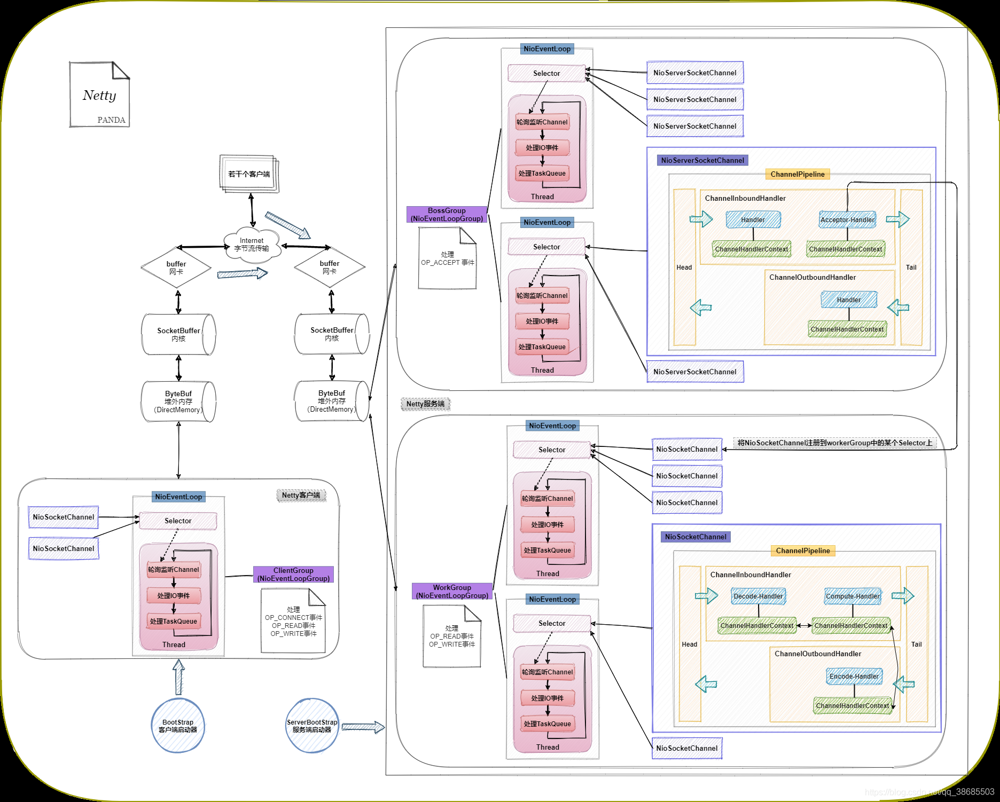
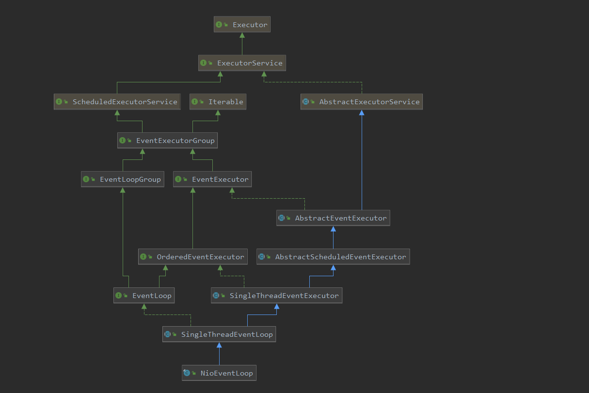
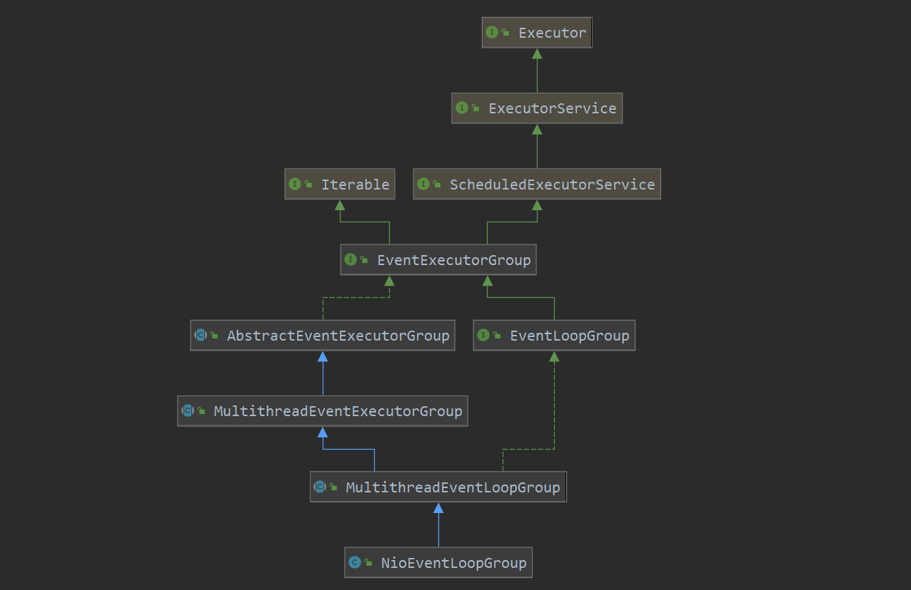
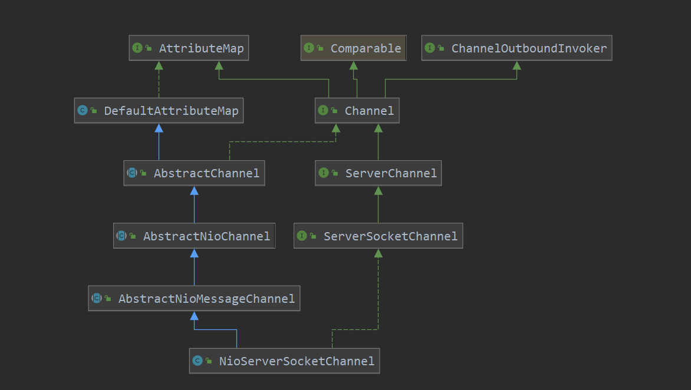

# Netty架构解析

对于解析netty架构，我们需要从大的角度去分析netty的架构，首先我们从架构的顶层设计着手
1. EventLoopGroup
2. EventLoop
3. Channel
4. ChannelPromise
5. ChannelFuture
6. ChannelHandler
7. DefaultChannelPipeline

1. NioEventLoop

2. NioEventLoopGroup

3. NioServerSocketChannel

4. NioServerSocketChannelConfig

5. DefaultChannelPipeline

6. ChannelHandler

ServerBootStrap
1. bootstrap中存在两个EventLoopGroup，两个Handler：
    group
    childGroup
    handler
    childHandler

NioEventLoop中的executor默认使用ThreadPerTaskExecutor
executor = new ThreadPerTaskExecutor(newDefaultThreadFactory());

NioEventLoop中的tailTasks taskQueue使用的是类MpscChunkedArrayQueue(jctools工具)
NioEventLoop中的tailTasks和taskQueue分别作用是什么？

NioServerSocketChannel在构造方法中，
1. 创建了Java的ServerSocketChannel
2. 创建了NioServerSocketChannelConfig，config并持有了channel本身的引用，以及java的channel的Socket的引用
3. 设置了readInterestOp的值为SelectionKey.OP_ACCEPT=16
4. 在祖先的构造方法中创建了id，unsafe类(NioMessageUnsafe)，以及pipeline类(DefaultChannelPipeline)
  
ServerBootstrap的init
1. 将用户配置的options，attrs加载到channel中
2. 加载用户配置的childOptions，childAttrs
3. 向pipeline中添加ChannelInitializer，该Initializer的作用是在初始化的时候，a:向pipeline中注册ServerBootstrap中的handler；b：channel的eventloop中注册task(该task的作用就是向pipeline中添加channelHandler(ServerBootstrapAcceptor)，该ServerBootstrapAcceptor会加加载的child相关配置，以及childHandler，childGroup)

register
1. 向channel中添加eventLoop的引用
2. 注册逻辑似乎是在group中注册channel，实际是在channel中向NioEventLoop中添加一个register的task，task的主要任务其实就是将javaChannel注册到NioEventLoop中的selector中，后续用于处理tcp连接
3. NioEventLoop执行Runnable，此时会进行初始化
4. 执行invokeHandlerAddedIfNeeded，fireChannelRegistered，如果已经激活，则继续执行fireChannelActive

pipeline中的handler添加顺序
1. 添加ChannelInitializer：1. 添加了bootstrap中的handler，2. 添加了Runnable，此时的任务是向pipeline添加ServerBootstrapAcceptor
2. 添加了Runnable，此时的任务是注册(即执行register0方法)

eventLoop中的task添加顺序
1. register0
2. pipeline中添加channelHandler(ServerBootstrapAcceptor)
3. doBind0

unsafe=NioMessageUnsafe
allocator=ByteBufAllocator.DEFAULT(PooledByteBufAllocator DEFAULT = new PooledByteBufAllocator(PlatformDependent.directBufferPreferred());)
rcvBufAllocator=AdaptiveRecvByteBufAllocator
recvHandle=HandleImpl

疑问：
1. 为什么注册时，ops=0，其含义是什么？
暂时回答：其在注册时，未直接关联OP_ACCEPT事件，是在doBind后，触发active事件，此时在HeadContext中将会执行invokeRead，后续将调用unsafe类的beginRead，此时将关联OP_ACCEPT事件。