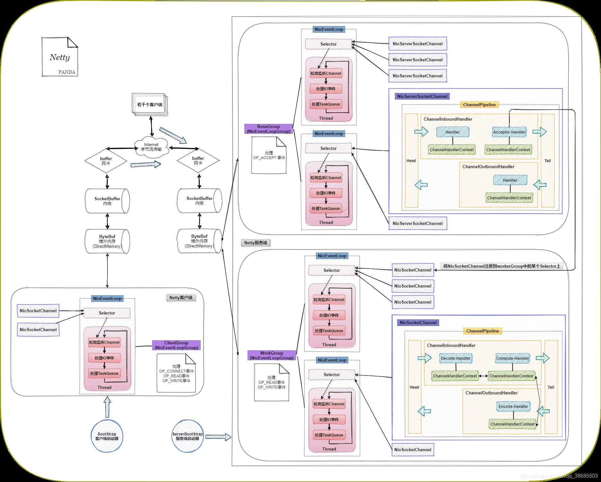

# netty启动



首先看下绑定过程中的主要流程：

1. 初始化`channel`，并注册到`selector`中
2. 再进行`doBind0`

```java
private ChannelFuture doBind(final SocketAddress localAddress) {
    final ChannelFuture regFuture = initAndRegister();
    final Channel channel = regFuture.channel();
    if (regFuture.cause() != null) {
        return regFuture;
    }

    if (regFuture.isDone()) {
        // At this point we know that the registration was complete and successful.
        ChannelPromise promise = channel.newPromise();
        doBind0(regFuture, channel, localAddress, promise);
        return promise;
    } else {
        // Registration future is almost always fulfilled already, but just in case it's not.
        final PendingRegistrationPromise promise = new PendingRegistrationPromise(channel);
        regFuture.addListener(new ChannelFutureListener() {
            @Override
            public void operationComplete(ChannelFuture future) throws Exception {
                Throwable cause = future.cause();
                if (cause != null) {
                    // Registration on the EventLoop failed so fail the ChannelPromise directly to not cause an
                    // IllegalStateException once we try to access the EventLoop of the Channel.
                    promise.setFailure(cause);
                } else {
                    // Registration was successful, so set the correct executor to use.
                    // See https://github.com/netty/netty/issues/2586
                    promise.registered();

                    doBind0(regFuture, channel, localAddress, promise);
                }
            }
        });
        return promise;
    }
}
```

initAndRegister

1. 使用工厂方法创建`channel`
2. 初始化`channel`
3. 将`channel`注册到`selector`中

```java
final ChannelFuture initAndRegister() {
    Channel channel = null;
    try {
        channel = channelFactory.newChannel();
        init(channel);
    } catch (Throwable t) {
        if (channel != null) {
            // channel can be null if newChannel crashed (eg SocketException("too many open files"))
            channel.unsafe().closeForcibly();
            // as the Channel is not registered yet we need to force the usage of the GlobalEventExecutor
            return new DefaultChannelPromise(channel, GlobalEventExecutor.INSTANCE).setFailure(t);
        }
        // as the Channel is not registered yet we need to force the usage of the GlobalEventExecutor
        return new DefaultChannelPromise(new FailedChannel(), GlobalEventExecutor.INSTANCE).setFailure(t);
    }

    ChannelFuture regFuture = config().group().register(channel);
    if (regFuture.cause() != null) {
        if (channel.isRegistered()) {
            channel.close();
        } else {
            channel.unsafe().closeForcibly();
        }
    }

    // If we are here and the promise is not failed, it's one of the following cases:
    // 1) If we attempted registration from the event loop, the registration has been completed at this point.
    //    i.e. It's safe to attempt bind() or connect() now because the channel has been registered.
    // 2) If we attempted registration from the other thread, the registration request has been successfully
    //    added to the event loop's task queue for later execution.
    //    i.e. It's safe to attempt bind() or connect() now:
    //         because bind() or connect() will be executed *after* the scheduled registration task is executed
    //         because register(), bind(), and connect() are all bound to the same thread.

    return regFuture;
}
```


## 一、初始化

### 1.1 参数配置

1. 设置`channel`的`option`参数
2. 设置`channel`的`attribute`参数
3. 向`pipeline`中添加`ChannelInitializer`，用于初始化`channel`
4. 最主要的动作是创建`ServerBootstrapAcceptor`，用于后续客户端连接请求
```java
void init(Channel channel) {
    setChannelOptions(channel, newOptionsArray(), logger);
    setAttributes(channel, newAttributesArray());

    ChannelPipeline p = channel.pipeline();

    final EventLoopGroup currentChildGroup = childGroup;
    final ChannelHandler currentChildHandler = childHandler;
    final Entry<ChannelOption<?>, Object>[] currentChildOptions = newOptionsArray(childOptions);
    final Entry<AttributeKey<?>, Object>[] currentChildAttrs = newAttributesArray(childAttrs);
    final Collection<ChannelInitializerExtension> extensions = getInitializerExtensions();

    p.addLast(new ChannelInitializer<Channel>() {
        @Override
        public void initChannel(final Channel ch) {
            final ChannelPipeline pipeline = ch.pipeline();
            ChannelHandler handler = config.handler();
            if (handler != null) {
                pipeline.addLast(handler);
            }

            ch.eventLoop().execute(new Runnable() {
                @Override
                public void run() {
                    pipeline.addLast(new ServerBootstrapAcceptor(
                            ch, currentChildGroup, currentChildHandler, currentChildOptions, currentChildAttrs,
                            extensions));
                }
            });
        }
    });
    if (!extensions.isEmpty() && channel instanceof ServerChannel) {
        ServerChannel serverChannel = (ServerChannel) channel;
        for (ChannelInitializerExtension extension : extensions) {
            try {
                extension.postInitializeServerListenerChannel(serverChannel);
            } catch (Exception e) {
                logger.warn("Exception thrown from postInitializeServerListenerChannel", e);
            }
        }
    }
}

```

### 1.2 实际初始化

在初始化时，并没有将直接将`ServerBootstrapAcceptor`注册到`pipeline`中，而是放在`ChannelInitializer`中。这其中最主要的目的是让`channel`注册后才生效，防止在初始化动作还没有完全完成时直接接收处理连接。那`ChanelInitializer`将在什么时候进行初始化呢？奥妙就在`register`后的`pipeline.fireChannelRegistered()`中，我们来具体看下其具体是如何生效的。

1. `pipeline`传播`register`事件，首先找到当前执行器，判断如果在执行器的线程里直接运行，如果不在，则以任务的方式执行。
```java
public final ChannelPipeline fireChannelRegistered() {
    AbstractChannelHandlerContext.invokeChannelRegistered(head);
    return this;
}

static void invokeChannelRegistered(final AbstractChannelHandlerContext next) {
    EventExecutor executor = next.executor();
    if (executor.inEventLoop()) {
        next.invokeChannelRegistered();
    } else {
        executor.execute(new Runnable() {
            @Override
            public void run() {
                next.invokeChannelRegistered();
            }
        });
    }
}
```

2. 判断当前`handler`是否生效，生效的情况下执行`channelRegistered`事件
```java
private void invokeChannelRegistered() {
    if (invokeHandler()) {
        try {
            // DON'T CHANGE
            // Duplex handlers implements both out/in interfaces causing a scalability issue
            // see https://bugs.openjdk.org/browse/JDK-8180450
            final ChannelHandler handler = handler();
            final DefaultChannelPipeline.HeadContext headContext = pipeline.head;
            if (handler == headContext) {
                headContext.channelRegistered(this);
            } else if (handler instanceof ChannelInboundHandlerAdapter) {
                ((ChannelInboundHandlerAdapter) handler).channelRegistered(this);
            } else {
                ((ChannelInboundHandler) handler).channelRegistered(this);
            }
        } catch (Throwable t) {
            invokeExceptionCaught(t);
        }
    } else {
        fireChannelRegistered();
    }
}

// 如果当前handler已经添加 或者 非有序并且状态处于待处理
private boolean invokeHandler() {
    // Store in local variable to reduce volatile reads.
    int handlerState = this.handlerState;
    return handlerState == ADD_COMPLETE || (!ordered && handlerState == ADD_PENDING);
}
```

2. `ChannelInitializer.channelRegistered`
```java
public final void channelRegistered(ChannelHandlerContext ctx) throws Exception {
    // Normally this method will never be called as handlerAdded(...) should call initChannel(...) and remove
    // the handler.
    if (initChannel(ctx)) {
        // we called initChannel(...) so we need to call now pipeline.fireChannelRegistered() to ensure we not
        // miss an event.
        ctx.pipeline().fireChannelRegistered();

        // We are done with init the Channel, removing all the state for the Channel now.
        removeState(ctx);
    } else {
        // Called initChannel(...) before which is the expected behavior, so just forward the event.
        ctx.fireChannelRegistered();
    }
}
```

3. 判断该`ChannelHandlerContext`是否已经初始化过（即在`initMap`中存在），未初始化时执行该动作：向`pipeline`中添加`ServerBootstrapAcceptor`，处理客户端连接

```java
@Override
public void initChannel(final Channel ch) {
    final ChannelPipeline pipeline = ch.pipeline();
    ChannelHandler handler = config.handler();
    if (handler != null) {
        pipeline.addLast(handler);
    }

    ch.eventLoop().execute(new Runnable() {
        @Override
        public void run() {
            pipeline.addLast(new ServerBootstrapAcceptor(
                    ch, currentChildGroup, currentChildHandler, currentChildOptions, currentChildAttrs,
                    extensions));
        }
    });
}
```

4. `pipeline`继续向后传播`channelRegistered`事件，整个事件传播结束后再将`ChannelHandlerContext`从`initMap`中移除

## 二、注册

1. 使用`config`中的`group`（即`NioEventLoopGroup`）来处理注册
```java
ChannelFuture regFuture = config().group().register(channel);
if (regFuture.cause() != null) {
    if (channel.isRegistered()) {
        channel.close();
    } else {
        channel.unsafe().closeForcibly();
    }
}
```

2. 实际还是交由`group`中下一个执行器(`NioEventLoop`)执行注册动作
```java
public ChannelFuture register(Channel channel) {
    return next().register(channel);
}
```

3. `NioEventLoop`中的注册动作实际还是交由`channel`中的`unsafe`（NioServerSocketChannel类的unsafe，class是NioMessageUnsafe）类来执行
```java
public ChannelFuture register(Channel channel) {
    return register(new DefaultChannelPromise(channel, this));
}
public ChannelFuture register(final ChannelPromise promise) {
    ObjectUtil.checkNotNull(promise, "promise");
    promise.channel().unsafe().register(this, promise);
    return promise;
}
```

4. 注册动作，授权判断当前是否是在`eventLoop`线程中，不在时，使用任务的方式交由`evevtLoop`执行

```java
public final void register(EventLoop eventLoop, final ChannelPromise promise) {
    ObjectUtil.checkNotNull(eventLoop, "eventLoop");
    if (isRegistered()) {
        promise.setFailure(new IllegalStateException("registered to an event loop already"));
        return;
    }
    if (!isCompatible(eventLoop)) {
        promise.setFailure(
                new IllegalStateException("incompatible event loop type: " + eventLoop.getClass().getName()));
        return;
    }

    AbstractChannel.this.eventLoop = eventLoop;

    if (eventLoop.inEventLoop()) {
        register0(promise);
    } else {
        try {
            eventLoop.execute(new Runnable() {
                @Override
                public void run() {
                    register0(promise);
                }
            });
        } catch (Throwable t) {
            logger.warn(
                    "Force-closing a channel whose registration task was not accepted by an event loop: {}",
                    AbstractChannel.this, t);
            closeForcibly();
            closeFuture.setClosed();
            safeSetFailure(promise, t);
        }
    }
}

```

5. 执行注册动作，注册完成后并触发`channelRegistered`事件，以及`channelActive`事件（如果是第一次注册的情况下）。并且如果不是第一次注册，而且`autoRead = true`，则还会开启读操作

```java

private void register0(ChannelPromise promise) {
    try {
        // check if the channel is still open as it could be closed in the mean time when the register
        // call was outside of the eventLoop
        if (!promise.setUncancellable() || !ensureOpen(promise)) {
            return;
        }
        boolean firstRegistration = neverRegistered;
        doRegister();
        neverRegistered = false;
        registered = true;

        // Ensure we call handlerAdded(...) before we actually notify the promise. This is needed as the
        // user may already fire events through the pipeline in the ChannelFutureListener.
        pipeline.invokeHandlerAddedIfNeeded();

        safeSetSuccess(promise);
        pipeline.fireChannelRegistered();
        // Only fire a channelActive if the channel has never been registered. This prevents firing
        // multiple channel actives if the channel is deregistered and re-registered.
        if (isActive()) {
            if (firstRegistration) {
                pipeline.fireChannelActive();
            } else if (config().isAutoRead()) {
                // This channel was registered before and autoRead() is set. This means we need to begin read
                // again so that we process inbound data.
                //
                // See https://github.com/netty/netty/issues/4805
                beginRead();
            }
        }
    } catch (Throwable t) {
        // Close the channel directly to avoid FD leak.
        closeForcibly();
        closeFuture.setClosed();
        safeSetFailure(promise, t);
    }
}

```

6. 实际的注册操作底层是调用jdk中的`channel`注册到`selector`中，并且会将当前netty的`channel`作为参数注册到`selector`中，方便后续网络事件过来时，直接拿到netty的`channel`进行事件/数据处理。此时，我们还需要留意到其注册时的ops=0，这意味着初始阶段并不会处理任何网络事件。
```java
protected void doRegister() throws Exception {
    boolean selected = false;
    for (;;) {
        try {
            selectionKey = javaChannel().register(eventLoop().unwrappedSelector(), 0, this);
            return;
        } catch (CancelledKeyException e) {
            if (!selected) {
                // Force the Selector to select now as the "canceled" SelectionKey may still be
                // cached and not removed because no Select.select(..) operation was called yet.
                eventLoop().selectNow();
                selected = true;
            } else {
                // We forced a select operation on the selector before but the SelectionKey is still cached
                // for whatever reason. JDK bug ?
                throw e;
            }
        }
    }
}
```
## 三、绑定

1. `channel`绑定操作：判断当前是否在`eventLoop`的线程中，不在则以任务的方式交由`eventLoop`执行
```java
private static void doBind0(
        final ChannelFuture regFuture, final Channel channel,
        final SocketAddress localAddress, final ChannelPromise promise) {

    // This method is invoked before channelRegistered() is triggered.  Give user handlers a chance to set up
    // the pipeline in its channelRegistered() implementation.
    channel.eventLoop().execute(new Runnable() {
        @Override
        public void run() {
            if (regFuture.isSuccess()) {
                channel.bind(localAddress, promise).addListener(ChannelFutureListener.CLOSE_ON_FAILURE);
            } else {
                promise.setFailure(regFuture.cause());
            }
        }
    });
}
```
2. 借由`channel`中的`pipeline`完成`bind`事件的传播

```java
    public ChannelFuture bind(SocketAddress localAddress, ChannelPromise promise) {
        return pipeline.bind(localAddress, promise);
    }
```

3. `ChannelOut`事件从`tail`起始，用户注册的`handler`将在这之后执行，最终流转到`head`中，执行真正的`bind`操作

```java
public final ChannelFuture bind(SocketAddress localAddress, ChannelPromise promise) {
    return tail.bind(localAddress, promise);
}
```

4. `head`中的`bind`事件，交由`unsafe`处理，而该`unsafe`类是`channel`的内部类，最终的实际操作`bind`操作还是调用`channel`的`doBind`方法

```java
public void bind(
        ChannelHandlerContext ctx, SocketAddress localAddress, ChannelPromise promise) {
    unsafe.bind(localAddress, promise);
}
```

5. `unsafe`执行绑定动作，如果`channel`之前未激活，而当前处于激活状态，则发起`pipeline`的`channelActive`事件

```java
public final void bind(final SocketAddress localAddress, final ChannelPromise promise) {
    assertEventLoop();

    if (!promise.setUncancellable() || !ensureOpen(promise)) {
        return;
    }

    // See: https://github.com/netty/netty/issues/576
    if (Boolean.TRUE.equals(config().getOption(ChannelOption.SO_BROADCAST)) &&
        localAddress instanceof InetSocketAddress &&
        !((InetSocketAddress) localAddress).getAddress().isAnyLocalAddress() &&
        !PlatformDependent.isWindows() && !PlatformDependent.maybeSuperUser()) {
        // Warn a user about the fact that a non-root user can't receive a
        // broadcast packet on *nix if the socket is bound on non-wildcard address.
        logger.warn(
                "A non-root user can't receive a broadcast packet if the socket " +
                "is not bound to a wildcard address; binding to a non-wildcard " +
                "address (" + localAddress + ") anyway as requested.");
    }

    boolean wasActive = isActive();
    try {
        doBind(localAddress);
    } catch (Throwable t) {
        safeSetFailure(promise, t);
        closeIfClosed();
        return;
    }

    if (!wasActive && isActive()) {
        invokeLater(new Runnable() {
            @Override
            public void run() {
                pipeline.fireChannelActive();
            }
        });
    }

    safeSetSuccess(promise);
}
```

6. `NioServerSocketChannel.doBind`方法（backlog参数的作用就是：tcp实际上是一个连接队列，用于存储等待服务器处理的连接请求。这个队列包括两个主要部分：未完成三次握手的连接队列（半连接队列）和已完成三次握手的连接队列（全连接队列），而backlog参数的主要作用是限制这两个连接队列的总和大小，服务器可以控制同时等待处理的连接请求数量，从而避免资源耗尽或过载）
```java
protected void doBind(SocketAddress localAddress) throws Exception {
    if (PlatformDependent.javaVersion() >= 7) {
        javaChannel().bind(localAddress, config.getBacklog());
    } else {
        javaChannel().socket().bind(localAddress, config.getBacklog());
    }
}
```


## 四、网络事件

### 4.1 前奏

|name|code|description|
|:---|:--:|:---|
|OP_READ|1 << 0|可读事件：当操作系统读缓冲区有数据可读时就绪。读缓冲区并非时刻都有数据可读，所以channel一般需要注册该操作，仅当缓冲区有数据就绪时才发起读操作，有的放矢，避免浪费CPU。|
|OP_WRITE|1 << 2|可写事件：当操作系统写缓冲区有空闲空间时就绪。一般情况下写缓冲区都有空闲空间，小块数据直接写入即可，没必要注册该操作类型，否则该条件不断就绪会浪费CPU；但如果是写密集型的任务，比如文件下载等，缓冲区很可能满，注册该类型就很有必要，同时注意写完后取消注册。|
|OP_CONNECT|1 << 3|客户端与服务器连接建立成功就会触发该事件|
|OP_ACCEPT|1 << 4|客户端发起了连接请求时触发该类型的事件|

在之前我们说过netty在register时，其并向selector中关联任何事件，而NioServerSocketChannel实例化时，需要订阅的是SelectionKey.OP_ACCEPT。这其中的奥妙在于，register之后，整个pipeline中的handler可能仍未完成初始化，所以在channelRegistered之后的channelActive事件中，会再处理将订阅事件再次注册到selector中

1. 在`head`中处理`channelActive`事件时，会执行`readIfIsAutoRead`
```java
public void channelActive(ChannelHandlerContext ctx) {
    ctx.fireChannelActive();

    readIfIsAutoRead();
}
private void readIfIsAutoRead() {
    if (channel.config().isAutoRead()) {
        channel.read();
    }
}
```

2. `channel`中触发`pipeline`的read事件
```java
public Channel read() {
    pipeline.read();
    return this;
}
```

3. 从`tail`向`head`往前传播，最终在`head`中处理
```java
public final ChannelPipeline read() {
    tail.read();
    return this;
}
```

4. 在`head`中交由`unsafe`执行`beginRead`操作
```java
public void read(ChannelHandlerContext ctx) {
    unsafe.beginRead();
}
```

5. `unsafe`类是`channel`的内部类，实际调用的`doBeginRead`方法还是在`channel`中
```java
public final void beginRead() {
    assertEventLoop();

    try {
        doBeginRead();
    } catch (final Exception e) {
        invokeLater(new Runnable() {
            @Override
            public void run() {
                pipeline.fireExceptionCaught(e);
            }
        });
        close(voidPromise());
    }
}
```

6. 修改`selector`中感兴趣的事件

```java
protected void doBeginRead() throws Exception {
    // Channel.read() or ChannelHandlerContext.read() was called
    final SelectionKey selectionKey = this.selectionKey;
    if (!selectionKey.isValid()) {
        return;
    }

    readPending = true;

    final int interestOps = selectionKey.interestOps();
    if ((interestOps & readInterestOp) == 0) {
        selectionKey.interestOps(interestOps | readInterestOp);
    }
}
```

### 4.2 客户端连接

在`NioEventLoop`中会不断向`selector`中获取事件，而`NioServerSocketChannel`订阅的是`SelectionKey.OP_ACCEPT`，所以这里会处理客户端连接事件，为什么不让这部分论述太长，而导致可阅读性差，所以我们这直接找到方法`NioEventLoop.processSelectedKey`，`netty`将在这里处理各类事件。（更多的`NioEventLoop`细节将在另一篇文章中细述）

1. 我们感兴趣的事件是`accept`，就在`unsafe.read()`中处理，可以看到绝大多数操作都会经由`unsafe`类来处理
```java
private void processSelectedKey(SelectionKey k, AbstractNioChannel ch) {
    final AbstractNioChannel.NioUnsafe unsafe = ch.unsafe();
    if (!k.isValid()) {
        final EventLoop eventLoop;
        try {
            eventLoop = ch.eventLoop();
        } catch (Throwable ignored) {
            // If the channel implementation throws an exception because there is no event loop, we ignore this
            // because we are only trying to determine if ch is registered to this event loop and thus has authority
            // to close ch.
            return;
        }
        // Only close ch if ch is still registered to this EventLoop. ch could have deregistered from the event loop
        // and thus the SelectionKey could be cancelled as part of the deregistration process, but the channel is
        // still healthy and should not be closed.
        // See https://github.com/netty/netty/issues/5125
        if (eventLoop == this) {
            // close the channel if the key is not valid anymore
            unsafe.close(unsafe.voidPromise());
        }
        return;
    }

    try {
        int readyOps = k.readyOps();
        // We first need to call finishConnect() before try to trigger a read(...) or write(...) as otherwise
        // the NIO JDK channel implementation may throw a NotYetConnectedException.
        if ((readyOps & SelectionKey.OP_CONNECT) != 0) {
            // remove OP_CONNECT as otherwise Selector.select(..) will always return without blocking
            // See https://github.com/netty/netty/issues/924
            int ops = k.interestOps();
            ops &= ~SelectionKey.OP_CONNECT;
            k.interestOps(ops);

            unsafe.finishConnect();
        }

        // Process OP_WRITE first as we may be able to write some queued buffers and so free memory.
        if ((readyOps & SelectionKey.OP_WRITE) != 0) {
            // Call forceFlush which will also take care of clear the OP_WRITE once there is nothing left to write
            unsafe.forceFlush();
        }

        // Also check for readOps of 0 to workaround possible JDK bug which may otherwise lead
        // to a spin loop
        if ((readyOps & (SelectionKey.OP_READ | SelectionKey.OP_ACCEPT)) != 0 || readyOps == 0) {
            unsafe.read();
        }
    } catch (CancelledKeyException ignored) {
        unsafe.close(unsafe.voidPromise());
    }
}
```

2. `netty`将`accept`事件和读事件完全统一了操作逻辑，而细节就藏在`channel.doReadMessages`方法中

```java
public void read() {
    assert eventLoop().inEventLoop();
    final ChannelConfig config = config();
    final ChannelPipeline pipeline = pipeline();
    final RecvByteBufAllocator.Handle allocHandle = unsafe().recvBufAllocHandle();
    allocHandle.reset(config);

    boolean closed = false;
    Throwable exception = null;
    try {
        try {
            do {
                int localRead = doReadMessages(readBuf);
                if (localRead == 0) {
                    break;
                }
                if (localRead < 0) {
                    closed = true;
                    break;
                }

                allocHandle.incMessagesRead(localRead);
            } while (continueReading(allocHandle));
        } catch (Throwable t) {
            exception = t;
        }

        int size = readBuf.size();
        for (int i = 0; i < size; i ++) {
            readPending = false;
            pipeline.fireChannelRead(readBuf.get(i));
        }
        readBuf.clear();
        allocHandle.readComplete();
        pipeline.fireChannelReadComplete();

        if (exception != null) {
            closed = closeOnReadError(exception);

            pipeline.fireExceptionCaught(exception);
        }

        if (closed) {
            inputShutdown = true;
            if (isOpen()) {
                close(voidPromise());
            }
        }
    } finally {
        // Check if there is a readPending which was not processed yet.
        // This could be for two reasons:
        // * The user called Channel.read() or ChannelHandlerContext.read() in channelRead(...) method
        // * The user called Channel.read() or ChannelHandlerContext.read() in channelReadComplete(...) method
        //
        // See https://github.com/netty/netty/issues/2254
        if (!readPending && !config.isAutoRead()) {
            removeReadOp();
        }
    }
}
```

3. 在这里将生成`NioSocketChannel`，实际处理客户端连接相关的读写操作

```java
protected int doReadMessages(List<Object> buf) throws Exception {
    SocketChannel ch = SocketUtils.accept(javaChannel());

    try {
        if (ch != null) {
            buf.add(new NioSocketChannel(this, ch));
            return 1;
        }
    } catch (Throwable t) {
        logger.warn("Failed to create a new channel from an accepted socket.", t);

        try {
            ch.close();
        } catch (Throwable t2) {
            logger.warn("Failed to close a socket.", t2);
        }
    }

    return 0;
}
```

4. 然后将`NioSocketChannel`作为消息，向`pipeline`中传播`channelRead`事件，在`ServerBootstrapAcceptor`中处理客户端连接事件。

```java
public void channelRead(ChannelHandlerContext ctx, Object msg) {
    final Channel child = (Channel) msg;

    child.pipeline().addLast(childHandler);

    setChannelOptions(child, childOptions, logger);
    setAttributes(child, childAttrs);

    if (!extensions.isEmpty()) {
        for (ChannelInitializerExtension extension : extensions) {
            try {
                extension.postInitializeServerChildChannel(child);
            } catch (Exception e) {
                logger.warn("Exception thrown from postInitializeServerChildChannel", e);
            }
        }
    }

    try {
        childGroup.register(child).addListener(new ChannelFutureListener() {
            @Override
            public void operationComplete(ChannelFuture future) throws Exception {
                if (!future.isSuccess()) {
                    forceClose(child, future.cause());
                }
            }
        });
    } catch (Throwable t) {
        forceClose(child, t);
    }
}
```


## 五、注册再绑定

> netty先注册到selector再执行绑定动作的意图是什么？能解决什么问题？因为这两个操作都交由EventLoop在单线程中执行，并不会有什么竞争关系?


你指出的问题非常关键，确实在 Netty 的单线程 `EventLoop` 中，先注册到 `Selector` 再执行绑定 (`bind()`) 的操作顺序并不是为了避免线程竞争。Netty 采用这种顺序的核心意图实际上是 **优化事件处理过程** 和 **提升连接事件的及时性**。以下是深入解析：

---

### 5.1 核心意图：提升新连接事件的处理效率与及时性

1. **解决 "连接事件可能错过" 的问题**  
   在 Java NIO 的 `Selector` 模型中，只有通道注册到 `Selector` 后，`Selector` 才会开始监听该通道的事件。  
   
   如果 Netty 按照 JDK 示例那样，先执行 `bind()` 再注册到 `Selector`，可能会出现以下问题：
   - 在 `bind()` 成功后（端口已经被占用），但 `ServerSocketChannel` 尚未注册到 `Selector` 之前，客户端可能已经尝试建立连接。
   - 此时，`Selector` 还没有准备好监听 `OP_ACCEPT` 事件，可能导致一些早期的连接被延迟处理，甚至丢失。  

   **Netty 的做法**：  
   - 通过先将通道注册到 `Selector`，确保通道已经能够监听连接事件（`OP_ACCEPT`）。
   - 然后再执行 `bind()`，这时任何新的连接请求都能及时触发，并被 `Selector` 捕获。  

2. **事件循环的连贯性**  
   Netty 的 `EventLoop` 设计强调事件的连贯处理：
   - 先注册到 `Selector` 后，`Selector` 就立即处于工作状态，可以监听事件。
   - 绑定动作的执行是非阻塞的，之后的连接事件会被及时捕获并派发到 `EventLoop` 的处理逻辑中。
   - 这种连贯性保证了通道在绑定后，立即能够处理事件，不需要额外的上下文切换。

---

### 5.2 设计逻辑：无缝切换到事件驱动

1. **统一的事件模型**  
   在 Netty 的设计中，所有通道的生命周期由 `EventLoop` 接管，且注册到 `Selector` 是通道的**初始化步骤**，这也是它能参与事件驱动的前提。先注册再 `bind()`，符合 Netty 的统一事件处理逻辑：
   - `Channel` 注册后，所有事件（包括绑定成功、接收连接、读写等）都由 `EventLoop` 监听和分发。
   - 即使绑定动作被延迟执行，也不会影响事件的及时性，因为 `Selector` 已经开始工作。

2. **减少潜在的 race condition（竞态条件）**  
   虽然 Netty 的 `EventLoop` 是单线程的，但在高并发场景中，先注册再 `bind()` 可以减少潜在的竞态问题：
   - 在绑定地址后，理论上有可能 `EventLoop` 尚未完成注册，客户端连接请求已到达，导致连接处理逻辑被延迟。
   - Netty 的顺序确保绑定完成时，`Selector` 已经就绪，可以立即处理客户端的连接事件。

---

### 5.3 原因
JDK 示例采用简单的逻辑（先 `bind()` 再注册），原因是：
- 通常没有高并发和严格的事件处理时效性需求。
- 示例代码通常运行在单线程中，且编程者假定绑定完成和注册操作之间没有连接请求。
- 如果连接事件被延迟处理甚至丢失，这种问题在简单示例中不容易暴露。

而 Netty 需要应对复杂的生产环境：
- 高并发情况下的早期连接可能发生得非常快。
- 需要保证 `Selector` 始终准备好监听并分发事件，最大化事件处理的及时性和一致性。

---

### 5.4 总结
Netty 先注册到 `Selector` 再执行 `bind()` 的主要目的是：
1. **确保在绑定完成后，早期到达的连接事件不会被忽略**。
2. **保证通道的生命周期由 `EventLoop` 统一管理，所有事件的处理逻辑连贯一致**。
3. **优化事件处理的时效性，避免在高并发场景中延迟捕获连接事件**。

虽然在单线程模型中，注册和绑定之间确实没有直接的竞争关系，但这种设计体现了 Netty 对事件驱动模型的深刻优化，特别是在高性能、高并发环境中的处理需求。

## 六、autoRead

Netty中的`autoRead`是一个非常重要的功能，它控制着Netty是否会自动从Channel中读取数据。以下是`autoRead`的详细作用说明：

### 6.1 基本功能

* **自动读取数据**：当`autoRead`被设置为`true`时，Netty会自动注册读事件，并在网络可读时从Channel中读取数据。这样，数据一旦被网络层接收，就会立即被Netty处理，并沿着pipeline流动。
* **手动控制读取**：当`autoRead`被设置为`false`时，Netty不会注册读事件，即使网络层有数据可读，Netty也不会从Channel中读取数据。这允许开发者更精确地控制数据的读取时机和速率。

### 6.2 应用场景

1. **流量控制**：在高并发或大数据量场景下，如果业务层处理速度跟不上数据读取速度，可能会导致数据积压、内存占用过高甚至OOM（Out Of Memory）。通过将`autoRead`设置为`false`，开发者可以在业务层处理不过来时暂停数据读取，从而避免这些问题。当业务层处理能力恢复时，再将`autoRead`设置为`true`，继续读取数据。
2. **资源限制**：在某些情况下，系统资源（如CPU、内存）可能有限。通过控制`autoRead`的开关，开发者可以根据当前资源使用情况动态调整数据读取速率，以优化系统性能。

### 6.3 注意事项

* **避免频繁开关**：频繁地打开和关闭`autoRead`会对性能产生影响，因为每次调整都会涉及系统调用。因此，开发者应该设计合理的策略来控制`autoRead`的开关，避免不必要的性能损耗。
* **与TCP流控配合**：当`autoRead`关闭时，如果客户端继续发送数据，TCP的流控机制会起作用。由于接收端的read buffer变小，向对端发送ACK时会降低窗口大小，直至变成0。这样，对端就会自动降低发送数据的速率。这有助于防止数据丢失和内存溢出。
* **感知连接关闭**：当`autoRead`关闭时，如果客户端发送了FIN报文来关闭连接，接收端的应用层可能无法立即感知到。因此，开发者需要特别注意这一点，并在需要时采取额外的措施来检测和处理连接关闭事件。

综上所述，Netty中的`autoRead`功能为开发者提供了灵活的数据读取控制方式。通过合理地使用这一功能，开发者可以优化系统性能、避免资源浪费并处理各种复杂的网络场景。