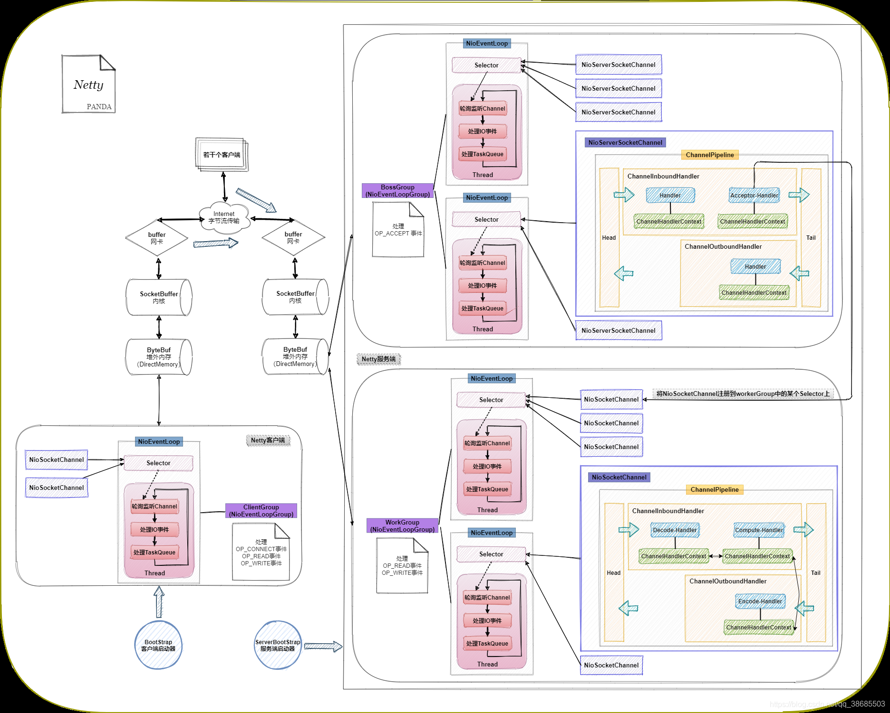

# NioEventLoop

    netty的核心模块就在NioEventLoop中，

## 一、diagram



<!--  -->

## 二、主要属性

|属性|类型|作用|
|:---|:--:|:---|
|selectNowSupplier|IntSupplier|查询连接|
|selector|Selector|JDK的选择器，用于获取连接的建立/读/写/关闭动作|
|unwrappedSelector|Selector|选择器|
|selectedKeys|SelectedSelectionKeySet|本次的连接动作|
|provider|SelectorProvider|选择器|
|nextWakeupNanos|AtomicLong|下一次醒来的时间|
|selectStrategy|SelectStrategy|选择策略|
|ioRatio|int|执行io动作，运行task的时间比例|
|cancelledKeys|int|取消的keys|
|needsToSelectAgain|boolean|是否需要再次查询|

## 三、类加载

```java
// Workaround for JDK NIO bug.
//
// See:
// - https://bugs.openjdk.java.net/browse/JDK-6427854 for first few dev (unreleased) builds of JDK 7
// - https://bugs.openjdk.java.net/browse/JDK-6527572 for JDK prior to 5.0u15-rev and 6u10
// - https://github.com/netty/netty/issues/203
static {
    if (PlatformDependent.javaVersion() < 7) {
        final String key = "sun.nio.ch.bugLevel";
        final String bugLevel = SystemPropertyUtil.get(key);
        if (bugLevel == null) {
            try {
                AccessController.doPrivileged(new PrivilegedAction<Void>() {
                    @Override
                    public Void run() {
                        System.setProperty(key, "");
                        return null;
                    }
                });
            } catch (final SecurityException e) {
                logger.debug("Unable to get/set System Property: " + key, e);
            }
        }
    }

    int selectorAutoRebuildThreshold = SystemPropertyUtil.getInt("io.netty.selectorAutoRebuildThreshold", 512);
    if (selectorAutoRebuildThreshold < MIN_PREMATURE_SELECTOR_RETURNS) {
        selectorAutoRebuildThreshold = 0;
    }

    SELECTOR_AUTO_REBUILD_THRESHOLD = selectorAutoRebuildThreshold;

    if (logger.isDebugEnabled()) {
        logger.debug("-Dio.netty.noKeySetOptimization: {}", DISABLE_KEY_SET_OPTIMIZATION);
        logger.debug("-Dio.netty.selectorAutoRebuildThreshold: {}", SELECTOR_AUTO_REBUILD_THRESHOLD);
    }
}
```

## 四、启动

`NioEventLoop`从类结构上看，他是一个执行器，可执行`Runnable`任务。核心是从`SingleThreadEventExecutor`父类中继承的`execute`方法。

```java
public void execute(Runnable task) {
    execute0(task);
}
private void execute0(@Schedule Runnable task) {
    ObjectUtil.checkNotNull(task, "task");
    execute(task, wakesUpForTask(task));
}
private void execute(Runnable task, boolean immediate) {
    
    boolean inEventLoop = inEventLoop();
    addTask(task);
    if (!inEventLoop) {
        startThread();
        if (isShutdown()) {
            boolean reject = false;
            try {
                if (removeTask(task)) {
                    reject = true;
                }
            } catch (UnsupportedOperationException e) {
                // The task queue does not support removal so the best thing we can do is to just move on and
                // hope we will be able to pick-up the task before its completely terminated.
                // In worst case we will log on termination.
            }
            if (reject) {
                reject();
            }
        }
    }

    if (!addTaskWakesUp && immediate) {
        wakeup(inEventLoop);
    }
}
```

## 五、run
```java
protected void run() {
    for (;;) {
        try {
            switch (selectStrategy.calculateStrategy(selectNowSupplier, hasTasks())) {
                case SelectStrategy.CONTINUE:
                    continue;
                case SelectStrategy.SELECT:
                    select(wakenUp.getAndSet(false));

                    // 'wakenUp.compareAndSet(false, true)' is always evaluated
                    // before calling 'selector.wakeup()' to reduce the wake-up
                    // overhead. (Selector.wakeup() is an expensive operation.)
                    //
                    // However, there is a race condition in this approach.
                    // The race condition is triggered when 'wakenUp' is set to
                    // true too early.
                    //
                    // 'wakenUp' is set to true too early if:
                    // 1) Selector is waken up between 'wakenUp.set(false)' and
                    //    'selector.select(...)'. (BAD)
                    // 2) Selector is waken up between 'selector.select(...)' and
                    //    'if (wakenUp.get()) { ... }'. (OK)
                    //
                    // In the first case, 'wakenUp' is set to true and the
                    // following 'selector.select(...)' will wake up immediately.
                    // Until 'wakenUp' is set to false again in the next round,
                    // 'wakenUp.compareAndSet(false, true)' will fail, and therefore
                    // any attempt to wake up the Selector will fail, too, causing
                    // the following 'selector.select(...)' call to block
                    // unnecessarily.
                    //
                    // To fix this problem, we wake up the selector again if wakenUp
                    // is true immediately after selector.select(...).
                    // It is inefficient in that it wakes up the selector for both
                    // the first case (BAD - wake-up required) and the second case
                    // (OK - no wake-up required).

                    if (wakenUp.get()) {
                        selector.wakeup();
                    }
                default:
                    // fallthrough
            }

            cancelledKeys = 0;
            needsToSelectAgain = false;
            final int ioRatio = this.ioRatio;
            if (ioRatio == 100) {
                try {
                    processSelectedKeys();
                } finally {
                    // Ensure we always run tasks.
                    runAllTasks();
                }
            } else {
                final long ioStartTime = System.nanoTime();
                try {
                    processSelectedKeys();
                } finally {
                    // Ensure we always run tasks.
                    final long ioTime = System.nanoTime() - ioStartTime;
                    runAllTasks(ioTime * (100 - ioRatio) / ioRatio);
                }
            }
        } catch (Throwable t) {
            handleLoopException(t);
        }
        // Always handle shutdown even if the loop processing threw an exception.
        try {
            if (isShuttingDown()) {
                closeAll();
                if (confirmShutdown()) {
                    return;
                }
            }
        } catch (Throwable t) {
            handleLoopException(t);
        }
    }
}
```

## 六、selector

在 Java NIO 中，`Selector` 提供了 `selectNow()` 和 `select()` 方法来检查注册的 `Channel` 是否有 I/O 事件就绪。它们的主要区别在于 **是否阻塞**。

---

### **1. `selectNow()`**
- **非阻塞**，立即返回。
- 如果没有就绪的通道，返回 `0`。
- 适用于需要轮询检查但不想阻塞的场景。

**示例：**
```java
int readyChannels = selector.selectNow();
if (readyChannels > 0) {
    Set<SelectionKey> selectedKeys = selector.selectedKeys();
    for (SelectionKey key : selectedKeys) {
        // 处理事件
    }
    selectedKeys.clear();
}
```
**特点：**
- 适用于 **主动轮询** 的情况，比如在游戏循环或高频 IO 监测场景中。
- 但如果没有就绪的通道，会浪费 CPU 资源，因为它立即返回，而不是等待事件发生。

---

### **2. `select()`**
- **阻塞**，直到至少有一个通道就绪，或者被其他线程 `wakeup()`，或者被 `close()`。
- 适用于等待 I/O 事件的情况，以提高 CPU 利用率。

**示例：**
```java
int readyChannels = selector.select();
if (readyChannels > 0) {
    Set<SelectionKey> selectedKeys = selector.selectedKeys();
    for (SelectionKey key : selectedKeys) {
        // 处理事件
    }
    selectedKeys.clear();
}
```
**特点：**
- 适用于 **低 CPU 消耗的 I/O 轮询**，因为它会阻塞等待事件发生，而不是空转浪费 CPU。
- 适合需要 **高效等待事件** 的场景，比如服务器处理客户端连接。

---

### **3. `select(timeout)`**
- **带超时时间的 `select`**，在超时时间内如果没有事件就绪，则返回 `0`。
- 适用于既不想一直阻塞等待，也不想浪费 CPU 资源的情况。

**示例：**
```java
int readyChannels = selector.select(5000); // 最多等待 5 秒
```
**特点：**
- 适用于 **定期检查 I/O 但不想无限阻塞** 的场景。

---

### **总结**
| 方法 | 是否阻塞 | 返回值 |
|------|--------|------|
| `selectNow()` | 非阻塞 | 立即返回就绪的通道数，没有就返回 0 |
| `select()` | 阻塞 | 至少有一个通道就绪才返回 |
| `select(timeout)` | 阻塞（带超时） | 在超时内等到至少一个通道就绪，否则返回 0 |

**选择使用场景：**
- **`selectNow()`** → 适合轮询、避免阻塞，但可能浪费 CPU。
- **`select()`** → 适合等待 I/O 事件，提高 CPU 利用率。
- **`select(timeout)`** → 适合折中场景，不想无限等待，也不想过度消耗 CPU。

## 七、task

在`netty`的`NioEventLoop`中存在两个任务队列：`taskQueue`以及`scheduledTaskQueue`
1. `taskQueue`：任务队列，执行非定时任务 以及所有到执行时间的定时任务，所有的任务都要经过`taskQueue`才最终被拉取执行。该队列使用的是`jctools`中的多生产者单消费者的队列`Mpsc.newMpscQueue(maxCapacity)`
2. `scheduledTaskQueue`：定时任务队列，该队列使用的是`PriorityQueue`（优先级队列），采用的是堆排序算法，以保证头节点优先级最高（当然也只能保证头节点的优先级最高，后续的节点并非按优先级排序）

### 7.1 运行所有任务

1. 运行所有任务，其主要流程就是拉取定时任务到`taskQueue`，再执行

```java
protected boolean runAllTasks() {
    assert inEventLoop();
    boolean fetchedAll;
    boolean ranAtLeastOne = false;

    do {
        // 拉取可执行定时任务到taskQueue
        fetchedAll = fetchFromScheduledTaskQueue();
        // 从taskQueue中运行所有任务
        if (runAllTasksFrom(taskQueue)) {
            ranAtLeastOne = true;
        }
    } while (!fetchedAll); // keep on processing until we fetched all scheduled tasks.

    if (ranAtLeastOne) {
        lastExecutionTime = ScheduledFutureTask.nanoTime();
    }
    // 预留的拓展口
    afterRunningAllTasks();
    return ranAtLeastOne;
}
```

2. 拉取定时任务
```java
private boolean fetchFromScheduledTaskQueue() {
    // 计算定时任务时间，来拉取可执行的定时任务
    long nanoTime = AbstractScheduledEventExecutor.nanoTime();
    // 从定时任务队列中拉取可执行的定时任务
    Runnable scheduledTask  = pollScheduledTask(nanoTime);
    while (scheduledTask != null) {
        // 添加到执行队列中
        if (!taskQueue.offer(scheduledTask)) {
            // 如果失败，这意味着任务队列空间已满，重新加入定时任务队列
            // No space left in the task queue add it back to the scheduledTaskQueue so we pick it up again.
            scheduledTaskQueue().add((ScheduledFutureTask<?>) scheduledTask);
            // 此时意味着可执行的定时任务未完全拉取
            return false;
        }
        // 从定时任务队列中拉取可执行的定时任务
        scheduledTask  = pollScheduledTask(nanoTime);
    }
    // 此时表示已全部拉取
    return true;
}

protected final Runnable pollScheduledTask(long nanoTime) {
    assert inEventLoop();

    Queue<ScheduledFutureTask<?>> scheduledTaskQueue = this.scheduledTaskQueue;
    ScheduledFutureTask<?> scheduledTask = scheduledTaskQueue == null ? null : scheduledTaskQueue.peek();
    if (scheduledTask == null) {
        return null;
    }
    // 判断当前任务的执行时间
    if (scheduledTask.deadlineNanos() <= nanoTime) {
        scheduledTaskQueue.remove();
        return scheduledTask;
    }
    return null;
}
```

3. 从队列中运行所有任务
```java
protected final boolean runAllTasksFrom(Queue<Runnable> taskQueue) {
    // 拉取任务
    Runnable task = pollTaskFrom(taskQueue);
    if (task == null) {
        return false;
    }
    for (;;) {
        // 循环执行任务
        safeExecute(task);
        task = pollTaskFrom(taskQueue);
        if (task == null) {
            return true;
        }
    }
}

protected final Runnable pollTaskFrom(Queue<Runnable> taskQueue) {
    for (;;) {
        Runnable task = taskQueue.poll();
        if (task == WAKEUP_TASK) {
            continue;
        }
        return task;
    }
}

protected static void safeExecute(Runnable task) {
    try {
        task.run();
    } catch (Throwable t) {
        logger.warn("A task raised an exception. Task: {}", task, t);
    }
}
```

### 7.2 限时运行任务

```java
protected boolean runAllTasks(long timeoutNanos) {
    // 从定时任务中拉取可执行任务到taskQueue
    fetchFromScheduledTaskQueue();
    // 从taskQueue中拉取任务
    Runnable task = pollTask();
    if (task == null) {
        afterRunningAllTasks();
        return false;
    }
    // 计算终止时间
    final long deadline = ScheduledFutureTask.nanoTime() + timeoutNanos;
    long runTasks = 0;
    long lastExecutionTime;
    for (;;) {
        // 执行任务
        safeExecute(task);

        runTasks ++;

        // Check timeout every 64 tasks because nanoTime() is relatively expensive.
        // XXX: Hard-coded value - will make it configurable if it is really a problem.
        // 每执行64次任务时，校验一次deadline
        if ((runTasks & 0x3F) == 0) {
            lastExecutionTime = ScheduledFutureTask.nanoTime();
            if (lastExecutionTime >= deadline) {
                break;
            }
        }

        task = pollTask();
        if (task == null) {
            lastExecutionTime = ScheduledFutureTask.nanoTime();
            break;
        }
    }
    // 预留的拓展口
    afterRunningAllTasks();
    this.lastExecutionTime = lastExecutionTime;
    return true;
}
```