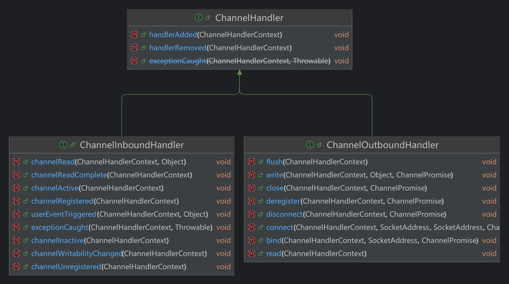

# ChannelHandler

|方法名|英文描述|中文描述|
|:---|:---|:---|
|handlerAdded|Gets called after the {@link ChannelHandler} was added to the actual context and it's ready to handle events.|当Channelhandler被添加到实际的context中，并且已准备处理事件时，该方法被调用|
|handlerRemoved|Gets called after the {@link ChannelHandler} was removed from the actual context and it doesn't handle events anymore.|当Channelhandler从实际的context中被移除，并且无法处理事件时，该方法被调用|

## ChannelInboundHandler

|方法名|英文描述|中文描述|
|:---|:---|:---|
|channelRegistered|The Channel of the ChannelHandlerContext was registered with its EventLoop|当ChannelHandlerContext的Channel被注册到EventLoop中时调用|
|channelUnregistered|The Channel of the ChannelHandlerContext was unregistered from its EventLoop|当ChannelHandlerContext的Channel从它的EventLoop中被解除注册时调用|
|channelActive|The Channel of the ChannelHandlerContext is now active|在Netty的异步事件驱动模型中，当网络连接建立成功且准备好进行数据传输时，Channel会被标记为活动状态。此时，channelActive方法会被触发，以通知应用程序该事件|
|channelInactive|The Channel of the ChannelHandlerContext was registered is now inactive and reached its end of lifetime.|已经注册的channel处于非活跃状态，并且达到生命周期的终点时调用|
|channelRead|Invoked when the current Channel has read a message from the peer.|当Netty的Channel从对等端读取到消息时，会调用此方法|
|channelReadComplete|Invoked when the last message read by the current read operation has been consumed by channelRead(ChannelHandlerContext, Object). If ChannelOption. AUTO_READ is off, no further attempt to read an inbound data from the current Channel will be made until ChannelHandlerContext. read() is called.|这个方法在当前的读操作读取的最后一条消息被channelRead()方法消费之后被调用。具体来说，当Netty从底层的网络通道中读取数据，并通过channelRead()方法将数据传递给应用程序之后，如果这次读取操作完成（即没有更多的数据可以立即从通道中读取），就会触发channelReadComplete()方法的调用|
|userEventTriggered|Gets called if an user event was triggered.|用户自定义事件触发时调用|
|channelWritabilityChanged|Gets called once the writable state of a Channel changed. You can check the state with Channel. isWritable().|一旦Channel的可写状态变更时，该方法被调用，你可以用Channel.isWritable()来检查状态|
|exceptionCaught|Gets called if a Throwable was thrown.|当Throwable被抛出来时调用|

## ChannelOutboundHandler

|方法名|英文描述|中文描述|
|:---|:---|:---|
|bind|Called once a bind operation is made.|执行绑定操作时调用|
|connect|Called once a connect operation is made.|执行连接操作时调用|
|disconnect|Called once a disconnect operation is made.|执行解除连接时调用|
|close|Called once a close operation is made.|执行关闭操作时调用|
|deregister|Called once a deregister operation is made from the current registered EventLoop.|从当前注册的EventLoop中执行解除注册操作时调用|
|read|Intercepts ChannelHandlerContext. read().|拦截处理ChannelHandlerContext.read()：通过SelectionKey关联感兴趣的网络事件，以便后续向selector中select相关事件|
|write|Called once a write operation is made. The write operation will write the messages through the ChannelPipeline. Those are then ready to be flushed to the actual Channel once Channel. flush() is called|执行写操作时调用，该写操作将通过ChannelPipeline来write message，然后等待flush操作被调用，来冲刷数据|
|flush|Called once a flush operation is made. The flush operation will try to flush out all previous written messages that are pending.|执行flush操作时调用，该操作将冲刷之前所有已写且等待冲刷的数据|