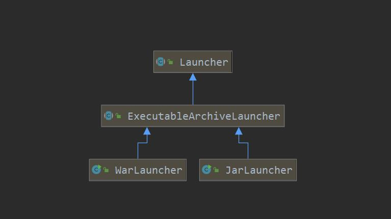

# SpringBoot启动分析

## Jar包结构
```
├── BOOT-INF
│   ├── classes
│   │   ├── application.properties
│   │   └── cn
│   │       └── lsp
│   │           └── springboot
│   │               └── executablejar
│   │                   └── ExecutableJarApplication.class
│   ├── classpath.idx
│   ├── layers.idx
│   └── lib
│       ├── ... ...
│       ├── spring-boot-2.6.2.jar
│       ├── ... ...
├── META-INF
│   ├── MANIFEST.MF
│   └── maven
│       └── cn.lsp.springboot
│           └── executable-jar
│               ├── pom.properties
│               └── pom.xml
└── org
    └── springframework
        └── boot
            └── loader
                ├── ClassPathIndexFile.class
                ├── ExecutableArchiveLauncher.class
                ├── JarLauncher.class
                ├── LaunchedURLClassLoader.class
                ├── Launcher.class
                ├── ... ...
```

1. BOOT-INF/classes目录存放应用编译后的class文件；   
2. BOOT-INF/classpath.id 可执行jar文件依赖的类路径索引文件；  
3. BOOT-INF/lib目录存放应用依赖的jar包；  
4. META-INF目录存放应用相关的元信息，如MANIFEST.MF文件；  
5. org目录存放启动SpringBoot相关的class文件；  
## JarLauncher

    以往我们关注SpringBoot启动,都直接从入口类的main方法进行分析,但是并没有更深入的了解.这一次,我们从SpringBoot打包后的jar启动,进行分析.

### MANIFEST.MF

    以下是一个测试项目打包后的MANIFEST.MF文件
```
Manifest-Version: 1.0
Spring-Boot-Classpath-Index: BOOT-INF/classpath.idx
Implementation-Title: spring-boot-study
Implementation-Version: 0.0.1-SNAPSHOT
Spring-Boot-Layers-Index: BOOT-INF/layers.idx
Start-Class: com.xiaohe.springbootstudy.SpringBootStudyApplication
Spring-Boot-Classes: BOOT-INF/classes/
Spring-Boot-Lib: BOOT-INF/lib/
Build-Jdk-Spec: 1.8
Spring-Boot-Version: 2.4.5
Created-By: Maven Jar Plugin 3.2.0
Main-Class: org.springframework.boot.loader.JarLauncher
```
    文件里,我们主要关注的是两个部分Main-Class(实际的启动类),Start-Class(工程的启动类)

#### Main-Class



```java

public JarLauncher() {}

public ExecutableArchiveLauncher() {
    try {
        this.archive = createArchive();
        this.classPathIndex = getClassPathIndex(this.archive);
    }
    catch (Exception ex) {
        throw new IllegalStateException(ex);
    }
}

public static void main(String[] args) throws Exception {
    new JarLauncher().launch(args);
}

protected void launch(String[] args) throws Exception {
    if (!isExploded()) {
        JarFile.registerUrlProtocolHandler();
    }
    // 创建springboot的类加载器
    ClassLoader classLoader = createClassLoader(getClassPathArchivesIterator());
    String jarMode = System.getProperty("jarmode");
    // 获取启动类Start-class
    String launchClass = (jarMode != null && !jarMode.isEmpty()) ? JAR_MODE_LAUNCHER : getMainClass();
    // 启动，设置线程的类加载器，并启动项目实际的main方法
    launch(args, launchClass, classLoader);
}

// 获取类路径下的归档文件的迭代器
protected Iterator<Archive> getClassPathArchivesIterator() throws Exception {
    Archive.EntryFilter searchFilter = this::isSearchCandidate;
    // 主要是获取类及依赖jar
    Iterator<Archive> archives = this.archive.getNestedArchives(searchFilter,
            (entry) -> isNestedArchive(entry) && !isEntryIndexed(entry));
    if (isPostProcessingClassPathArchives()) {
        archives = applyClassPathArchivePostProcessing(archives);
    }
    return archives;
}

static final EntryFilter NESTED_ARCHIVE_ENTRY_FILTER = (entry) -> {
    if (entry.isDirectory()) {
        return entry.getName().equals("BOOT-INF/classes/");
    }
    return entry.getName().startsWith("BOOT-INF/lib/");
};
// 判断是否为内部class还是依赖的jar包
protected boolean isNestedArchive(Archive.Entry entry) {
    return NESTED_ARCHIVE_ENTRY_FILTER.matches(entry);
}
// 暂时未知
private boolean isEntryIndexed(Archive.Entry entry) {
    if (this.classPathIndex != null) {
        return this.classPathIndex.containsEntry(entry.getName());
    }
    return false;
}

// 创建类加载器LaunchedURLClassLoader，并将我们工程中的类以及依赖的类都用该类加载器进行加载
protected ClassLoader createClassLoader(Iterator<Archive> archives) throws Exception {
    List<URL> urls = new ArrayList<>(50);
    while (archives.hasNext()) {
        urls.add(archives.next().getUrl());
    }
    return createClassLoader(urls.toArray(new URL[0]));
}

// 我们了解到LaunchedURLClassLoader的属性ucp = new URLClassPath(urls, acc)，即为了后续findClass时，可以拿到jar in jar中的类
// 这里我们需要了解到一个tips:即java可执行jar原本是不可以依赖其他jar的，而springboot通过创建LaunchedURLClassLoader来加载jar in jar中的类
protected ClassLoader createClassLoader(URL[] urls) throws Exception {
    return new LaunchedURLClassLoader(isExploded(), getArchive(), urls, getClass().getClassLoader());
}

// 这里在启动时，将当前线程的类加载器置为SpringBoot的类加载器，即保证后续类加载都是用该类加载器
protected void launch(String[] args, String launchClass, ClassLoader classLoader) throws Exception {
    Thread.currentThread().setContextClassLoader(classLoader);
    // 运行Start-class即项目实际的启动类
    createMainMethodRunner(launchClass, args, classLoader).run();
}
```

## LaunchedURLClassLoader
    java中的可执行jar是不可以依赖其他jar的，而Springboot通过创建LaunchedURLClassLoader来加载jar in jar中的类
    该类加载实际上还是使用super进行类加载

```java
@Override
protected Class<?> loadClass(String name, boolean resolve) throws ClassNotFoundException {
    if (name.startsWith("org.springframework.boot.loader.jarmode.")) {
        try {
            Class<?> result = loadClassInLaunchedClassLoader(name);
            if (resolve) {
                resolveClass(result);
            }
            return result;
        }
        catch (ClassNotFoundException ex) {
        }
    }
    if (this.exploded) {
        return super.loadClass(name, resolve);
    }
    Handler.setUseFastConnectionExceptions(true);
    try {
        try {
            definePackageIfNecessary(name);
        }
        catch (IllegalArgumentException ex) {
            // Tolerate race condition due to being parallel capable
            if (getPackage(name) == null) {
                // This should never happen as the IllegalArgumentException indicates
                // that the package has already been defined and, therefore,
                // getPackage(name) should not return null.
                throw new AssertionError("Package " + name + " has already been defined but it could not be found");
            }
        }
        return super.loadClass(name, resolve);
    }
    finally {
        Handler.setUseFastConnectionExceptions(false);
    }
}


protected Class<?> findClass(final String name)
    throws ClassNotFoundException
{
    final Class<?> result;
    try {
        result = AccessController.doPrivileged(
            new PrivilegedExceptionAction<Class<?>>() {
                public Class<?> run() throws ClassNotFoundException {
                    String path = name.replace('.', '/').concat(".class");
                    // 可以看到这里ucp进行类文件加载，即达到了springboot对JarInJar的类加载
                    Resource res = ucp.getResource(path, false);
                    if (res != null) {
                        try {
                            return defineClass(name, res);
                        } catch (IOException e) {
                            throw new ClassNotFoundException(name, e);
                        }
                    } else {
                        return null;
                    }
                }
            }, acc);
    } catch (java.security.PrivilegedActionException pae) {
        throw (ClassNotFoundException) pae.getException();
    }
    if (result == null) {
        throw new ClassNotFoundException(name);
    }
    return result;
}
``
