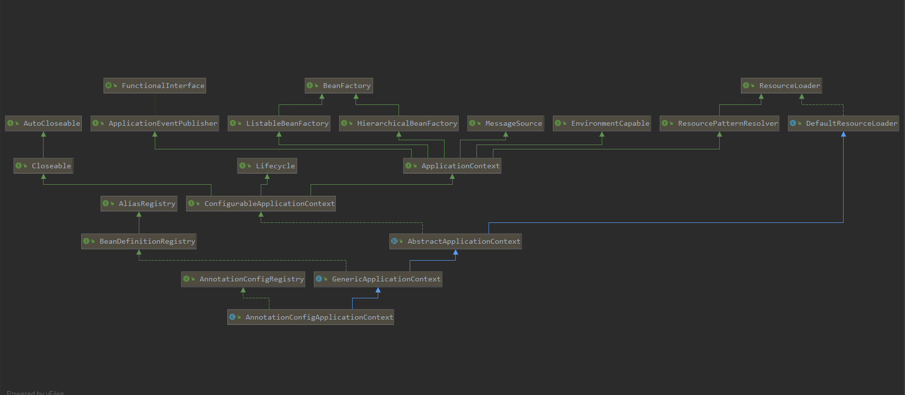

# 基于注解启动分析

## 要点提炼

1. AnnotationConfigApplicationContext内部的BeanFactory创建时机，在于构造方法会默认调用父类GenericApplicationContext构造方法，此时会创建DefaultListableBeanFactory

2. AnnotationConfigApplicationContext在构造方法中会创建AnnotatedBeanDefinitionReader，此时会做几件大事：
    1. 创建默认的Environment
    2. 创建ConditionEvaluator 用于处理@Conditional注解
    3. 注册注解配置解析器
        1. AnnotationAwareOrderComparator
            注解排序器
        2. ContextAnnotationAutowireCandidateResolver
            注入候补解析器，用于后续属性注入时，处理属性的实例获取
            该类继承于QualifierAnnotationAutowireCandidateResolver，但是增加对@Lazy注解支持
        3. ConfigurationClassPostProcessor
            ConfigurationClassPostProcessor implements BeanDefinitionRegistryPostProcessor,PriorityOrdered, ResourceLoaderAware, ApplicationStartupAware, BeanClassLoaderAware, EnvironmentAware
            实现了接口BeanDefinitionRegistryPostProcessor（BeanFactoryPostProcessor的子类）
            该类用于处理@Configuration注解
        4. AutowiredAnnotationBeanPostProcessor
            AutowiredAnnotationBeanPostProcessor implements SmartInstantiationAwareBeanPostProcessor,MergedBeanDefinitionPostProcessor, PriorityOrdered, BeanFactoryAware
            该类主要用于处理@Autowired @Value等注解，以及处理MergedBeanDefinition
        5. CommonAnnotationBeanPostProcessor
             CommonAnnotationBeanPostProcessor extends InitDestroyAnnotationBeanPostProcessor implements InstantiationAwareBeanPostProcessor, BeanFactoryAware, Serializable
             该类主要用于处理@Resource @PostContruct @PreDestroy等注解（静态代码块，构造方法）
        6. PersistenceAnnotationBeanPostProcessor
            看不到源码，暂时不作分析
        7. EventListenerMethodProcessor
            EventListenerMethodProcessor implements SmartInitializingSingleton, ApplicationContextAware, BeanFactoryPostProcessor
            该类用于处理注解 @EventListener 的
        8. DefaultEventListenerFactory
            该类用于适配ApplicationListener方法，即处理@EventListener

3. ClassPathBeanDefinitionScanner
    1. 注册默认的过滤器，includeFilters过滤器包含new AnnotationTypeFilter(Component.class)
    2. 设置Environment
    3. 设置资源加载器

### 重要属性

    1. 注解生成的BeanDefinition的实例是ScannedGenericBeanDefinition，但此时并未进行bean的类信息解析

    2. MetadataReader = SimpleMetadataReader

    3. ClassVisitor = SimpleAnnotationMetadataReadingVisitor

    4. metadata = SimpleAnnotationMetadata

    ContextTypeMatchClassLoader