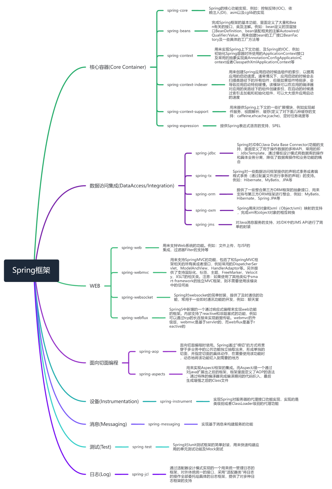

# Spring架构简析



## SpringBoot

### SpringApplication 创建
```java
public SpringApplication(ResourceLoader resourceLoader, Class<?>... primarySources) {
    this.resourceLoader = resourceLoader;
    Assert.notNull(primarySources, "PrimarySources must not be null");
    this.primarySources = new LinkedHashSet<>(Arrays.asList(primarySources));
    // 判断当前的启动类型：reactive，servlet，none
    this.webApplicationType = WebApplicationType.deduceFromClasspath();
    // 加载spring.factories文件中获取class，并实例化
    setInitializers((Collection) getSpringFactoriesInstances(ApplicationContextInitializer.class));
    setListeners((Collection) getSpringFactoriesInstances(ApplicationListener.class));
    // 通过异常栈获取main类
    this.mainApplicationClass = deduceMainApplicationClass();
}
```

### SpringApplication.run
```java
public ConfigurableApplicationContext run(String... args) {
    StopWatch stopWatch = new StopWatch();
    stopWatch.start();
    ConfigurableApplicationContext context = null;
    // 当 java.awt.headless 设置为 true 时，Java 应用程序将禁用图形操作，例如绘制图形或创建窗口。这可以提高性能并减少资源消耗，因为服务器或自动化测试环境通常不需要图形界面。
    configureHeadlessProperty();
    // 从 spring.factories 中获取 SpringApplicationRunListener
    SpringApplicationRunListeners listeners = getRunListeners(args);
    listeners.starting();
    try {
        // 启动参数解析
        ApplicationArguments applicationArguments = new DefaultApplicationArguments(args);
        // 准备环境，以及listener的事件处理
        ConfigurableEnvironment environment = prepareEnvironment(listeners, applicationArguments);
        configureIgnoreBeanInfo(environment);
        Banner printedBanner = printBanner(environment);
        context = createApplicationContext();
        prepareContext(context, environment, listeners, applicationArguments, printedBanner);
        refreshContext(context);
        afterRefresh(context, applicationArguments);
        stopWatch.stop();
        if (this.logStartupInfo) {
            new StartupInfoLogger(this.mainApplicationClass).logStarted(getApplicationLog(), stopWatch);
        }
        listeners.started(context);
        callRunners(context, applicationArguments);
    }
    catch (Throwable ex) {
        handleRunFailure(context, ex, listeners);
        throw new IllegalStateException(ex);
    }

    try {
        listeners.running(context);
    }
    catch (Throwable ex) {
        handleRunFailure(context, ex, null);
        throw new IllegalStateException(ex);
    }
    return context;
}
```


## IOC

## CONFIG

## AOP

## MVC

## TRANSACTION

## TOMCAT