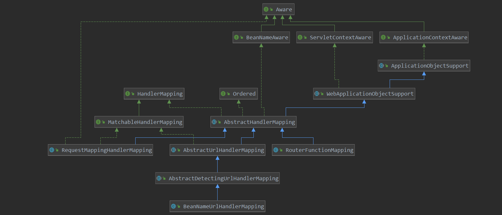

# SpringMVC启动流程源码解析
SpringMVC主要的关键类在于DispatcherServlet
## DispatcherServlet的类图


DispatcherServlet继承于父类`FrameworkServlet`,爷爷`HttpServletBean`。而这其中重要的方法则是`init`方法。

### HttpServletBean_init

    在tomcat中初始化servlet时，会调用 init 方法。并在其中留下钩子方法 initServletBean ，由子类拓展
```java
public final void init() throws ServletException {
	// 从ServletConfig中获取需要的属性值
    PropertyValues pvs = new ServletConfigPropertyValues(getServletConfig(), this.requiredProperties);
    if (!pvs.isEmpty()) {
        try {
			// 包装器包装下，以便后续属性赋值
            BeanWrapper bw = PropertyAccessorFactory.forBeanPropertyAccess(this);
            ResourceLoader resourceLoader = new ServletContextResourceLoader(getServletContext());
            bw.registerCustomEditor(Resource.class, new ResourceEditor(resourceLoader, getEnvironment()));
            initBeanWrapper(bw);
			// 此处是初始化 DispatcherServlet的属性
            bw.setPropertyValues(pvs, true);
        }
        catch (BeansException ex) {
            if (logger.isErrorEnabled()) {
                logger.error("Failed to set bean properties on servlet '" + getServletName() + "'", ex);
            }
            throw ex;
        }
    }
    initServletBean();
}
```

### FrameworkServlet_initServletBean

    此处会进行容器的初始化动作 initWebApplicationContext，并留下 hook 方法 initFrameworkServlet，交由子类拓展

```java
protected final void initServletBean() throws ServletException {
    getServletContext().log("Initializing Spring " + getClass().getSimpleName() + " '" + getServletName() + "'");
    if (logger.isInfoEnabled()) {
        logger.info("Initializing Servlet '" + getServletName() + "'");
    }
    long startTime = System.currentTimeMillis();

    try {
        this.webApplicationContext = initWebApplicationContext();
        initFrameworkServlet();
    }
    catch (ServletException | RuntimeException ex) {
        logger.error("Context initialization failed", ex);
        throw ex;
    }

    if (logger.isDebugEnabled()) {
        String value = this.enableLoggingRequestDetails ?
                "shown which may lead to unsafe logging of potentially sensitive data" :
                "masked to prevent unsafe logging of potentially sensitive data";
        logger.debug("enableLoggingRequestDetails='" + this.enableLoggingRequestDetails +
                "': request parameters and headers will be " + value);
    }

    if (logger.isInfoEnabled()) {
        logger.info("Completed initialization in " + (System.currentTimeMillis() - startTime) + " ms");
    }
}
```

### initWebApplicationContext

    初始化WebApplicationContext，并执行DispatcherServlet的初始化动作
```java
    protected WebApplicationContext initWebApplicationContext() {
        // 从ServletContext中获取WebApplicationContext，参数名：WebApplicationContext全限定类名.ROOT
		WebApplicationContext rootContext =
				WebApplicationContextUtils.getWebApplicationContext(getServletContext());
		WebApplicationContext wac = null;
        // 判断当前是否有 WebApplicationContext
		if (this.webApplicationContext != null) {
			wac = this.webApplicationContext;
			if (wac instanceof ConfigurableWebApplicationContext) {
				ConfigurableWebApplicationContext cwac = (ConfigurableWebApplicationContext) wac;
				if (!cwac.isActive()) {
					if (cwac.getParent() == null) {
						cwac.setParent(rootContext);
					}
					configureAndRefreshWebApplicationContext(cwac);
				}
			}
		}
		if (wac == null) {
            // 如果wac为空，则通过属性 contextAttribute 去ServletContext中查找是否存在 WebApplicationContext
			wac = findWebApplicationContext();
		}
		if (wac == null) {
            // 创建默认的WebApplicationContext XmlWebApplicationContext，然后启动容器
			wac = createWebApplicationContext(rootContext);
		}

		if (!this.refreshEventReceived) {
			// 重中之重，此处方法由DispatcherServlet重写
			synchronized (this.onRefreshMonitor) {
				onRefresh(wac);
			}
		}

		if (this.publishContext) {
			// Publish the context as a servlet context attribute.
			String attrName = getServletContextAttributeName();
			getServletContext().setAttribute(attrName, wac);
		}

		return wac;
	}
```

### DispatcherServlet_onRefresh
	DispatcherServlet.properties内容，该文件用于加载MVC系统需要的解析器
```
# Default implementation classes for DispatcherServlet's strategy interfaces.
# Used as fallback when no matching beans are found in the DispatcherServlet context.
# Not meant to be customized by application developers.

org.springframework.web.servlet.LocaleResolver=org.springframework.web.servlet.i18n.AcceptHeaderLocaleResolver

org.springframework.web.servlet.ThemeResolver=org.springframework.web.servlet.theme.FixedThemeResolver

org.springframework.web.servlet.HandlerMapping=org.springframework.web.servlet.handler.BeanNameUrlHandlerMapping,\
	org.springframework.web.servlet.mvc.method.annotation.RequestMappingHandlerMapping,\
	org.springframework.web.servlet.function.support.RouterFunctionMapping

org.springframework.web.servlet.HandlerAdapter=org.springframework.web.servlet.mvc.HttpRequestHandlerAdapter,\
	org.springframework.web.servlet.mvc.SimpleControllerHandlerAdapter,\
	org.springframework.web.servlet.mvc.method.annotation.RequestMappingHandlerAdapter,\
	org.springframework.web.servlet.function.support.HandlerFunctionAdapter


org.springframework.web.servlet.HandlerExceptionResolver=org.springframework.web.servlet.mvc.method.annotation.ExceptionHandlerExceptionResolver,\
	org.springframework.web.servlet.mvc.annotation.ResponseStatusExceptionResolver,\
	org.springframework.web.servlet.mvc.support.DefaultHandlerExceptionResolver

org.springframework.web.servlet.RequestToViewNameTranslator=org.springframework.web.servlet.view.DefaultRequestToViewNameTranslator

org.springframework.web.servlet.ViewResolver=org.springframework.web.servlet.view.InternalResourceViewResolver

org.springframework.web.servlet.FlashMapManager=org.springframework.web.servlet.support.SessionFlashMapManager
```

```java

    protected void onRefresh(ApplicationContext context) {
		initStrategies(context);
	}

    protected void initStrategies(ApplicationContext context) {
		// 初始化 MultipartResolver ：该类用于处理文件上传
		initMultipartResolver(context);
		// 初始化 国际化解析器 即设置MVC不同的语言
		initLocaleResolver(context);
		// 初始化 主题解析器：用于jsp文件更换主题
		initThemeResolver(context);
		// 初始化 映射处理器 
		initHandlerMappings(context);
		// 初始化 适配处理器
		initHandlerAdapters(context);
		// 初始化 异常解析器
		initHandlerExceptionResolvers(context);
		// 初始化 视图解析转换器
		initRequestToViewNameTranslator(context);
		// 初始化 视图解析器
		initViewResolvers(context);
		// FlashMap主要用于在redirect中传递参数，而FlashMapManager主要用于管理FlashMap
		initFlashMapManager(context);
	}

	// 初始化 MultipartResolver ：该类用于处理文件上传
	private void initMultipartResolver(ApplicationContext context) {
		try {
			this.multipartResolver = context.getBean(MULTIPART_RESOLVER_BEAN_NAME, MultipartResolver.class);
			if (logger.isTraceEnabled()) {
				logger.trace("Detected " + this.multipartResolver);
			}
			else if (logger.isDebugEnabled()) {
				logger.debug("Detected " + this.multipartResolver.getClass().getSimpleName());
			}
		}
		catch (NoSuchBeanDefinitionException ex) {
			// Default is no multipart resolver.
			this.multipartResolver = null;
			if (logger.isTraceEnabled()) {
				logger.trace("No MultipartResolver '" + MULTIPART_RESOLVER_BEAN_NAME + "' declared");
			}
		}
	}

	// 初始化 国际化解析器 即设置MVC不同的语言
	private void initLocaleResolver(ApplicationContext context) {
		try {
			this.localeResolver = context.getBean(LOCALE_RESOLVER_BEAN_NAME, LocaleResolver.class);
			if (logger.isTraceEnabled()) {
				logger.trace("Detected " + this.localeResolver);
			}
			else if (logger.isDebugEnabled()) {
				logger.debug("Detected " + this.localeResolver.getClass().getSimpleName());
			}
		}
		catch (NoSuchBeanDefinitionException ex) {
			// We need to use the default.
			this.localeResolver = getDefaultStrategy(context, LocaleResolver.class);
			if (logger.isTraceEnabled()) {
				logger.trace("No LocaleResolver '" + LOCALE_RESOLVER_BEAN_NAME +
						"': using default [" + this.localeResolver.getClass().getSimpleName() + "]");
			}
		}
	}

	// 初始化 主题解析器：用于jsp文件更换主题
	private void initThemeResolver(ApplicationContext context) {
		try {
			this.themeResolver = context.getBean(THEME_RESOLVER_BEAN_NAME, ThemeResolver.class);
			if (logger.isTraceEnabled()) {
				logger.trace("Detected " + this.themeResolver);
			}
			else if (logger.isDebugEnabled()) {
				logger.debug("Detected " + this.themeResolver.getClass().getSimpleName());
			}
		}
		catch (NoSuchBeanDefinitionException ex) {
			// We need to use the default.
			this.themeResolver = getDefaultStrategy(context, ThemeResolver.class);
			if (logger.isTraceEnabled()) {
				logger.trace("No ThemeResolver '" + THEME_RESOLVER_BEAN_NAME +
						"': using default [" + this.themeResolver.getClass().getSimpleName() + "]");
			}
		}
	}

	// 初始化 映射处理器 
	private void initHandlerMappings(ApplicationContext context) {
		this.handlerMappings = null;

		if (this.detectAllHandlerMappings) {
			// Find all HandlerMappings in the ApplicationContext, including ancestor contexts.
			Map<String, HandlerMapping> matchingBeans =
					BeanFactoryUtils.beansOfTypeIncludingAncestors(context, HandlerMapping.class, true, false);
			if (!matchingBeans.isEmpty()) {
				this.handlerMappings = new ArrayList<>(matchingBeans.values());
				// We keep HandlerMappings in sorted order.
				AnnotationAwareOrderComparator.sort(this.handlerMappings);
			}
		}
		else {
			try {
				HandlerMapping hm = context.getBean(HANDLER_MAPPING_BEAN_NAME, HandlerMapping.class);
				this.handlerMappings = Collections.singletonList(hm);
			}
			catch (NoSuchBeanDefinitionException ex) {
				// Ignore, we'll add a default HandlerMapping later.
			}
		}

		// Ensure we have at least one HandlerMapping, by registering
		// a default HandlerMapping if no other mappings are found.
		if (this.handlerMappings == null) {
			this.handlerMappings = getDefaultStrategies(context, HandlerMapping.class);
			if (logger.isTraceEnabled()) {
				logger.trace("No HandlerMappings declared for servlet '" + getServletName() +
						"': using default strategies from DispatcherServlet.properties");
			}
		}
	}

	// 初始化 适配处理器
	private void initHandlerAdapters(ApplicationContext context) {
		this.handlerAdapters = null;

		if (this.detectAllHandlerAdapters) {
			// Find all HandlerAdapters in the ApplicationContext, including ancestor contexts.
			Map<String, HandlerAdapter> matchingBeans =
					BeanFactoryUtils.beansOfTypeIncludingAncestors(context, HandlerAdapter.class, true, false);
			if (!matchingBeans.isEmpty()) {
				this.handlerAdapters = new ArrayList<>(matchingBeans.values());
				// We keep HandlerAdapters in sorted order.
				AnnotationAwareOrderComparator.sort(this.handlerAdapters);
			}
		}
		else {
			try {
				HandlerAdapter ha = context.getBean(HANDLER_ADAPTER_BEAN_NAME, HandlerAdapter.class);
				this.handlerAdapters = Collections.singletonList(ha);
			}
			catch (NoSuchBeanDefinitionException ex) {
				// Ignore, we'll add a default HandlerAdapter later.
			}
		}

		// Ensure we have at least some HandlerAdapters, by registering
		// default HandlerAdapters if no other adapters are found.
		if (this.handlerAdapters == null) {
			this.handlerAdapters = getDefaultStrategies(context, HandlerAdapter.class);
			if (logger.isTraceEnabled()) {
				logger.trace("No HandlerAdapters declared for servlet '" + getServletName() +
						"': using default strategies from DispatcherServlet.properties");
			}
		}
	}

	// 初始化 异常解析器
	private void initHandlerExceptionResolvers(ApplicationContext context) {
		this.handlerExceptionResolvers = null;

		if (this.detectAllHandlerExceptionResolvers) {
			// Find all HandlerExceptionResolvers in the ApplicationContext, including ancestor contexts.
			Map<String, HandlerExceptionResolver> matchingBeans = BeanFactoryUtils
					.beansOfTypeIncludingAncestors(context, HandlerExceptionResolver.class, true, false);
			if (!matchingBeans.isEmpty()) {
				this.handlerExceptionResolvers = new ArrayList<>(matchingBeans.values());
				// We keep HandlerExceptionResolvers in sorted order.
				AnnotationAwareOrderComparator.sort(this.handlerExceptionResolvers);
			}
		}
		else {
			try {
				HandlerExceptionResolver her =
						context.getBean(HANDLER_EXCEPTION_RESOLVER_BEAN_NAME, HandlerExceptionResolver.class);
				this.handlerExceptionResolvers = Collections.singletonList(her);
			}
			catch (NoSuchBeanDefinitionException ex) {
				// Ignore, no HandlerExceptionResolver is fine too.
			}
		}

		// Ensure we have at least some HandlerExceptionResolvers, by registering
		// default HandlerExceptionResolvers if no other resolvers are found.
		if (this.handlerExceptionResolvers == null) {
			this.handlerExceptionResolvers = getDefaultStrategies(context, HandlerExceptionResolver.class);
			if (logger.isTraceEnabled()) {
				logger.trace("No HandlerExceptionResolvers declared in servlet '" + getServletName() +
						"': using default strategies from DispatcherServlet.properties");
			}
		}
	}

	// 初始化 视图解析转换器
	private void initRequestToViewNameTranslator(ApplicationContext context) {
		try {
			this.viewNameTranslator =
					context.getBean(REQUEST_TO_VIEW_NAME_TRANSLATOR_BEAN_NAME, RequestToViewNameTranslator.class);
			if (logger.isTraceEnabled()) {
				logger.trace("Detected " + this.viewNameTranslator.getClass().getSimpleName());
			}
			else if (logger.isDebugEnabled()) {
				logger.debug("Detected " + this.viewNameTranslator);
			}
		}
		catch (NoSuchBeanDefinitionException ex) {
			// We need to use the default.
			this.viewNameTranslator = getDefaultStrategy(context, RequestToViewNameTranslator.class);
			if (logger.isTraceEnabled()) {
				logger.trace("No RequestToViewNameTranslator '" + REQUEST_TO_VIEW_NAME_TRANSLATOR_BEAN_NAME +
						"': using default [" + this.viewNameTranslator.getClass().getSimpleName() + "]");
			}
		}
	}

	// 初始化 视图解析器
	private void initViewResolvers(ApplicationContext context) {
		this.viewResolvers = null;

		if (this.detectAllViewResolvers) {
			// Find all ViewResolvers in the ApplicationContext, including ancestor contexts.
			Map<String, ViewResolver> matchingBeans =
					BeanFactoryUtils.beansOfTypeIncludingAncestors(context, ViewResolver.class, true, false);
			if (!matchingBeans.isEmpty()) {
				this.viewResolvers = new ArrayList<>(matchingBeans.values());
				// We keep ViewResolvers in sorted order.
				AnnotationAwareOrderComparator.sort(this.viewResolvers);
			}
		}
		else {
			try {
				ViewResolver vr = context.getBean(VIEW_RESOLVER_BEAN_NAME, ViewResolver.class);
				this.viewResolvers = Collections.singletonList(vr);
			}
			catch (NoSuchBeanDefinitionException ex) {
				// Ignore, we'll add a default ViewResolver later.
			}
		}

		// Ensure we have at least one ViewResolver, by registering
		// a default ViewResolver if no other resolvers are found.
		if (this.viewResolvers == null) {
			this.viewResolvers = getDefaultStrategies(context, ViewResolver.class);
			if (logger.isTraceEnabled()) {
				logger.trace("No ViewResolvers declared for servlet '" + getServletName() +
						"': using default strategies from DispatcherServlet.properties");
			}
		}
	}
	// 初始化 
	// FlashMap主要用于在redirect中传递参数，而FlashMapManager主要用于管理FlashMap
	private void initFlashMapManager(ApplicationContext context) {
		try {
			this.flashMapManager = context.getBean(FLASH_MAP_MANAGER_BEAN_NAME, FlashMapManager.class);
			if (logger.isTraceEnabled()) {
				logger.trace("Detected " + this.flashMapManager.getClass().getSimpleName());
			}
			else if (logger.isDebugEnabled()) {
				logger.debug("Detected " + this.flashMapManager);
			}
		}
		catch (NoSuchBeanDefinitionException ex) {
			// We need to use the default.
			this.flashMapManager = getDefaultStrategy(context, FlashMapManager.class);
			if (logger.isTraceEnabled()) {
				logger.trace("No FlashMapManager '" + FLASH_MAP_MANAGER_BEAN_NAME +
						"': using default [" + this.flashMapManager.getClass().getSimpleName() + "]");
			}
		}
	}
```


### getDefaultStrategy
	获取默认的实例
```java

	// DispatcherServlet的静态代码块会自动加载DispatcherServlet.properties的内容，用于生成缺省状态下的各类解析器
	private static final Properties defaultStrategies;

	static {
		// DEFAULT_STRATEGIES_PATH = "DispatcherServlet.properties";
		try {
			ClassPathResource resource = new ClassPathResource(DEFAULT_STRATEGIES_PATH, DispatcherServlet.class);
			defaultStrategies = PropertiesLoaderUtils.loadProperties(resource);
		}
		catch (IOException ex) {
			throw new IllegalStateException("Could not load '" + DEFAULT_STRATEGIES_PATH + "': " + ex.getMessage());
		}
	}

	// 用于生成缺省状态下的各类解析器
	protected <T> T getDefaultStrategy(ApplicationContext context, Class<T> strategyInterface) {
		List<T> strategies = getDefaultStrategies(context, strategyInterface);
		if (strategies.size() != 1) {
			throw new BeanInitializationException(
					"DispatcherServlet needs exactly 1 strategy for interface [" + strategyInterface.getName() + "]");
		}
		return strategies.get(0);
	}

	protected <T> List<T> getDefaultStrategies(ApplicationContext context, Class<T> strategyInterface) {
		String key = strategyInterface.getName();
		String value = defaultStrategies.getProperty(key);
		if (value != null) {
			String[] classNames = StringUtils.commaDelimitedListToStringArray(value);
			List<T> strategies = new ArrayList<>(classNames.length);
			for (String className : classNames) {
				try {
					Class<?> clazz = ClassUtils.forName(className, DispatcherServlet.class.getClassLoader());
					Object strategy = createDefaultStrategy(context, clazz);
					strategies.add((T) strategy);
				}
				catch (ClassNotFoundException ex) {
					throw new BeanInitializationException(
							"Could not find DispatcherServlet's default strategy class [" + className +
							"] for interface [" + key + "]", ex);
				}
				catch (LinkageError err) {
					throw new BeanInitializationException(
							"Unresolvable class definition for DispatcherServlet's default strategy class [" +
							className + "] for interface [" + key + "]", err);
				}
			}
			return strategies;
		}
		else {
			return new LinkedList<>();
		}
	}

	protected Object createDefaultStrategy(ApplicationContext context, Class<?> clazz) {
		return context.getAutowireCapableBeanFactory().createBean(clazz);
	}
```
	以上分析只是DispatcherServlet的初始化过程。那么映射关系是如何产生的呢？
### 映射关系生成
	首先默认的HanderMapping有三个：
	1. BeanNameUrlHandlerMapping ：仅仅绑定url与handler的关系，存储在handlerMap中。其创建映射关系的时机在于ApplicationContextAware的setApplicationContext方法中
	2. RequestMappingHandlerMapping ：mappingLookup中绑定mapping与handlerMethod，urlLookup中绑定url与mapping的映射，并在registry中保存完整的映射关系信息。其创建映射关系的时机在于 InitializingBean的afterPropertiesSet方法中
	3. RouterFunctionMapping：响应式编程相关，暂不进行分析




**ApplicationObjectSupport**
```java
	public final void setApplicationContext(@Nullable ApplicationContext context) throws BeansException {
		if (context == null && !isContextRequired()) {
			// Reset internal context state.
			this.applicationContext = null;
			this.messageSourceAccessor = null;
		}
		else if (this.applicationContext == null) {
			// Initialize with passed-in context.
			if (!requiredContextClass().isInstance(context)) {
				throw new ApplicationContextException(
						"Invalid application context: needs to be of type [" + requiredContextClass().getName() + "]");
			}
			this.applicationContext = context;
			this.messageSourceAccessor = new MessageSourceAccessor(context);
			// 此处由子类拓展
			initApplicationContext(context);
		}
		else {
			// Ignore reinitialization if same context passed in.
			if (this.applicationContext != context) {
				throw new ApplicationContextException(
						"Cannot reinitialize with different application context: current one is [" +
						this.applicationContext + "], passed-in one is [" + context + "]");
			}
		}
	}
```
	子类WebApplicationObjectSupport拓展了initApplicationContext方法
**WebApplicationObjectSupport**
```java
	protected void initApplicationContext(ApplicationContext context) {
		super.initApplicationContext(context);
		if (this.servletContext == null && context instanceof WebApplicationContext) {
			this.servletContext = ((WebApplicationContext) context).getServletContext();
			if (this.servletContext != null) {
				initServletContext(this.servletContext);
			}
		}
	}
```
### 请求映射
