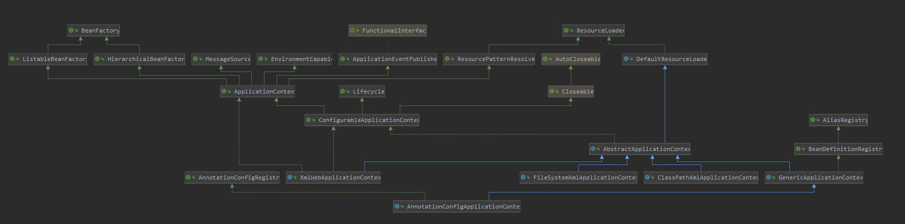

# AnnotationConfigApplicationContext



> 重要属性：
> 1. reader = AnnotatedBeanDefinitionReader
> 2. scanner = ClassPathBeanDefinitionScanner 
>  
> 并且reader，scanner都持有AnnotationConfigApplicationContext的引用(属性：registry)

# 父类GenericApplicationContext
创建DefaultListableBeanFactory在父类的构造方法中

# 源码解析
1. 创建启动类，并创建读取器，扫描器，BeanFactory
2. 扫描包
3. 开始启动流程
```java
public AnnotationConfigApplicationContext(String... basePackages) {
    this();
    scan(basePackages);
    refresh();
}
```

## 包扫描scan(basePackages)
1. findCandidateComponents扫描包，解析并创建对象的BeanDefinition
2. 解析BeanDefinition的scope
3. 生成beanName，先从注解中获取beanName，如果没有就生成默认。
4. 如果实现接口AbstractBeanDefinition，则会设置一些默认属性：lazyInit,autowireMode,dependencyCheck,initMethodName,enforceInitMethod,destroyMethodName,enforceDestroyMethod
5. 如果实现接口AnnotatedBeanDefinition，则需要处理一些bean定义的注解@Lazy,@Primary,@DependsOn,@Role,@Description
6. 检查beanName是否注册
7. 根据scope注解的proxyMode属性，设置BeanDefinition的属性（与bean的生成方式有关）。将未注册的Beandefinition注册到registry中
```java
//AnnotationConfigApplicationContext
public void scan(String... basePackages) {
    Assert.notEmpty(basePackages, "At least one base package must be specified");
    this.scanner.scan(basePackages);
}
//ClassPathBeanDefinitionScanner
public int scan(String... basePackages) {
    int beanCountAtScanStart = this.registry.getBeanDefinitionCount();

    doScan(basePackages);

    // Register annotation config processors, if necessary.
    if (this.includeAnnotationConfig) {
        AnnotationConfigUtils.registerAnnotationConfigProcessors(this.registry);
    }

    return (this.registry.getBeanDefinitionCount() - beanCountAtScanStart);
}
protected Set<BeanDefinitionHolder> doScan(String... basePackages) {
    Assert.notEmpty(basePackages, "At least one base package must be specified");
    Set<BeanDefinitionHolder> beanDefinitions = new LinkedHashSet<>();
    for (String basePackage : basePackages) {
        // 扫描包,创建对象的BeanDefinition
        Set<BeanDefinition> candidates = findCandidateComponents(basePackage);
        for (BeanDefinition candidate : candidates) {
            // 解析BeanDefinition的scope
            ScopeMetadata scopeMetadata = this.scopeMetadataResolver.resolveScopeMetadata(candidate);
            candidate.setScope(scopeMetadata.getScopeName());
            // 生成beanName，先从注解中获取beanName，如果没有就生成默认。
            String beanName = this.beanNameGenerator.generateBeanName(candidate, this.registry);
            // 设置一些默认属性：lazyInit,autowireMode,dependencyCheck,initMethodName,enforceInitMethod,destroyMethodName,enforceDestroyMethod
            if (candidate instanceof AbstractBeanDefinition) {
                postProcessBeanDefinition((AbstractBeanDefinition) candidate, beanName);
            }
            // 处理一些bean定义的注解@Lazy,@Primary,@DependsOn,@Role,@Description
            if (candidate instanceof AnnotatedBeanDefinition) {
                AnnotationConfigUtils.processCommonDefinitionAnnotations((AnnotatedBeanDefinition) candidate);
            }
            if (checkCandidate(beanName, candidate)) {
                BeanDefinitionHolder definitionHolder = new BeanDefinitionHolder(candidate, beanName);
                // 根据scope注解的proxyMode属性，设置BeanDefinition的属性（与bean的生成方式有关）
                definitionHolder =
                        AnnotationConfigUtils.applyScopedProxyMode(scopeMetadata, definitionHolder, this.registry);
                beanDefinitions.add(definitionHolder);
                // 未注册的Beandefinition注册到registry中
                registerBeanDefinition(definitionHolder, this.registry);
            }
        }
    }
    return beanDefinitions;
}
```

## 解析findCandidateComponents(basePackage)
1. 查看是否有过滤器，过滤包路径
2. 解析路径：解析basePackage(spirng路径可以包含表达式)，转换为Resource对象
3. 创建BeanDefinition：ScannedGenericBeanDefinition，此类继承AbstractBeanDefinition并实现了AnnotatedBeanDefinition
```java
public Set<BeanDefinition> findCandidateComponents(String basePackage) {
    if (this.componentsIndex != null && indexSupportsIncludeFilters()) {
        return addCandidateComponentsFromIndex(this.componentsIndex, basePackage);
    }
    else {
        return scanCandidateComponents(basePackage);
    }
}

private Set<BeanDefinition> scanCandidateComponents(String basePackage) {
    Set<BeanDefinition> candidates = new LinkedHashSet<>();
    try {
        String packageSearchPath = ResourcePatternResolver.CLASSPATH_ALL_URL_PREFIX +
                resolveBasePackage(basePackage) + '/' + this.resourcePattern;
        Resource[] resources = getResourcePatternResolver().getResources(packageSearchPath);
        boolean traceEnabled = logger.isTraceEnabled();
        boolean debugEnabled = logger.isDebugEnabled();
        for (Resource resource : resources) {
            if (traceEnabled) {
                logger.trace("Scanning " + resource);
            }
            if (resource.isReadable()) {
                try {
                    MetadataReader metadataReader = getMetadataReaderFactory().getMetadataReader(resource);
                    if (isCandidateComponent(metadataReader)) {
                        ScannedGenericBeanDefinition sbd = new ScannedGenericBeanDefinition(metadataReader);
                        sbd.setResource(resource);
                        sbd.setSource(resource);
                        if (isCandidateComponent(sbd)) {
                            if (debugEnabled) {
                                logger.debug("Identified candidate component class: " + resource);
                            }
                            candidates.add(sbd);
                        }
                        else {
                            if (debugEnabled) {
                                logger.debug("Ignored because not a concrete top-level class: " + resource);
                            }
                        }
                    }
                    else {
                        if (traceEnabled) {
                            logger.trace("Ignored because not matching any filter: " + resource);
                        }
                    }
                }
                catch (Throwable ex) {
                    throw new BeanDefinitionStoreException(
                            "Failed to read candidate component class: " + resource, ex);
                }
            }
            else {
                if (traceEnabled) {
                    logger.trace("Ignored because not readable: " + resource);
                }
            }
        }
    }
    catch (IOException ex) {
        throw new BeanDefinitionStoreException("I/O failure during classpath scanning", ex);
    }
    return candidates;
}
```

## 生成BeanFactory：obtainFreshBeanFactory()
**AnnotationConfigApplicationContext继承于GenericApplicationContext**
```java
//AnnotationConfigApplicationContext
protected ConfigurableListableBeanFactory obtainFreshBeanFactory() {
    refreshBeanFactory();
    return getBeanFactory();
}
//GenericApplicationContext
protected final void refreshBeanFactory() throws IllegalStateException {
    if (!this.refreshed.compareAndSet(false, true)) {
        throw new IllegalStateException(
                "GenericApplicationContext does not support multiple refresh attempts: just call 'refresh' once");
    }
    this.beanFactory.setSerializationId(getId());
}
//GenericApplicationContext
public final ConfigurableListableBeanFactory getBeanFactory() {
    return this.beanFactory;
}
```
## 结语
后续流程与xml解析一致，不再赘述。