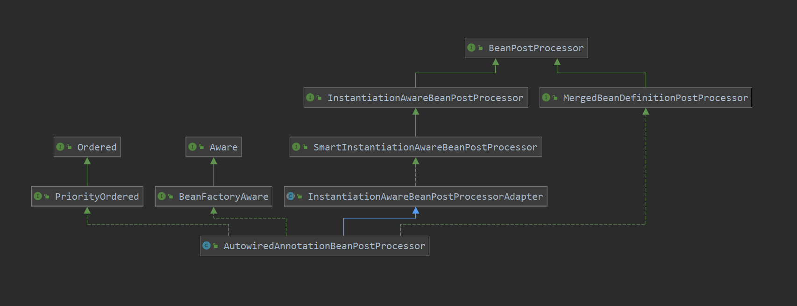

# AutowiredAnnotationBeanPostProcessor


AutowiredAnnotationBeanPostProcessor 的执行时机：
1. AnnotationConfigApplicationContext 在构造器中初始化的时候会创建部分重要的 RootBeanDefinition，其中包含了         AutowiredAnnotationBeanPostProcessor
2. 
## buildAutowiringMetadata

```java
    private InjectionMetadata buildAutowiringMetadata(final Class<?> clazz) {
		if (!AnnotationUtils.isCandidateClass(clazz, this.autowiredAnnotationTypes)) {
			return InjectionMetadata.EMPTY;
		}

		List<InjectionMetadata.InjectedElement> elements = new ArrayList<>();
		Class<?> targetClass = clazz;

		do {
			final List<InjectionMetadata.InjectedElement> currElements = new ArrayList<>();

			ReflectionUtils.doWithLocalFields(targetClass, field -> {
				MergedAnnotation<?> ann = findAutowiredAnnotation(field);
				if (ann != null) {
					if (Modifier.isStatic(field.getModifiers())) {
						if (logger.isInfoEnabled()) {
							logger.info("Autowired annotation is not supported on static fields: " + field);
						}
						return;
					}
					boolean required = determineRequiredStatus(ann);
					currElements.add(new AutowiredFieldElement(field, required));
				}
			});

			ReflectionUtils.doWithLocalMethods(targetClass, method -> {
				Method bridgedMethod = BridgeMethodResolver.findBridgedMethod(method);
				if (!BridgeMethodResolver.isVisibilityBridgeMethodPair(method, bridgedMethod)) {
					return;
				}
				MergedAnnotation<?> ann = findAutowiredAnnotation(bridgedMethod);
				if (ann != null && method.equals(ClassUtils.getMostSpecificMethod(method, clazz))) {
					if (Modifier.isStatic(method.getModifiers())) {
						if (logger.isInfoEnabled()) {
							logger.info("Autowired annotation is not supported on static methods: " + method);
						}
						return;
					}
					if (method.getParameterCount() == 0) {
						if (logger.isInfoEnabled()) {
							logger.info("Autowired annotation should only be used on methods with parameters: " +
									method);
						}
					}
					boolean required = determineRequiredStatus(ann);
					PropertyDescriptor pd = BeanUtils.findPropertyForMethod(bridgedMethod, clazz);
					currElements.add(new AutowiredMethodElement(method, required, pd));
				}
			});

			elements.addAll(0, currElements);
			targetClass = targetClass.getSuperclass();
		}
		while (targetClass != null && targetClass != Object.class);

		return InjectionMetadata.forElements(elements, clazz);
	}

```


### findAutowiredAnnotation
> 此段代码的主要逻辑是 查找 注入相关的 注解
```java
    private MergedAnnotation<?> findAutowiredAnnotation(AccessibleObject ao) {
        // 相当于
        // TypeMappedAnnotations.from(element, SearchStrategy.DIRECT, RepeatableContainers.standardRepeatables(), AnnotationFilter.PLAIN)
        // new TypeMappedAnnotations(element, SearchStrategy.DIRECT, RepeatableContainers.standardRepeatables(), AnnotationFilter.PLAIN)
        // AnnotationFilter.PLAIN = packages("java.lang", "org.springframework.lang");
		MergedAnnotations annotations = MergedAnnotations.from(ao);
		for (Class<? extends Annotation> type : this.autowiredAnnotationTypes) {
			MergedAnnotation<?> annotation = annotations.get(type);
			if (annotation.isPresent()) {
				return annotation;
			}
		}
		return null;
	}

    // org/springframework/core/annotation/TypeMappedAnnotations.java 的 get方法
    public <A extends Annotation> MergedAnnotation<A> get(Class<A> annotationType,
			@Nullable Predicate<? super MergedAnnotation<A>> predicate,
			@Nullable MergedAnnotationSelector<A> selector) {
        // 如果annotation的全限定名的前缀是 java.lang. 或者 org.springframework.lang. 则直接返回missing
		if (this.annotationFilter.matches(annotationType)) {
			return MergedAnnotation.missing();
		}
		MergedAnnotation<A> result = scan(annotationType,
				new MergedAnnotationFinder<>(annotationType, predicate, selector));
		return (result != null ? result : MergedAnnotation.missing());
	}


    private <C, R> R scan(C criteria, AnnotationsProcessor<C, R> processor) {
        // 创建对象时，未赋值该对象
		if (this.annotations != null) {
			R result = processor.doWithAnnotations(criteria, 0, this.source, this.annotations);
			return processor.finish(result);
		}
        // 注解扫描器进行扫描
		if (this.element != null && this.searchStrategy != null) {
			return AnnotationsScanner.scan(criteria, this.element, this.searchStrategy, processor);
		}
		return null;
	}
    // AnnotationsScanner
    static <C, R> R scan(C context, AnnotatedElement source, SearchStrategy searchStrategy,
			AnnotationsProcessor<C, R> processor) {

		return scan(context, source, searchStrategy, processor, null);
	}

    static <C, R> R scan(C context, AnnotatedElement source, SearchStrategy searchStrategy,
			AnnotationsProcessor<C, R> processor, @Nullable BiPredicate<C, Class<?>> classFilter) {

		R result = process(context, source, searchStrategy, processor, classFilter);
		return processor.finish(result);
	}

    private static <C, R> R process(C context, AnnotatedElement source,
			SearchStrategy searchStrategy, AnnotationsProcessor<C, R> processor,
			@Nullable BiPredicate<C, Class<?>> classFilter) {

		if (source instanceof Class) {
			return processClass(context, (Class<?>) source, searchStrategy, processor, classFilter);
		}
		if (source instanceof Method) {
			return processMethod(context, (Method) source, searchStrategy, processor, classFilter);
		}
		return processElement(context, source, processor, classFilter);
	}

    private static <C, R> R processClass(C context, Class<?> source,
			SearchStrategy searchStrategy, AnnotationsProcessor<C, R> processor,
			@Nullable BiPredicate<C, Class<?>> classFilter) {

		switch (searchStrategy) {
			case DIRECT:
				return processElement(context, source, processor, classFilter);
			case INHERITED_ANNOTATIONS:
				return processClassInheritedAnnotations(context, source, searchStrategy, processor, classFilter);
			case SUPERCLASS:
				return processClassHierarchy(context, source, processor, classFilter, false, false);
			case TYPE_HIERARCHY:
				return processClassHierarchy(context, source, processor, classFilter, true, false);
			case TYPE_HIERARCHY_AND_ENCLOSING_CLASSES:
				return processClassHierarchy(context, source, processor, classFilter, true, true);
		}
		throw new IllegalStateException("Unsupported search strategy " + searchStrategy);
	}

    private static <C, R> R processElement(C context, AnnotatedElement source,
			AnnotationsProcessor<C, R> processor, @Nullable BiPredicate<C, Class<?>> classFilter) {

		try {
			R result = processor.doWithAggregate(context, 0);
			return (result != null ? result : processor.doWithAnnotations(
				context, 0, source, getDeclaredAnnotations(context, source, classFilter, false)));
		}
		catch (Throwable ex) {
			AnnotationUtils.handleIntrospectionFailure(source, ex);
		}
		return null;
	}

    private static <C, R> Annotation[] getDeclaredAnnotations(C context,
			AnnotatedElement source, @Nullable BiPredicate<C, Class<?>> classFilter, boolean copy) {
        // content 就是 注解，source 就是 刚才field，但是classFilter == null
		if (source instanceof Class && isFiltered((Class<?>) source, context, classFilter)) {
			return NO_ANNOTATIONS;
		}
		if (source instanceof Method && isFiltered(((Method) source).getDeclaringClass(), context, classFilter)) {
			return NO_ANNOTATIONS;
		}
		return getDeclaredAnnotations(source, copy);
	}

    static Annotation[] getDeclaredAnnotations(AnnotatedElement source, boolean defensive) {
		boolean cached = false;
        // 查看是否存在缓存
		Annotation[] annotations = declaredAnnotationCache.get(source);
		if (annotations != null) {
			cached = true;
		}
		else {
            // 获取 存在的注解
			annotations = source.getDeclaredAnnotations();
			if (annotations.length != 0) {
				boolean allIgnored = true;
				for (int i = 0; i < annotations.length; i++) {
					Annotation annotation = annotations[i];
                    // 判断是否需要忽略（"java.lang", "org.springframework.lang"）
                    // 或者不正常的，此处会将注解加入缓存中(AttributeMethods.cache)
					if (isIgnorable(annotation.annotationType()) ||
							!AttributeMethods.forAnnotationType(annotation.annotationType()).isValid(annotation)) {
						annotations[i] = null;
					}
					else {
						allIgnored = false;
					}
				}
				annotations = (allIgnored ? NO_ANNOTATIONS : annotations);
                // 如果源 source 属于 类 或者 Member，则加入 AnnotationsScanner.declaredAnnotationCache的缓存中
				if (source instanceof Class || source instanceof Member) {
					declaredAnnotationCache.put(source, annotations);
					cached = true;
				}
			}
		}
		if (!defensive || annotations.length == 0 || !cached) {
			return annotations;
		}
		return annotations.clone();
	}

    // MergedAnnotationFinder 的 doWithAnnotations 方法
    // 此时的 aggregateIndex = 0
    public MergedAnnotation<A> doWithAnnotations(Object type, int aggregateIndex,
            @Nullable Object source, Annotation[] annotations) {

        for (Annotation annotation : annotations) {
            // 判断 "java.lang", "org.springframework.lang" 
            if (annotation != null && !annotationFilter.matches(annotation)) {
                MergedAnnotation<A> result = process(type, aggregateIndex, source, annotation);
                if (result != null) {
                    return result;
                }
            }
        }
        return null;
    }

    private MergedAnnotation<A> process(
            Object type, int aggregateIndex, @Nullable Object source, Annotation annotation) {

        Annotation[] repeatedAnnotations = repeatableContainers.findRepeatedAnnotations(annotation);
        if (repeatedAnnotations != null) {
            return doWithAnnotations(type, aggregateIndex, source, repeatedAnnotations);
        }
        AnnotationTypeMappings mappings = AnnotationTypeMappings.forAnnotationType(
                annotation.annotationType(), repeatableContainers, annotationFilter);
        for (int i = 0; i < mappings.size(); i++) {
            AnnotationTypeMapping mapping = mappings.get(i);
            if (isMappingForType(mapping, annotationFilter, this.requiredType)) {
                MergedAnnotation<A> candidate = TypeMappedAnnotation.createIfPossible(
                        mapping, source, annotation, aggregateIndex, IntrospectionFailureLogger.INFO);
                if (candidate != null && (this.predicate == null || this.predicate.test(candidate))) {
                    if (this.selector.isBestCandidate(candidate)) {
                        return candidate;
                    }
                    updateLastResult(candidate);
                }
            }
        }
        return null;
    }
```