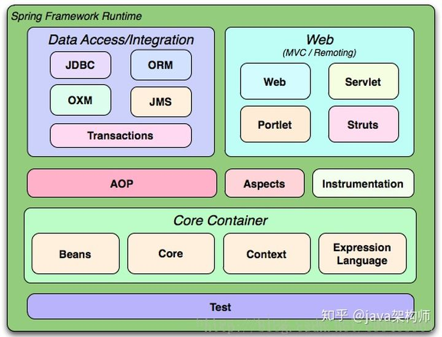
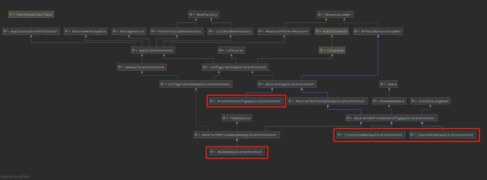
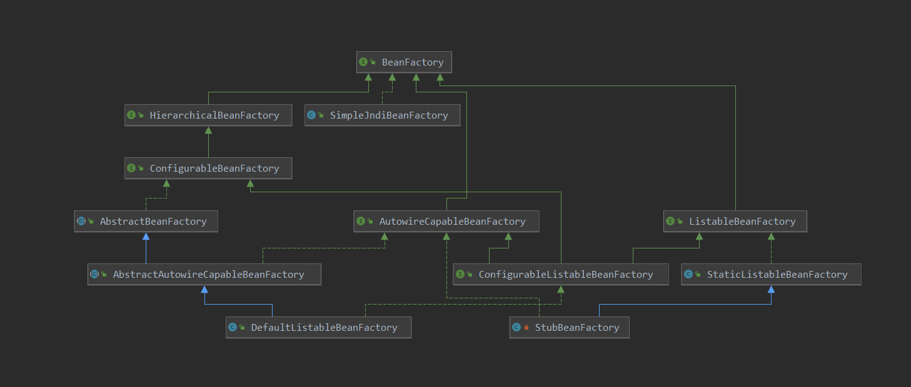

# spring架构解析
spring基础架构图


spring重要的顶级类：
1. ApplicationContext
2. Environment
3. BeanFactory
4. BeanDefinition
5. FactoryBean
6. ClassLoader
7. Source
8. Resource
9. Aware
10. LifeCycle
11. BeanPostProcessor
12. BeanFactoryPostProcessor
13. Metadata

## Metadata
Metadata 使用用来描述元数据，即 类信息，或者注解信息，方法信息等等

## ApplicationContext

1. XmlWebApplicationContext:基于(默认/WEB-INF下的)xml配置文件
2. ClassPathXmlApplicationContext:基于classpath的xml配置文件
3. FileSystemXmlApplicationContext:基于文件系统的xml配置文件
4. AnnotationConfigApplicationContext:基于注解

在类的继承关系图中可以看到ApplicationContext的主要实现类，都是继承实现了BeanFactory，LifeCycle，ResourceLoader，Aware

## BeanFactory


BeanFactory就是spring的容器，IOC的核心  

```java
public interface BeanFactory {

	/**
	 * Used to dereference a {@link FactoryBean} instance and distinguish it from
	 * beans <i>created</i> by the FactoryBean. For example, if the bean named
	 * {@code myJndiObject} is a FactoryBean, getting {@code &myJndiObject}
	 * will return the factory, not the instance returned by the factory.
	 */
	String FACTORY_BEAN_PREFIX = "&";


	Object getBean(String name) throws BeansException;

	<T> T getBean(String name, Class<T> requiredType) throws BeansException;

	Object getBean(String name, Object... args) throws BeansException;

	<T> T getBean(Class<T> requiredType) throws BeansException;

	<T> T getBean(Class<T> requiredType, Object... args) throws BeansException;

	<T> ObjectProvider<T> getBeanProvider(Class<T> requiredType);

	<T> ObjectProvider<T> getBeanProvider(ResolvableType requiredType);

	boolean containsBean(String name);

	boolean isSingleton(String name) throws NoSuchBeanDefinitionException;

	boolean isPrototype(String name) throws NoSuchBeanDefinitionException;

	boolean isTypeMatch(String name, ResolvableType typeToMatch) throws NoSuchBeanDefinitionException;

	boolean isTypeMatch(String name, Class<?> typeToMatch) throws NoSuchBeanDefinitionException;

	@Nullable
	Class<?> getType(String name) throws NoSuchBeanDefinitionException;

	@Nullable
	Class<?> getType(String name, boolean allowFactoryBeanInit) throws NoSuchBeanDefinitionException;

	String[] getAliases(String name);
}

```
而Spring默认使用的BeanFactory则是DefaultListableBeanFactory，继承于AbstractAutowireCapableBeanFactory
AbstractAutowireCapableBeanFactory核心属性：
```java
  //AbstractAutowireCapableBeanFactory类中的重要属性

  /** Strategy for creating bean instances. */
	private InstantiationStrategy instantiationStrategy = new CglibSubclassingInstantiationStrategy();

	/** Resolver strategy for method parameter names. */
	@Nullable
	private ParameterNameDiscoverer parameterNameDiscoverer = new DefaultParameterNameDiscoverer();

	/** Whether to automatically try to resolve circular references between beans. */
  // 是否允许循环引用
	private boolean allowCircularReferences = true;

	/**
	 * Whether to resort to injecting a raw bean instance in case of circular reference,
	 * even if the injected bean eventually got wrapped.
	 */
  // 在循环引用的情况下，是否允许原生对象注入
	private boolean allowRawInjectionDespiteWrapping = false;

	/**
	 * Dependency types to ignore on dependency check and autowire, as Set of
	 * Class objects: for example, String. Default is none.
	 */
  // 定义了在依赖检查和自动绑定时要忽略的依赖类型，是一组类对象，例如string，默认为没有
	private final Set<Class<?>> ignoredDependencyTypes = new HashSet<>();

	/**
	 * Dependency interfaces to ignore on dependency check and autowire, as Set of
	 * Class objects. By default, only the BeanFactory interface is ignored.
	 */
  // 定义了在依赖检查和自动绑定时要忽略的依赖接口，是一组类对象，默认情况下，只有beanFactory接口被忽略。
	private final Set<Class<?>> ignoredDependencyInterfaces = new HashSet<>();

	/**
	 * The name of the currently created bean, for implicit dependency registration
	 * on getBean etc invocations triggered from a user-specified Supplier callback.
	 */
	private final NamedThreadLocal<String> currentlyCreatedBean = new NamedThreadLocal<>("Currently created bean");

	/** Cache of unfinished FactoryBean instances: FactoryBean name to BeanWrapper. */
  // 缓存未完成的FactoryBean实例
	private final ConcurrentMap<String, BeanWrapper> factoryBeanInstanceCache = new ConcurrentHashMap<>();

	/** Cache of candidate factory methods per factory class. */
	private final ConcurrentMap<Class<?>, Method[]> factoryMethodCandidateCache = new ConcurrentHashMap<>();

	/** Cache of filtered PropertyDescriptors: bean Class to PropertyDescriptor array. */
	private final ConcurrentMap<Class<?>, PropertyDescriptor[]> filteredPropertyDescriptorsCache =
			new ConcurrentHashMap<>();
```
DefaultListableBeanFactory核心属性：
```java
  

  /** Whether to allow re-registration of a different definition with the same name. */
  // 定义了是否允许同名的不同 bean definition 再次进行注册
	private boolean allowBeanDefinitionOverriding = true;
  /** Whether to allow eager class loading even for lazy-init beans. */
  // 定义了是否允许eager类（相对于lazy）的加载，甚至延迟初始化的bean的加载
	private boolean allowEagerClassLoading = true;

  /** Resolver to use for checking if a bean definition is an autowire candidate. */
  // autowireCandidateResolver 是一个策略接口，用来决定一个特定的bean definition 是否满足做一个特定依赖的自动绑定的候选项
	private AutowireCandidateResolver autowireCandidateResolver = new SimpleAutowireCandidateResolver();

	/** Map from dependency type to corresponding autowired value. */
  // 定义了依赖类型和其对应的自动绑定值的键值对集合。
	private final Map<Class<?>, Object> resolvableDependencies = new ConcurrentHashMap<>(16);

	/** Map of bean definition objects, keyed by bean name. */
	private final Map<String, BeanDefinition> beanDefinitionMap = new ConcurrentHashMap<>(256);

	/** Map of singleton and non-singleton bean names, keyed by dependency type. */
	private final Map<Class<?>, String[]> allBeanNamesByType = new ConcurrentHashMap<>(64);

	/** Map of singleton-only bean names, keyed by dependency type. */
	private final Map<Class<?>, String[]> singletonBeanNamesByType = new ConcurrentHashMap<>(64);

	/** List of bean definition names, in registration order. */
	private volatile List<String> beanDefinitionNames = new ArrayList<>(256);

	/** List of names of manually registered singletons, in registration order. */
	private volatile Set<String> manualSingletonNames = new LinkedHashSet<>(16);

	/** Cached array of bean definition names in case of frozen configuration. */
	@Nullable
	private volatile String[] frozenBeanDefinitionNames;

	/** Whether bean definition metadata may be cached for all beans. */
	private volatile boolean configurationFrozen = false;
```

## BeanDefinition
BeanDefinition extends AttributeAccessor, BeanMetadataElement  
BeanDefinition接口规定了，BeanDefinition对象必须的一些功能，具体的实现由子类完成。  
BeanDefinition对象是对spring中的bean的一个定义  
spring会先将@Bean 、@Component 等标注的类，或者通过xml中bean标签 解析成一个BeanDefinition对象。  
后面创建对象都是根据BeanDefinition对象中的属性进行创建。  
核心方法：
```java
    String[] attributeNames();
    Object getAttribute(String name);
    String getBeanClassName();
    ConstructorArgumentValues getConstructorArgumentValues();
    String[] getDependsOn();
    String getDescription();
    String getDestroyMethodName();
    String getFactoryBeanName();
    String getFactoryMethodName();
    String getInitMethodName();
    BeanDefinition getOriginatingBeanDefinition();
    String getParentName();
    MutablePropertyValues getPropertyValues();
    ResolvableType getResolvableType();
    String getResourceDescription();
    int getRole();
    String getScope();
    Object getSource();
    default boolean hasConstructorArgumentValues() {
		return !getConstructorArgumentValues().isEmpty();
	}
    default boolean hasPropertyValues() {
		return !getPropertyValues().isEmpty();
	}
    boolean isAbstract();
    boolean isAutowireCandidate();
    boolean isLazyInit();
    boolean isPrimary();
    boolean isPrototype();
    boolean isSingleton();
    Object removeAttribute(String name);
    void setAttribute(String name, @Nullable Object value);
    void setAutowireCandidate(boolean autowireCandidate);
    void setBeanClassName(@Nullable String beanClassName);
    void setDependsOn(@Nullable String... dependsOn);
    void setDescription(@Nullable String description);
    void setDestroyMethodName(@Nullable String destroyMethodName);
    void setFactoryBeanName(@Nullable String factoryBeanName);
    void setFactoryMethodName(@Nullable String factoryMethodName);
    void setInitMethodName(@Nullable String initMethodName);
    void setLazyInit(boolean lazyInit);
    void setParentName(@Nullable String parentName);
    void setPrimary(boolean primary);
    void setRole(int role);
    void setScope(@Nullable String scope);
```

## Aware
aware的作用是赋予某种能力
其子类：
1. ApplicationEventPublisherAware
2. ServletContextAware
3. MessageSourceAware
4. ResourceLoaderAware
5. SchedulerContextAware
6. NotificationPublisherAware
7. EnvironmentAware
8. BeanFactoryAware
9. EmbeddedValueResolverAware
10. ImportAware
11. BootstrapContextAware
12. ServletConfigAware
13. LoadTimeWeaverAware
14. BeanClassLoaderAware
15. BeanNameAware
16. ApplicationContextAware


而spring在初始化Aware接口过程中主要的步骤有：
1. 在bean初始化的过程中，会进行Aware相关接口的赋值动作
```java
	// invokeAwareMethods(beanName, bean);
	protected Object initializeBean(final String beanName, final Object bean, @Nullable RootBeanDefinition mbd) {
		if (System.getSecurityManager() != null) {
			AccessController.doPrivileged((PrivilegedAction<Object>) () -> {
				invokeAwareMethods(beanName, bean);
				return null;
			}, getAccessControlContext());
		}
		else {
			invokeAwareMethods(beanName, bean);
		}

		Object wrappedBean = bean;
		if (mbd == null || !mbd.isSynthetic()) {
			wrappedBean = applyBeanPostProcessorsBeforeInitialization(wrappedBean, beanName);
		}

		try {
			invokeInitMethods(beanName, wrappedBean, mbd);
		}
		catch (Throwable ex) {
			throw new BeanCreationException(
					(mbd != null ? mbd.getResourceDescription() : null),
					beanName, "Invocation of init method failed", ex);
		}
		if (mbd == null || !mbd.isSynthetic()) {
			wrappedBean = applyBeanPostProcessorsAfterInitialization(wrappedBean, beanName);
		}

		return wrappedBean;
	}
	// 主要执行三种类型Aware接口 BeanNameAware BeanClassLoaderAware BeanFactoryAware
	private void invokeAwareMethods(final String beanName, final Object bean) {
		if (bean instanceof Aware) {
			if (bean instanceof BeanNameAware) {
				((BeanNameAware) bean).setBeanName(beanName);
			}
			if (bean instanceof BeanClassLoaderAware) {
				ClassLoader bcl = getBeanClassLoader();
				if (bcl != null) {
					((BeanClassLoaderAware) bean).setBeanClassLoader(bcl);
				}
			}
			if (bean instanceof BeanFactoryAware) {
				((BeanFactoryAware) bean).setBeanFactory(AbstractAutowireCapableBeanFactory.this);
			}
		}
	}
```
2. ApplicationContextAwareProcessor


## BeanPostProcessor
```java
	public interface BeanPostProcessor {

	/**
	 * Apply this {@code BeanPostProcessor} to the given new bean instance <i>before</i> any bean
	 * initialization callbacks (like InitializingBean's {@code afterPropertiesSet}
	 * or a custom init-method). The bean will already be populated with property values.
	 * The returned bean instance may be a wrapper around the original.
	 * <p>The default implementation returns the given {@code bean} as-is.
	 * @param bean the new bean instance
	 * @param beanName the name of the bean
	 * @return the bean instance to use, either the original or a wrapped one;
	 * if {@code null}, no subsequent BeanPostProcessors will be invoked
	 * @throws org.springframework.beans.BeansException in case of errors
	 * @see org.springframework.beans.factory.InitializingBean#afterPropertiesSet
	 */
	@Nullable
	default Object postProcessBeforeInitialization(Object bean, String beanName) throws BeansException {
		return bean;
	}

	/**
	 * Apply this {@code BeanPostProcessor} to the given new bean instance <i>after</i> any bean
	 * initialization callbacks (like InitializingBean's {@code afterPropertiesSet}
	 * or a custom init-method). The bean will already be populated with property values.
	 * The returned bean instance may be a wrapper around the original.
	 * <p>In case of a FactoryBean, this callback will be invoked for both the FactoryBean
	 * instance and the objects created by the FactoryBean (as of Spring 2.0). The
	 * post-processor can decide whether to apply to either the FactoryBean or created
	 * objects or both through corresponding {@code bean instanceof FactoryBean} checks.
	 * <p>This callback will also be invoked after a short-circuiting triggered by a
	 * {@link InstantiationAwareBeanPostProcessor#postProcessBeforeInstantiation} method,
	 * in contrast to all other {@code BeanPostProcessor} callbacks.
	 * <p>The default implementation returns the given {@code bean} as-is.
	 * @param bean the new bean instance
	 * @param beanName the name of the bean
	 * @return the bean instance to use, either the original or a wrapped one;
	 * if {@code null}, no subsequent BeanPostProcessors will be invoked
	 * @throws org.springframework.beans.BeansException in case of errors
	 * @see org.springframework.beans.factory.InitializingBean#afterPropertiesSet
	 * @see org.springframework.beans.factory.FactoryBean
	 */
	@Nullable
	default Object postProcessAfterInitialization(Object bean, String beanName) throws BeansException {
		return bean;
	}

}
```
BeanPostProcessor执行的时机在bean初始化的方法中(initializeBean):  
1. 在执行的时候会先执行invokeAwareMethods将部分实现Aware接口的对象，赋予某些特性
2. applyBeanPostProcessorsBeforeInitialization 执行 BeanPostProcessor 的 postProcessBeforeInitialization 方法
3. invokeInitMethods执行初始化方法
4. applyBeanPostProcessorsAfterInitialization 执行 BeanPostProcessor 的 postProcessAfterInitialization 方法

```java
protected Object initializeBean(final String beanName, final Object bean, @Nullable RootBeanDefinition mbd) {
		if (System.getSecurityManager() != null) {
			AccessController.doPrivileged((PrivilegedAction<Object>) () -> {
				invokeAwareMethods(beanName, bean);
				return null;
			}, getAccessControlContext());
		}
		else {
			invokeAwareMethods(beanName, bean);
		}

		Object wrappedBean = bean;
		if (mbd == null || !mbd.isSynthetic()) {
			wrappedBean = applyBeanPostProcessorsBeforeInitialization(wrappedBean, beanName);
		}

		try {
			invokeInitMethods(beanName, wrappedBean, mbd);
		}
		catch (Throwable ex) {
			throw new BeanCreationException(
					(mbd != null ? mbd.getResourceDescription() : null),
					beanName, "Invocation of init method failed", ex);
		}
		if (mbd == null || !mbd.isSynthetic()) {
			wrappedBean = applyBeanPostProcessorsAfterInitialization(wrappedBean, beanName);
		}

		return wrappedBean;
	}
```

AutowiredAnnotationBeanPostProcessor
CommonAnnotationBeanPostProcessor
RequiredAnnotationBeanPostProcessor

## BeanFactoryPostProcessor
```java
@FunctionalInterface
public interface BeanFactoryPostProcessor {

	/**
	 * Modify the application context's internal bean factory after its standard
	 * initialization. All bean definitions will have been loaded, but no beans
	 * will have been instantiated yet. This allows for overriding or adding
	 * properties even to eager-initializing beans.
	 * @param beanFactory the bean factory used by the application context
	 * @throws org.springframework.beans.BeansException in case of errors
	 */
	void postProcessBeanFactory(ConfigurableListableBeanFactory beanFactory) throws BeansException;

}
```
BeanFactoryPostProcessor主要用于拓展处理BeanFactory，此时BeanFactory已经经过标准的初始化，且已加载所有的BeanDefinition，但没有Bean被初始化。执行时机在`AbstractApplicationContext.invokeBeanFactoryPostProcessors`中

ConfigurationClassPostProcessor
