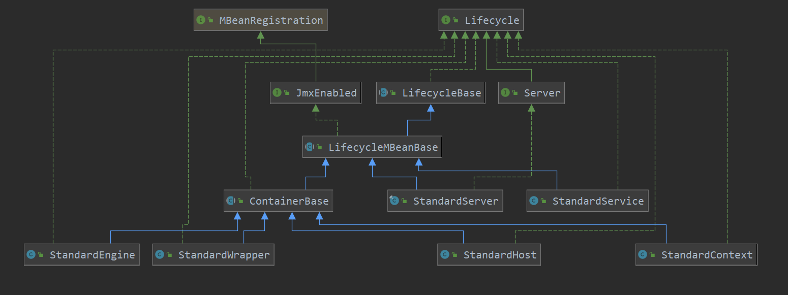
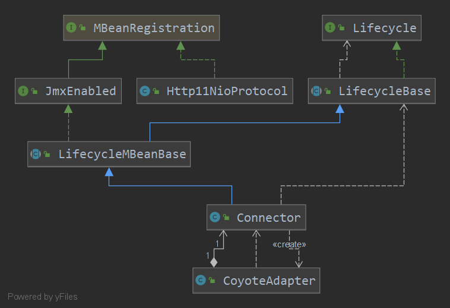

# tomcat9
**本次tomcat源码版本为：9.0.31**  

## 1  tomcat9启动流程  


### 1.1 执行BootStrap类的main方法
1. BootStrap类是启动类，会进行初始化，执行static代码块内容，主要为属性catalinaHomeFile,catalinaBaseFile赋值为项目的根目录(System.getProperty("user.dir"));
2. 执行main方法，创建BootStrap对象，并执行bootstrap.init()方法
    1. init方法第一步，初始化类加载器，创建commonLoader，catalinaLoader，sharedLoader三个类加载器
    2. 设置当前线程的上下文类加载器为catalinaLoader，以及`SecurityClassLoad.securityClassLoad(catalinaLoader);`
    3. 使用catalinaLoader加载Catalina类，反射生成Catalina对象（startupInstance），并反射调用setParentClassLoader方法，值为sharedLoader。然后赋值BootStrap.catalinaDaemon=startupInstance

```java
Bootstrap类的main方法启动tomcat
    public static void main(String args[]) {

        if (daemon == null) {
            // Don't set daemon until init() has completed
            Bootstrap bootstrap = new Bootstrap();
            try {
                bootstrap.init();
            } catch (Throwable t) {
                handleThrowable(t);
                t.printStackTrace();
                return;
            }
            daemon = bootstrap;
        } else {
            // When running as a service the call to stop will be on a new
            // thread so make sure the correct class loader is used to prevent
            // a range of class not found exceptions.
            Thread.currentThread().setContextClassLoader(daemon.catalinaLoader);
        }

        try {
            String command = "start";
            if (args.length > 0) {
                command = args[args.length - 1];
            }

            if (command.equals("startd")) {
                args[args.length - 1] = "start";
                daemon.load(args);
                daemon.start();
            } else if (command.equals("stopd")) {
                args[args.length - 1] = "stop";
                daemon.stop();
            } else if (command.equals("start")) {
                daemon.setAwait(true);
                daemon.load(args);
                daemon.start();
            } else if (command.equals("stop")) {
                daemon.stopServer(args);
            } else if (command.equals("configtest")) {
                daemon.load(args);
                if (null==daemon.getServer()) {
                    System.exit(1);
                }
                System.exit(0);
            } else {
                log.warn("Bootstrap: command \"" + command + "\" does not exist.");
            }
        } catch (Throwable t) {
            // Unwrap the Exception for clearer error reporting
            if (t instanceof InvocationTargetException &&
                    t.getCause() != null) {
                t = t.getCause();
            }
            handleThrowable(t);
            t.printStackTrace();
            System.exit(1);
        }

    }
    Bootstrap类初始化
    public void init() throws Exception {

        initClassLoaders();

        Thread.currentThread().setContextClassLoader(catalinaLoader);

        SecurityClassLoad.securityClassLoad(catalinaLoader);

        // Load our startup class and call its process() method
        if (log.isDebugEnabled())
            log.debug("Loading startup class");
        Class<?> startupClass =
            catalinaLoader.loadClass
            ("org.apache.catalina.startup.Catalina");
        Object startupInstance = startupClass.newInstance();

        // Set the shared extensions class loader
        if (log.isDebugEnabled())
            log.debug("Setting startup class properties");
        String methodName = "setParentClassLoader";
        Class<?> paramTypes[] = new Class[1];
        paramTypes[0] = Class.forName("java.lang.ClassLoader");
        Object paramValues[] = new Object[1];
        paramValues[0] = sharedLoader;
        Method method =
            startupInstance.getClass().getMethod(methodName, paramTypes);
        method.invoke(startupInstance, paramValues);

        catalinaDaemon = startupInstance;

    }
    Bootstrap类初始化类加载器
    private void initClassLoaders() {
        try {
            commonLoader = createClassLoader("common", null);
            if( commonLoader == null ) {
                // no config file, default to this loader - we might be in a 'single' env.
                commonLoader=this.getClass().getClassLoader();
            }
            catalinaLoader = createClassLoader("server", commonLoader);
            sharedLoader = createClassLoader("shared", commonLoader);
        } catch (Throwable t) {
            handleThrowable(t);
            log.error("Class loader creation threw exception", t);
            System.exit(1);
        }
    }
```
3. 赋值BootStrap类变量daemon=bootstrap
4. 调用`daemon.setAwait(true);daemon.load(args);daemon.start();`


```java
    Catalina
    public void load(String args[]) {

        try {
            if (arguments(args)) {
                load();
            }
        } catch (Exception e) {
            e.printStackTrace(System.out);
        }
    }
    protected boolean arguments(String args[]) {

        boolean isConfig = false;

        if (args.length < 1) {
            usage();
            return false;
        }

        for (int i = 0; i < args.length; i++) {
            if (isConfig) {
                configFile = args[i];
                isConfig = false;
            } else if (args[i].equals("-config")) {
                isConfig = true;
            } else if (args[i].equals("-nonaming")) {
                setUseNaming(false);
            } else if (args[i].equals("-help")) {
                usage();
                return false;
            } else if (args[i].equals("start")) {
                // NOOP
            } else if (args[i].equals("configtest")) {
                // NOOP
            } else if (args[i].equals("stop")) {
                // NOOP
            } else {
                usage();
                return false;
            }
        }

        return true;
    }
    public void load() {

        if (loaded) {
            return;
        }
        loaded = true;

        long t1 = System.nanoTime();

        initDirs();

        // Before digester - it may be needed
        initNaming();

        // Set configuration source
        ConfigFileLoader.setSource(new CatalinaBaseConfigurationSource(Bootstrap.getCatalinaBaseFile(), getConfigFile()));
        File file = configFile();

        // Create and execute our Digester
        Digester digester = createStartDigester();

        try (ConfigurationSource.Resource resource = ConfigFileLoader.getSource().getServerXml()) {
            InputStream inputStream = resource.getInputStream();
            InputSource inputSource = new InputSource(resource.getURI().toURL().toString());
            inputSource.setByteStream(inputStream);
            digester.push(this);
            digester.parse(inputSource);
        } catch (Exception e) {
            log.warn(sm.getString("catalina.configFail", file.getAbsolutePath()), e);
            if (file.exists() && !file.canRead()) {
                log.warn(sm.getString("catalina.incorrectPermissions"));
            }
            return;
        }

        getServer().setCatalina(this);
        getServer().setCatalinaHome(Bootstrap.getCatalinaHomeFile());
        getServer().setCatalinaBase(Bootstrap.getCatalinaBaseFile());

        // Stream redirection
        initStreams();

        // Start the new server
        try {
            getServer().init();
        } catch (LifecycleException e) {
            if (Boolean.getBoolean("org.apache.catalina.startup.EXIT_ON_INIT_FAILURE")) {
                throw new java.lang.Error(e);
            } else {
                log.error(sm.getString("catalina.initError"), e);
            }
        }

        long t2 = System.nanoTime();
        if(log.isInfoEnabled()) {
            log.info(sm.getString("catalina.init", Long.valueOf((t2 - t1) / 1000000)));
        }
    }
```
5. 设置await=true，执行bootstrap.load()方法，load方法主要是调用Catalina对象执行load方法
    1. 执行catalina.arguments()方法主要是解析：在启动BootStrap类的main方法所带的参数
    2. 执行catalina.load()方法
        1. 执行initDirs方法，执行initNaming，初始化java系统属性
        2. ConfigFileLoader设置资源，获取配置文件（conf/server.xml）
        3. 创建Degiser类，解析server.xml文件，注意catalina.createStartDigester方法中的`digester.addRuleSet(new HostRuleSet("Server/Service/Engine/"));`。此处会为容器Host添加生命周期监听器HostConfig类，用来部署项目。`digester.addRule("Server/Service/Connector",new ConnectorCreateRule());`,此处添加的Rule，会创建Connector类，在connector对象start启动后，Connector接受http请求，经过一系列复杂的操作会执行Engine的pipeline的过程。`digester.addRuleSet(new ContextRuleSet("Server/Service/Engine/Host/"));`，此处添加的Rule，会创建给StandardContext对象注入ContextConfig对象，而ContextConfig对象会加载解析WEB-INF/web.xml文件。
        4. 解析完成后，会根据配置生成Server，Service，Connector，Engine，Host，Valve等等对象
        5. Server对象设置catalina，catalinaHome，catalinaBase属性
        6. catalina.initStreams()：设置系统输出对象
        7. 执行Server类的初始化init方法
            1. 响应生命周期监听器的INITIALIZING事件
            2. 执行StandardServer类的initInternal方法，首先调用父类的super.initInternal();再创建ScheduleThreadPoolExecutor;将对象utilityExecutor，onameStringCache，onameMBeanFactory放入tomcat中的Bean管理器中。Register the naming resources;Populate the extension validator with JARs from common and shared class loaders;然后再执行service的init方法。
                1. Service的init方法,首先调用父类的initInternal方法
                2. 然后执行engine对象的init方法
                3. 执行executor对象的init方法
                4. 执行mapperListener.init()方法
                5. 执行connector对象的init方法,因为在解析conf/server.xml时，创建Connector时，会创建protocolHandler（类型是org.apache.coyote.http11.Http11NioProtocol）并设置endpoint=new NioEndpoint()，connector在执行init方法最后，会调用protocolHandler.init方法--endpoint.init方法，此时ServerSocket会绑定地址和端口
            3. 响应生命周期监听器的INITIALIZED事件

```java
    StandardServer类继承祖先类LifecycleBase的init方法
    public final synchronized void init() throws LifecycleException {
        if (!state.equals(LifecycleState.NEW)) {
            invalidTransition(Lifecycle.BEFORE_INIT_EVENT);
        }

        try {
            setStateInternal(LifecycleState.INITIALIZING, null, false);
            initInternal();
            setStateInternal(LifecycleState.INITIALIZED, null, false);
        } catch (Throwable t) {
            handleSubClassException(t, "lifecycleBase.initFail", toString());
        }
    }
    StandardServer类
    protected void initInternal() throws LifecycleException {

        super.initInternal();

        // Initialize utility executor
        reconfigureUtilityExecutor(getUtilityThreadsInternal(utilityThreads));
        register(utilityExecutor, "type=UtilityExecutor");

        // Register global String cache
        // Note although the cache is global, if there are multiple Servers
        // present in the JVM (may happen when embedding) then the same cache
        // will be registered under multiple names
        onameStringCache = register(new StringCache(), "type=StringCache");

        // Register the MBeanFactory
        MBeanFactory factory = new MBeanFactory();
        factory.setContainer(this);
        onameMBeanFactory = register(factory, "type=MBeanFactory");

        // Register the naming resources
        globalNamingResources.init();

        // Populate the extension validator with JARs from common and shared
        // class loaders
        if (getCatalina() != null) {
            ClassLoader cl = getCatalina().getParentClassLoader();
            // Walk the class loader hierarchy. Stop at the system class loader.
            // This will add the shared (if present) and common class loaders
            while (cl != null && cl != ClassLoader.getSystemClassLoader()) {
                if (cl instanceof URLClassLoader) {
                    URL[] urls = ((URLClassLoader) cl).getURLs();
                    for (URL url : urls) {
                        if (url.getProtocol().equals("file")) {
                            try {
                                File f = new File (url.toURI());
                                if (f.isFile() &&
                                        f.getName().endsWith(".jar")) {
                                    ExtensionValidator.addSystemResource(f);
                                }
                            } catch (URISyntaxException e) {
                                // Ignore
                            } catch (IOException e) {
                                // Ignore
                            }
                        }
                    }
                }
                cl = cl.getParent();
            }
        }
        // Initialize our defined Services
        for (int i = 0; i < services.length; i++) {
            services[i].init();
        }
    }
```
6. 调用getServer().start()--service.start--engine.start--host.start

## HostConfig
此类属于监听器，在事件START_EVENT时，会去部署war包，生成StandardContext对象，并添加ContextConfig监听器

## ContextConfig
此类属于监听器，在事件START_EVENT时，解析WEB-INF/web.xml文件

## ContainerBackgroundProcessorMonitor
ContainerBackgroundProcessorMonitor会在start事件中放入周期性执行器中定时执行：调用ContainerBackgroundProcessor定时执行任务：
* 部署项目
* 过期Session处理
* 其他任务

## Connector
