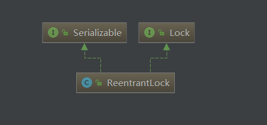
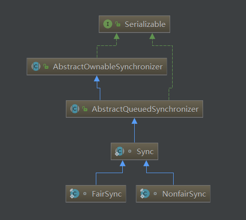

# ReetrantLock源码解析
## ReentrantLock,Sync类层次结构





>* ReenTrantLock属于可重入锁，默认非公平模式。  
>* ReentrantLock是借助Sync子类实现锁的功能，FailSync实现公平锁，NonFairSync实现非公平锁。

## 重要属性

|waitStatus|value|description|
|---|---|---|
|DEFAULT|0|默认值|
|CANCELLED|1|节点取消|
|SIGNAL|-1|信号，表示后继节点park，等待唤醒|
|CONDITION|-2|表示条件等待|
|PROPAGATE|-3|表示等待传播|
Node 节点包含两种：
1. lock等待队列：包含的状态值有 CANCELLED SIGNAL PROPAGATE 0
2. condition等待队列：包含的状态值有 CANCELLED CONDITION 0


## Sync

```java
//非公平获取锁
final boolean nonfairTryAcquire(int acquires) {
            final Thread current = Thread.currentThread();
            int c = getState();
            //c==0:表示当前没有线程获取锁
            if (c == 0) {
                //以CAS方式修改state属性，标志获取锁
                if (compareAndSetState(0, acquires)) {
                    //设置锁的拥有者为当前线程
                    setExclusiveOwnerThread(current);
                    return true;
                }
            }
            //c!=0：表示当前有线程获取了锁，则继续判断是否是同一线程，因为ReentrantLock的实现是可重入的
            else if (current == getExclusiveOwnerThread()) {
                //同一线程的情况下，可直接获取锁，修改state+1，表示获取锁的线程总数
                int nextc = c + acquires;
                // 如果nextc小于0，则表示值溢出了，此时最高位的符号位为1，变成了负数
                if (nextc < 0) // overflow
                    throw new Error("Maximum lock count exceeded");
                setState(nextc);
                return true;
            }
            //获取锁失败
            return false;
        }
//释放锁
protected final boolean tryRelease(int releases) {
            int c = getState() - releases;
            if (Thread.currentThread() != getExclusiveOwnerThread())
                throw new IllegalMonitorStateException();
            boolean free = false;
            if (c == 0) {
                free = true;
                setExclusiveOwnerThread(null);
            }
            setState(c);
            return free;
        }


```

## NonFairSync

>非公平锁的原理，即在开始获取锁时，直接判断能否获取锁，这样实现能获得更好的性能，减少上下文的切换。

```java
final void lock() {
            //直接尝试获取锁
            if (compareAndSetState(0, 1))
                //获取成功后，设置当前线程作为锁的拥有者
                setExclusiveOwnerThread(Thread.currentThread());
            else
                //失败后，再按照AQS的逻辑继续获取锁
                acquire(1);
        }

protected final boolean tryAcquire(int acquires) {
            //直接调用父类Sync的非公平获取锁方法
            return nonfairTryAcquire(acquires);
        }
```

## AbstractQueuedSynchronizer
### Node重要属性
|name|value|description|
|---|---|---|
|SHARED|Node|表示当前节点是共享模式的节点|
|EXCLUSIVE|null|表示当前节点是独占模式的节点|
|waitStatus|1/-1/-2/-3|等待标志位|
|CANCELLED|1|取消标志位|
|SIGNAL|-1|表示后继节点等待被唤醒|
|CONDITION|-2||
|PROPAGATE|-3|共享模式下，会传播唤醒后继节点|
|next|Node|后节点|
|prev|Node|前节点|
|thread|Thread|当前节点的线程|
|nextWaiter|Node|下一个等待节点|


### AQS.acquire
```java
public final void acquire(int arg) {
        //尝试获取锁，若是获取锁失败，则将当前线程以独占模式放入等待队列中
        if (!tryAcquire(arg) &&
            acquireQueued(addWaiter(Node.EXCLUSIVE), arg))
            //acquireQueued 如果返回true，表示当前线程应当中断，设定中断标志位，等待响应中断
            selfInterrupt();
    }
private Node addWaiter(Node mode) {
        //创建节点，并放置队列尾端
        Node node = new Node(Thread.currentThread(), mode);
        // Try the fast path of enq; backup to full enq on failure
        Node pred = tail;
        //pred != null ：表示已经初始化，则直接设置尾节点
        if (pred != null) {
            node.prev = pred;
            if (compareAndSetTail(pred, node)) {
                pred.next = node;
                return node;
            }
        }
        //若队列未初始化，或者插入尾节点失败，则调用enq自旋执行初始化/插入尾节点动作
        enq(node);
        return node;
    }
//初始化队列/设置尾节点
private Node enq(final Node node) {
        for (;;) {
            Node t = tail;
            //尾节点为空，表示刚开始放入等待队列中，进行初始化
            if (t == null) { // Must initialize
                //CAS的方式给头节点设置new Node
                if (compareAndSetHead(new Node()))
                    tail = head;
            } else {
                //设置尾节点
                node.prev = t;
                if (compareAndSetTail(t, node)) {
                    t.next = node;
                    return t;
                }
            }
        }
    }
static void selfInterrupt() {
        Thread.currentThread().interrupt();
    }
//返回是否中断
final boolean acquireQueued(final Node node, int arg) {
        boolean failed = true;
        try {
            boolean interrupted = false;
            for (;;) {
                //获取当前节点的前节点
                final Node p = node.predecessor();
                //如果前节点为头节点，则尝试获取锁
                if (p == head && tryAcquire(arg)) {
                    //获取成功后，设置当前节点为头节点，并去掉关联关系
                    setHead(node);
                    p.next = null; // help GC
                    failed = false;
                    return interrupted;
                }
                //如果不是头节点或者获取锁失败，则进行判断
                if (shouldParkAfterFailedAcquire(p, node) &&
                    parkAndCheckInterrupt())
                    interrupted = true;
            }
        } finally {
            if (failed)
                cancelAcquire(node);
        }
    }
private static boolean shouldParkAfterFailedAcquire(Node pred, Node node) {
        //获取前节点的状态值
        int ws = pred.waitStatus;
        //SIGNAL:表示当前节点暂时还无法拿到锁，应该进行中断
        if (ws == Node.SIGNAL)
            /*
             * This node has already set status asking a release
             * to signal it, so it can safely park.
             */
            return true;
        //ws>0 : 表示前节点已取消获取锁，则暂时不暂停当前线程
        if (ws > 0) {
            /*
             * Predecessor was cancelled. Skip over predecessors and
             * indicate retry.
             */
            //循环过滤掉前节点之前的取消节点
            do {
                node.prev = pred = pred.prev;
            } while (pred.waitStatus > 0);
            pred.next = node;
        } else {
            /*
             * waitStatus must be 0 or PROPAGATE.  Indicate that we
             * need a signal, but don't park yet.  Caller will need to
             * retry to make sure it cannot acquire before parking.
             */
            // 此时表示前节点 为0/PROPOGATION，但是当前节点无法获取lock，所以设置前节点标志位为SIGNAL，让前节点在释放锁的时候，唤醒当前节点的线程
            //此时则表示前节点的状态为0/PROPOGATION,则表明前驱节点正常，则设置前驱节点标志位为SIGNAL，目的等前驱节点获取锁后，执行完成唤醒当前线程
            compareAndSetWaitStatus(pred, ws, Node.SIGNAL);
        }
        return false;
    }
//暂停当前线程，线程激活后，返回当前线程是否中断
private final boolean parkAndCheckInterrupt() {
        LockSupport.park(this);
        return Thread.interrupted();
    }
```

### AQS.release
```java
public final boolean release(int arg) {
        
        if (tryRelease(arg)) {
            Node h = head;
            //如果头节点不为空，且状态值不为0：如果当前waitStatus=0，表示不用唤醒后继节点了
            if (h != null && h.waitStatus != 0)
                unparkSuccessor(h);
            return true;
        }
        return false;
    }
private void unparkSuccessor(Node node) {
        /*
         * If status is negative (i.e., possibly needing signal) try
         * to clear in anticipation of signalling.  It is OK if this
         * fails or if status is changed by waiting thread.
         */
        int ws = node.waitStatus;
        if (ws < 0)
            //此时将waitStatus标志位重置为0，即标志不用唤醒后继节点了，如果失败了，意味着状态值已经被等待的线程重置了，所以无需判断是否已经修改
            compareAndSetWaitStatus(node, ws, 0);

        /*
         * Thread to unpark is held in successor, which is normally
         * just the next node.  But if cancelled or apparently null,
         * traverse backwards from tail to find the actual
         * non-cancelled successor.
         */
        Node s = node.next;
        //此时选择接近当前节点的未取消节点
        if (s == null || s.waitStatus > 0) {
            s = null;
            //此时从后往前遍历寻找可用的后继节点进行唤醒
            //为什么要从后往前呢？
            //答案可能是： cancelAcquire 方法在取消节点的时候，只修改了前驱节点的关联关系
            for (Node t = tail; t != null && t != node; t = t.prev)
                if (t.waitStatus <= 0)
                    s = t;
        }
        //若存在后继可用节点，则进行唤醒
        if (s != null)
            LockSupport.unpark(s.thread);
    }
```

### AQS:public final void acquire(int arg) 获取请求锁，或插入双向链表队列
```java
public final void acquire(int arg) {
    //尝试获取锁，如果没有获取到，则添加到等待队列中,park当前线程，并判断中断标志位
    if (!tryAcquire(arg) &&
        acquireQueued(addWaiter(Node.EXCLUSIVE), arg))
        selfInterrupt();
}
```
#### Sync:final boolean nonfairTryAcquire(int acquires) 非公平尝试获取锁
```java
final boolean nonfairTryAcquire(int acquires) {
    final Thread current = Thread.currentThread();
    int c = getState();
    if (c == 0) {
        //如果当前没有竞争，则直接获取锁
        if (compareAndSetState(0, acquires)) {
            setExclusiveOwnerThread(current);
            return true;
        }
    }
    //如果当前锁已被获取，则判断是否是同一线程，如果是，则将锁标志位state加1，ReenTrantLock是可重入锁
    else if (current == getExclusiveOwnerThread()) {
        int nextc = c + acquires;
        if (nextc < 0) // overflow
            throw new Error("Maximum lock count exceeded");
        setState(nextc);
        return true;
    }
    return false;
}
```
#### AQS:private Node addWaiter(Node mode) 插入等待队列中
```java
private Node addWaiter(Node mode) {
    Node node = new Node(Thread.currentThread(), mode);
    // Try the fast path of enq; backup to full enq on failure
    //将新的节点添加至最后
    Node pred = tail;
    if (pred != null) {
        node.prev = pred;
        if (compareAndSetTail(pred, node)) {
            pred.next = node;
            return node;
        }
    }
    //将节点添加至queue中，如果queue没有初始化，则初始化queue
    enq(node);
    return node;
}
```
#### AQS:final boolean acquireQueued(final Node node, int arg)检测是否到node节点执行，如果不是则park节点所属线程，并检测中断
```java
final boolean acquireQueued(final Node node, int arg) {
        boolean failed = true;
        try {
            boolean interrupted = false;
            for (;;) {
                //获取前置节点
                final Node p = node.predecessor();
                //如果当前节点的前置节点是头节点，则表示当前线程可以获取锁了
                if (p == head && tryAcquire(arg)) {
                    setHead(node);
                    p.next = null; // help GC
                    failed = false;
                    return interrupted;
                }
                //如果前置节点不是首节点，或者尝试获取锁失败，则应当LockSupport.park当前线程
                if (shouldParkAfterFailedAcquire(p, node) &&
                    parkAndCheckInterrupt())
                    interrupted = true;
            }
        } finally {
            if (failed)
                cancelAcquire(node);
        }
    }
```
**问题一：finally是在什么时候触发呢？tryAcquire 方法在获取到锁后，如果超出int的最大值，会抛出异常throw new Error("Maximum lock count exceeded")**
##### AQS:private static boolean shouldParkAfterFailedAcquire(Node pred, Node node) 
```java
private static boolean shouldParkAfterFailedAcquire(Node pred, Node node) {
    int ws = pred.waitStatus;
    //表示当前节点需要park，等待前置节点release后unpark当前节点
    if (ws == Node.SIGNAL)
        /*
         * This node has already set status asking a release
         * to signal it, so it can safely park.
         */
        return true;
    //表明前置节点已取消，则将当前节点循环放到上一个未取消的节点
    if (ws > 0) {
        /*
         * Predecessor was cancelled. Skip over predecessors and
         * indicate retry.
         */
        do {
            node.prev = pred = pred.prev;
        } while (pred.waitStatus > 0);
        pred.next = node;
    } else {
        /*
         * waitStatus must be 0 or PROPAGATE.  Indicate that we
         * need a signal, but don't park yet.  Caller will need to
         * retry to make sure it cannot acquire before parking.
         */
        //疑问：为什么不返回true，直接让他park，而是等待下一次判断？
        compareAndSetWaitStatus(pred, ws, Node.SIGNAL);
    }
    return false;
}
```
**问题二：为什么不返回true，直接让他park，而是等待下一次判断？**<br/>
**解释:其实就是让head的后继节点有两次检测获取锁的机会**
## AQS:public final boolean release(int arg)释放锁
```java
public final boolean release(int arg) {
    //释放锁
    if (tryRelease(arg)) {
        Node h = head;
        if (h != null && h.waitStatus != 0)
            //释放锁后，如果head节点waitStatus 不为0，则需要unpark后继节点线程
            //此处说明：由于lock在获取到锁后，会将head赋值为当前节点，所以release的时候，直接unpark首节点的next
            unparkSuccessor(h);
        return true;
    }
    return false;
}
```

### AQS:  private void unparkSuccessor(Node node) 唤醒后继节点
```java
private void unparkSuccessor(Node node) {
        /*
         * If status is negative (i.e., possibly needing signal) try
         * to clear in anticipation of signalling.  It is OK if this
         * fails or if status is changed by waiting thread.
         */
        //waitStatus小于0，将其置0
        int ws = node.waitStatus;
        if (ws < 0)
            compareAndSetWaitStatus(node, ws, 0);

        /*
         * Thread to unpark is held in successor, which is normally
         * just the next node.  But if cancelled or apparently null,
         * traverse backwards from tail to find the actual
         * non-cancelled successor.
         */
        Node s = node.next;
        if (s == null || s.waitStatus > 0) {
            s = null;
            for (Node t = tail; t != null && t != node; t = t.prev)
                if (t.waitStatus <= 0)
                    s = t;
        }
        if (s != null)
            LockSupport.unpark(s.thread);
    }
```