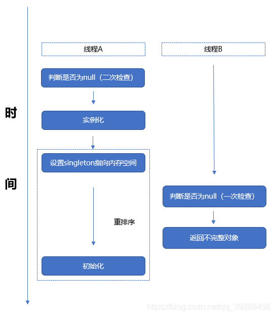

# 并发编程

    正确使用并发编程能提高系统系统，但与之而来，也会带来一些问题
    1. 安全性问题：并发编程下通常会出现多个线程同时访问/改变某一变量的问题，此时对象状态的不确定性可能会导致错误
    2. 活跃性问题：当我们为了解决安全性问题时，而引入锁时，此时资源的争夺，可能会导致死锁，饥饿，活锁等活跃性问题
    3. 性能问题：多线程下，当线程调度器临时挂起当前线程并转而运行其他线程时，此时会出现上下文切换，这种操作将带来极大的运行开销：保存和恢复执行上下文，丢失局部性，并且CPU将更多的时间花在线程调度上而不是线程运行上。当线程共享数据时，必须使用同步机制，而这些机制将限制某些编译器优化，使内存缓存区中的数据无效，以及增加共享内存总线的同步流量。这些因素都将带来性能开销。

## 线程状态

```java
public enum State {
    // 线程创建而未启动状态
    NEW,
    // 此处是一个复合状态：READY，RUNNING
    // READY：该状态表示可以被线程调度器进行调度而使之处于RUNNING状态
    // RUNNING：表示线程正在运行
    RUNNABLE,
    // 阻塞状态：当线程发起一个阻塞I/O操作后，或者申请一个被其他线程持有的独占锁时，会处于BLOCK状态，此时线程不会占用处理器资源，直至阻塞I/O完成或者申请到了独占锁时，该线程转为RUNNABLE
    BLOCKED,
    // 等待状态：线程执行了特定方法后会处于等待其他线程执行特定操作的状态
    // 变更为WAITING状态的方法：Object.wait(),Thread.join(),LockSupport.park()等
    // WAITING-RUNNABLE方法：Object.notify(),Object.notifyAll(),LockSupport.unpark()等
    WAITING,
    // 该状态与WAITING状态相似，差别在于处于该状态的线程并非无限制等待，超时后将自动转换为RUNNABLE
    // 即调用Object.wait(long),Thread.sleep(long),LockSupport.park(long)
    TIMED_WAITING,
    // 线程已结束状态，当线程正常执行完成或者抛出异常而提前终止的情况下，线程处于该状态
    TERMINATED;
}
```
    tips：Thread.join方法：若线程A调用线程B的join方法，那么A线程将暂停执行，直至B运行结束后，A线程由WAITING转换为RUNNABLE状态

## 安全性问题
    一个对象是否需要线程安全，取决于它是否被多个线程访问。在多个线程同时访问某个状态变量时，必须使用同步机制来协同。java中的关键字就是synchronized，它提供了一种独占的加锁方式。同步机制下还包括了volatile类型变量，显式锁以及原子变量。

    解决多线程访问同一变量的方式：
    1. 不在多线程下共享该状态变量
    2. 将状态变量修改为不可变的变量
    3. 在访问时使用同步机制

### 定义线程安全性
    当多个线程访问某个类时，这个类始终都能表现出正确的行为。那么就可以称这个类为线程安全类。

    当多个线程访问某个类时，不管运行时环境采用何种调度方式或者这些线程将如何交替执行，在主调代码中无需任何额外的同步或协同，这个类都能表现出正确的行为。

    无状态对象一定是线程安全的

### 竞态条件
    竞态条件：运行的正确性取决于多个线程的交替执行时序时，就会发生竞态条件。

### 数据竞争
    数据竞争：多个线程同时访问某一（无同步机制）变量，并且伴随着读写操作（不是全读），这时就会发生数据竞争。


## 对象的共享
    同步代码块/同步方法 不仅可以确保程序以原子的方式执行，而且能保证内存可见性，即在该同步代码块能及时看到某个变量的状态变化。

### 可见性
    可见性问题来源：
    1. 重排序问题：在没有同步的情况下，编译器，处理器，运行时等都可能对操作的执行顺序进行意想不到的调整。在缺乏足够同步的多线程程序中，要想对内存操作的执行顺序进行判断，几乎无法得出正确的结论。

    2. CPU缓存机制
    

#### volatile
    java中提供了一种弱同步机制，即volatile变量，用于确保将变量的更新操作通知到其他线程。编译器与运行时都会注意到这个变量是共享的，因此不会将该变量上的操作与其他内存操作一起进行重排序。volatile变量不会缓存在寄存器或者其他线程看不到的地方，因此在读取volatile变量时，总会拿到最新值。

    我们必须要注意到volatile变量仅仅只提供内存可见性，没有原子性的操作。如果在验证正确性时需要进行复杂的判断，那么就不要使用volatile变量。volatile变量的正确使用：确保它们状态的可见性，确保它们所引用对象的可见性，以及标识一些重要的程序生命周期事件的发生。

### 发布与逸出
    不要在构造方法中使this逸出。
    隐式逸出
```java
public class ThisEscape {
  public ThisEscape(EventSource source) {
    source.registerListener(
      new EventListener() {
        public void onEvent(Event e) {
          doSomething(e);
        }
      });
  }
}
```
    那为什么会逸出呢？这是因为内部类可使用外部类的this引用，而source对象在ThisEscape的构造未完成时，发布了EventListener，间接导致了ThisEscape的逸出，这种隐式的方式，可能带来意想不到的错误。
```java
public class Out {

    class Inner {

        public void in() {
            this.in();
            Out.this.out();
            System.out.println("in");
        }
    }

    public void out() {
        System.out.println("out");
    }

    public void doOut() {
        this.out();
    }
}
```

### 不变性
    不可变对象一定是线程安全。不可变对象必须满足的条件：
    1. 对象创建后其状态就无法修改
    2. 对象所有的域都是final类型
    3. 对象是正确创建的（在对象创建过程中，this没有逸出）

    多线程下访问可变对象，在没有同步的情况下，可能出现状态不一致。而访问不可变对象时，无需额外的同步操作。

### 安全发布对象
    一个正确构造的对象可以通过以下几种方式来安全地发布：
    1. 在静态初始化函数中初始化一个对象引用
    2. 将对象引用保存到volatile类型的域或者AtomicReference对象中
    3. 将对象引用保存到某个正确的构造对象的final域中
    4. 将对象的引用保存到一个由锁保护的域中

    通常要发布一个静态构造对象，最简单和最安全的方式是使用静态的初始化器：
    public static Holder holder = new Holder(12);
    静态初始化器由JVM在类的初始化阶段执行。由于JVM内部存在着同步机制，因此通过该方式初始化的对象都可以安全地发布。

### 事实不可变对象
    如果对象从技术上来看是可变的，但其状态在发布后不会改变，那么这个对象就可以称为事实不可变对象。
    在没有额外的同步的情况下，任何线程都可以安全地使用被安全发布的事实不可变对象。

### 安全共享对象
    在并发程序中使用和共享对象时，可以使用一些策略：
    1. 线程封闭：线程封闭的对象只能由一个线程持有，对象被封闭在该线程中，无法被其他线程修改。例如：使用ThreadLocal
    2. 只读共享：在没有额外的同步的情况下，共享的只读对象可以被多个线程同时访问，但任何线程都不能去修改它。共享的只读对象包括：不可变对象，事实不可变对象。
    3. 线程安全共享：线程安全的对象在其内部实现同步，因此多个线程可以并发访问。
    4. 保护对象：被保护的对象只能通过持有特定的锁来访问。

## 对象的组合
    第四章的内容，暂不解读。后续需要详看。

## 基础构建模块
    介绍JDK中的常用类，以及模块
    CountDownLatch：类似于门闩，创建时需要设置count值，即对应共享锁的可入次数。每一次countDown都会减少一次共享锁的可入次数。await方法可使用线程挂起，当调用countDown次数 = count值时，则可以激活所有被await挂起的线程

    CyclicBarrier：可循环使用栅栏，创建时需要设置parties值。目的是当调用await方法的次数等于parties时，会唤醒所有被挂起的线程。

    Semaphore：通常用于那些资源有明确访问数量限制的场景，常用于限流 

### 并发技巧清单
    1. 可变状态是至关重要的。所有的并发问题都可以归结于如何协调对并发状态的访问。可变状态越少，就越容易保证线程安全性。
    2. 尽量将域声明为final类型
    3. 不可变对象一定是线程安全的。不可变对象能极大地降低并发编程的复杂性。它们更为简单而且安全，可以任意共享而无需使用加锁或者保护性复制等操作。
    4. 封装有助于管理复杂性。在编写程序时，虽然可以将所有的数据都保存在全局变量中，但为什么这么做？将数据封装在对象中，更易于维持不变性条件。将同步机制封装在对象中，更易于遵循同步策略。
    5. 用锁来保护每个可变变量。
    6. 当保护同一个不变性条件中所有的变量时，要使用同一个锁。
    7. 在执行符合操作时，要使用锁。
    8. 在设计过程中考虑线程安全，或者在文档中明确指示它是否线程安全
    9. 同步策略文档化。有助于理清复杂的同步逻辑

## 取消与关闭

### 取消

    在java的API或语言规范中，并没有将中断与任何取消语义关联，但实际上，如果在取消之外的其他操作中使用中断，那么都是不合适的（即中断方法只适用于取消），并且很难支持起更大的应用。

    在调用了interrupt方法并不意味着目标线程停止正在进行的工作，而只是传递了一个中断的信号。由线程在下一个合适的时机中断自己，例如：wait方法，sleep方法，join方法等等，当这些方法在检测到中断信号后，会马上抛出异常。检测的方法主要是Thread.isInterrupted(boolean clearInterrupted)，传递的参数表示是否清楚中断状态。

    通常中断是实现取消的最好方式。

    只有实现了线程中断策略的代码才可以屏蔽中断请求，在常规的任务和库代码中都不应该屏蔽中断请求。

### 关闭

    线程池的关闭：
    1. shutdown 正常关闭，此时会等待所有的任务执行完成。
    2. shutdownNow 立即强行关闭，此时会关闭当前正在执行的线程任务，然后返回还未启动的线程任务清单。

## 线程池
    JDK中自带的线程池对象ThreadPoolExecutor。其继承自AbstractExecutorService。当然我们常用Executors来帮助构建ThreaPoolExecutor。
    Executors的几种构建方法：
    1. newCachedThreadPool：可无限扩充的线程池，默认最大值为int最大值
    2. newFixedThreadPool：固定大小线程池，超出任务将在队列中等待。
    3. newScheduledThreadPool：周期性任务线程池，用于处理延时任务或定时任务
    4. newSingleThreadExecutor：单线程的线程池

    线程池重要的几个属性介绍：
    1. corePoolSize：核心线程池大小
    2. maximumPoolSize：最大线程池大小
    3. keepAliveTime：当空闲线程数量超出核心线程池大小时，超时后销毁空闲线程
    4. workQueue：工作队列，当工作线程数量超出最大线程池大小时，用于处理等待执行的任务
    5. threadFactory：线程工厂，用于创建线程。
    6. handler：当工作队列已满，无法添加任务时，用于处理拒绝任务策略

## 活跃性问题

### 死锁
    由于多个线程存在独享锁循环依赖而永远等待的问题。促成死锁的几个要点：
    1. 互斥条件：资源独占
    2. 请求和保持：持有独占资源且不释放，需要获取其他资源
    3. 环路等待关系：存在循环依赖关系
    4. 不剥夺条件：持有独占资源且只有自己可以释放

    解决方法：
    1. 请求独占资源设置超时，在请求独占资源失败后，释放已持有的独占资源，等待后续再次请求
    2. 规定独占资源请求顺序

    死锁检测

### 饥饿
    当线程由于无法访问它所需的资源而不能继续执行时，就发生了'饥饿'。

### 活锁
    活锁是另一种形式的活跃性问题，该问题尽管不会阻塞线程，但是也不能执行后续操作，因为线程将不断重复执行相同的操作，而且总会失败。要解决这类问题，需要在重试机制上增加随机性。


## 性能与可伸缩性
    多线程引起的额外开销：
    1. 线程之间的协调（加锁，触发信号以及内存同步等）
    2. 线程的上下文切换（虚拟机栈中的指令操作码，以及局部变量，程序计数器存储的指令内容）
    3. 线程的创建与销毁
    4. 线程的调度
    5. CPU的高速缓存失效

### 内存同步

    同步操作的性能开销包括多个方面。在synchronized和volatile提供的可见性保证中可能会使用一些特殊指令，即内存栅栏。内存栅栏可以刷新缓存，使缓存无效，刷新硬件的写缓冲，以及停止执行管道。内存栅栏将抑制一些编译器优化操作。在内存栅栏中，大多数操作都是不能被重排序的。


### 减少锁的竞争
    在并发程序中，对可伸缩性的最主要威胁就是独占方式的资源锁。有两个因素将影响在锁上发生的竞争的可能性：锁的请求频率，持有锁的时间。

1. 缩小锁的范围

2. 减小锁的粒度

3. 锁分段
    示例即 ConcurrentHashMap

4. 采用非独占锁或非阻塞锁来代替独占锁

## 原子变量与非阻塞同步机制
    原子变量类相当于一种泛化的volatile变量，能够支持原子性操作比较后修改，内部采用的是Unsafe类以CAS的方式进行比较并修改。因此不仅提供了可见性以及原子性。相较于锁来说，具有更高的可伸缩性。

### 非阻塞算法
    在基于锁的算法中，可能会发生各种活跃性故障。如果线程在持有锁时由于IO阻塞，内存也缺失或其他延迟而推迟执行，那么很可能所有线程都不能继续执行下去。如果在某种算法中，一个线程的失败或挂起不会导致其他线程也失败或挂起，那么这种算法就可以称为非阻塞算法。如果在算法的每个步骤中都存在某个线程能够执行下去，那么这种算法也被称为无锁算法。如果算法仅仅将CAS用于协调线程之间的操作，并且能够正确实现，那么它既是非阻塞算法，又是无锁算法。

### ABA问题
    即线程1将值以CAS的方式 从A改到B，再从B改到A。但是在另一个线程中无法感知到值是否改变过。所以这里说的问题是：值相同=值未改变？很显然并不能说明值未曾改过。所以java中还提供了一个类AtomicStampedReference用于处理，该类多提供了一个参数stamp来标识特征值。


## java内存模型

    再共享内存的多处理器体系架构中，每个处理器都有自己的缓存，并且定期与主内存进行协调。在不同处理器架构中提供了不同级别的缓存一致性，其中一部分只提供最小的保证，即允许不同的处理器在任意时刻从同一存储位置上看到不同的值。

### 重排序
    线程的执行顺序与源代码可能不一致，这是编译器和处理器会对指令进行重排序。
    重排序是对内存访问有关的操作(读和写)所做的一种优化。它可以在不影响单线程程序正确性的情况下提升程序性能。
    两个操作之间存在happen-before关系，并不意味着前一个操作必须要再后一个操作之前执行！happen-before仅仅要求前一个操作的结果对后一个操作可见，且前一个操作按顺序排在第二个操作之前。

    Happen-Before偏序关系 规则：
    1. 程序顺序规则：如果代码前后执行存在依赖关系，则不会进行重排序
    2. 监视器锁规则：在监视器上的解锁动作必须在同一个监视器上的加锁操作之前。
    3. volatile变量规则：对volatile变量的写入操作必须在对该变量的读操作之前
    4. 线程启动规则：线程中的任何操作都发生在线程启动（Thread.start）之后
    5. 线程结束规则：线程中的任何操作都发生在线程结束之前。
    6. 中断规则：当一个线程在另一个线程上调用interrupt时，必须在被中断线程检测到interrupt调用之前
    7. 终结器规则：对象的构造函数一定在对象的回收之前
    8. 传递性：如果操作A在操作B之前，操作B在操作C之前，那么操作A一定在操作C之前

### happen-before

Java 内存模型（JMM, Java Memory Model）中的 **happen-before** 规则定义了 **在多线程环境下，如何保证操作之间的可见性和有序性**，避免数据竞争问题。  

---

如果 **操作 A happen-before 操作 B**，那么：
1. **A 的结果对 B 可见**（即 B 读取到 A 的修改）。
2. **A 在 B 之前执行**（在 JMM 规则下，不受 CPU 指令重排影响）。

#### **JMM 定义的 8 条 happen-before 规则：**

1. **程序次序规则（Program Order Rule）**  
   - **单线程内**，程序的执行结果 **必须与源代码顺序执行的结果一致**（as-if-serial 语义）。  
   - 但这不意味着 **物理执行顺序** 一定按照代码编写顺序。  
   - **编译器和 CPU 可能会进行重排序**，只要不改变单线程下的 **最终可观测行为**。  

**修正示例：**
```java
int a = 1; 
int b = 2;
```
✅ **JMM 规则保证**：
- 程序最终的行为 **看起来** 像是 `a = 1` 先执行，`b = 2` 后执行。  
- 但 **底层 CPU 执行顺序可能变化**（比如 `b = 2` 可能会先执行），只要**结果一致**，就不会影响单线程正确性。  

2. **监视器锁（synchronized）规则（Monitor Lock Rule）**  
   - **解锁（unlock）happen-before 之后的加锁（lock）**。
   - 例：线程 A `synchronized` 代码块执行完释放锁，线程 B 获取同一个锁后执行，则 A 的修改对 B 可见。

3. **volatile 变量规则（Volatile Variable Rule）**  
   - **对 volatile 变量的写，happen-before 后续对该变量的读**。  
   - 例：
     ```java
     volatile int a = 0;
     a = 1;  // happen-before
     int b = a;  // 保证能看到 a = 1
     ```

4. **线程启动规则（Thread Start Rule）**  
   - **主线程调用 `Thread.start()` 先行于该线程中的操作**。  
   - 例：
     ```java
     Thread t = new Thread(() -> x = 1);
     t.start();  // happen-before 线程 t 读取 x
     ```

5. **线程终结规则（Thread Termination Rule）**  
   - **线程执行完毕（终止）happen-before 其他线程检测到它的终止**（如 `Thread.join()` 或 `isAlive()` 返回 `false`）。
   - 例：
     ```java
     t.join();  // 线程 t 结束
     System.out.println(x);  // 这里能看到 t 修改的 x
     ```

6. **线程中断规则（Thread Interruption Rule）**  
   - **调用 `interrupt()` happen-before 目标线程检测到中断（`isInterrupted()` / `InterruptedException`）**。
   - 例：
     ```java
     t.interrupt();  // happen-before
     if (t.isInterrupted()) { ... }  // 一定能检测到
     ```

7. **对象终结规则（Finalizer Rule）**  
   - **对象的构造函数执行完，happen-before 该对象的 `finalize()` 方法**。

8. **传递性（Transitivity）**  
   - **如果 A happen-before B，且 B happen-before C，那么 A happen-before C**。  
   - 例：
     ```java
     a = 1;  // A
     volatile int x = a;  // A -> B（volatile 规则）
     int y = x;  // B -> C（程序次序规则）
     ```

---

#### **总结**
- **synchronized** 解决 **线程间锁机制** 的 happen-before 关系。
- **volatile** 确保 **变量可见性**。
- **start()、join()** 确保 **线程启动和结束的顺序**。
- **中断、finalizer 也有规则**，但使用较少。
- **所有 happen-before 规则可传递**，确保线程间有序执行。

这些规则帮助 Java 程序员 **正确理解并发，避免数据竞争和指令重排导致的不可预测行为**。

| 规则 | 适用于单线程？ | 适用于多线程？ | 主要作用 |
|------|-------------|-------------|---------|
| **程序次序规则（Program Order Rule）** | ✅ **适用** | ❌ **不适用** | 确保单线程代码执行结果符合 as-if-serial 语义（但可重排） |
| **监视器锁规则（Monitor Lock Rule）** | ✅ **适用** | ✅ **适用** | `synchronized` 保证线程间的 happens-before 关系 |
| **volatile 变量规则** | ✅ **适用** | ✅ **适用** | `volatile` 防止指令重排，保证可见性 |
| **线程启动/终止规则** | ✅ **适用** | ✅ **适用** | `Thread.start()` 和 `Thread.join()` 确保线程间 happens-before 关系 |
| **中断规则** | ✅ **适用** | ✅ **适用** | `Thread.interrupt()` 的可见性 |
| **对象终结规则（Finalizer Rule）** | ✅ **适用** | ✅ **适用** | 对象的构造函数执行完，happen-before 该对象的 `finalize()` 方法 |
| **传递性（Transitivity Rule）** | ✅ **适用** | ✅ **适用** | A happens-before B，B happens-before C，则 A happens-before C |

### 双重检查加锁
    声名狼藉的双重检查加锁代码如下：

```java
public class DoubleCheckedLocking{

    private static Resource resource;

    public static Resource getInstance() {
        // 第一次检查
        if (resource == null) {
            synchronized(DoubleCheckedLocking.class) {
                // 第二次检查
                if (resource == null) {
                    resource = new Resource();
                }
            }
        }
        return resource;
    }

}
```

问题的根源在于Java的内存模型（Java Memory Model, JMM）和`new`操作符的非原子性。`new Resource()`操作可以分为以下三个步骤（这里为了简化，只考虑与内存可见性相关的部分）：

1. 分配内存空间给Resource对象。
2. 初始化Resource对象。
3. 将instance引用指向分配的内存空间。

如果没有volatile关键字，JVM可能会将步骤3（对象引用的赋值）重排序到步骤2（对象实例的初始化）之前。这意味着其他线程可能会看到一个非null的instance引用，但实际上Resource对象还没有完全初始化。这通常被称为“半初始化”状态，并可能导致不可预测的行为，包括NullPointerException或其他类型的错误。

使用`volatile`关键字可以确保以下两点：

1. **可见性**：当一个线程修改了`volatile`变量的值，其他线程会立即看到这个修改。
2. **禁止重排序**：`volatile`禁止了指令重排序优化，从而确保了`new Resource()`操作的三个步骤按照预期的顺序执行。

因此，如果你不使用`volatile`来修饰类变量，双重检查加锁就无法保证线程安全，从而可能导致错误的行为。

    所以该代码的解决方法就是保证resource的可见性，即把resource声明为volatile类型


```java
public class DoubleCheckedLocking{

    // volatile非常重要
    private volatile static Resource resource;

    public static Resource getInstance() {
        // 此处的可见性问题不容忽略
        if (resource == null) {
            synchronized(DoubleCheckedLocking.class) {
                if (resource == null) {
                    // 对象创建及引用传递 整个过程可能出现的重排序 不容忽略
                    resource = new Resource();
                }
            }
        }
        return resource;
    }

}
```

### 初始化过程的安全性
    正确构造：需要确保对象在构造过程中没有'逸出'。

    初始化安全性将确保，对于被正确构造的对象，所有线程都能看到由构造函数为对象给各个final域设置的正确值，而不管采用何种方式来发布对象。而且对于可以通过被正确构造对象中某个final域到达的任意变量（如某个final数组中的元素，或一个final域引用的HashMap的内容）将同样对于其他线程可见。

    写final域的重排序规则：
    1. JMM禁止编译器把final域的写重排序到构造函数之外
    2. 编译器会在final域的写之后，构造函数return之前，插入一个StoreStore屏障。这个屏障禁止处理器把final域的写重排序到构造函数之外

    对于含有final域的对象，初始化安全性可以防止对对象的初始引用被重排序到构造过程之前。只要对象是正确构造的（被构造对象的引用在构造函数中没有“逸出”），那么不需要使用同步（指lock和volatile的使用）就可以保证任意线程都能看到这个final域在构造函数中被初始化之后的值。

## Java内部锁优化

### 锁消除
    JIT编译器可以借助一种被称为逃逸分析的技术判断同步块所使用的锁对象是否只能够被单线程访问而没有发布到其他线程中去。如果确实只能被单线程访问，那么JIT编译器在编译这个同步代码块时，并不会生成synchronized所表示的锁申请与释放对应的机器码，而仅生成原临界区代码对应的机器码，这就造成了被动态编译的字节码就像是不包含monitorenter和monitorexit这两个字节码指令一样，即消除了锁的使用。

### 锁粗化
    锁粗化是JIT编译器对内部锁的具体实现所做的一种优化，如果一个方法中的几个同步代码块使用的是同一个锁，那么JIT编译器会将这些同步块合并为一个大的同步代码块。从而避免一个线程反复申请，释放同一个锁导致的开销。

### 偏向锁

    偏向锁是java虚拟机对锁的实现做的一种优化，这种优化基于观测结果：大多数锁并没有被争用，并且这些锁在其整个生命周期内至多只会被一个线程持有。Java虚拟机在执行monitorenter 和 monitorexit时需要借助CAS的方式，这个原子操作开销较大，因此java虚拟机会为每个对象维护一个偏好，即一个对象对应的内部锁第一次被一个线程获取，那么这个线程会被记录为该对象的偏好线程。这个线程在后续无论是再次申请锁还是释放锁，都无须借助原先昂贵的原子操作，从而减少了锁的申请与释放开销。

    然而一个锁没有被争用，并不代表着只有一个线程会持有，所以对象的偏好线程之外的其他线程申请内部锁时，Java虚拟机需要回收该对象对原偏好线程的偏好，并重新设置新的偏好线程。这个回收与重新分配的过程也是十分昂贵的。鉴于此，偏向锁，只适用于存在大部分锁都没有被争用的系统之中。如果不适用可以进行关系偏向锁优化。

### 适应性锁
    存在锁争用的情况下，一个线程申请被占用的锁时，线程会进入BLOCK状态，那此时则会进行上下文切换，这些操作会影响系统性能。所以JIT编译器提供了一种适应性锁来对此提供优化：当我们系统中的绝大所数锁的持有时间较短时，线程会采用忙等，即不释放时间片，一直循环到可获取到资源（如:锁）。即避免了上下文的切换，但是比较耗费处理器资源。

### 轻量级锁
    32位虚拟机下对象头mark word如下：


#### 加锁与膨胀

    在代码进入同步代码块的时候，如果此对象没有被锁定(01)，虚拟机首先将在当前线程的虚拟机栈帧中建立一个名为锁记录(Lock Record)的空间，用于存储当前对象的mark word的拷贝，然后虚拟机使用CAS操作成功后，将该对象的mark word更新为指向该锁记录的指针。如果这个更新动作成功，那么这个线程就拥有了该对象的锁，并且mark word的状态变为00，即表示该对象处于轻量级锁定状态。如果该操作失败了，虚拟机会先检查对象的mark word是否指向当前线程的栈帧，如果是，则说明当前线程已经有了这个锁，可以直接执行同步代码块，否则，说明该锁对象已被其他线程占用。如果由两条以上的线程争夺该对象锁，那么轻量级锁不再适用，会膨胀为重量级锁，锁状态10，mark word中存储的就是指向重量级锁的指针，后面等待锁的线程进入阻塞状态。

#### 解锁
    轻量级锁解锁过程：
    如果对象的mark word仍然指向线程的锁记录，那就用CAS方式将对象的mark word拷贝覆盖掉锁记录，替换成功，同步过程结束。如果替换失败，说明有其他线程尝试获取过该锁，那就要在释放锁的同时，唤醒被挂起的线程。

#### 偏向锁-转换
    假设当前虚拟机开启了偏向锁，那么当锁对象第一次被线程获取的时候，虚拟机会将锁标志位设置为01，即偏向模式，同时使用CAS模式，将线程ID记录在对象头 mark word中，如果CAS成功，则持有偏向锁的线程以后每次进入该锁相关的代码块时，都不需要进行任何同步。当另一个线程尝试去获取这个锁时，偏向模式就宣告结束了。根据目前锁对象是否处于被锁状态，撤销偏向后恢复到未锁定(01)或轻量级锁定(00)的状态。

#### 偏向锁与hashcode

    当一个对象已经计算过identity hash code，它就无法进入偏向锁状态；
    当一个对象当前正处于偏向锁状态，并且需要计算其identity hash code的话，则它的偏向锁会被撤销，并且锁会膨胀为重量锁；
    重量锁的实现中，ObjectMonitor类里有字段可以记录非加锁状态下的mark word，其中可以存储identity hash code的值。或者简单说就是重量锁可以存下identity hash code。

## 并发重点
    
### 原子性
    即保证操作不可切分

### 可见性
    在多核CPU下，每个CPU都有自己缓存器，寄存器。我们暂且称之为工作内存，当CPU执行某个线程任务时，会先从主内存中读取数据到工作内存中

### 有序性
    即