# 红黑树

## 在线演示
[在线演示红黑树](https://www.cs.usfca.edu/~galles/visualization/Algorithms.html)

## 特性
红黑树是一种自平衡二叉搜索树，每个节点都有颜色，颜色为红色或黑色，红黑树由此得名。除了满足二叉搜索树的特性以外，红黑树还具有如下特性：

1. 节点是红色或黑色。

2. 根节点是黑色。

3. 所有叶子节点都是黑色的空节点。(叶子节点是NIL节点或NULL节点)

4. 每个红色节点的两个子节点都是黑色节点。(从每个叶子节点到根的所有路径上不能有两个连续的红色节点)

5. 从任一节点到其每个叶子节点的所有路径都包含相同数目的黑色节点。

>这些约束强制了红黑树的关键性质: 从根到叶子的最长的可能路径不多于最短的可能路径的两倍长。结果是这个树大致上是平衡的。因为操作比如插入、删除和查找某个值的最坏情况时间都要求与树的高度成比例，这个在高度上的理论上限允许红黑树在最坏情况下都是高效的，而不同于普通的二叉查找树。

## 旋转
### 左旋
    左旋的本质是：将该节点(N)旋转变成左子节点(NL)的右子节点(NLR)，并将原本的右子节点(Pre_NLR)至于该节点(N)的左子节点(NL_Next)


### 右旋
    右旋的本质是：将该节点(N)旋转变成右子节点(NR)的左子节点(NRL)，并将原本的左子节点(Pre_NRL)至于该节点(N)的右子节点(NR_Next)


## 新增节点

    在红黑树中新增节点的理论操作：在一颗红黑树上插入红节点，最后通过旋转/重新着色使之成为标准意义上的红黑树

**为什么新增的节点都要设置为红节点？**

> 1. 不违背规则5：路径中的黑色节点数量相同
> 2. 根据规则4，表明红黑树中的黑节点个数多于红节点，所以新增节点的父亲节点是黑节点的概率比较大，因为父亲是黑节点的情况下，是不需要做任何处理的，即可满足现有条件。  

**然后我们来看下新节点为红节点情况，在哪些规则下有冲突：**

    规则1：满足
    规则2：满足，如果不满足，也可以修改颜色保证
    规则3：满足
    规则4：可能存在冲突
    规则5：满足

**现在来分析下可能出现的情况及解决措施：**

**情形1. 插入的节点是根节点**

    将节点置为黑色

**情形2. 父节点是黑色**

    无需处理，此时仍满足红黑树的规则

**情形3. 父节点是红色的情况下，其叔叔节点是红色（不分左右）**

    将父节点与叔节点改为黑色，其爷节点置为红色。并且将爷节点当作新插入的红节点，进行各种情况处理

**情形4. 父节点是红色的情况下，其叔叔节点是黑色**

    4.1 父节点是左节点，插入节点是左节点：将爷节点与父节点颜色互换，然后将爷节点右旋
    4.2 父节点是右节点，插入节点是右节点：将爷节点与父节点颜色互换，然后将爷节点左旋
    4.3 父节点是左节点，插入节点是右节点：将父节点左旋，则情况与4.1一致
    4.4 父节点是右节点，插入节点是左节点：将父节点右旋，则情况与4.2一致

### 情形3

**3. 父节点是红色的情况下，其叔叔节点是红色（不分左右）**

    将父节点与叔节点改为黑色，其爷节点置为红色。并且将爷节点当作新插入的红节点，进行各种情况处理

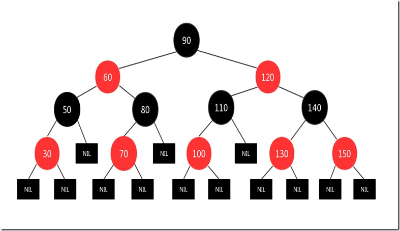

    插入红节点125

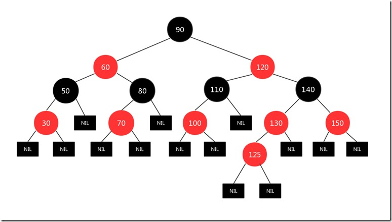

    交换颜色，爷节点140当作新节点

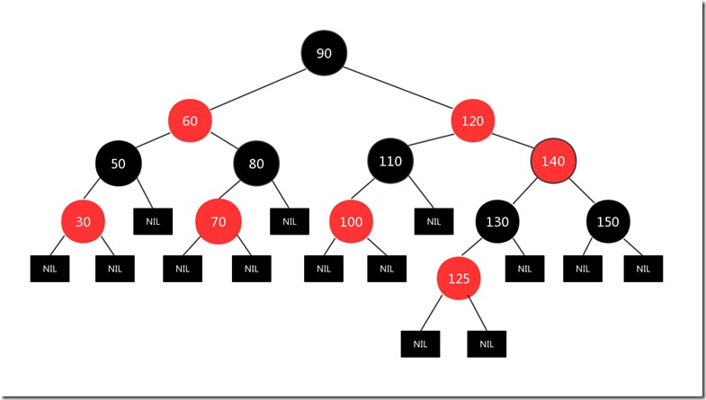

    依然是情形3，交换颜色，然后根据情形1再作处理


### 情形4
#### 情形4_LL

**4. 父节点是红色的情况下，其叔叔节点是黑色**  
**4.1 父节点是左节点，插入节点是左节点：将爷节点与父节点颜色互换，然后将爷节点右旋**

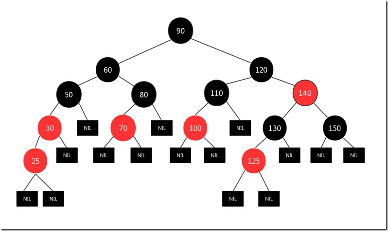

    将爷节点50与父节点30颜色互换，然后将爷节点50右旋

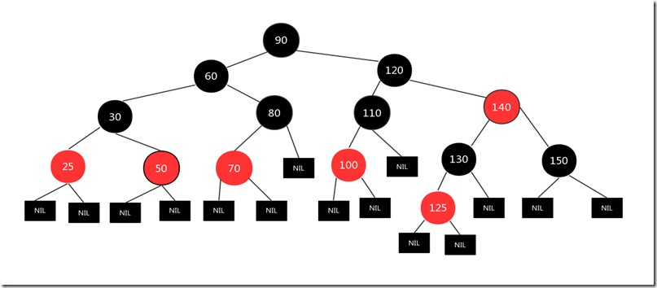


**如果我们只将颜色互换，不进行旋转，即50成红节点，30成黑节点，是否可行？**

    那么我们稍加分析则可知：此时明显分支 90-60-50-NIL 的黑色节点数量与其他分支的黑色节点数量不一致，违反了规则5

#### 情形4_RR

**4. 父节点是红色的情况下，其叔叔节点是黑色**  
**4.2 父节点是右节点，插入节点是右节点：将爷节点与父节点颜色互换，然后将爷节点左旋**

    该情况与LL型情形差距不大，仅仅只是爷节点左旋的差别，不再赘述

#### 情形4_LR

**4. 父节点是红色的情况下，其叔叔节点是黑色**  
**4.3 父节点是左节点，插入节点是右节点：将父节点左旋，则情况与4.1一致**

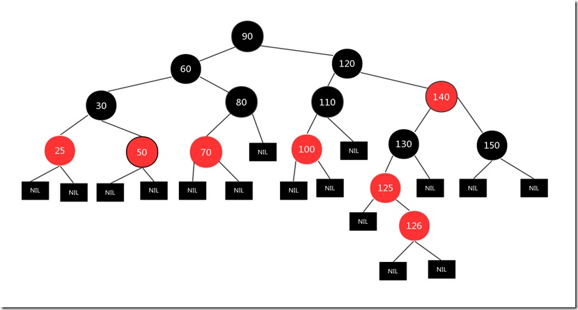

    将父节点125左旋后，情形与LL型一致

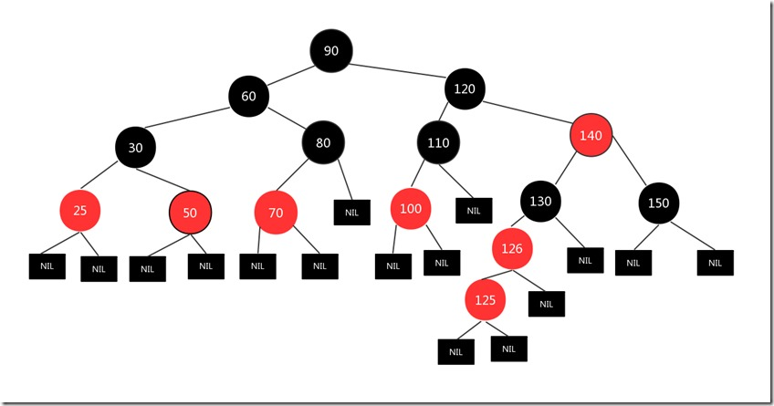


#### 情形4_RL

**4. 父节点是红色的情况下，其叔叔节点是黑色**  
**4.4 父节点是右节点，插入节点是左节点：将父节点右旋，则情况与4.2一致**

    该情况与LR型情形差距不大，父节点右旋后，情形与RR型一致

### 总结

    是否插入情形只有上述情况：当然不是

## 删除节点（HashMap）

### 红黑树特性

1. 节点是红色或黑色。

2. 根节点是黑色。

3. 所有叶子节点都是黑色的空节点。(叶子节点是NIL节点或NULL节点)

4. 每个红色节点的两个子节点都是黑色节点。(从每个叶子节点到根的所有路径上不能有两个连续的红色节点)

5. 从任一节点到其每个叶子节点的所有路径都包含相同数目的黑色节点。

### 删除逻辑分析

**在删除节点时，我们需要分析可能出现的情况，以及使用什么方式保证删除节点后依然保证红黑树的完整性**
1. 删除的节点是否是叶节点？在非叶节点被删除时，则要考虑其子节点如何再连接红黑树，以及保证红黑树的特性不被破坏。
2. 如果删除的节点是叶节点，这里就要分析该节点是红节点还是黑节点？
    1. 该节点是红节点：则直接删除，不影响红黑树的特性
    2. 该节点是黑节点：如果直接删除，则红黑树整体的黑高不一致，破坏了规则5；

**<font color=red>所以主要的问题处理分为两大块：</font>**

<font color=red>1. 非叶节点删除时，应当如何处理？</font>   

>首先，我们先要想清楚红黑树的本质是什么？本质上红黑树就是一颗带着以上五条规则的二叉树，二叉树的特性无非就是保证其整体的有序性。  
>那么我们在上述分析中，可以看到叶节点删除的逻辑分支明显清晰明朗，那么我们有没有可能将非叶节点的删除，转化为叶结点的删除？  
>那么如何将非叶节点替换到叶节点？首先一点，就是我们找到一个叶节点只交换其值，其颜色，父子节点关系不变，那么红黑树的特性没有被破坏，但是此时二叉树的有序性肯定会遭到破坏，那么如何将有序性的破坏降到最低？肯定是将一个最接近待删除节点值的非叶节点进行交换

    我们随便找一颗红黑树，假设当前待删除的节点是60，那么如何找到最接近的叶节点进行交换呢？
    明显我们可以看到肯定是，左子树的最右节点50 跟 右子树的最左节点70最接近
    那么假设我们统一用右子树的最左节点70进行替换，那么肯定除了交换的节点会出现有序性破坏，其他节点任然符合二叉树的特性。
    但是我们要想到，节点60是要被删除的，那么意味着删除后最终还是保证了二叉树的整体有序性，而且红黑树的特性没有变化


    所以在处理非叶节点删除时，我们可以将被删除节点与其左子树的最右节点 或 右子树的最左节点进行替换，然后转换为叶节点删除的逻辑分支里进行处理

<font color=red>2. 删除黑节点时，导致红黑树整体的黑高不一致，应当如何处理？</font>  

>第一种处理方式就是给该分支补充黑高；  
>另一种是给分支红黑树的黑高减1，再递归到父节点进行处理；

### 非叶节点删除

    根据我们上述的分析，那么我们需要将非叶节点删除转换为叶节点删除
    我们以JDK8中的HashMap的删除节点作为分析

```java

final void removeTreeNode(HashMap<K,V> map, Node<K,V>[] tab,
                            boolean movable) {
    int n;
    if (tab == null || (n = tab.length) == 0)
        return;
    int index = (n - 1) & hash;
    TreeNode<K,V> first = (TreeNode<K,V>)tab[index], root = first, rl;
    TreeNode<K,V> succ = (TreeNode<K,V>)next, pred = prev;
    if (pred == null)
        tab[index] = first = succ;
    else
        pred.next = succ;
    if (succ != null)
        succ.prev = pred;
    if (first == null)
        return;
    if (root.parent != null)
        root = root.root();
    if (root == null || root.right == null ||
        (rl = root.left) == null || rl.left == null) {
        tab[index] = first.untreeify(map);  // too small
        return;
    }
    TreeNode<K,V> p = this, pl = left, pr = right, replacement;
    if (pl != null && pr != null) {
        TreeNode<K,V> s = pr, sl;
        while ((sl = s.left) != null) // find successor
            s = sl;
        boolean c = s.red; s.red = p.red; p.red = c; // swap colors
        TreeNode<K,V> sr = s.right;
        TreeNode<K,V> pp = p.parent;
        if (s == pr) { // p was s's direct parent
            p.parent = s;
            s.right = p;
        }
        else {
            TreeNode<K,V> sp = s.parent;
            if ((p.parent = sp) != null) {
                if (s == sp.left)
                    sp.left = p;
                else
                    sp.right = p;
            }
            if ((s.right = pr) != null)
                pr.parent = s;
        }
        p.left = null;
        if ((p.right = sr) != null)
            sr.parent = p;
        if ((s.left = pl) != null)
            pl.parent = s;
        if ((s.parent = pp) == null)
            root = s;
        else if (p == pp.left)
            pp.left = s;
        else
            pp.right = s;
        if (sr != null)
            replacement = sr;
        else
            replacement = p;
    }
    else if (pl != null)
        replacement = pl;
    else if (pr != null)
        replacement = pr;
    else
        replacement = p;
    if (replacement != p) {
        TreeNode<K,V> pp = replacement.parent = p.parent;
        if (pp == null)
            root = replacement;
        else if (p == pp.left)
            pp.left = replacement;
        else
            pp.right = replacement;
        p.left = p.right = p.parent = null;
    }

    TreeNode<K,V> r = p.red ? root : balanceDeletion(root, replacement);

    if (replacement == p) {  // detach
        TreeNode<K,V> pp = p.parent;
        p.parent = null;
        if (pp != null) {
            if (p == pp.left)
                pp.left = null;
            else if (p == pp.right)
                pp.right = null;
        }
    }
    if (movable)
        moveRootToFront(tab, r);
}

```

### 叶节点删除

    我们将待删除节点标记为x，父节点标记为p，其兄弟节点标记为s，则兄弟左子节点sl，右子节点sr
    在这里，我们将x假设为左节点，右节点的处理过程逻辑是一致的，只是方向上的变化

按照之前的分析，叶节点删除分为以下几个过程：

#### X红节点

    x节点为红节点：直接删除x节点即可

#### X黑节点

    需要补高或整体黑高减1，由于分析补高/黑高减1 可能需要递归处理，所以我们的分析不能只考虑在叶结点上，需要考虑其一般形式

    首先，我们来分析下，如何才能补黑高，那么必须要有黑节点加入，且其他分支的黑高不变，才行

    图形中蓝色表示红黑都有可能，当然图中只是展示整个红黑树的局部，我们只是分析在不同情况下如何补高

##### 补高

**1. 如果父节点P是红色，那么我们将父节点变黑**

>父节点P初始为红色，那么表示S节点必然为黑色，那么为了S分支的黑高保持不变，那么S必然要变成红色，S节点为红色，则其子节点都要是黑色的情况下才能实现  
>所以这时的情形：P红色，S黑色，SR，SL都是黑色


**2. 如果兄弟节点S为黑色，那么我们将父节点左旋换色**

>那么我们可以看到X分支的黑高+1，SL分支黑高不变，最重要的是SR分支的黑高-1了，那么有一种情况：就是SR原本是红色，那么我们将SR转换为黑色，这里转换黑色不会影响子树


>此时就是特定情况S节点黑色，SR节点红色，经过P节点左旋后，保证了整体黑高的一致性


##### 实际分析

**1. s节点为黑节点，且s节点无子节点/双子节点都是黑色：**

 >P节点为红色：此时是我们补高方式的第一点，P与S交换颜色即可


    
>P节点为黑色：那么此时已经无法处理黑高了，只有将S变红，然后P树的整体黑高减1，维持子树的黑高一致性，然后将P节点当前新的X节点，再递归处理，看能否在上层进行补高/减高


**2. s节点为黑节点，且SR为红色**

> 此时是我们之前补高处理方法的第二点，将P节点左旋换色，且SR节点转黑色，即可将整体黑高保持一致


**3. s节点为黑节点，且SL为红色，SR为黑色**

 > 此时我们可以将S节点右旋换色，那么就可以转换为SR为红色的情况


**4. s节点为红节点**

> S节点为红色，则意味着其必须有两个子节点都是黑色，不然无法满足红黑树的规则  
> 那么此时将P节点左旋，换色后，我们可以看到此时情形已经转换为S为黑色的情况了，我们按照之前的处理方式进行修复就可以了


    此时我们再来梳理下，看是否存在逻辑分支遗漏的情况：
    1. 

##### 源码

```java
static <K,V> TreeNode<K,V> balanceDeletion(TreeNode<K,V> root,
                                            TreeNode<K,V> x) {
    for (TreeNode<K,V> xp, xpl, xpr;;)  {
        if (x == null || x == root)
            return root;
        else if ((xp = x.parent) == null) {
            x.red = false;
            return x;
        }
        else if (x.red) {
            x.red = false;
            return root;
        }
        else if ((xpl = xp.left) == x) {
            if ((xpr = xp.right) != null && xpr.red) {
                xpr.red = false;
                xp.red = true;
                root = rotateLeft(root, xp);
                xpr = (xp = x.parent) == null ? null : xp.right;
            }
            if (xpr == null)
                x = xp;
            else {
                TreeNode<K,V> sl = xpr.left, sr = xpr.right;
                if ((sr == null || !sr.red) &&
                    (sl == null || !sl.red)) {
                    xpr.red = true;
                    x = xp;
                }
                else {
                    if (sr == null || !sr.red) {
                        if (sl != null)
                            sl.red = false;
                        xpr.red = true;
                        root = rotateRight(root, xpr);
                        xpr = (xp = x.parent) == null ?
                            null : xp.right;
                    }
                    if (xpr != null) {
                        xpr.red = (xp == null) ? false : xp.red;
                        if ((sr = xpr.right) != null)
                            sr.red = false;
                    }
                    if (xp != null) {
                        xp.red = false;
                        root = rotateLeft(root, xp);
                    }
                    x = root;
                }
            }
        }
        else { // symmetric
            if (xpl != null && xpl.red) {
                xpl.red = false;
                xp.red = true;
                root = rotateRight(root, xp);
                xpl = (xp = x.parent) == null ? null : xp.left;
            }
            if (xpl == null)
                x = xp;
            else {
                TreeNode<K,V> sl = xpl.left, sr = xpl.right;
                if ((sl == null || !sl.red) &&
                    (sr == null || !sr.red)) {
                    xpl.red = true;
                    x = xp;
                }
                else {
                    if (sl == null || !sl.red) {
                        if (sr != null)
                            sr.red = false;
                        xpl.red = true;
                        root = rotateLeft(root, xpl);
                        xpl = (xp = x.parent) == null ?
                            null : xp.left;
                    }
                    if (xpl != null) {
                        xpl.red = (xp == null) ? false : xp.red;
                        if ((sl = xpl.left) != null)
                            sl.red = false;
                    }
                    if (xp != null) {
                        xp.red = false;
                        root = rotateRight(root, xp);
                    }
                    x = root;
                }
            }
        }
    }
}

```
## 删除节点

    删除一个节点，我们要分析哪些规则会遭到破坏，以及如何保证红黑树的正确性：
    
1. 节点是红色或黑色。-- 不会影响

2. 根节点是黑色。-- 影响不大，最后可直接染黑根节点

3. 所有叶子节点都是黑色的空节点。（叶子节点是NIL节点或NULL节点）-- 不会影响

4. 每个红色节点的两个子节点都是黑色节点。（从每个叶子节点到根的所有路径上不能有两个连续的红色节点）-- 易受影响

5. 从任一节点到其每个叶子节点的所有路径都包含相同数目的黑色节点。-- 易受影响

>删除节点，最重要的就是保证两个规则不被破坏：1. 红节点的子节点必须是黑色；2. 任一节点为根节点，其分支黑节点数必须一致。  
>修复的整体思路是：
>1. 如果该节点的父节点、或兄弟节点、或兄弟节点的特定方向的子节点 中，有红色节点，则将此红色节点旋转过来，通过旋转、涂黑操作，保持自父节点以来的树的平衡；
>2. 如果不满足上述条件，则通过旋转和变色操作，使其兄弟分支上也减少一个黑色节点，这样自父节点以来的分支保持了平衡，满足了条件，但对于父节点来说，其整个分支减少了一个黑色节点，需要递归向上处理，直至重新平衡，或者到达根节点；


**删除节点需要分别处理几种情况：**
1. 删除节点没有子节点
    1. 删除节点为红色
    2. 删除节点为黑色，其兄弟节点没有子节点
    3. 删除节点为黑色，其兄弟节点只有一个子节点
    4. 删除节点为黑色，其兄弟节点有两个子节点
2. 删除节点只有一个子节点
    1. 删除节点是黑节点，则这个唯一的子节点必然是红节点
    2. 删除节点是红节点，则这个唯一的子节点必然是黑节点（该情况不可能出现，规则4/5不容许）
3. 删除节点有两个子节点

### 删除节点无子节点

#### 情形1.1
**情形1.1：删除节点没有子节点，且删除节点为红色**

    直接删除该节点125/130，不影响红黑树规则

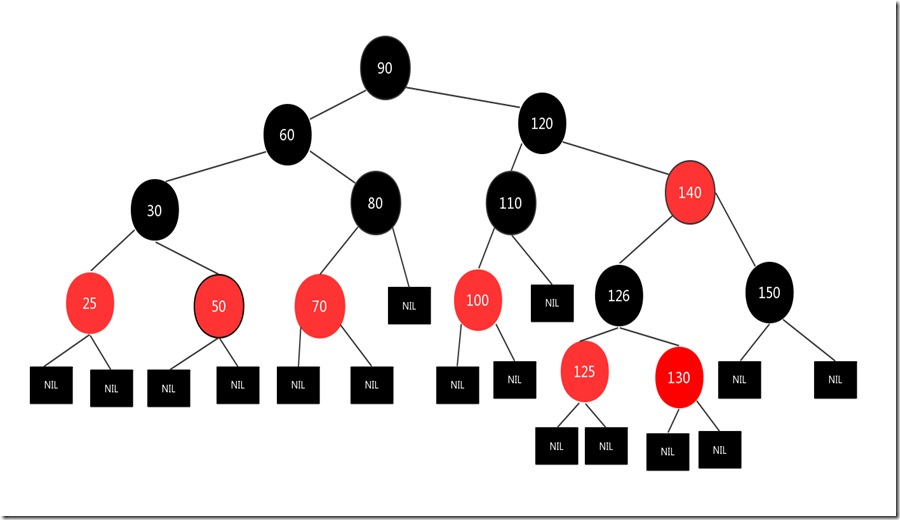

#### 情形1.2
**情形1.2：删除节点没有子节点，且删除节点为黑色，其兄弟节点没有子节点**

    此时隐含条件：其兄弟节点也是黑节点。但是此时应当再分清父节点颜色：
    1. 父节点红色：这种情况下，可以将兄弟节点染红，父节点染黑，此时删除节点不影响规则5
    2. 父节点黑色：这种情况比较复杂，需要分析


##### 情况1

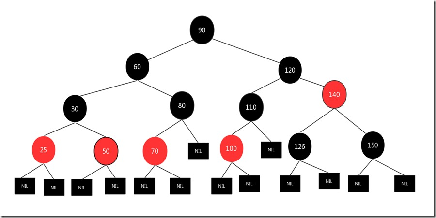

    父节点140与子节点颜色互换

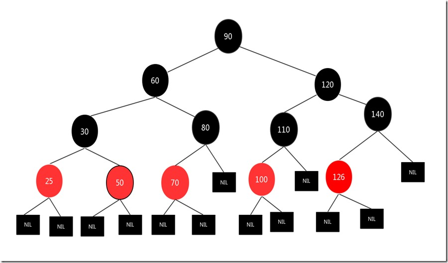


##### 情况2
**<font color=red>父节点黑色：这种情况比较复杂，需要分析</font>**

#### 情形1.3
**情形1.3：删除节点没有子节点，且删除节点为黑色，其兄弟节点只有一个子节点**

    1. 如果此时兄弟节点是黑色，则其子节点必然是红色
    2. 如果此时兄弟节点是红色，则其子节点必然是黑色（此时违反了规则5）

>此时其子节点是否与自己同边即LL/RR，如果是LR/RL，则需要先换色旋转后，转变为LL/RR，来处理。那么此时我们可以将兄弟的子节点染黑，然后将该节点的父节点颜色与兄弟节点交换，然后旋转父节点，即可

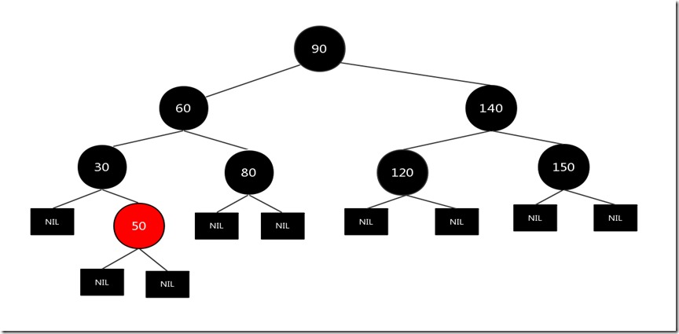

    此时我们将节点30左旋，转换为LL/RR

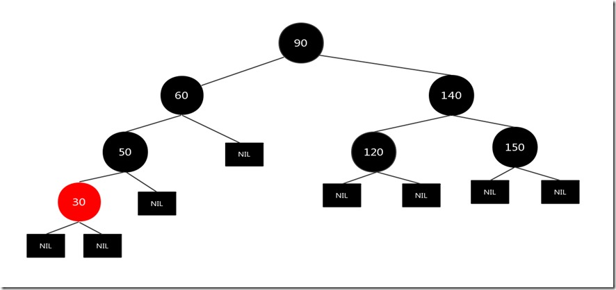

    右旋节点60，并将节点30染黑

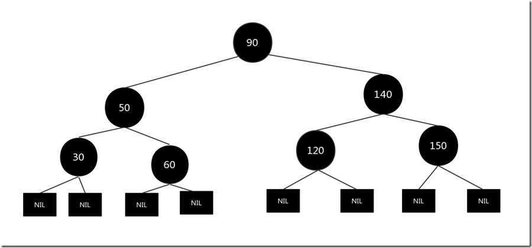

#### 情形1.4
**情形1.4：删除节点没有子节点，且删除节点为黑色，其兄弟节点有两个子节点**

    此时隐含条件：兄弟节点没有孙节点
    1. 兄弟节点为红色：则两个子节点为黑色
    2. 兄弟节点为黑色：则两个子节点为红色

>情况1可以将兄弟节点染黑，然后两个子节点染红，即变成[情况2](#情况2)

##### 情况1

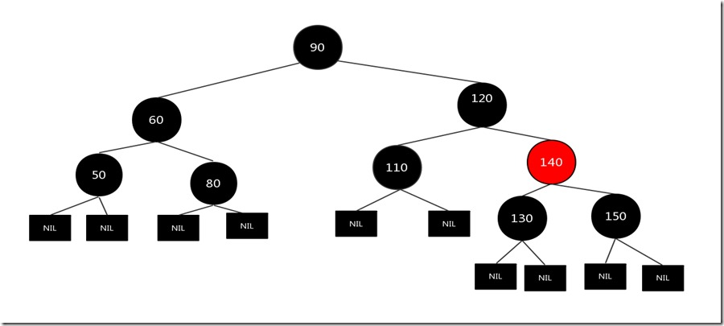

    节点120左旋，并与节点140换色

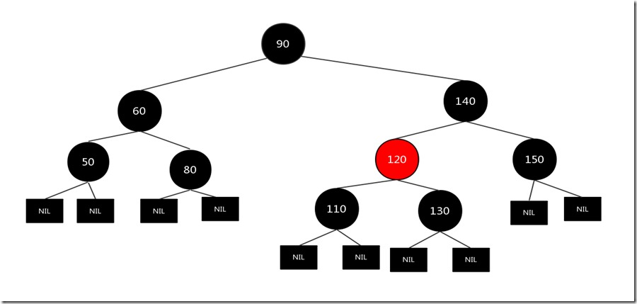

    节点120与子节点交换颜色，节点110为红节点，可以直接删除


##### 情况2
**情形1.4.2：删除节点没有子节点，且删除节点为黑色，其兄弟节点有两个子节点，兄弟节点为黑色：则两个子节点为红色**

    下面所论情形：即待删除节点(D)为父节点(F)的左节点
    父节点(F)不论黑红，将父节点(F)左旋，且父节点(F)颜色与兄弟节点(B)互换，待删除节点(D)转红，兄弟节点的右节点(BR)颜色与父节点一致，原兄弟节点的左节点(BL)颜色与父节点(F)相反
    如果即待删除节点(D)为父节点(F)的右节点，则父节点右旋而已

### 删除节点单子结点

**情形2.1：删除节点是黑节点，且唯一的子节点必然是红节点**

    这种情况很好处理，即直接删除该节点，并将该节点的子节点染黑代替删除的节点即可。

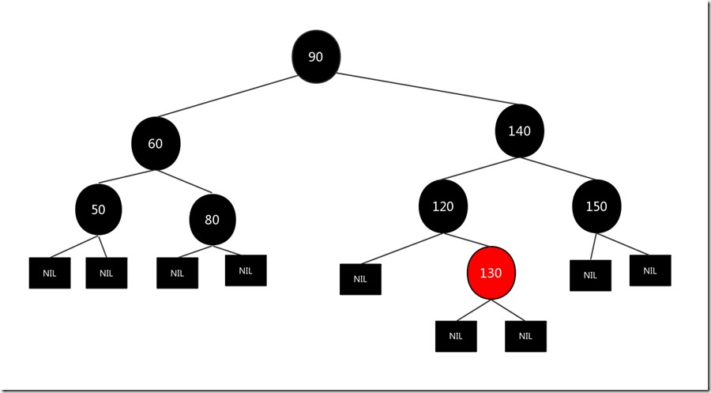

    我们将需要删除的结点120删除，然后将子节点130涂黑放到被删除结点120的位置，结果如下：

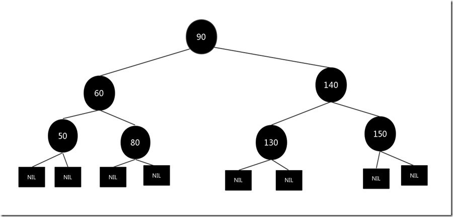

### 删除节点双子节点

>删除节点有双子节点，这种情况可以转换为：[删除节点无子节点](###删除节点无子节点)。即将删除节点的位置与 `右子树的最左叶节点（左子树的最右叶节点）` 进行替换，此时不影响整棵树的特性(有序以及红黑树规则)，待删除节点虽然被替换到了叶子节点，看似打破了有序的特性，实则没有`（只可意会不可言传）`，处理方式则可按照[删除节点无子节点](###删除节点无子节点)的做法，以此简化需要处理的逻辑分支。


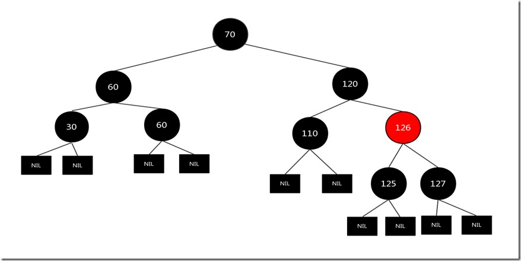

    假设要删除的结点是120，先找到结点120右子树中最左的结点125，交换两者的值，图如下：


    按照删除节点无子节点的情形1.2：父节点为红节点处理

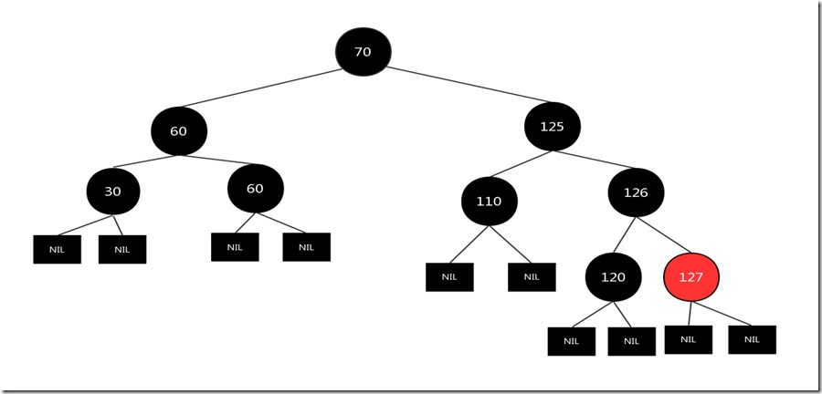


## 参考文章
- [1] [西风(文章分析存在漏洞)](https://www.cnblogs.com/yinbiao/p/10732600.html)