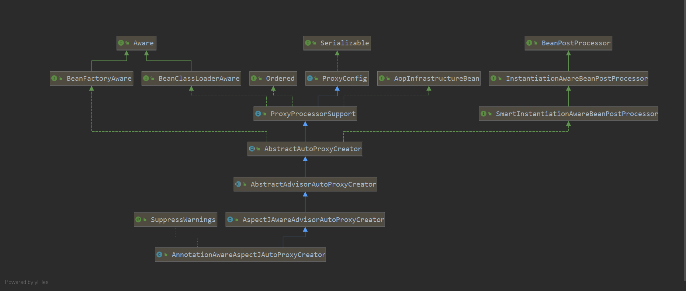

# AOP源码解析
## 1 AOP运用
```java
@Aspect
public class NormalAdvisor {

    //execution表达式
    @Pointcut("execution(* com.xiaohe..*.*(..))")
    public void pointcut(){}

    // 指定规则下所有符合的类的方法
    @Pointcut("within(com.xiaohe..*)")
    public void withinPointcut(){}

    // this(类型全限定名)：表示符合指定类的代理对象的所有方法
    @Pointcut("this(com.xiaohe.springbootstudy.aop.TestDemo)")
    public void thisPointcut(){}

    // target(类型全限定名)：表示符合指定类的被代理对象的所有方法
    @Pointcut("target(com.xiaohe.springbootstudy.aop.TestDemo)")
    public void targetPointcut(){}

    // 表示符合名称的bean的所有方法
    @Pointcut("bean(*Service)")
    public void beanPointcut(){}

    // 表示参数列表符合的所有方法
    @Pointcut("args(Long, String, ..)")
    public void argsPointcut(){}

    //标注方法级别
    @Pointcut("@annotation(org.springframework.web.bind.annotation.GetMapping)")
    public void annotationsPointcut(){}

    //标注类级别
    @Pointcut("@within(org.springframework.web.bind.annotation.RestController)")
    public void withinAnnotationPointcut(){}

    //标注参数级别
    @Pointcut("@args(org.springframework.web.bind.annotation.RequestParam)")
    public void argsAnnotationPointcut(){}

    //标注参数级别
    @Pointcut("@target(org.springframework.web.bind.annotation.RequestParam)")
    public void targetAnnotationPointcut(){}

    @Before("pointcut()")
    public void before() {
        System.out.println("before : " + System.currentTimeMillis());
    }

    @After("bean(*Service)")
    public void after() {
        System.out.println("after : " + System.currentTimeMillis());
    }

    @Around("pointcut()")
    public Object around(ProceedingJoinPoint joinPoint) {
        System.out.println("around start : " + System.currentTimeMillis());
        Object result = null;
        try {
            result = joinPoint.proceed(joinPoint.getArgs());
        } catch (Throwable throwable) {
            throwable.printStackTrace();
        }
        System.out.println("around end : " + System.currentTimeMillis());
        return result;
    }

    @AfterReturning("pointcut()")
    public void afterReturning() {
        System.out.println("afterReturning : " + System.currentTimeMillis());
    }

    @AfterThrowing("pointcut()")
    public void afterThrowing() {
        System.out.println("afterThrowing : " + System.currentTimeMillis());
    }
}

```
## 2 AOP加载流程解析

### @EnableAspectJAutoProxy
    解析AOP源码，需要关注到一个注解`@EnableAspectJAutoProxy`
```java
@Target(ElementType.TYPE)
@Retention(RetentionPolicy.RUNTIME)
@Documented
@Import(AspectJAutoProxyRegistrar.class)
public @interface EnableAspectJAutoProxy {

    /**
    * Indicate whether subclass-based (CGLIB) proxies are to be created as opposed
    * to standard Java interface-based proxies. The default is {@code false}.
    */
    boolean proxyTargetClass() default false;

    /**
    * Indicate that the proxy should be exposed by the AOP framework as a {@code ThreadLocal}
    * for retrieval via the {@link org.springframework.aop.framework.AopContext} class.
    * Off by default, i.e. no guarantees that {@code AopContext} access will work.
    * @since 4.3.1
    */
    boolean exposeProxy() default false;

}
```
    其中import了关键类 AspectJAutoProxyRegistrar ，该类主要用于将 AnnotationAwareAspectJAutoProxyCreator 置于Spring容器中。
```java
class AspectJAutoProxyRegistrar implements ImportBeanDefinitionRegistrar {

	@Override
	public void registerBeanDefinitions(
			AnnotationMetadata importingClassMetadata, BeanDefinitionRegistry registry) {

		AopConfigUtils.registerAspectJAnnotationAutoProxyCreatorIfNecessary(registry);
        // 设置配置proxyTargetClass，exposeProxy
		AnnotationAttributes enableAspectJAutoProxy =
				AnnotationConfigUtils.attributesFor(importingClassMetadata, EnableAspectJAutoProxy.class);
		if (enableAspectJAutoProxy != null) {
			if (enableAspectJAutoProxy.getBoolean("proxyTargetClass")) {
				AopConfigUtils.forceAutoProxyCreatorToUseClassProxying(registry);
			}
			if (enableAspectJAutoProxy.getBoolean("exposeProxy")) {
				AopConfigUtils.forceAutoProxyCreatorToExposeProxy(registry);
			}
		}
	}

}
// 生成 BeanDefinition
public static BeanDefinition registerAspectJAnnotationAutoProxyCreatorIfNecessary(BeanDefinitionRegistry registry) {
    return registerAspectJAnnotationAutoProxyCreatorIfNecessary(registry, null);
}
public static BeanDefinition registerAspectJAnnotationAutoProxyCreatorIfNecessary(
        BeanDefinitionRegistry registry, @Nullable Object source) {

    return registerOrEscalateApcAsRequired(AnnotationAwareAspectJAutoProxyCreator.class, registry, source);
}
// AUTO_PROXY_CREATOR_BEAN_NAME = "org.springframework.aop.config.internalAutoProxyCreator"
private static BeanDefinition registerOrEscalateApcAsRequired(
        Class<?> cls, BeanDefinitionRegistry registry, @Nullable Object source) {

    Assert.notNull(registry, "BeanDefinitionRegistry must not be null");

    if (registry.containsBeanDefinition(AUTO_PROXY_CREATOR_BEAN_NAME)) {
        BeanDefinition apcDefinition = registry.getBeanDefinition(AUTO_PROXY_CREATOR_BEAN_NAME);
        if (!cls.getName().equals(apcDefinition.getBeanClassName())) {
            int currentPriority = findPriorityForClass(apcDefinition.getBeanClassName());
            int requiredPriority = findPriorityForClass(cls);
            if (currentPriority < requiredPriority) {
                apcDefinition.setBeanClassName(cls.getName());
            }
        }
        return null;
    }

    RootBeanDefinition beanDefinition = new RootBeanDefinition(cls);
    beanDefinition.setSource(source);
    beanDefinition.getPropertyValues().add("order", Ordered.HIGHEST_PRECEDENCE);
    beanDefinition.setRole(BeanDefinition.ROLE_INFRASTRUCTURE);
    registry.registerBeanDefinition(AUTO_PROXY_CREATOR_BEAN_NAME, beanDefinition);
    return beanDefinition;
}
```

### AnnotationAwareAspectJAutoProxyCreator
    主角正式登场，AnnotationAwareAspectJAutoProxyCreator 用于查找解析Advisor，Advice，并生成AOP代理类。
    其中主要类：
    1. BeanPostProcessor：主要的逻辑在于postProcessAfterInitialization，此处会进行解析AOP，并创建相应的Advisor，Advice
    2. InstantiationAwareBeanPostProcessor：好像没用到，暂时不管
    3. BeanFactoryAware：注入Spring的BeanFactory，方便后续逻辑拓展，以及管理创建的代理类
    4. 以及其主要维护AOP主要流程的ProxyCreator



#### setBeanFactory
    由于实现了BeanFactoryAware接口，所以Spring会在某个时机下运行setBeanFactory，此时会创建几个关键对象，在后续的流程处理中，发挥其出色的功能性
    1. ReflectiveAspectJAdvisorFactory：主要用于创建Advisor，Advice
    2. BeanFactoryAspectJAdvisorsBuilderAdapter：主要用于扫描 带有注解 @Aspect
    3. BeanFactoryAdvisorRetrievalHelperAdapter：主要用于检索 实现接口 Advisor
```java
// AbstractAdvisorAutoProxyCreator
public void setBeanFactory(BeanFactory beanFactory) {
    super.setBeanFactory(beanFactory);
    if (!(beanFactory instanceof ConfigurableListableBeanFactory)) {
        throw new IllegalArgumentException(
                "AdvisorAutoProxyCreator requires a ConfigurableListableBeanFactory: " + beanFactory);
    }
    // 子类拓展
    initBeanFactory((ConfigurableListableBeanFactory) beanFactory);
}
// AnnotationAwareAspectJAutoProxyCreator
protected void initBeanFactory(ConfigurableListableBeanFactory beanFactory) {
    super.initBeanFactory(beanFactory);
    if (this.aspectJAdvisorFactory == null) {
        this.aspectJAdvisorFactory = new ReflectiveAspectJAdvisorFactory(beanFactory);
    }
    this.aspectJAdvisorsBuilder =
            new BeanFactoryAspectJAdvisorsBuilderAdapter(beanFactory, this.aspectJAdvisorFactory);
}
// super.initBeanFactory(beanFactory);
protected void initBeanFactory(ConfigurableListableBeanFactory beanFactory) {
    this.advisorRetrievalHelper = new BeanFactoryAdvisorRetrievalHelperAdapter(beanFactory);
}
```

#### postProcessAfterInitialization
    在bean进行实例化并初始化后，此时AOP代理开始拦路打劫
```java

public Object postProcessAfterInitialization(@Nullable Object bean, String beanName) {
    if (bean != null) {
        Object cacheKey = getCacheKey(bean.getClass(), beanName);
        if (this.earlyProxyReferences.remove(cacheKey) != bean) {
            return wrapIfNecessary(bean, beanName, cacheKey);
        }
    }
    return bean;
}

protected Object wrapIfNecessary(Object bean, String beanName, Object cacheKey) {
    // 如果该bean已在postProcessBeforeInstantiation完成代理，则在此处不重复处理
    if (StringUtils.hasLength(beanName) && this.targetSourcedBeans.contains(beanName)) {
        return bean;
    }
    // 校验已处理的缓存
    if (Boolean.FALSE.equals(this.advisedBeans.get(cacheKey))) {
        return bean;
    }
    // 判断是否为基础设施类 或 Advisor类
    if (isInfrastructureClass(bean.getClass()) || shouldSkip(bean.getClass(), beanName)) {
        this.advisedBeans.put(cacheKey, Boolean.FALSE);
        return bean;
    }

    // 查询当前 bean 可适用的AOP Advisor列表
    Object[] specificInterceptors = getAdvicesAndAdvisorsForBean(bean.getClass(), beanName, null);
    if (specificInterceptors != DO_NOT_PROXY) {
        this.advisedBeans.put(cacheKey, Boolean.TRUE);
        // 创建代理类
        Object proxy = createProxy(
                bean.getClass(), beanName, specificInterceptors, new SingletonTargetSource(bean));
        this.proxyTypes.put(cacheKey, proxy.getClass());
        return proxy;
    }

    this.advisedBeans.put(cacheKey, Boolean.FALSE);
    return bean;
}

// AspectJAwareAdvisorAutoProxyCreator
protected boolean shouldSkip(Class<?> beanClass, String beanName) {
    // TODO: Consider optimization by caching the list of the aspect names
    List<Advisor> candidateAdvisors = findCandidateAdvisors();
    for (Advisor advisor : candidateAdvisors) {
        if (advisor instanceof AspectJPointcutAdvisor &&
                ((AspectJPointcutAdvisor) advisor).getAspectName().equals(beanName)) {
            return true;
        }
    }
    return super.shouldSkip(beanClass, beanName);
}

protected boolean shouldSkip(Class<?> beanClass, String beanName) {
    return AutoProxyUtils.isOriginalInstance(beanName, beanClass);
}
static boolean isOriginalInstance(String beanName, Class<?> beanClass) {
    if (!StringUtils.hasLength(beanName) || beanName.length() !=
            beanClass.getName().length() + AutowireCapableBeanFactory.ORIGINAL_INSTANCE_SUFFIX.length()) {
        return false;
    }
    return (beanName.startsWith(beanClass.getName()) &&
            beanName.endsWith(AutowireCapableBeanFactory.ORIGINAL_INSTANCE_SUFFIX));
}
```

##### findCandidateAdvisors
```java
protected List<Advisor> findCandidateAdvisors() {
    // 此处是扫描检索 实现接口Advisor的 子类bean
    List<Advisor> advisors = super.findCandidateAdvisors();
    if (this.aspectJAdvisorsBuilder != null) {
        // 此处是扫描 带有注解@Aspect 的 bean
        advisors.addAll(this.aspectJAdvisorsBuilder.buildAspectJAdvisors());
    }
    return advisors;
}
```
    1. 实现接口Advisor的子类bean，此处是借 BeanFactoryAdvisorRetrievalHelperAdapter 之手来实现的
```java
protected List<Advisor> findCandidateAdvisors() {
    Assert.state(this.advisorRetrievalHelper != null, "No BeanFactoryAdvisorRetrievalHelper available");
    return this.advisorRetrievalHelper.findAdvisorBeans();
}


public List<Advisor> findAdvisorBeans() {
    // 查看缓存是否已扫描
    String[] advisorNames = this.cachedAdvisorBeanNames;
    if (advisorNames == null) {
        // Do not initialize FactoryBeans here: We need to leave all regular beans
        // uninitialized to let the auto-proxy creator apply to them!
        // 扫描 BeanFactory 中的 Advisor类
        advisorNames = BeanFactoryUtils.beanNamesForTypeIncludingAncestors(
                this.beanFactory, Advisor.class, true, false);
        this.cachedAdvisorBeanNames = advisorNames;
    }
    if (advisorNames.length == 0) {
        return new ArrayList<>();
    }

    List<Advisor> advisors = new ArrayList<>();
    for (String name : advisorNames) {
        // 判断是否符合条件
        if (isEligibleBean(name)) {
            // 判断bean是否正在创建中
            if (this.beanFactory.isCurrentlyInCreation(name)) {
                if (logger.isTraceEnabled()) {
                    logger.trace("Skipping currently created advisor '" + name + "'");
                }
            }
            else {
                // 查找bean
                try {
                    advisors.add(this.beanFactory.getBean(name, Advisor.class));
                }
                catch (BeanCreationException ex) {
                    Throwable rootCause = ex.getMostSpecificCause();
                    if (rootCause instanceof BeanCurrentlyInCreationException) {
                        BeanCreationException bce = (BeanCreationException) rootCause;
                        String bceBeanName = bce.getBeanName();
                        if (bceBeanName != null && this.beanFactory.isCurrentlyInCreation(bceBeanName)) {
                            if (logger.isTraceEnabled()) {
                                logger.trace("Skipping advisor '" + name +
                                        "' with dependency on currently created bean: " + ex.getMessage());
                            }
                            // Ignore: indicates a reference back to the bean we're trying to advise.
                            // We want to find advisors other than the currently created bean itself.
                            continue;
                        }
                    }
                    throw ex;
                }
            }
        }
    }
    return advisors;
}
```
    2. 扫描带有注解@Aspect 的 bean
```java
public List<Advisor> buildAspectJAdvisors() {
    List<String> aspectNames = this.aspectBeanNames;

    if (aspectNames == null) {
        synchronized (this) {
            aspectNames = this.aspectBeanNames;
            if (aspectNames == null) {
                List<Advisor> advisors = new ArrayList<>();
                aspectNames = new ArrayList<>();
                // 查询所有bean
                String[] beanNames = BeanFactoryUtils.beanNamesForTypeIncludingAncestors(
                        this.beanFactory, Object.class, true, false);
                // 遍历查询 带有@Aspect的bean
                for (String beanName : beanNames) {
                    if (!isEligibleBean(beanName)) {
                        continue;
                    }
                    // We must be careful not to instantiate beans eagerly as in this case they
                    // would be cached by the Spring container but would not have been weaved.
                    Class<?> beanType = this.beanFactory.getType(beanName, false);
                    if (beanType == null) {
                        continue;
                    }
                    // 此处会判断是否带有注解@Aspect，当然还有一些与AJTypeSystem相关的逻辑检测，不作深入探讨
                    if (this.advisorFactory.isAspect(beanType)) {
                        aspectNames.add(beanName);
                        // 解析bean的元数据
                        AspectMetadata amd = new AspectMetadata(beanType, beanName);
                        if (amd.getAjType().getPerClause().getKind() == PerClauseKind.SINGLETON) {
                            // 包装 获取原对象bean的factory
                            MetadataAwareAspectInstanceFactory factory =
                                    new BeanFactoryAspectInstanceFactory(this.beanFactory, beanName);
                            List<Advisor> classAdvisors = this.advisorFactory.getAdvisors(factory);
                            if (this.beanFactory.isSingleton(beanName)) {
                                this.advisorsCache.put(beanName, classAdvisors);
                            }
                            else {
                                this.aspectFactoryCache.put(beanName, factory);
                            }
                            advisors.addAll(classAdvisors);
                        }
                        else {
                            // Per target or per this.
                            if (this.beanFactory.isSingleton(beanName)) {
                                throw new IllegalArgumentException("Bean with name '" + beanName +
                                        "' is a singleton, but aspect instantiation model is not singleton");
                            }
                            MetadataAwareAspectInstanceFactory factory =
                                    new PrototypeAspectInstanceFactory(this.beanFactory, beanName);
                            this.aspectFactoryCache.put(beanName, factory);
                            advisors.addAll(this.advisorFactory.getAdvisors(factory));
                        }
                    }
                }
                this.aspectBeanNames = aspectNames;
                return advisors;
            }
        }
    }

    if (aspectNames.isEmpty()) {
        return Collections.emptyList();
    }
    List<Advisor> advisors = new ArrayList<>();
    for (String aspectName : aspectNames) {
        List<Advisor> cachedAdvisors = this.advisorsCache.get(aspectName);
        if (cachedAdvisors != null) {
            advisors.addAll(cachedAdvisors);
        }
        else {
            MetadataAwareAspectInstanceFactory factory = this.aspectFactoryCache.get(aspectName);
            advisors.addAll(this.advisorFactory.getAdvisors(factory));
        }
    }
    return advisors;
}

```

    获取Advisor并生成Advice，此时我们需要注意两个类：
    1. AspectJExpressionPointcut：切点表达式类，在getMethodMatcher，getClassFilter时会调用obtainPointcutExpression方法，解析切点表达式
    2. InstantiationModelAwarePointcutAdvisorImpl：Advisor的实际类

```java

public List<Advisor> getAdvisors(MetadataAwareAspectInstanceFactory aspectInstanceFactory) {
    Class<?> aspectClass = aspectInstanceFactory.getAspectMetadata().getAspectClass();
    String aspectName = aspectInstanceFactory.getAspectMetadata().getAspectName();
    validate(aspectClass);
    // 再次封装factory，保证bean只实例化一次
    MetadataAwareAspectInstanceFactory lazySingletonAspectInstanceFactory =
            new LazySingletonAspectInstanceFactoryDecorator(aspectInstanceFactory);

    List<Advisor> advisors = new ArrayList<>();
    // 获取非@Pointcut标注的method
    for (Method method : getAdvisorMethods(aspectClass)) {
        // 实例化Advisor
        Advisor advisor = getAdvisor(method, lazySingletonAspectInstanceFactory, 0, aspectName);
        if (advisor != null) {
            advisors.add(advisor);
        }
    }

    // If it's a per target aspect, emit the dummy instantiating aspect.
    if (!advisors.isEmpty() && lazySingletonAspectInstanceFactory.getAspectMetadata().isLazilyInstantiated()) {
        Advisor instantiationAdvisor = new SyntheticInstantiationAdvisor(lazySingletonAspectInstanceFactory);
        advisors.add(0, instantiationAdvisor);
    }

    // Find introduction fields.
    for (Field field : aspectClass.getDeclaredFields()) {
        Advisor advisor = getDeclareParentsAdvisor(field);
        if (advisor != null) {
            advisors.add(advisor);
        }
    }

    return advisors;
}

// MethodFilter adviceMethodFilter = ReflectionUtils.USER_DECLARED_METHODS.and(method -> (AnnotationUtils.getAnnotation(method, Pointcut.class) == null));
// adviceMethodFilter用于获取 非@Pointcut标注的method
// 至于为什么要获取非@Pointcut方法，我的理解有下：
// 1. @Before,@After...等等advice注解可以直接定义切点表达式
// 2. 假设advice注解指定了Pointcut方法，可以等到解析注解时去获取对应pointcut方法
private List<Method> getAdvisorMethods(Class<?> aspectClass) {
    List<Method> methods = new ArrayList<>();
    ReflectionUtils.doWithMethods(aspectClass, methods::add, adviceMethodFilter);
    if (methods.size() > 1) {
        methods.sort(adviceMethodComparator);
    }
    return methods;
}

// 获取Advisor
public Advisor getAdvisor(Method candidateAdviceMethod, MetadataAwareAspectInstanceFactory aspectInstanceFactory,
        int declarationOrderInAspect, String aspectName) {

    validate(aspectInstanceFactory.getAspectMetadata().getAspectClass());
    // 获取pointcut，但是此处仅仅是保存 切点表达式
    AspectJExpressionPointcut expressionPointcut = getPointcut(
            candidateAdviceMethod, aspectInstanceFactory.getAspectMetadata().getAspectClass());
    if (expressionPointcut == null) {
        return null;
    }
    // 实例化Advisor
    return new InstantiationModelAwarePointcutAdvisorImpl(expressionPointcut, candidateAdviceMethod,
            this, aspectInstanceFactory, declarationOrderInAspect, aspectName);
}

// 实例化Advisor
public InstantiationModelAwarePointcutAdvisorImpl(AspectJExpressionPointcut declaredPointcut,
        Method aspectJAdviceMethod, AspectJAdvisorFactory aspectJAdvisorFactory,
        MetadataAwareAspectInstanceFactory aspectInstanceFactory, int declarationOrder, String aspectName) {

    this.declaredPointcut = declaredPointcut;
    this.declaringClass = aspectJAdviceMethod.getDeclaringClass();
    this.methodName = aspectJAdviceMethod.getName();
    this.parameterTypes = aspectJAdviceMethod.getParameterTypes();
    this.aspectJAdviceMethod = aspectJAdviceMethod;
    this.aspectJAdvisorFactory = aspectJAdvisorFactory;
    this.aspectInstanceFactory = aspectInstanceFactory;
    this.declarationOrder = declarationOrder;
    this.aspectName = aspectName;
    // 判断是否延迟加载
    if (aspectInstanceFactory.getAspectMetadata().isLazilyInstantiated()) {
        // Static part of the pointcut is a lazy type.
        Pointcut preInstantiationPointcut = Pointcuts.union(
                aspectInstanceFactory.getAspectMetadata().getPerClausePointcut(), this.declaredPointcut);

        // Make it dynamic: must mutate from pre-instantiation to post-instantiation state.
        // If it's not a dynamic pointcut, it may be optimized out
        // by the Spring AOP infrastructure after the first evaluation.
        this.pointcut = new PerTargetInstantiationModelPointcut(
                this.declaredPointcut, preInstantiationPointcut, aspectInstanceFactory);
        this.lazy = true;
    }
    else {
        // 非延迟加载
        // A singleton aspect.
        this.pointcut = this.declaredPointcut;
        this.lazy = false;
        // 重要的步骤：实例化Advice
        this.instantiatedAdvice = instantiateAdvice(this.declaredPointcut);
    }
}

// 实例化Advice
private Advice instantiateAdvice(AspectJExpressionPointcut pointcut) {
    Advice advice = this.aspectJAdvisorFactory.getAdvice(this.aspectJAdviceMethod, pointcut,
            this.aspectInstanceFactory, this.declarationOrder, this.aspectName);
    return (advice != null ? advice : EMPTY_ADVICE);
}
// 根据注解不同生成不同类型的Advice
public Advice getAdvice(Method candidateAdviceMethod, AspectJExpressionPointcut expressionPointcut,
        MetadataAwareAspectInstanceFactory aspectInstanceFactory, int declarationOrder, String aspectName) {

    Class<?> candidateAspectClass = aspectInstanceFactory.getAspectMetadata().getAspectClass();
    validate(candidateAspectClass);
    // 获取方法上的AOP注解
    AspectJAnnotation<?> aspectJAnnotation =
            AbstractAspectJAdvisorFactory.findAspectJAnnotationOnMethod(candidateAdviceMethod);
    if (aspectJAnnotation == null) {
        return null;
    }

    // 校验是否为@Aspect标注类
    if (!isAspect(candidateAspectClass)) {
        throw new AopConfigException("Advice must be declared inside an aspect type: " +
                "Offending method '" + candidateAdviceMethod + "' in class [" +
                candidateAspectClass.getName() + "]");
    }

    if (logger.isDebugEnabled()) {
        logger.debug("Found AspectJ method: " + candidateAdviceMethod);
    }

    AbstractAspectJAdvice springAdvice;
    // 根据注解类型，生成不同实例化的Advice
    switch (aspectJAnnotation.getAnnotationType()) {
        case AtPointcut:
            // 切点无需实例化
            if (logger.isDebugEnabled()) {
                logger.debug("Processing pointcut '" + candidateAdviceMethod.getName() + "'");
            }
            return null;
        case AtAround:
            // 环绕通知
            springAdvice = new AspectJAroundAdvice(
                    candidateAdviceMethod, expressionPointcut, aspectInstanceFactory);
            break;
        case AtBefore:
            // 前置通知
            springAdvice = new AspectJMethodBeforeAdvice(
                    candidateAdviceMethod, expressionPointcut, aspectInstanceFactory);
            break;
        case AtAfter:
            // 后置通知
            springAdvice = new AspectJAfterAdvice(
                    candidateAdviceMethod, expressionPointcut, aspectInstanceFactory);
            break;
        case AtAfterReturning:
            // 最终通知
            springAdvice = new AspectJAfterReturningAdvice(
                    candidateAdviceMethod, expressionPointcut, aspectInstanceFactory);
            AfterReturning afterReturningAnnotation = (AfterReturning) aspectJAnnotation.getAnnotation();
            if (StringUtils.hasText(afterReturningAnnotation.returning())) {
                springAdvice.setReturningName(afterReturningAnnotation.returning());
            }
            break;
        case AtAfterThrowing:
            // 异常通知
            springAdvice = new AspectJAfterThrowingAdvice(
                    candidateAdviceMethod, expressionPointcut, aspectInstanceFactory);
            AfterThrowing afterThrowingAnnotation = (AfterThrowing) aspectJAnnotation.getAnnotation();
            if (StringUtils.hasText(afterThrowingAnnotation.throwing())) {
                springAdvice.setThrowingName(afterThrowingAnnotation.throwing());
            }
            break;
        default:
            throw new UnsupportedOperationException(
                    "Unsupported advice type on method: " + candidateAdviceMethod);
    }
    // 设置参数
    springAdvice.setAspectName(aspectName);
    springAdvice.setDeclarationOrder(declarationOrder);
    String[] argNames = this.parameterNameDiscoverer.getParameterNames(candidateAdviceMethod);
    if (argNames != null) {
        springAdvice.setArgumentNamesFromStringArray(argNames);
    }
    // 参数绑定
    springAdvice.calculateArgumentBindings();

    return springAdvice;
}
```

##### getAdvicesAndAdvisorsForBean
    获取适用于当前bean的advisor，其主要逻辑是解析切点表达式，然后遍历beanClass的所有method，判断当前method是否满足切点
```java
protected Object[] getAdvicesAndAdvisorsForBean(
        Class<?> beanClass, String beanName, @Nullable TargetSource targetSource) {

    List<Advisor> advisors = findEligibleAdvisors(beanClass, beanName);
    if (advisors.isEmpty()) {
        return DO_NOT_PROXY;
    }
    return advisors.toArray();
}
// 查找符合条件的advisor
protected List<Advisor> findEligibleAdvisors(Class<?> beanClass, String beanName) {
    // 获取所有的Advisor
    List<Advisor> candidateAdvisors = findCandidateAdvisors();
    // 获取适用 beanClass 的 Advisor
    List<Advisor> eligibleAdvisors = findAdvisorsThatCanApply(candidateAdvisors, beanClass, beanName);
    extendAdvisors(eligibleAdvisors);
    if (!eligibleAdvisors.isEmpty()) {
        eligibleAdvisors = sortAdvisors(eligibleAdvisors);
    }
    return eligibleAdvisors;
}

protected List<Advisor> findAdvisorsThatCanApply(
        List<Advisor> candidateAdvisors, Class<?> beanClass, String beanName) {

    ProxyCreationContext.setCurrentProxiedBeanName(beanName);
    try {
        return AopUtils.findAdvisorsThatCanApply(candidateAdvisors, beanClass);
    }
    finally {
        ProxyCreationContext.setCurrentProxiedBeanName(null);
    }
}

public static List<Advisor> findAdvisorsThatCanApply(List<Advisor> candidateAdvisors, Class<?> clazz) {
    if (candidateAdvisors.isEmpty()) {
        return candidateAdvisors;
    }
    List<Advisor> eligibleAdvisors = new ArrayList<>();
    for (Advisor candidate : candidateAdvisors) {
        if (candidate instanceof IntroductionAdvisor && canApply(candidate, clazz)) {
            eligibleAdvisors.add(candidate);
        }
    }
    boolean hasIntroductions = !eligibleAdvisors.isEmpty();
    for (Advisor candidate : candidateAdvisors) {
        if (candidate instanceof IntroductionAdvisor) {
            // already processed
            continue;
        }
        // 所以在 通过节点表达式的校验后，满足条件的 advisor 添加到 eligibleAdvisors中
        if (canApply(candidate, clazz, hasIntroductions)) {
            eligibleAdvisors.add(candidate);
        }
    }
    return eligibleAdvisors;
}

public static boolean canApply(Advisor advisor, Class<?> targetClass, boolean hasIntroductions) {
    if (advisor instanceof IntroductionAdvisor) {
        return ((IntroductionAdvisor) advisor).getClassFilter().matches(targetClass);
    }
    else if (advisor instanceof PointcutAdvisor) {
        PointcutAdvisor pca = (PointcutAdvisor) advisor;
        return canApply(pca.getPointcut(), targetClass, hasIntroductions);
    }
    else {
        // It doesn't have a pointcut so we assume it applies.
        return true;
    }
}

public static boolean canApply(Pointcut pc, Class<?> targetClass, boolean hasIntroductions) {
    Assert.notNull(pc, "Pointcut must not be null");
    if (!pc.getClassFilter().matches(targetClass)) {
        return false;
    }
    // 切点在获取matcher时会解析表达式
    MethodMatcher methodMatcher = pc.getMethodMatcher();
    if (methodMatcher == MethodMatcher.TRUE) {
        return true;
    }
    // AspectJExpressionPointcut 实现了接口 IntroductionAwareMethodMatcher
    IntroductionAwareMethodMatcher introductionAwareMethodMatcher = null;
    if (methodMatcher instanceof IntroductionAwareMethodMatcher) {
        introductionAwareMethodMatcher = (IntroductionAwareMethodMatcher) methodMatcher;
    }

    Set<Class<?>> classes = new LinkedHashSet<>();
    if (!Proxy.isProxyClass(targetClass)) {
        classes.add(ClassUtils.getUserClass(targetClass));
    }
    classes.addAll(ClassUtils.getAllInterfacesForClassAsSet(targetClass));

    for (Class<?> clazz : classes) {
        Method[] methods = ReflectionUtils.getAllDeclaredMethods(clazz);
        for (Method method : methods) {
            if (introductionAwareMethodMatcher != null ?
                    introductionAwareMethodMatcher.matches(method, targetClass, hasIntroductions) :
                    methodMatcher.matches(method, targetClass)) {
                return true;
            }
        }
    }

    return false;
}
```

##### createProxy
    如果存在满足切点的method方法，则需要对bean进行代理，而目前存在的代理模式有两种：JDK代理，CGLIB代理

```java
protected Object createProxy(Class<?> beanClass, @Nullable String beanName,
        @Nullable Object[] specificInterceptors, TargetSource targetSource) {

    if (this.beanFactory instanceof ConfigurableListableBeanFactory) {
        AutoProxyUtils.exposeTargetClass((ConfigurableListableBeanFactory) this.beanFactory, beanName, beanClass);
    }

    ProxyFactory proxyFactory = new ProxyFactory();
    proxyFactory.copyFrom(this);

    if (!proxyFactory.isProxyTargetClass()) {
        if (shouldProxyTargetClass(beanClass, beanName)) {
            proxyFactory.setProxyTargetClass(true);
        }
        else {
            evaluateProxyInterfaces(beanClass, proxyFactory);
        }
    }

    Advisor[] advisors = buildAdvisors(beanName, specificInterceptors);
    proxyFactory.addAdvisors(advisors);
    proxyFactory.setTargetSource(targetSource);
    customizeProxyFactory(proxyFactory);

    proxyFactory.setFrozen(this.freezeProxy);
    if (advisorsPreFiltered()) {
        proxyFactory.setPreFiltered(true);
    }

    // Use original ClassLoader if bean class not locally loaded in overriding class loader
    ClassLoader classLoader = getProxyClassLoader();
    if (classLoader instanceof SmartClassLoader && classLoader != beanClass.getClassLoader()) {
        classLoader = ((SmartClassLoader) classLoader).getOriginalClassLoader();
    }
    return proxyFactory.getProxy(classLoader);
}

public Object getProxy(@Nullable ClassLoader classLoader) {
    return createAopProxy().getProxy(classLoader);
}

// 创建AOP代理类的生成器：JDK的proxy / CGLIB
public AopProxy createAopProxy(AdvisedSupport config) throws AopConfigException {
    // 根据配置isOptimize isProxyTargetClass 判断使用 JDK 还是使用 CGLIB
    if (!NativeDetector.inNativeImage() &&
            (config.isOptimize() || config.isProxyTargetClass() || hasNoUserSuppliedProxyInterfaces(config))) {
        Class<?> targetClass = config.getTargetClass();
        if (targetClass == null) {
            throw new AopConfigException("TargetSource cannot determine target class: " +
                    "Either an interface or a target is required for proxy creation.");
        }
        if (targetClass.isInterface() || Proxy.isProxyClass(targetClass)) {
            return new JdkDynamicAopProxy(config);
        }
        return new ObjenesisCglibAopProxy(config);
    }
    else {
        return new JdkDynamicAopProxy(config);
    }
}
```


## AOP运行流程解析
### 运行代理执行链
    实例化 JdkDynamicAopProxy
```java
public JdkDynamicAopProxy(AdvisedSupport config) throws AopConfigException {
    Assert.notNull(config, "AdvisedSupport must not be null");
    // 判断 config 是否存在 被代理类相关信息
    if (config.getAdvisorCount() == 0 && config.getTargetSource() == AdvisedSupport.EMPTY_TARGET_SOURCE) {
        throw new AopConfigException("No advisors and no TargetSource specified");
    }
    this.advised = config;
    // 获取被代理接口
    this.proxiedInterfaces = AopProxyUtils.completeProxiedInterfaces(this.advised, true);
    // 查询定义的 equals hashcode方法
    findDefinedEqualsAndHashCodeMethods(this.proxiedInterfaces);
}

static Class<?>[] completeProxiedInterfaces(AdvisedSupport advised, boolean decoratingProxy) {
    Class<?>[] specifiedInterfaces = advised.getProxiedInterfaces();
    if (specifiedInterfaces.length == 0) {
        // No user-specified interfaces: check whether target class is an interface.
        Class<?> targetClass = advised.getTargetClass();
        if (targetClass != null) {
            // 判断是否为接口
            if (targetClass.isInterface()) {
                advised.setInterfaces(targetClass);
            }
            //判断是否为代理类
            else if (Proxy.isProxyClass(targetClass)) {
                advised.setInterfaces(targetClass.getInterfaces());
            }
            // 获取所有被代理方法
            specifiedInterfaces = advised.getProxiedInterfaces();
        }
    }
    // 判断接口中是否有接口SpringProxy实现类
    boolean addSpringProxy = !advised.isInterfaceProxied(SpringProxy.class);
    boolean addAdvised = !advised.isOpaque() && !advised.isInterfaceProxied(Advised.class);
    boolean addDecoratingProxy = (decoratingProxy && !advised.isInterfaceProxied(DecoratingProxy.class));
    int nonUserIfcCount = 0;
    if (addSpringProxy) {
        nonUserIfcCount++;
    }
    if (addAdvised) {
        nonUserIfcCount++;
    }
    if (addDecoratingProxy) {
        nonUserIfcCount++;
    }
    // 增加默认实现的接口 SpringProxy Advised DecoratingProxy
    Class<?>[] proxiedInterfaces = new Class<?>[specifiedInterfaces.length + nonUserIfcCount];
    System.arraycopy(specifiedInterfaces, 0, proxiedInterfaces, 0, specifiedInterfaces.length);
    int index = specifiedInterfaces.length;
    if (addSpringProxy) {
        proxiedInterfaces[index] = SpringProxy.class;
        index++;
    }
    if (addAdvised) {
        proxiedInterfaces[index] = Advised.class;
        index++;
    }
    if (addDecoratingProxy) {
        proxiedInterfaces[index] = DecoratingProxy.class;
    }
    return proxiedInterfaces;
}
```
    JdkDynamicAopProxy 实现了 InvocationHandler ，在代理类在执行AOP方法时，则会进入 JdkDynamicAopProxy.invoke 方法中
```java
@Override
@Nullable
public Object invoke(Object proxy, Method method, Object[] args) throws Throwable {
    Object oldProxy = null;
    boolean setProxyContext = false;

    TargetSource targetSource = this.advised.targetSource;
    Object target = null;

    try {
        // 如果未实现 equals 方法，则调用 JdkDynamicAopProxy 的equals方法
        if (!this.equalsDefined && AopUtils.isEqualsMethod(method)) {
            return equals(args[0]);
        }
        // 如果未实现 hashCode 方法，则调用 JdkDynamicAopProxy 的hashCode方法
        else if (!this.hashCodeDefined && AopUtils.isHashCodeMethod(method)) {
            return hashCode();
        }
        // 如果属于 DecoratingProxy 类的方法
        else if (method.getDeclaringClass() == DecoratingProxy.class) {
            // There is only getDecoratedClass() declared -> dispatch to proxy config.
            return AopProxyUtils.ultimateTargetClass(this.advised);
        }
        // 如果属于 Advised 类的方法
        else if (!this.advised.opaque && method.getDeclaringClass().isInterface() &&
                method.getDeclaringClass().isAssignableFrom(Advised.class)) {
            // Service invocations on ProxyConfig with the proxy config...
            return AopUtils.invokeJoinpointUsingReflection(this.advised, method, args);
        }

        Object retVal;
        // 是否暴露代理
        if (this.advised.exposeProxy) {
            oldProxy = AopContext.setCurrentProxy(proxy);
            setProxyContext = true;
        }

        // Get as late as possible to minimize the time we "own" the target,
        // in case it comes from a pool.
        target = targetSource.getTarget();
        Class<?> targetClass = (target != null ? target.getClass() : null);

        // 获取当前method的advice
        List<Object> chain = this.advised.getInterceptorsAndDynamicInterceptionAdvice(method, targetClass);

        // 判断advice是否为空
        if (chain.isEmpty()) {
            // We can skip creating a MethodInvocation: just invoke the target directly
            // Note that the final invoker must be an InvokerInterceptor so we know it does
            // nothing but a reflective operation on the target, and no hot swapping or fancy proxying.
            Object[] argsToUse = AopProxyUtils.adaptArgumentsIfNecessary(method, args);
            retVal = AopUtils.invokeJoinpointUsingReflection(target, method, argsToUse);
        }
        else {
            // 创建aop执行器链
            MethodInvocation invocation =
                    new ReflectiveMethodInvocation(proxy, target, method, args, targetClass, chain);
            // 执行aop链
            retVal = invocation.proceed();
        }

        // Massage return value if necessary.
        Class<?> returnType = method.getReturnType();
        if (retVal != null && retVal == target &&
                returnType != Object.class && returnType.isInstance(proxy) &&
                !RawTargetAccess.class.isAssignableFrom(method.getDeclaringClass())) {
            // Special case: it returned "this" and the return type of the method
            // is type-compatible. Note that we can't help if the target sets
            // a reference to itself in another returned object.
            retVal = proxy;
        }
        else if (retVal == null && returnType != Void.TYPE && returnType.isPrimitive()) {
            throw new AopInvocationException(
                    "Null return value from advice does not match primitive return type for: " + method);
        }
        return retVal;
    }
    finally {
        if (target != null && !targetSource.isStatic()) {
            // Must have come from TargetSource.
            targetSource.releaseTarget(target);
        }
        if (setProxyContext) {
            // Restore old proxy.
            AopContext.setCurrentProxy(oldProxy);
        }
    }
}
// 获取拦截器advice
public List<Object> getInterceptorsAndDynamicInterceptionAdvice(Method method, @Nullable Class<?> targetClass) {
    MethodCacheKey cacheKey = new MethodCacheKey(method);
    List<Object> cached = this.methodCache.get(cacheKey);
    if (cached == null) {
        cached = this.advisorChainFactory.getInterceptorsAndDynamicInterceptionAdvice(
                this, method, targetClass);
        this.methodCache.put(cacheKey, cached);
    }
    return cached;
}

public List<Object> getInterceptorsAndDynamicInterceptionAdvice(
        Advised config, Method method, @Nullable Class<?> targetClass) {

    // This is somewhat tricky... We have to process introductions first,
    // but we need to preserve order in the ultimate list.
    AdvisorAdapterRegistry registry = GlobalAdvisorAdapterRegistry.getInstance();
    Advisor[] advisors = config.getAdvisors();
    List<Object> interceptorList = new ArrayList<>(advisors.length);
    Class<?> actualClass = (targetClass != null ? targetClass : method.getDeclaringClass());
    Boolean hasIntroductions = null;
    // 获取需要代理的advisor
    for (Advisor advisor : advisors) {
        if (advisor instanceof PointcutAdvisor) {
            // 判断是否符合aop的切点要求
            PointcutAdvisor pointcutAdvisor = (PointcutAdvisor) advisor;
            if (config.isPreFiltered() || pointcutAdvisor.getPointcut().getClassFilter().matches(actualClass)) {
                MethodMatcher mm = pointcutAdvisor.getPointcut().getMethodMatcher();
                boolean match;
                if (mm instanceof IntroductionAwareMethodMatcher) {
                    if (hasIntroductions == null) {
                        hasIntroductions = hasMatchingIntroductions(advisors, actualClass);
                    }
                    match = ((IntroductionAwareMethodMatcher) mm).matches(method, actualClass, hasIntroductions);
                }
                else {
                    match = mm.matches(method, actualClass);
                }
                if (match) {
                    // 获取advisor中的advice
                    MethodInterceptor[] interceptors = registry.getInterceptors(advisor);
                    if (mm.isRuntime()) {
                        // Creating a new object instance in the getInterceptors() method
                        // isn't a problem as we normally cache created chains.
                        for (MethodInterceptor interceptor : interceptors) {
                            interceptorList.add(new InterceptorAndDynamicMethodMatcher(interceptor, mm));
                        }
                    }
                    else {
                        interceptorList.addAll(Arrays.asList(interceptors));
                    }
                }
            }
        }
        else if (advisor instanceof IntroductionAdvisor) {
            IntroductionAdvisor ia = (IntroductionAdvisor) advisor;
            if (config.isPreFiltered() || ia.getClassFilter().matches(actualClass)) {
                Interceptor[] interceptors = registry.getInterceptors(advisor);
                interceptorList.addAll(Arrays.asList(interceptors));
            }
        }
        else {
            Interceptor[] interceptors = registry.getInterceptors(advisor);
            interceptorList.addAll(Arrays.asList(interceptors));
        }
    }

    return interceptorList;
}

// AOP运行逻辑，即通过职责链模式来执行AOP的嵌套链路
public Object proceed() throws Throwable {
    // 判断是否执行到最后，此处执行的是被代理类的方法
    if (this.currentInterceptorIndex == this.interceptorsAndDynamicMethodMatchers.size() - 1) {
        return invokeJoinpoint();
    }
    // 获取职责链中的advice
    Object interceptorOrInterceptionAdvice =
            this.interceptorsAndDynamicMethodMatchers.get(++this.currentInterceptorIndex);
    if (interceptorOrInterceptionAdvice instanceof InterceptorAndDynamicMethodMatcher) {
        // 进行匹配判断，是否执行
        InterceptorAndDynamicMethodMatcher dm =
                (InterceptorAndDynamicMethodMatcher) interceptorOrInterceptionAdvice;
        Class<?> targetClass = (this.targetClass != null ? this.targetClass : this.method.getDeclaringClass());
        if (dm.methodMatcher.matches(this.method, targetClass, this.arguments)) {
            return dm.interceptor.invoke(this);
        }
        else {
            // 如果不满足则直接跳过进入下次
            return proceed();
        }
    }
    else {
        // 普通的MethodInterceptor，在我们直接生成的advice，部分实现了MethodInterceptor接口的，另一部分则通过适配器来处理
        // 直接执行其逻辑
        return ((MethodInterceptor) interceptorOrInterceptionAdvice).invoke(this);
    }
}
```

#### Advice
    我们要注意：部分Advice没有实现
    1. AfterReturningAdvice
    2. MethodBeforeAdvice
    3. ThrowsAdvice
    但是Spring中采用了适配器，来进行逻辑补充。DefaultAdvisorAdapterRegistry 在实例化时，会默认创建三个适配器。
```java
public DefaultAdvisorAdapterRegistry() {
    registerAdvisorAdapter(new MethodBeforeAdviceAdapter());
    registerAdvisorAdapter(new AfterReturningAdviceAdapter());
    registerAdvisorAdapter(new ThrowsAdviceAdapter());
}
```

### 引介增强
    其主要用于类级别的增强，暂不介绍