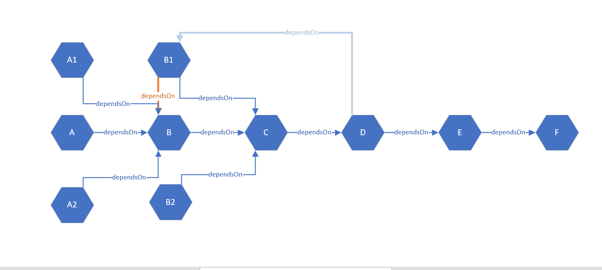

# 循环依赖源码解析
> 重要属性：
> dependentBeanMap: 注册依赖关系，bean 被依赖的对象
> dependenciesForBeanMap：注册依赖关系,bean 依赖的对象
>
## 循环依赖判断流程
```java
final RootBeanDefinition mbd = getMergedLocalBeanDefinition(beanName);
checkMergedBeanDefinition(mbd, beanName, args);

// Guarantee initialization of beans that the current bean depends on.
String[] dependsOn = mbd.getDependsOn();
if (dependsOn != null) {
    for (String dep : dependsOn) {
        // 判断是否存在循环依赖
        if (isDependent(beanName, dep)) {
            throw new BeanCreationException(mbd.getResourceDescription(), beanName,
                    "Circular depends-on relationship between '" + beanName + "' and '" + dep + "'");
        }
        // 注册依赖关系
        registerDependentBean(dep, beanName);
        try {
            getBean(dep);
        }
        catch (NoSuchBeanDefinitionException ex) {
            throw new BeanCreationException(mbd.getResourceDescription(), beanName,
                    "'" + beanName + "' depends on missing bean '" + dep + "'", ex);
        }
    }
}
```

## 关键方法--registerDependentBean
> **注册依赖关系**
```java
// dependentBeanName dependsOn beanName
// beanName:被依赖项
// dependentBeanName:
public void registerDependentBean(String beanName, String dependentBeanName) {
    String canonicalName = canonicalName(beanName);
    // 向beanName对应的set中注册，表示dependentBeanName依赖过beanName
    synchronized (this.dependentBeanMap) {
        Set<String> dependentBeans =
                this.dependentBeanMap.computeIfAbsent(canonicalName, k -> new LinkedHashSet<>(8));
        if (!dependentBeans.add(dependentBeanName)) {
            // 如果添加失败，表示之前注册过，跳过后续流程
            return;
        }
    }
    synchronized (this.dependenciesForBeanMap) {
        Set<String> dependenciesForBean =
                this.dependenciesForBeanMap.computeIfAbsent(dependentBeanName, k -> new LinkedHashSet<>(8));
        dependenciesForBean.add(canonicalName);
    }
}
```

## 关键方法--isDependent
> **判断是否存在循环依赖**
```java
// beanName依赖，dependentBeanName被依赖的beanName
protected boolean isDependent(String beanName, String dependentBeanName) {
    synchronized (this.dependentBeanMap) {
        return isDependent(beanName, dependentBeanName, null);
    }
}
// 此方法判断的是dependentBeanName 是否依赖过 beanName，alreadySeen中存放的是已判断过的bean，无需重复判断
private boolean isDependent(String beanName, String dependentBeanName, @Nullable Set<String> alreadySeen) {
    if (alreadySeen != null && alreadySeen.contains(beanName)) {
        return false;
    }
    // 获取初始beanName
    String canonicalName = canonicalName(beanName);
    // 获取曾经依赖beanName的bean
    Set<String> dependentBeans = this.dependentBeanMap.get(canonicalName);
    if (dependentBeans == null) {
        return false;
    }
    // 如果存在则表示存在循环依赖
    if (dependentBeans.contains(dependentBeanName)) {
        return true;
    }
    // 遍历判断之前依赖beanName的bean，并将当前判断无误的beanName放入alreadySeen中
    for (String transitiveDependency : dependentBeans) {
        if (alreadySeen == null) {
            alreadySeen = new HashSet<>();
        }
        alreadySeen.add(beanName);
        // 递归向前判断 是否产生循环依赖
        if (isDependent(transitiveDependency, dependentBeanName, alreadySeen)) {
            return true;
        }
    }
    return false;
}
```

### 图解判断
> 假设此时存在的依赖关系 A->B->C->D->E->F,A1->B,A2->B,B1->C,B2->C
> dependentBeanMap中C的set=[B,B1,B2]
> dependentBeanMap中B的set=[A,A1,A2]
> 此时，我们讨论C->D的关系是否可能导致循环依赖
> 
> 我们显而易见的是只要判断依赖C的项([B,B1,B2])中是否包含D，再往前递归到依赖[B,B1,B2]的项中是否包含D...
> 递归完成后，我们就可以得出是否存在循环依赖
> 
> alreadySeen：该属性的作用，在于保存已判断不存在循环依赖的beanName
> 假设我们增加一项依赖关系B1->B，此时dependentBeanMap中B的set=[A,A1,A2,B1]
> 如果我们没有alreadySeen参数，意味着我们要重复判断B1
> 1. 判断C时，遍历set[B,B1,B2],第一次判断B1
> 2. 判断B时，遍历set[A,A1,A2,B1],第二次判断B1
> 

