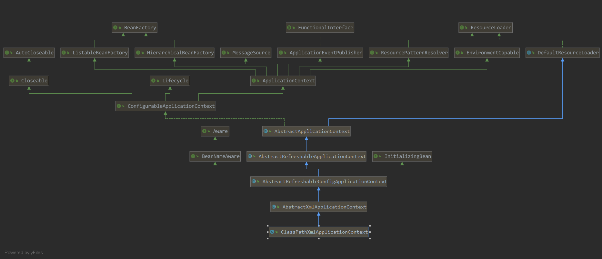
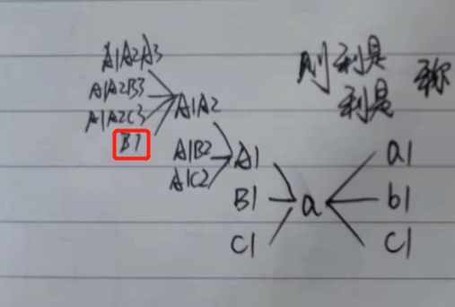

# xml启动流程再分析
ClassPathXmlApplicationContext



## 启动流程

### ClassPathXmlApplicationContext构造器
```java
public ClassPathXmlApplicationContext(
        String[] configLocations, boolean refresh, @Nullable ApplicationContext parent)
        throws BeansException {
    // 调用父级构造器，此时会创建默认的资源解析器(PathMatchingResourcePatternResolver)，以及如果有父级ApplicationContext的时候，并且Environment如果时ConfigurableEnvironment的话，会进行Environment合并
    super(parent);
    // 设置配置文件configLocations
    setConfigLocations(configLocations);
    if (refresh) {
        refresh();
    }
}

public AbstractApplicationContext(@Nullable ApplicationContext parent) {
    // 此处是会创建默认的资源规则解析器
    this();
    setParent(parent);
}
// 资源规则解析器
public AbstractApplicationContext() {
    this.resourcePatternResolver = getResourcePatternResolver();
}
// 设置父级ApplicationContext，并合并Environment
public void setParent(@Nullable ApplicationContext parent) {
    this.parent = parent;
    if (parent != null) {
        Environment parentEnvironment = parent.getEnvironment();
        if (parentEnvironment instanceof ConfigurableEnvironment) {
            getEnvironment().merge((ConfigurableEnvironment) parentEnvironment);
        }
    }
}

// 设置配置文件
public void setConfigLocations(@Nullable String... locations) {
    if (locations != null) {
        Assert.noNullElements(locations, "Config locations must not be null");
        this.configLocations = new String[locations.length];
        for (int i = 0; i < locations.length; i++) {
            // 解析路径时会获取Environment，此时会进行初始化Environment，并创建默认的路径解析器(PropertySourcesPropertyResolver)，然后进行路径解析
            this.configLocations[i] = resolvePath(locations[i]).trim();
        }
    }
    else {
        this.configLocations = null;
    }
}
```

### refresh(启动spring容器)
```java
public void refresh() throws BeansException, IllegalStateException {
    synchronized (this.startupShutdownMonitor) {
        StartupStep contextRefresh = this.applicationStartup.start("spring.context.refresh");

        // Prepare this context for refreshing.
        prepareRefresh();

        // Tell the subclass to refresh the internal bean factory.
        ConfigurableListableBeanFactory beanFactory = obtainFreshBeanFactory();

        // Prepare the bean factory for use in this context.
        prepareBeanFactory(beanFactory);

        try {
            // Allows post-processing of the bean factory in context subclasses.
            postProcessBeanFactory(beanFactory);

            StartupStep beanPostProcess = this.applicationStartup.start("spring.context.beans.post-process");
            // Invoke factory processors registered as beans in the context.
            invokeBeanFactoryPostProcessors(beanFactory);

            // Register bean processors that intercept bean creation.
            registerBeanPostProcessors(beanFactory);
            beanPostProcess.end();

            // Initialize message source for this context.
            initMessageSource();

            // Initialize event multicaster for this context.
            initApplicationEventMulticaster();

            // Initialize other special beans in specific context subclasses.
            onRefresh();

            // Check for listener beans and register them.
            registerListeners();

            // Instantiate all remaining (non-lazy-init) singletons.
            finishBeanFactoryInitialization(beanFactory);

            // Last step: publish corresponding event.
            finishRefresh();
        }

        catch (BeansException ex) {
            if (logger.isWarnEnabled()) {
                logger.warn("Exception encountered during context initialization - " +
                        "cancelling refresh attempt: " + ex);
            }

            // Destroy already created singletons to avoid dangling resources.
            destroyBeans();

            // Reset 'active' flag.
            cancelRefresh(ex);

            // Propagate exception to caller.
            throw ex;
        }

        finally {
            // Reset common introspection caches in Spring's core, since we
            // might not ever need metadata for singleton beans anymore...
            resetCommonCaches();
            contextRefresh.end();
        }
    }
}
```
1. prepareRefresh：为spring启动，做一些准备工作，设置启动标志位，初始化部分监听器，校验Environment
2. obtainFreshBeanFactory
3. prepareBeanFactory：
    1. 设置BeanFactory的类加载器
    2. 添加属性编辑器注册器
    3. 添加BeanPostProcessor(ApplicationContextAwareProcessor),该BeanPostProcessor的作用是用于处理实现相关Aware接口的bean
    4. 设置忽略依赖的Aware接口
    5. 注册BeanFactory以及其他启动类继承实现的接口到BeanFactory中的resolvableDependencies
    6. 注册部分系统环境bean
4. postProcessBeanFactory：交由子类拓展：允许在上下文子类中对bean工厂进行后处理。
5. invokeBeanFactoryPostProcessors：
    1. 判断beanFactory是否为BeanDefinitionRegistry，如果是的话，则需要把BeanDifinition注册器中的BeanDefinitionRegistryPostProcessor，按照PriorityOrdered，Ordered，普通，全部执行一次。由于BeanDefinitionRegistryPostProcessor可以直接注册BeanDefinition，所以后续需要while循环来处理可能有新增的BeanDefinitionRegistryPostProcessor。BeanDefinitionRegistryPostProcessor是直接继承BeanFactoryPostProcessor的，所以需要执行两类方法postProcessBeanDefinitionRegistry，postProcessBeanFactory
    2. 再将BeanFactory中的BeanFactoryPostProcessor的bean取出来，按照PriorityOrdered，Ordered，普通的顺序执行
6. registerBeanPostProcessors
    1. 注册BeanPostProcessor，用于拓展处理bean初始化前后
    2. ApplicationListenerDetector，在最后会注册一个监听器的探测器，用于添加BeanFactory中的监听器
7. initMessageSource
    国际化，用于处理多语言系统。默认创建DelegatingMessageSource
8. initApplicationEventMulticaster
    初始化事件广播器
9. onRefresh
    在xml体系中，并无拓展
10. registerListeners
    注册监听器，并广播前置事件
11. finishBeanFactoryInitialization
    重点来了，此处是用于创建生成bean
    1. 添加ConversionService，默认的类型转换器
    2. 添加StringValueResolver，用于处理@Value以及相关注解的关联配置文件
    3. LoadTimeWeaverAware
    4. 取消临时类加载器
    5. 冻结加载BeanDefinition配置，允许缓存所有bean定义的元数据，但不再更改
    6. 实例化sigleton且非懒加载的bean
12. finishRefresh

## 细节分析
### CreateBean细节分析

#### 1. dependsOn的循环依赖问题
    关于循环依赖的问题，我们需要关注两个重要属性
    假定 a dependsOn A，即a依赖A
    1. Map<String, Set<String>> dependentBeanMap：被依赖关系存储器，key = A,value = a的Set集合
    2. Map<String, Set<String>> dependenciesForBeanMap：依赖关系存储器，key = a,value = A的Set集合
    
    进入doGetBean方法中的代码片段如下
```java
// 获取BeanDefinition的依赖项
String[] dependsOn = mbd.getDependsOn();
if (dependsOn != null) {
    // 再依次判断是否存在循环依赖
    for (String dep : dependsOn) {
        if (isDependent(beanName, dep)) {
            throw new BeanCreationException(mbd.getResourceDescription(), beanName,
                    "Circular depends-on relationship between '" + beanName + "' and '" + dep + "'");
        }
        // 如不存在循环依赖，则添加依赖关系
        registerDependentBean(dep, beanName);
        try {
            // 创建依赖Bean
            getBean(dep);
        }
        catch (NoSuchBeanDefinitionException ex) {
            throw new BeanCreationException(mbd.getResourceDescription(), beanName,
                    "'" + beanName + "' depends on missing bean '" + dep + "'", ex);
        }
    }
}

// 判断是否存在循环依赖
protected boolean isDependent(String beanName, String dependentBeanName) {
    synchronized (this.dependentBeanMap) {
        return isDependent(beanName, dependentBeanName, null);
    }
}

// 判断是否存在循环依赖
// 重点如下
private boolean isDependent(String beanName, String dependentBeanName, @Nullable Set<String> alreadySeen) {
    // 用于过滤已判定不存在循环依赖的bean
    if (alreadySeen != null && alreadySeen.contains(beanName)) {
        return false;
    }
    // 获取规范的实际name
    String canonicalName = canonicalName(beanName);
    // 从被依赖关系存储器中，获取依赖canonicalName的beanName集合
    Set<String> dependentBeans = this.dependentBeanMap.get(canonicalName);
    if (dependentBeans == null) {
        return false;
    }
    // 如果集合中存在，则说明存在循环依赖问题
    if (dependentBeans.contains(dependentBeanName)) {
        return true;
    }
    // 依赖项中也可能存在依赖关系，所以此时需要遍历递归检测
    for (String transitiveDependency : dependentBeans) {
        // 添加已判定bean
        if (alreadySeen == null) {
            alreadySeen = new HashSet<>();
        }
        alreadySeen.add(beanName);
        // 递归检测
        if (isDependent(transitiveDependency, dependentBeanName, alreadySeen)) {
            return true;
        }
    }
    return false;
}

// 注册依赖关系
public void registerDependentBean(String beanName, String dependentBeanName) {
    String canonicalName = canonicalName(beanName);
    // 注册被依赖关系
    synchronized (this.dependentBeanMap) {
        Set<String> dependentBeans =
                this.dependentBeanMap.computeIfAbsent(canonicalName, k -> new LinkedHashSet<>(8));
        if (!dependentBeans.add(dependentBeanName)) {
            return;
        }
    }
    // 注册依赖关系
    synchronized (this.dependenciesForBeanMap) {
        Set<String> dependenciesForBean =
                this.dependenciesForBeanMap.computeIfAbsent(dependentBeanName, k -> new LinkedHashSet<>(8));
        dependenciesForBean.add(canonicalName);
    }
}
```
    循环依赖的AlreadySeen的问题

#### 2. 循环引用问题
#### 3. BeanPostProcessor的相关问题
#### 4. 属性注入的问题
#### 5. bean初始化问题
#### 6. Bean生命周期问题

## 疑点注释

### 标签解析

    lockup-method：用于替换方法返回bean

    replace-method：用于替换方法实现，需要实现接口MethodReplacer

### 属性解析

    singletonObjects:Map<String, Object> singletonObjects,缓存单例名称及实例
    singletonFactories:Map<String, ObjectFactory<?>> singletonFactories,缓存单例名称及单例工厂
    earlySingletonObjects:Map<String, Object> earlySingletonObjects,缓存早期的单例实例
    registeredSingletons:Set<String> registeredSingletons,已注册的单例名称集合

    singletonsCurrentlyInDestruction：指示当前的singleton是否处于销毁状态
    inCreationCheckExclusions:Set<String> inCreationCheckExclusions,存储排除创建检测的singleton beanName
    singletonsCurrentlyInCreation:Set<String> singletonsCurrentlyInCreation,存储正在创建的singleton beanName

    factoryBeanInstanceCache

    currentlyCreatedBean

### 方法解析

    obtainFromSupplier

    instantiateUsingFactoryMethod

    getAutowireCandidateResolver().getSuggestedValue(descriptor)
    用于处理@Value注解
    
### 类解析

    ObjectFactory,ObjectProvider,FactoryBean,Supplier

    BeanPostProcessor
    spring中默认创建的有：
    1. ApplicationContextAwareProcessor
    2. ApplicationListenerDetector
    3. LoadTimeWeaverAwareProcessor


### 注解解析

    AnnotationTypeMapping

    这是由于@AliasFor的作用，可使不同或相同注解的不同属性作用相同，AnnotationTypeMapping即用于支持@AliasFor
```java
public @interface ContextConfiguration {
  
    @AliasFor("locations")
    String[] value() default {};
  
    @AliasFor("value")
    String[] locations() default {};
  
    // ...
}

@ContextConfiguration
public @interface MyTestConfig {
  
   @AliasFor(annotation = ContextConfiguration.class, attribute = "locations")
   String[] value() default {};
  
   @AliasFor(annotation = ContextConfiguration.class, attribute = "locations")
   String[] groovyScripts() default {};
  
   @AliasFor(annotation = ContextConfiguration.class, attribute = "locations")
   String[] xmlFiles() default {};
}
```

### 泛型解析

    BridgeMethod问题
    由于java的泛型存在类型擦除的问题，所以对于给定的类型的某一泛型方法，其实会存在两个method
```java
public interface BridgeFather<T> {

    T test(T param);
}

public class BridgeSon implements BridgeFather<String> {

    @Override
    public String test(String param) {
        return param;
    }

    public static void main(String[] args) {
        BridgeFather father = new BridgeSon();
        for (Method declaredMethod : father.getClass().getDeclaredMethods()) {
            System.out.println(declaredMethod.getName() + ",isBridge=" +
                    declaredMethod.isBridge() + ",isSynthetic=" + declaredMethod.isSynthetic());
            for (Class<?> parameterType : declaredMethod.getParameterTypes()) {
                System.out.println("parameterType=" + parameterType.getTypeName());
            }
            System.out.println();
        }
        System.out.println(father.test("a"));
        System.out.println(father.test(new Object()));
    }
    // 以上代码编译器不报错
    // 结果输出：
    // main,isBridge=false,isSynthetic=false
    // parameterType=java.lang.String[]

    // test,isBridge=false,isSynthetic=false
    // parameterType=java.lang.String

    // test,isBridge=true,isSynthetic=true
    // parameterType=java.lang.Object

    // a
    // Exception in thread "main" java.lang.ClassCastException: java.lang.Object cannot be cast to java.lang.String
    // 	at com.xiaohe.springbootstudy.bridge.BridgeSon.test(BridgeSon.java:15)
    // 	at com.xiaohe.springbootstudy.bridge.BridgeSon.main(BridgeSon.java:33)
}
```
    在上面示例中，我们可以看到，test方法生成了两个，一个参数为Object的BridgeMethod，一个参数String的正常方法。这就是由于类型擦除而产生的问题所在。
    而且在test(Object)时，编译器不会报错，但是执行时，出现类型转换错误，这也是类型擦除后，编译器无法校验
    后续还有synthetic问题