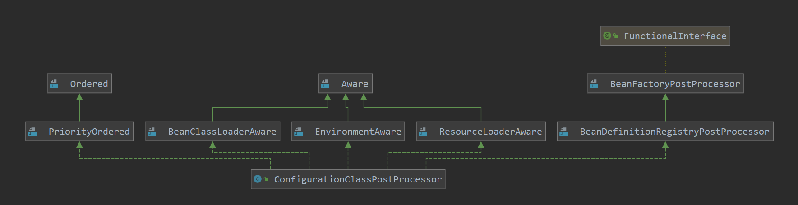

# ConfigurationClassPostProcessor源码分析

ConfigurationClassPostProcessor继承关系图


由此可以看出 ConfigurationClassPostProcessor 实现了接口BeanDefinitionRegistryPostProcessor，而BeanDefinitionRegistryPostProcessor接口继承于BeanFactoryPostProcessor接口。

> @Import 注解用于引入其他配置类
> @ImportResource 注解用于引入其他的类配置文件
> ImportBeanDefinitionRegistrar 用于手动注册 BeanDefinition 。此类只能由 @Import 驱动

## BeanDefinitionRegistryPostProcessor
BeanDefinitionRegistryPostProcessor接口执行的时机在ApplicationContext类的invokeBeanFactoryPostProcessors方法中
```java
    protected void invokeBeanFactoryPostProcessors(ConfigurableListableBeanFactory beanFactory) {
		PostProcessorRegistrationDelegate.invokeBeanFactoryPostProcessors(beanFactory, getBeanFactoryPostProcessors());

		// Detect a LoadTimeWeaver and prepare for weaving, if found in the meantime
		// (e.g. through an @Bean method registered by ConfigurationClassPostProcessor)
		if (beanFactory.getTempClassLoader() == null && beanFactory.containsBean(LOAD_TIME_WEAVER_BEAN_NAME)) {
			beanFactory.addBeanPostProcessor(new LoadTimeWeaverAwareProcessor(beanFactory));
			beanFactory.setTempClassLoader(new ContextTypeMatchClassLoader(beanFactory.getBeanClassLoader()));
		}
	}

    public static void invokeBeanFactoryPostProcessors(
			ConfigurableListableBeanFactory beanFactory, List<BeanFactoryPostProcessor> beanFactoryPostProcessors) {

		// Invoke BeanDefinitionRegistryPostProcessors first, if any.
		Set<String> processedBeans = new HashSet<>();
        // 因为AnnotationConfigApplicationContext继承了GenericApplicationContext,而GenericApplicationContext实现了BeanDefinitionRegistry
		if (beanFactory instanceof BeanDefinitionRegistry) {
			BeanDefinitionRegistry registry = (BeanDefinitionRegistry) beanFactory;
			List<BeanFactoryPostProcessor> regularPostProcessors = new ArrayList<>();
			List<BeanDefinitionRegistryPostProcessor> registryProcessors = new ArrayList<>();

			for (BeanFactoryPostProcessor postProcessor : beanFactoryPostProcessors) {
                // 此时如果postProcessor，则会执行 postProcessBeanDefinitionRegistry
				if (postProcessor instanceof BeanDefinitionRegistryPostProcessor) {
					BeanDefinitionRegistryPostProcessor registryProcessor =
							(BeanDefinitionRegistryPostProcessor) postProcessor;
					registryProcessor.postProcessBeanDefinitionRegistry(registry);
					registryProcessors.add(registryProcessor);
				}
				else {
					regularPostProcessors.add(postProcessor);
				}
			}

			// Do not initialize FactoryBeans here: We need to leave all regular beans
			// uninitialized to let the bean factory post-processors apply to them!
			// Separate between BeanDefinitionRegistryPostProcessors that implement
			// PriorityOrdered, Ordered, and the rest.
			List<BeanDefinitionRegistryPostProcessor> currentRegistryProcessors = new ArrayList<>();

			// First, invoke the BeanDefinitionRegistryPostProcessors that implement PriorityOrdered.
			String[] postProcessorNames =
					beanFactory.getBeanNamesForType(BeanDefinitionRegistryPostProcessor.class, true, false);
			for (String ppName : postProcessorNames) {
				if (beanFactory.isTypeMatch(ppName, PriorityOrdered.class)) {
					currentRegistryProcessors.add(beanFactory.getBean(ppName, BeanDefinitionRegistryPostProcessor.class));
					processedBeans.add(ppName);
				}
			}
			sortPostProcessors(currentRegistryProcessors, beanFactory);
			registryProcessors.addAll(currentRegistryProcessors);
			invokeBeanDefinitionRegistryPostProcessors(currentRegistryProcessors, registry);
			currentRegistryProcessors.clear();

			// Next, invoke the BeanDefinitionRegistryPostProcessors that implement Ordered.
			postProcessorNames = beanFactory.getBeanNamesForType(BeanDefinitionRegistryPostProcessor.class, true, false);
			for (String ppName : postProcessorNames) {
				if (!processedBeans.contains(ppName) && beanFactory.isTypeMatch(ppName, Ordered.class)) {
					currentRegistryProcessors.add(beanFactory.getBean(ppName, BeanDefinitionRegistryPostProcessor.class));
					processedBeans.add(ppName);
				}
			}
			sortPostProcessors(currentRegistryProcessors, beanFactory);
			registryProcessors.addAll(currentRegistryProcessors);
			invokeBeanDefinitionRegistryPostProcessors(currentRegistryProcessors, registry);
			currentRegistryProcessors.clear();

			// Finally, invoke all other BeanDefinitionRegistryPostProcessors until no further ones appear.
			boolean reiterate = true;
			while (reiterate) {
				reiterate = false;
				postProcessorNames = beanFactory.getBeanNamesForType(BeanDefinitionRegistryPostProcessor.class, true, false);
				for (String ppName : postProcessorNames) {
					if (!processedBeans.contains(ppName)) {
						currentRegistryProcessors.add(beanFactory.getBean(ppName, BeanDefinitionRegistryPostProcessor.class));
						processedBeans.add(ppName);
						reiterate = true;
					}
				}
				sortPostProcessors(currentRegistryProcessors, beanFactory);
				registryProcessors.addAll(currentRegistryProcessors);
				invokeBeanDefinitionRegistryPostProcessors(currentRegistryProcessors, registry);
				currentRegistryProcessors.clear();
			}

			// Now, invoke the postProcessBeanFactory callback of all processors handled so far.
            // 再执行 BeanFactoryPostProcessor 接口的方法
			invokeBeanFactoryPostProcessors(registryProcessors, beanFactory);
			invokeBeanFactoryPostProcessors(regularPostProcessors, beanFactory);
		}

		else {
			// Invoke factory processors registered with the context instance.
			invokeBeanFactoryPostProcessors(beanFactoryPostProcessors, beanFactory);
		}

		// Do not initialize FactoryBeans here: We need to leave all regular beans
		// uninitialized to let the bean factory post-processors apply to them!
		String[] postProcessorNames =
				beanFactory.getBeanNamesForType(BeanFactoryPostProcessor.class, true, false);

		// Separate between BeanFactoryPostProcessors that implement PriorityOrdered,
		// Ordered, and the rest.
		List<BeanFactoryPostProcessor> priorityOrderedPostProcessors = new ArrayList<>();
		List<String> orderedPostProcessorNames = new ArrayList<>();
		List<String> nonOrderedPostProcessorNames = new ArrayList<>();
		for (String ppName : postProcessorNames) {
			if (processedBeans.contains(ppName)) {
				// skip - already processed in first phase above
			}
			else if (beanFactory.isTypeMatch(ppName, PriorityOrdered.class)) {
				priorityOrderedPostProcessors.add(beanFactory.getBean(ppName, BeanFactoryPostProcessor.class));
			}
			else if (beanFactory.isTypeMatch(ppName, Ordered.class)) {
				orderedPostProcessorNames.add(ppName);
			}
			else {
				nonOrderedPostProcessorNames.add(ppName);
			}
		}

		// First, invoke the BeanFactoryPostProcessors that implement PriorityOrdered.
		sortPostProcessors(priorityOrderedPostProcessors, beanFactory);
		invokeBeanFactoryPostProcessors(priorityOrderedPostProcessors, beanFactory);

		// Next, invoke the BeanFactoryPostProcessors that implement Ordered.
		List<BeanFactoryPostProcessor> orderedPostProcessors = new ArrayList<>(orderedPostProcessorNames.size());
		for (String postProcessorName : orderedPostProcessorNames) {
			orderedPostProcessors.add(beanFactory.getBean(postProcessorName, BeanFactoryPostProcessor.class));
		}
		sortPostProcessors(orderedPostProcessors, beanFactory);
		invokeBeanFactoryPostProcessors(orderedPostProcessors, beanFactory);

		// Finally, invoke all other BeanFactoryPostProcessors.
		List<BeanFactoryPostProcessor> nonOrderedPostProcessors = new ArrayList<>(nonOrderedPostProcessorNames.size());
		for (String postProcessorName : nonOrderedPostProcessorNames) {
			nonOrderedPostProcessors.add(beanFactory.getBean(postProcessorName, BeanFactoryPostProcessor.class));
		}
		invokeBeanFactoryPostProcessors(nonOrderedPostProcessors, beanFactory);

		// Clear cached merged bean definitions since the post-processors might have
		// modified the original metadata, e.g. replacing placeholders in values...
		beanFactory.clearMetadataCache();
	}
``` 

## postProcessBeanDefinitionRegistry 方法
> 此方法的执行目的就是解析配置类@Configuration
```java
    public void postProcessBeanDefinitionRegistry(BeanDefinitionRegistry registry) {
		int registryId = System.identityHashCode(registry);
		if (this.registriesPostProcessed.contains(registryId)) {
			throw new IllegalStateException(
					"postProcessBeanDefinitionRegistry already called on this post-processor against " + registry);
		}
		if (this.factoriesPostProcessed.contains(registryId)) {
			throw new IllegalStateException(
					"postProcessBeanFactory already called on this post-processor against " + registry);
		}
		this.registriesPostProcessed.add(registryId);

		processConfigBeanDefinitions(registry);
	}
    // 此方法就是解析配置类的主要流程
    public void processConfigBeanDefinitions(BeanDefinitionRegistry registry) {
		List<BeanDefinitionHolder> configCandidates = new ArrayList<>();
        // 此时ApplicationContext已经解析了部分类的BeanDefinition
		String[] candidateNames = registry.getBeanDefinitionNames();

		for (String beanName : candidateNames) {
			BeanDefinition beanDef = registry.getBeanDefinition(beanName);
			if (beanDef.getAttribute(ConfigurationClassUtils.CONFIGURATION_CLASS_ATTRIBUTE) != null) {
				if (logger.isDebugEnabled()) {
					logger.debug("Bean definition has already been processed as a configuration class: " + beanDef);
				}
			}
			else if (ConfigurationClassUtils.checkConfigurationClassCandidate(beanDef, this.metadataReaderFactory)) {
                // 此处是判断是否为配置类
				configCandidates.add(new BeanDefinitionHolder(beanDef, beanName));
			}
		}
        // 如果配置类为空，直接返回
		// Return immediately if no @Configuration classes were found
		if (configCandidates.isEmpty()) {
			return;
		}
        // 进行排序
		// Sort by previously determined @Order value, if applicable
		configCandidates.sort((bd1, bd2) -> {
			int i1 = ConfigurationClassUtils.getOrder(bd1.getBeanDefinition());
			int i2 = ConfigurationClassUtils.getOrder(bd2.getBeanDefinition());
			return Integer.compare(i1, i2);
		});

		// Detect any custom bean name generation strategy supplied through the enclosing application context
		SingletonBeanRegistry sbr = null;
		if (registry instanceof SingletonBeanRegistry) {
			sbr = (SingletonBeanRegistry) registry;
			if (!this.localBeanNameGeneratorSet) {
				BeanNameGenerator generator = (BeanNameGenerator) sbr.getSingleton(
						AnnotationConfigUtils.CONFIGURATION_BEAN_NAME_GENERATOR);
				if (generator != null) {
					this.componentScanBeanNameGenerator = generator;
					this.importBeanNameGenerator = generator;
				}
			}
		}

		if (this.environment == null) {
        // 设置默认环境
			this.environment = new StandardEnvironment();
		}
        // @Configuration解析类
		// Parse each @Configuration class
		ConfigurationClassParser parser = new ConfigurationClassParser(
				this.metadataReaderFactory, this.problemReporter, this.environment,
				this.resourceLoader, this.componentScanBeanNameGenerator, registry);

		Set<BeanDefinitionHolder> candidates = new LinkedHashSet<>(configCandidates);
		Set<ConfigurationClass> alreadyParsed = new HashSet<>(configCandidates.size());
		// 此处do-while循环是用于 处理 新 增加的类中如果 也包含 配置类，也要再进行 解析
		do {
			// 解析配置类
			parser.parse(candidates);
			// 由于spring中@Configuration中的 proxyBeanMethods 默认为true，表示默认使用代理 ，所以此处要进行校验，是否可以使用代理（CGLIB），即会判断是否为final方法，static方法，已经是否可以 覆盖
			parser.validate();

			Set<ConfigurationClass> configClasses = new LinkedHashSet<>(parser.getConfigurationClasses());
			configClasses.removeAll(alreadyParsed);

			// Read the model and create bean definitions based on its content
			if (this.reader == null) {
				this.reader = new ConfigurationClassBeanDefinitionReader(
						registry, this.sourceExtractor, this.resourceLoader, this.environment,
						this.importBeanNameGenerator, parser.getImportRegistry());
			}
			// 正式加载
			this.reader.loadBeanDefinitions(configClasses);
			alreadyParsed.addAll(configClasses);

			candidates.clear();
			if (registry.getBeanDefinitionCount() > candidateNames.length) {
				String[] newCandidateNames = registry.getBeanDefinitionNames();
				Set<String> oldCandidateNames = new HashSet<>(Arrays.asList(candidateNames));
				Set<String> alreadyParsedClasses = new HashSet<>();
				for (ConfigurationClass configurationClass : alreadyParsed) {
					alreadyParsedClasses.add(configurationClass.getMetadata().getClassName());
				}
				for (String candidateName : newCandidateNames) {
					if (!oldCandidateNames.contains(candidateName)) {
						BeanDefinition bd = registry.getBeanDefinition(candidateName);
						// 添加 未解析的 配置类@Configuration
						if (ConfigurationClassUtils.checkConfigurationClassCandidate(bd, this.metadataReaderFactory) &&
								!alreadyParsedClasses.contains(bd.getBeanClassName())) {
							candidates.add(new BeanDefinitionHolder(bd, candidateName));
						}
					}
				}
				candidateNames = newCandidateNames;
			}
		}
		while (!candidates.isEmpty());

		// Register the ImportRegistry as a bean in order to support ImportAware @Configuration classes
		// 如果 registry 是 SignletonBeanRegistry ，注册 配置类 Bean
		if (sbr != null && !sbr.containsSingleton(IMPORT_REGISTRY_BEAN_NAME)) {
			sbr.registerSingleton(IMPORT_REGISTRY_BEAN_NAME, parser.getImportRegistry());
		}

		if (this.metadataReaderFactory instanceof CachingMetadataReaderFactory) {
			// Clear cache in externally provided MetadataReaderFactory; this is a no-op
			// for a shared cache since it'll be cleared by the ApplicationContext.
			((CachingMetadataReaderFactory) this.metadataReaderFactory).clearCache();
		}
	}
```

## ConfigurationClassParser.parse
```java
    private static final Predicate<String> DEFAULT_EXCLUSION_FILTER = className ->
                (className.startsWith("java.lang.annotation.") || className.startsWith("org.springframework.stereotype."));
    public void parse(Set<BeanDefinitionHolder> configCandidates) {
		for (BeanDefinitionHolder holder : configCandidates) {
			BeanDefinition bd = holder.getBeanDefinition();
			try {
				if (bd instanceof AnnotatedBeanDefinition) {
                    // 现在主要关注下注解BeanDefinition实现
					parse(((AnnotatedBeanDefinition) bd).getMetadata(), holder.getBeanName());
				}
				else if (bd instanceof AbstractBeanDefinition && ((AbstractBeanDefinition) bd).hasBeanClass()) {
					parse(((AbstractBeanDefinition) bd).getBeanClass(), holder.getBeanName());
				}
				else {
					parse(bd.getBeanClassName(), holder.getBeanName());
				}
			}
			catch (BeanDefinitionStoreException ex) {
				throw ex;
			}
			catch (Throwable ex) {
				throw new BeanDefinitionStoreException(
						"Failed to parse configuration class [" + bd.getBeanClassName() + "]", ex);
			}
		}

		this.deferredImportSelectorHandler.process();
	}

    protected final void parse(AnnotationMetadata metadata, String beanName) throws IOException {
		processConfigurationClass(new ConfigurationClass(metadata, beanName), DEFAULT_EXCLUSION_FILTER);
	}

    protected void processConfigurationClass(ConfigurationClass configClass, Predicate<String> filter) throws IOException {
        // shouldSkip 方法主要用于判断类是否标注了@Conditional ，如果有则表示有条件Condition需要判断，如果不满足，则直接return了
		if (this.conditionEvaluator.shouldSkip(configClass.getMetadata(), ConfigurationPhase.PARSE_CONFIGURATION)) {
			return;
		}
        // 暂时未完全理解
		// 判断 配置类 是否 被重复解析
		// ConfigurationClass 类的 hashCode，equals方法是对 类名称 进行判断
		ConfigurationClass existingClass = this.configurationClasses.get(configClass);
		if (existingClass != null) {
			// isImported方法是判断 !this.importedBy.isEmpty()
			if (configClass.isImported()) {
				// 如果被重复import ，则合并importedBy，然后退出
				if (existingClass.isImported()) {
					existingClass.mergeImportedBy(configClass);
				}
				// Otherwise ignore new imported config class; existing non-imported class overrides it.
				return;
			}
			else {
				// 此时 虽然也是重复 解析，但是没有importedBy，表示，第一次是该类自己的解析数据，并非由其他类进行处理
				// 可能后续的 解析更加准确，所以此时将之前的 保存的数据清除
				// 此处的解释 并未完全 解释我的疑惑，但是大概意思应该是如此的
				// Explicit bean definition found, probably replacing an import.
				// Let's remove the old one and go with the new one.
				this.configurationClasses.remove(configClass);
				this.knownSuperclasses.values().removeIf(configClass::equals);
			}
		}

		// Recursively process the configuration class and its superclass hierarchy.
        // 递归处理 配置类
		// 会从子类向上 一直递归父类
		SourceClass sourceClass = asSourceClass(configClass, filter);
		do {
            // 主要处理流程
			sourceClass = doProcessConfigurationClass(configClass, sourceClass, filter);
		}
		while (sourceClass != null);

		this.configurationClasses.put(configClass, configClass);
	}

    protected final SourceClass doProcessConfigurationClass(
			ConfigurationClass configClass, SourceClass sourceClass, Predicate<String> filter)
			throws IOException {
        // 如果是注解@Component类，则进一步处理内部类
		if (configClass.getMetadata().isAnnotated(Component.class.getName())) {
			// Recursively process any member (nested) classes first
			processMemberClasses(configClass, sourceClass, filter);
		}

		// Process any @PropertySource annotations
        // 处理@PropertySource注解，其作用是用来加载指定的配置文件
		for (AnnotationAttributes propertySource : AnnotationConfigUtils.attributesForRepeatable(
				sourceClass.getMetadata(), PropertySources.class,
				org.springframework.context.annotation.PropertySource.class)) {
			if (this.environment instanceof ConfigurableEnvironment) {
				processPropertySource(propertySource);
			}
			else {
				logger.info("Ignoring @PropertySource annotation on [" + sourceClass.getMetadata().getClassName() +
						"]. Reason: Environment must implement ConfigurableEnvironment");
			}
		}
        // 此处用于处理@ComponentScan扫描包
		// Process any @ComponentScan annotations
        // 获取注解@ComponentScan的内容
		Set<AnnotationAttributes> componentScans = AnnotationConfigUtils.attributesForRepeatable(
				sourceClass.getMetadata(), ComponentScans.class, ComponentScan.class);
		if (!componentScans.isEmpty() &&
				!this.conditionEvaluator.shouldSkip(sourceClass.getMetadata(), ConfigurationPhase.REGISTER_BEAN)) {
			for (AnnotationAttributes componentScan : componentScans) {
				// The config class is annotated with @ComponentScan -> perform the scan immediately
                // 解析指定路径下的bean生成BeanDefinition
				Set<BeanDefinitionHolder> scannedBeanDefinitions =
						this.componentScanParser.parse(componentScan, sourceClass.getMetadata().getClassName());
				// Check the set of scanned definitions for any further config classes and parse recursively if needed
				for (BeanDefinitionHolder holder : scannedBeanDefinitions) {
					BeanDefinition bdCand = holder.getBeanDefinition().getOriginatingBeanDefinition();
					if (bdCand == null) {
						bdCand = holder.getBeanDefinition();
					}
                    // 判断扫描出来的类是否包含配置类@Configuration注解，有的话则再次进行解析
					if (ConfigurationClassUtils.checkConfigurationClassCandidate(bdCand, this.metadataReaderFactory)) {
						parse(bdCand.getBeanClassName(), holder.getBeanName());
					}
				}
			}
		}
        // 处理@Import注解
		// Process any @Import annotations
		processImports(configClass, sourceClass, getImports(sourceClass), filter, true);

        // 处理@ImportResource注解
		// Process any @ImportResource annotations
		AnnotationAttributes importResource =
				AnnotationConfigUtils.attributesFor(sourceClass.getMetadata(), ImportResource.class);
		if (importResource != null) {
			String[] resources = importResource.getStringArray("locations");
			Class<? extends BeanDefinitionReader> readerClass = importResource.getClass("reader");
			for (String resource : resources) {
				String resolvedResource = this.environment.resolveRequiredPlaceholders(resource);
				// @ImportResourcet 只是在这里 添加，后续在上层流程中会进行解析
				configClass.addImportedResource(resolvedResource, readerClass);
			}
		}
        // 处理@Bean注解，此时并不会生成bean的BeanDefinition，会在上层方法的loadBeanDefinitions方法中进行加载
		// Process individual @Bean methods
		Set<MethodMetadata> beanMethods = retrieveBeanMethodMetadata(sourceClass);
		for (MethodMetadata methodMetadata : beanMethods) {
			configClass.addBeanMethod(new BeanMethod(methodMetadata, configClass));
		}

		// Process default methods on interfaces
        // 获取上级接口类信息，判断是否有@Bean注解的方法，因为Java8+之后，接口可以有默认实现
		processInterfaces(configClass, sourceClass);

		// Process superclass, if any
        // 判断是否有父类，有的话返回父类，上层方法会递归进行解析父类
		if (sourceClass.getMetadata().hasSuperClass()) {
			String superclass = sourceClass.getMetadata().getSuperClassName();
			if (superclass != null && !superclass.startsWith("java") &&
					!this.knownSuperclasses.containsKey(superclass)) {
				this.knownSuperclasses.put(superclass, configClass);
				// Superclass found, return its annotation metadata and recurse
				return sourceClass.getSuperClass();
			}
		}

		// No superclass -> processing is complete
		return null;
	}
```


### processMemberClasses
> 处理类中的其他类，即配置类的 内部类，非public类，也会当作配置类进行解析
```java
	private void processMemberClasses(ConfigurationClass configClass, SourceClass sourceClass,
			Predicate<String> filter) throws IOException {
		// 获取该类中所有类（包含内部类，私有类等等，但不包含父类中的类）信息
		Collection<SourceClass> memberClasses = sourceClass.getMemberClasses();
		if (!memberClasses.isEmpty()) {
			List<SourceClass> candidates = new ArrayList<>(memberClasses.size());
			for (SourceClass memberClass : memberClasses) {
				// 判断是否为 配置类
				if (ConfigurationClassUtils.isConfigurationCandidate(memberClass.getMetadata()) &&
						!memberClass.getMetadata().getClassName().equals(configClass.getMetadata().getClassName())) {
					candidates.add(memberClass);
				}
			}
			OrderComparator.sort(candidates);
			for (SourceClass candidate : candidates) {
				// 判断是否 存在 循环import
				if (this.importStack.contains(configClass)) {
					this.problemReporter.error(new CircularImportProblem(configClass, this.importStack));
				}
				else {
					this.importStack.push(configClass);
					try {
						// 如果不存在，就继续处理该 配置类
						processConfigurationClass(candidate.asConfigClass(configClass), filter);
					}
					finally {
						this.importStack.pop();
					}
				}
			}
		}
	}
```

### processPropertySource
> 处理 属性配置文件，即使用注解@PropertySource，可以指定多个配置文件，spring会进行加载
```java
	/**
	 * Process the given <code>@PropertySource</code> annotation metadata.
	 * @param propertySource metadata for the <code>@PropertySource</code> annotation found
	 * @throws IOException if loading a property source failed
	 */
	private void processPropertySource(AnnotationAttributes propertySource) throws IOException {
		String name = propertySource.getString("name");
		if (!StringUtils.hasLength(name)) {
			name = null;
		}
		// 获取指定的配置文件编码格式
		String encoding = propertySource.getString("encoding");
		if (!StringUtils.hasLength(encoding)) {
			encoding = null;
		}
		// 获取配置文件位置
		String[] locations = propertySource.getStringArray("value");
		Assert.isTrue(locations.length > 0, "At least one @PropertySource(value) location is required");
		boolean ignoreResourceNotFound = propertySource.getBoolean("ignoreResourceNotFound");
		// 创建 属性资源工厂类
		Class<? extends PropertySourceFactory> factoryClass = propertySource.getClass("factory");
		PropertySourceFactory factory = (factoryClass == PropertySourceFactory.class ?
				DEFAULT_PROPERTY_SOURCE_FACTORY : BeanUtils.instantiateClass(factoryClass));

		for (String location : locations) {
			try {
				// 使用 环境类 Environment 进行解析该路径下的配置文件
				String resolvedLocation = this.environment.resolveRequiredPlaceholders(location);
				Resource resource = this.resourceLoader.getResource(resolvedLocation);
				// createPropertySource 会进行加载配置文件
				addPropertySource(factory.createPropertySource(name, new EncodedResource(resource, encoding)));
			}
			catch (IllegalArgumentException | FileNotFoundException | UnknownHostException ex) {
				// Placeholders not resolvable or resource not found when trying to open it
				if (ignoreResourceNotFound) {
					if (logger.isInfoEnabled()) {
						logger.info("Properties location [" + location + "] not resolvable: " + ex.getMessage());
					}
				}
				else {
					throw ex;
				}
			}
		}
	}
```

### processImports
> 该方法主要用于处理 @Import 注解
> import导入时，有两个关键 类 ImportSelector，ImportBeanDefinitionRegistrar
> ImportSelector ： 该类用于拓展
> ImportBeanDefinitionRegistrar ： 该类用于直接import
```java
	private void processImports(ConfigurationClass configClass, SourceClass currentSourceClass,
			Collection<SourceClass> importCandidates, Predicate<String> exclusionFilter,
			boolean checkForCircularImports) {

		if (importCandidates.isEmpty()) {
			return;
		}

		if (checkForCircularImports && isChainedImportOnStack(configClass)) {
			this.problemReporter.error(new CircularImportProblem(configClass, this.importStack));
		}
		else {
			this.importStack.push(configClass);
			try {
				for (SourceClass candidate : importCandidates) {
					// 判断import类是否为 ImportSelector 的子类
					if (candidate.isAssignable(ImportSelector.class)) {
						// Candidate class is an ImportSelector -> delegate to it to determine imports
						Class<?> candidateClass = candidate.loadClass();
						ImportSelector selector = ParserStrategyUtils.instantiateClass(candidateClass, ImportSelector.class,
								this.environment, this.resourceLoader, this.registry);
						Predicate<String> selectorFilter = selector.getExclusionFilter();
						if (selectorFilter != null) {
							exclusionFilter = exclusionFilter.or(selectorFilter);
						}
						if (selector instanceof DeferredImportSelector) {
							// 此处暂未考虑，后续再继续 探讨
							this.deferredImportSelectorHandler.handle(configClass, (DeferredImportSelector) selector);
						}
						else {
							// 此时获取 import类的数组，进行递归调用 processImports
							String[] importClassNames = selector.selectImports(currentSourceClass.getMetadata());
							Collection<SourceClass> importSourceClasses = asSourceClasses(importClassNames, exclusionFilter);
							processImports(configClass, currentSourceClass, importSourceClasses, exclusionFilter, false);
						}
					}
					else if (candidate.isAssignable(ImportBeanDefinitionRegistrar.class)) {
						// 判断import类是否为 ImportBeanDefinitionRegistrar 的子类
						// Candidate class is an ImportBeanDefinitionRegistrar ->
						// delegate to it to register additional bean definitions
						Class<?> candidateClass = candidate.loadClass();
						ImportBeanDefinitionRegistrar registrar =
								ParserStrategyUtils.instantiateClass(candidateClass, ImportBeanDefinitionRegistrar.class,
										this.environment, this.resourceLoader, this.registry);
						configClass.addImportBeanDefinitionRegistrar(registrar, currentSourceClass.getMetadata());
					}
					else {
						// 此时表明 该类 是普通类或者配置类，此时可以全部当成 配置类进行处理，因为配置类后续也会进行 类解析，类的创建，初始化等等bean的生成流程
						// Candidate class not an ImportSelector or ImportBeanDefinitionRegistrar ->
						// process it as an @Configuration class
						this.importStack.registerImport(
								currentSourceClass.getMetadata(), candidate.getMetadata().getClassName());
						processConfigurationClass(candidate.asConfigClass(configClass), exclusionFilter);
					}
				}
			}
			catch (BeanDefinitionStoreException ex) {
				throw ex;
			}
			catch (Throwable ex) {
				throw new BeanDefinitionStoreException(
						"Failed to process import candidates for configuration class [" +
						configClass.getMetadata().getClassName() + "]", ex);
			}
			finally {
				this.importStack.pop();
			}
		}
	}


	public interface ImportSelector {

	/**
	 * Select and return the names of which class(es) should be imported based on
	 * the {@link AnnotationMetadata} of the importing @{@link Configuration} class.
	 * @return the class names, or an empty array if none
	 */
	String[] selectImports(AnnotationMetadata importingClassMetadata);

	/**
	 * Return a predicate for excluding classes from the import candidates, to be
	 * transitively applied to all classes found through this selector's imports.
	 * <p>If this predicate returns {@code true} for a given fully-qualified
	 * class name, said class will not be considered as an imported configuration
	 * class, bypassing class file loading as well as metadata introspection.
	 * @return the filter predicate for fully-qualified candidate class names
	 * of transitively imported configuration classes, or {@code null} if none
	 * @since 5.2.4
	 */
	@Nullable
	default Predicate<String> getExclusionFilter() {
		return null;
	}

}
```

### processInterfaces
> 处理 上层的 接口，由于java8之后，接口可以有默认实现，则也可以使用@Bean，所以在此也进行解析
```java
	/**
	 * Register default methods on interfaces implemented by the configuration class.
	 */
	private void processInterfaces(ConfigurationClass configClass, SourceClass sourceClass) throws IOException {
		for (SourceClass ifc : sourceClass.getInterfaces()) {
			Set<MethodMetadata> beanMethods = retrieveBeanMethodMetadata(ifc);
			for (MethodMetadata methodMetadata : beanMethods) {
				if (!methodMetadata.isAbstract()) {
					// A default method or other concrete method on a Java 8+ interface...
					configClass.addBeanMethod(new BeanMethod(methodMetadata, configClass));
				}
			}
			processInterfaces(configClass, ifc);
		}
	}

```

## loadBeanDefinitions
```java
	/**
	 * Read {@code configurationModel}, registering bean definitions
	 * with the registry based on its contents.
	 */
	public void loadBeanDefinitions(Set<ConfigurationClass> configurationModel) {
		TrackedConditionEvaluator trackedConditionEvaluator = new TrackedConditionEvaluator();
		for (ConfigurationClass configClass : configurationModel) {
			loadBeanDefinitionsForConfigurationClass(configClass, trackedConditionEvaluator);
		}
	}

	private void loadBeanDefinitionsForConfigurationClass(
			ConfigurationClass configClass, TrackedConditionEvaluator trackedConditionEvaluator) {

		if (trackedConditionEvaluator.shouldSkip(configClass)) {
			String beanName = configClass.getBeanName();
			if (StringUtils.hasLength(beanName) && this.registry.containsBeanDefinition(beanName)) {
				this.registry.removeBeanDefinition(beanName);
			}
			this.importRegistry.removeImportingClass(configClass.getMetadata().getClassName());
			return;
		}
		// 注册 配置类本身bean
		if (configClass.isImported()) {
			registerBeanDefinitionForImportedConfigurationClass(configClass);
		}
		// 加载 解析BeanMothod，即 解析 @Bean 注解，生成的BeanMethod
		for (BeanMethod beanMethod : configClass.getBeanMethods()) {
			loadBeanDefinitionsForBeanMethod(beanMethod);
		}
		// 加载 ImportedResource 的 BeanDefinition
		loadBeanDefinitionsFromImportedResources(configClass.getImportedResources());
		// 加载 ImportBeanDefinitionRegistry 的 BeanDefinition
		loadBeanDefinitionsFromRegistrars(configClass.getImportBeanDefinitionRegistrars());
	}
```

###  loadBeanDefinitionsForBeanMethod
> 加载 解析BeanMothod（即 解析 @Bean 注解，生成的BeanMethod）
> 注意 由@Configuration 注解 解析的@Bean 生成的 BeanDefinition 是 ConfigurationClassBeanDefinition
```java
	private void loadBeanDefinitionsForBeanMethod(BeanMethod beanMethod) {
		ConfigurationClass configClass = beanMethod.getConfigurationClass();
		MethodMetadata metadata = beanMethod.getMetadata();
		String methodName = metadata.getMethodName();
		// 判断 @Conditional 注解的condition条件
		// Do we need to mark the bean as skipped by its condition?
		if (this.conditionEvaluator.shouldSkip(metadata, ConfigurationPhase.REGISTER_BEAN)) {
			configClass.skippedBeanMethods.add(methodName);
			return;
		}
		if (configClass.skippedBeanMethods.contains(methodName)) {
			return;
		}
		// 获取@Bean注解的属性值
		AnnotationAttributes bean = AnnotationConfigUtils.attributesFor(metadata, Bean.class);
		Assert.state(bean != null, "No @Bean annotation attributes");

		// Consider name and any aliases
		List<String> names = new ArrayList<>(Arrays.asList(bean.getStringArray("name")));
		String beanName = (!names.isEmpty() ? names.remove(0) : methodName);

		// Register aliases even when overridden
		// 注册 别名
		for (String alias : names) {
			this.registry.registerAlias(beanName, alias);
		}
		// 判断是否要覆盖 已存在的 BeanDefinition
		// Has this effectively been overridden before (e.g. via XML)?
		if (isOverriddenByExistingDefinition(beanMethod, beanName)) {
			if (beanName.equals(beanMethod.getConfigurationClass().getBeanName())) {
				throw new BeanDefinitionStoreException(beanMethod.getConfigurationClass().getResource().getDescription(),
						beanName, "Bean name derived from @Bean method '" + beanMethod.getMetadata().getMethodName() +
						"' clashes with bean name for containing configuration class; please make those names unique!");
			}
			return;
		}

		ConfigurationClassBeanDefinition beanDef = new ConfigurationClassBeanDefinition(configClass, metadata);
		beanDef.setResource(configClass.getResource());
		beanDef.setSource(this.sourceExtractor.extractSource(metadata, configClass.getResource()));
		// 判断是否为 static 方法
		if (metadata.isStatic()) {
			// static @Bean method
			// 判断，如果是 StandardAnnotationMetadata ，则设置BeanClass， 如果不是，则设置BeanClassName
			if (configClass.getMetadata() instanceof StandardAnnotationMetadata) {
				beanDef.setBeanClass(((StandardAnnotationMetadata) configClass.getMetadata()).getIntrospectedClass());
			}
			else {
				beanDef.setBeanClassName(configClass.getMetadata().getClassName());
			}
			beanDef.setUniqueFactoryMethodName(methodName);
		}
		else {
			// instance @Bean method
			// 如果是非static 方法，则设置FactoryBeanName，表示由 配置类 生成的
			beanDef.setFactoryBeanName(configClass.getBeanName());
			beanDef.setUniqueFactoryMethodName(methodName);
		}

		if (metadata instanceof StandardMethodMetadata) {
			beanDef.setResolvedFactoryMethod(((StandardMethodMetadata) metadata).getIntrospectedMethod());
		}
		// 设置构造方法 注入
		beanDef.setAutowireMode(AbstractBeanDefinition.AUTOWIRE_CONSTRUCTOR);
		beanDef.setAttribute(org.springframework.beans.factory.annotation.RequiredAnnotationBeanPostProcessor.
				SKIP_REQUIRED_CHECK_ATTRIBUTE, Boolean.TRUE);

		// 处理一些公共的注解 @Lazy ， @Primary ， @DependsOn ， @Role ， @Description
		AnnotationConfigUtils.processCommonDefinitionAnnotations(beanDef, metadata);
		// 获取@Bean注解的注入方式
		Autowire autowire = bean.getEnum("autowire");
		if (autowire.isAutowire()) {
			beanDef.setAutowireMode(autowire.value());
		}
		// 获取@Bean注解的 autowireCandidate
		boolean autowireCandidate = bean.getBoolean("autowireCandidate");
		if (!autowireCandidate) {
			beanDef.setAutowireCandidate(false);
		}
		// 获取@Bean注解的 initMethod
		String initMethodName = bean.getString("initMethod");
		if (StringUtils.hasText(initMethodName)) {
			beanDef.setInitMethodName(initMethodName);
		}
		// 获取@Bean注解的 destroyMethod
		String destroyMethodName = bean.getString("destroyMethod");
		beanDef.setDestroyMethodName(destroyMethodName);

		// Consider scoping
		// 域 代理模式：DEFAULT，NO，INTERFACES(JDK dynamic proxy)，TARGET_CLASS(CGLIB)
		ScopedProxyMode proxyMode = ScopedProxyMode.NO;
		// 获取注解 @Scope 的属性
		AnnotationAttributes attributes = AnnotationConfigUtils.attributesFor(metadata, Scope.class);
		if (attributes != null) {
			beanDef.setScope(attributes.getString("value"));
			proxyMode = attributes.getEnum("proxyMode");
			// 默认值设置为NO
			if (proxyMode == ScopedProxyMode.DEFAULT) {
				proxyMode = ScopedProxyMode.NO;
			}
		}

		// Replace the original bean definition with the target one, if necessary
		BeanDefinition beanDefToRegister = beanDef;
		if (proxyMode != ScopedProxyMode.NO) {
			// 根据代理 类型 重新创建 代理的 BeanDefinition
			BeanDefinitionHolder proxyDef = ScopedProxyCreator.createScopedProxy(
					new BeanDefinitionHolder(beanDef, beanName), this.registry,
					proxyMode == ScopedProxyMode.TARGET_CLASS);
			beanDefToRegister = new ConfigurationClassBeanDefinition(
					(RootBeanDefinition) proxyDef.getBeanDefinition(), configClass, metadata);
		}

		if (logger.isTraceEnabled()) {
			logger.trace(String.format("Registering bean definition for @Bean method %s.%s()",
					configClass.getMetadata().getClassName(), beanName));
		}
		this.registry.registerBeanDefinition(beanName, beanDefToRegister);
	}
```

### loadBeanDefinitionsFromImportedResources
```java
	private void loadBeanDefinitionsFromImportedResources(
			Map<String, Class<? extends BeanDefinitionReader>> importedResources) {

		Map<Class<?>, BeanDefinitionReader> readerInstanceCache = new HashMap<>();

		importedResources.forEach((resource, readerClass) -> {
			// Default reader selection necessary?
			// 默认的 readClass 是 BeanDefinitionReader，所以 最终的 readClass 是 XmlBeanDefinitionReader
			if (BeanDefinitionReader.class == readerClass) {
				if (StringUtils.endsWithIgnoreCase(resource, ".groovy")) {
					// When clearly asking for Groovy, that's what they'll get...
					readerClass = GroovyBeanDefinitionReader.class;
				}
				else {
					// Primarily ".xml" files but for any other extension as well
					// 主要用于 xml 文件加载， 但是 其他拓展 也适用
					readerClass = XmlBeanDefinitionReader.class;
				}
			}
			// 取缓存中是否已有
			BeanDefinitionReader reader = readerInstanceCache.get(readerClass);
			if (reader == null) {
				try {
					// 没有的话，直接在此实例化 ，再放入缓存中
					// Instantiate the specified BeanDefinitionReader
					reader = readerClass.getConstructor(BeanDefinitionRegistry.class).newInstance(this.registry);
					// Delegate the current ResourceLoader to it if possible
					if (reader instanceof AbstractBeanDefinitionReader) {
						AbstractBeanDefinitionReader abdr = ((AbstractBeanDefinitionReader) reader);
						abdr.setResourceLoader(this.resourceLoader);
						abdr.setEnvironment(this.environment);
					}
					readerInstanceCache.put(readerClass, reader);
				}
				catch (Throwable ex) {
					throw new IllegalStateException(
							"Could not instantiate BeanDefinitionReader class [" + readerClass.getName() + "]");
				}
			}
			// 使用加载器 加载 BeanDefinition
			// TODO SPR-6310: qualify relative path locations as done in AbstractContextLoader.modifyLocations
			reader.loadBeanDefinitions(resource);
		});
	}
```