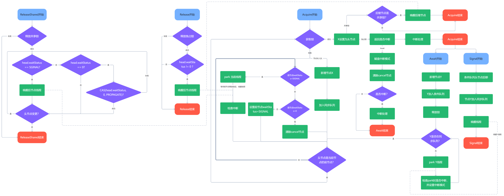

# AQS源码分析

## UML


## 适用场景

    使用于多线程下，资源竞争时

## 重要属性

### AbstractQueuedSynchronizer

|name|value|description|
|---|---|:---|
|head|transient volatile Node|头节点|
|tail|transient volatile Node|尾节点|
|state|volatile int|状态：锁的标志位|
|unsafe|Unsafe unsafe = Unsafe.getUnsafe()|用于直接处理类的属性值|

### Node

|name|value|description|
|---|---|:---|
|SHARED|Node|共享模式|
|EXCLUSIVE|null|独占模式|
|CANCELLED|1|节点取消|
|SIGNAL|-1|信号：表示需要唤醒下一个节点|
|CONDITION|-2|条件：表示当前节点是condition等待队列的节点|
|PROPAGATE|-3|传播：共享模式下传播唤醒|
|waitStatus|volatile int|CANCELLED/SIGNAL//CONDITION/PROPAGATE：当前节点状态|
|prev|volatile Node|前节点|
|next|volatile Node|后节点|
|thread|volatile Thread|节点所表示的线程|
|nextWaiter|Node|SHARED/EXCLUSIVE，表示当前节点模式|

### ConditionObject

|name|value|description|
|---|---|:---|
|firstWaiter|transient Node|头节点|
|lastWaiter|transient Node|尾节点|

## 原理简析

>   `AQS`作为常用的`ReentrantLock`，`ReentrantReadWriteLock`中必不可少的通用组件的父类，其封装了在同步队列`park`等待，在被唤醒后重试获取锁的动作；以及`Condition`队列的逻辑。`state`参数标识锁的持有释放；`waitStatus`参数标识该节点的状态：`CANCELLED`/`SIGNAL`/`CONDITION`/`PROPAGATE`。 
>1. `AQS`为独占锁开放了拓展方法`tryAcquire`，`tryRelease`，让子类进行拓展加锁逻辑，例如我们使用的`ReentrantLock`的公平锁/非公平锁，以及`ReentrantReadWriteLock`的写锁，其差异化就在方法`tryAcquire`。  
>2. `AQS`为共享锁开放了拓展方法`tryAcquireShared`，`tryReleaseShared`，让子类进行拓展加锁逻辑，例如我们使用的`ReentrantReadWriteLock`的读锁就是由此拓展而来。  
>3. `AQS`中维护了一条双向链表的同步队列，获取锁失败的节点，将进入同步队列中，等待重试获取锁。在释放锁时，如果当前节点的`waitStatus != 0`，则表示后继节点等待被唤醒，此时将唤醒该线程再次竞争获取锁。
>4. `Condition`的`await/signal/signalAll`使用方式类似于`Object`的`wait/notify/notifyAll`，在`condition`内部维护了一条双向链表的条件队列，在await期间，会向`condition`的链表中插入一个节点X，并释放所有锁，然后`park`当前线程X，直到其他线程`notify/notifyAll`时，会将X节点再插入同步队列中，X线程被唤醒后，重试获取锁。



## 源码分析

### 独占锁
> 独占锁：顾名思义就是在任意时刻，只有一个线程能持有。

#### acquire
>当前获取独占锁使用的通用的模板方法：
>1. 直接尝试获取独占锁
>2. 获取独占锁失败后，将当前线程添加到等待队列中，等待时机唤醒，循环获取独占锁
>3. 判断是否中断
```java
public final void acquire(int arg) {
    if (!tryAcquire(arg) &&
        acquireQueued(addWaiter(Node.EXCLUSIVE), arg))
        selfInterrupt();
}

static void selfInterrupt() {
    Thread.currentThread().interrupt();
}
```

#### tryAcquire
>尝试获取独占锁，用于子类拓展；可分为 公平/非公平获取锁
```java
protected boolean tryAcquire(int arg) {
    throw new UnsupportedOperationException();
}
```

#### addWaiter
>将当前线程添加到等待队列中
```java
private Node addWaiter(Node mode) {
    // 将当前线程以及模式构建节点对象
    Node node = new Node(Thread.currentThread(), mode);
    // Try the fast path of enq; backup to full enq on failure
    // 尝试直接向尾节点后追加节点
    Node pred = tail;
    if (pred != null) {
        node.prev = pred;
        // cas方式设置尾节点
        if (compareAndSetTail(pred, node)) {
            pred.next = node;
            return node;
        }
    }
    // 如果尾节点为空（表示队列未初始化）或者cas设置尾节点失败，那么死循环入队
    enq(node);
    return node;
}
```

#### enq
>节点循环入队
```java
private Node enq(final Node node) {
    for (;;) {
        Node t = tail;
        // 初始化
        if (t == null) { // Must initialize
            // 未初始化时，设置虚拟的头节点
            if (compareAndSetHead(new Node()))
                tail = head;
        } else {
            // 初始化完成后，再追加新的尾节点
            node.prev = t;
            if (compareAndSetTail(t, node)) {
                t.next = node;
                return t;
            }
        }
    }
}
```

#### acquireQueued
>判断当前节点是否能获取独占锁，如果无法获取独占锁，则park当前线程，等待被唤醒后，重试获取独占锁
```java
final boolean acquireQueued(final Node node, int arg) {
    boolean failed = true;
    try {
        boolean interrupted = false;
        for (;;) {
            // 获取node节点的前节点
            final Node p = node.predecessor();
            if (p == head && tryAcquire(arg)) {
                // 如果前节点是头节点，且获取独占锁成功，将当前节点置为头节点
                setHead(node);
                p.next = null; // help GC
                failed = false;
                return interrupted;
            }
            // 获取独占锁失败后，判断是否需要暂停当前线程，并在唤醒后检查当前线程是否出现中断
            if (shouldParkAfterFailedAcquire(p, node) &&
                parkAndCheckInterrupt())
                interrupted = true;
        }
    } finally {
        if (failed)
            // 获取独占锁失败后，取消该节点
            cancelAcquire(node);
    }
}
```

#### shouldParkAfterFailedAcquire
> 1. 如果pred节点的waitStatus是SIGNAL时，那么就可以park当前线程
> 2. 不是的情况下，如果pred节点已取消，则过滤取消的节点
> 3. 如果pred节点不是SIGNAL或CANCELED，那么就以CAS的方式设置pred节点为SIGNAL，以便下次循环时park线程
```java

private static boolean shouldParkAfterFailedAcquire(Node pred, Node node) {
    int ws = pred.waitStatus;
    if (ws == Node.SIGNAL)
        /*
            * This node has already set status asking a release
            * to signal it, so it can safely park.
            */
        return true;
    if (ws > 0) {
        /*
            * Predecessor was cancelled. Skip over predecessors and
            * indicate retry.
            */
        do {
            node.prev = pred = pred.prev;
        } while (pred.waitStatus > 0);
        pred.next = node;
    } else {
        /*
            * waitStatus must be 0 or PROPAGATE.  Indicate that we
            * need a signal, but don't park yet.  Caller will need to
            * retry to make sure it cannot acquire before parking.
            */
        compareAndSetWaitStatus(pred, ws, Node.SIGNAL);
    }
    return false;
}
```


#### parkAndCheckInterrupt
> park当前线程，并在线程被唤醒时，判断是否中断
```java
private final boolean parkAndCheckInterrupt() {
    LockSupport.park(this);
    return Thread.interrupted();
}
```


#### release
> 释放锁
```java

public final boolean release(int arg) {
    if (tryRelease(arg)) {
        Node h = head;
        if (h != null && h.waitStatus != 0)
            unparkSuccessor(h);
        return true;
    }
    return false;
}
```

#### tryRelease
> 尝试直接释放锁，由子类实现
```java

protected boolean tryRelease(int arg) {
    throw new UnsupportedOperationException();
}
```


#### unparkSuccessor
> 唤醒后继节点
```java
private void unparkSuccessor(Node node) {
    /*
        * If status is negative (i.e., possibly needing signal) try
        * to clear in anticipation of signalling.  It is OK if this
        * fails or if status is changed by waiting thread.
        */
    int ws = node.waitStatus;
    if (ws < 0)
        compareAndSetWaitStatus(node, ws, 0);

    /*
        * Thread to unpark is held in successor, which is normally
        * just the next node.  But if cancelled or apparently null,
        * traverse backwards from tail to find the actual
        * non-cancelled successor.
        */
    Node s = node.next;
    if (s == null || s.waitStatus > 0) {
        s = null;
        for (Node t = tail; t != null && t != node; t = t.prev)
            if (t.waitStatus <= 0)
                s = t;
    }
    if (s != null)
        LockSupport.unpark(s.thread);
}
```

### Condition
>

#### await
>1. 新增条件队列节点并入队
>2. 释放全部持有的锁
>3. 等待signal信号，重新进入同步队列
>4. 重试获取锁
>5. 取消关联cancel节点
>6. 中断处理
```java

public final void await() throws InterruptedException {
    if (Thread.interrupted())
        throw new InterruptedException();
    // 新增条件队列节点并入队
    Node node = addConditionWaiter();
    // 释放全部持有的锁
    int savedState = fullyRelease(node);
    int interruptMode = 0;
    // 等待signal信号，重新进入同步队列
    while (!isOnSyncQueue(node)) {
        LockSupport.park(this);
        if ((interruptMode = checkInterruptWhileWaiting(node)) != 0)
            break;
    }
    // 重试获取锁
    if (acquireQueued(node, savedState) && interruptMode != THROW_IE)
        interruptMode = REINTERRUPT;
    // 取消关联cancel节点
    if (node.nextWaiter != null) // clean up if cancelled
        unlinkCancelledWaiters();
    // 中断处理
    if (interruptMode != 0)
        reportInterruptAfterWait(interruptMode);
}
```

#### addConditionWaiter
> 新增条件队列节点并入队
```java
private Node addConditionWaiter() {
    Node t = lastWaiter;
    // If lastWaiter is cancelled, clean out.
    if (t != null && t.waitStatus != Node.CONDITION) {
        unlinkCancelledWaiters();
        t = lastWaiter;
    }
    Node node = new Node(Thread.currentThread(), Node.CONDITION);
    if (t == null)
        firstWaiter = node;
    else
        t.nextWaiter = node;
    lastWaiter = node;
    return node;
}
```
#### fullyRelease
> 释放全部持有的锁
```java

final int fullyRelease(Node node) {
    boolean failed = true;
    try {
        int savedState = getState();
        if (release(savedState)) {
            failed = false;
            return savedState;
        } else {
            throw new IllegalMonitorStateException();
        }
    } finally {
        if (failed)
            node.waitStatus = Node.CANCELLED;
    }
}
```
#### isOnSyncQueue
> 判断节点node是否处于同步队列中
```java
final boolean isOnSyncQueue(Node node) {
    if (node.waitStatus == Node.CONDITION || node.prev == null)
        return false;
    if (node.next != null) // If has successor, it must be on queue
        return true;
    /*
        * node.prev can be non-null, but not yet on queue because
        * the CAS to place it on queue can fail. So we have to
        * traverse from tail to make sure it actually made it.  It
        * will always be near the tail in calls to this method, and
        * unless the CAS failed (which is unlikely), it will be
        * there, so we hardly ever traverse much.
        */
    // 从尾部遍历，查看是否存在当前节点
    return findNodeFromTail(node);
}

private boolean findNodeFromTail(Node node) {
    Node t = tail;
    for (;;) {
        if (t == node)
            return true;
        if (t == null)
            return false;
        t = t.prev;
    }
}
```
 
#### signal
>1. 条件队列头节点后移
>2. 旧头节点重新加入同步队列并唤醒该节点关联线程
```java

public final void signal() {
    if (!isHeldExclusively())
        throw new IllegalMonitorStateException();
    Node first = firstWaiter;
    if (first != null)
        doSignal(first);
}

private void doSignal(Node first) {
    // 条件队列头节点后移
    do {
        if ( (firstWaiter = first.nextWaiter) == null)
            lastWaiter = null;
        first.nextWaiter = null;
    // 旧头节点重新加入同步队列并唤醒该节点关联线程
    } while (!transferForSignal(first) &&
                (first = firstWaiter) != null);
}

final boolean transferForSignal(Node node) {
    /*
        * If cannot change waitStatus, the node has been cancelled.
        */
    // 以CAS方式修改waitStatus，如果失败则意味着线程之前已经被唤醒，后续无需处理
    if (!compareAndSetWaitStatus(node, Node.CONDITION, 0))
        return false;

    /*
        * Splice onto queue and try to set waitStatus of predecessor to
        * indicate that thread is (probably) waiting. If cancelled or
        * attempt to set waitStatus fails, wake up to resync (in which
        * case the waitStatus can be transiently and harmlessly wrong).
        */
    // 节点重新加入同步队列
    Node p = enq(node);
    int ws = p.waitStatus;
    if (ws > 0 || !compareAndSetWaitStatus(p, ws, Node.SIGNAL))
        // 唤醒线程
        LockSupport.unpark(node.thread);
    return true;
}
```

### 共享锁
> 共享锁获取锁的方式：
> 1. 头节点唤醒后继节点时
> 2. 共享锁在获取锁成功后，将以链式反应激活下一个共享锁节点

#### acquireShared
>1. 尝试直接获取共享锁
>2. 获取失败后，进入同步队列中循环获取锁
```java
public final void acquireShared(int arg) {
    if (tryAcquireShared(arg) < 0)
        doAcquireShared(arg);
}

```

#### tryAcquireShared
> 加锁方式则由子类拓展：
>1. `ReentrantReadWriteLock`的读锁则由此拓展而来
>2. `Semaphore`的许可凭证就是依赖于共享锁
>3. `CountDownLatch`门栓也依赖于共享锁
```java
protected int tryAcquireShared(int arg) {
    throw new UnsupportedOperationException();
}
```

#### doAcquireShared
>判断当前节点是否能获取锁，如果无法获取共享锁，则park当前线程，等待被唤醒后，重试获取锁，获取共享锁成功后，下个节点如果是共享锁，则唤醒线程
>1. 循环处理获取共享锁
>2. 当前节点是头节点则尝试获取共享锁
>3. 获取共享锁成功后，下个节点如果是共享锁，则唤醒线程
>4. 未获取到共享锁时，判断是否需要暂停当前线程，并在唤醒后检查当前线程是否出现中断
```java

private void doAcquireShared(int arg) {
    // 创建共享节点
    final Node node = addWaiter(Node.SHARED);
    boolean failed = true;
    try {
        boolean interrupted = false;
        // 死循环获取锁
        for (;;) {
            // 获取前置节点
            final Node p = node.predecessor();
            if (p == head) {
                // 尝试获取共享锁
                int r = tryAcquireShared(arg);
                if (r >= 0) {
                    // 获取共享锁成功后，下个节点如果是读锁，则唤醒线程
                    setHeadAndPropagate(node, r);
                    p.next = null; // help GC
                    // 判断中断
                    if (interrupted)
                        selfInterrupt();
                    failed = false;
                    return;
                }
            }
            // 获取锁失败后，判断是否需要暂停当前线程，并在唤醒后检查当前线程是否出现中断
            if (shouldParkAfterFailedAcquire(p, node) &&
                parkAndCheckInterrupt())
                interrupted = true;
        }
    } finally {
        if (failed)
            cancelAcquire(node);
    }
}
```

#### setHeadAndPropagate
> 设置头节点，下个节点如果是读锁，则唤醒该线程，以此形成链式反应：连续的读锁最终都被唤醒
```java
private void setHeadAndPropagate(Node node, int propagate) {
    Node h = head; // Record old head for check below
    // 设置node为头节点
    setHead(node);
    /*
        * Try to signal next queued node if:
        *   Propagation was indicated by caller,
        *     or was recorded (as h.waitStatus either before
        *     or after setHead) by a previous operation
        *     (note: this uses sign-check of waitStatus because
        *      PROPAGATE status may transition to SIGNAL.)
        * and
        *   The next node is waiting in shared mode,
        *     or we don't know, because it appears null
        *
        * The conservatism in both of these checks may cause
        * unnecessary wake-ups, but only when there are multiple
        * racing acquires/releases, so most need signals now or soon
        * anyway.
        */
    if (propagate > 0 || h == null || h.waitStatus < 0 ||
        (h = head) == null || h.waitStatus < 0) {
        Node s = node.next;
        // 下个节点是读锁则唤醒该线程
        if (s == null || s.isShared())
            doReleaseShared();
    }
}
```

#### releaseShared
> 1. 释放锁
> 2. 唤醒后继节点
```java

public final boolean releaseShared(int arg) {
    if (tryReleaseShared(arg)) {
        doReleaseShared();
        return true;
    }
    return false;
}
```

#### doReleaseShared
> 死循环唤醒头节点的后继节点
```java
private void doReleaseShared() {
    /*
        * Ensure that a release propagates, even if there are other
        * in-progress acquires/releases.  This proceeds in the usual
        * way of trying to unparkSuccessor of head if it needs
        * signal. But if it does not, status is set to PROPAGATE to
        * ensure that upon release, propagation continues.
        * Additionally, we must loop in case a new node is added
        * while we are doing this. Also, unlike other uses of
        * unparkSuccessor, we need to know if CAS to reset status
        * fails, if so rechecking.
        */
    // 死循环处理唤醒头节点的下一个节点：此处是为了防止并发情况下的唤醒出现遗漏
    for (;;) {
        Node h = head;
        // 此时判断是否存在后继节点
        if (h != null && h != tail) {
            int ws = h.waitStatus;
            // 如果当前节点是SIGNAL，则表示下一个节点等待被唤醒
            if (ws == Node.SIGNAL) {
                // 此处的CAS修改，是防止并发处理唤醒
                if (!compareAndSetWaitStatus(h, Node.SIGNAL, 0))
                    continue;            // loop to recheck cases
                unparkSuccessor(h);
            }
            // 此时则发生于唤醒时，新节点刚插入，此时以CAS的方式将头节点的waitStatus置为PROPAGATE
            else if (ws == 0 &&
                        !compareAndSetWaitStatus(h, 0, Node.PROPAGATE))
                continue;                // loop on failed CAS
        }
        // 头节点未变，则跳出循环
        if (h == head)                   // loop if head changed
            break;
    }
}

```

## 逻辑论证

**1. AQS是如何保证可见性，互斥性？**

**2. AQS中waitStatus = SIGNAL的作用？以及为什么在将前节点设置为SIGNAL后，还要再次获取锁，失败后才park线程？**

## 未解之疑

**1. AQS中waitStatus = PROPAGATE的作用？**