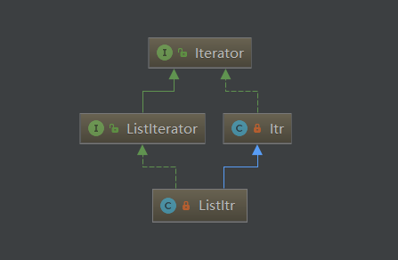

# ArrayList源码解析
## UML


## 重要属性
|name|value|description|
|---|---|:---|
|DEFAULT_CAPACITY|10|初始化长度|
|EMPTY_ELEMENTDATA|{}|空数组|
|DEFAULTCAPACITY_EMPTY_ELEMENTDATA|{}|空数组|
|elementData|Object[]|实际存储|
|size|int|List实际插入元素数量|
|modCount|int|数组修改计数，ArrayList中用于防止迭代器遍历时，数组元素更改|
|MAX_ARRAY_SIZE|Integer.MAX_VALUE - 8|容量最大值|

## 原理简析

>`ArrayList`的原理非常简单，底层就是使用数组`Object[] elementData`来存储数据，但是数组是定长的，这就意味着在使用过程中，如果数组长度不够，则需要扩容，并将数据迁移至新数组中。所以如果在我们知道数据的长度的情况下，最好初始化List长度，防止数据插入时，经常扩容，迁移数据，造成性能损失。


## 构造器
    在使用ArrayList时，最好初始化数组长度，避免扩容
```java
public ArrayList(int initialCapacity) {
    if (initialCapacity > 0) {
        this.elementData = new Object[initialCapacity];
    } else if (initialCapacity == 0) {
        this.elementData = EMPTY_ELEMENTDATA;
    } else {
        throw new IllegalArgumentException("Illegal Capacity: "+
                                            initialCapacity);
    }
}
```


## 新增
    向数组插入元素

1. 确认数组长度是否即将超出，如达到临界值，则进行扩容
2. 数组插入元素，并自增size
```java
public boolean add(E e) {
    //插入时，判断数组长度是否能够容纳，如若超出，则进行扩容
    ensureCapacityInternal(size + 1);  // Increments modCount!!
    elementData[size++] = e;
    return true;
}
```

## 扩容

    确保容量，首先计算容量，如果容量不够，则进行扩容。


```java

// 确保内部容量
private void ensureCapacityInternal(int minCapacity) {
    // 计算容量
    ensureExplicitCapacity(calculateCapacity(elementData, minCapacity));
}
// 计算容量 
private static int calculateCapacity(Object[] elementData, int minCapacity) {
    if (elementData == DEFAULTCAPACITY_EMPTY_ELEMENTDATA) {
        return Math.max(DEFAULT_CAPACITY, minCapacity);
    }
    return minCapacity;
}
// 确保显式容量
private void ensureExplicitCapacity(int minCapacity) {
    modCount++;

    // overflow-conscious code
    if (minCapacity - elementData.length > 0)
        grow(minCapacity);
}
// 扩容
private void grow(int minCapacity) {
    // overflow-conscious code
    int oldCapacity = elementData.length;
    //取当前数组长度的1.5倍为初始值
    int newCapacity = oldCapacity + (oldCapacity >> 1);
    if (newCapacity - minCapacity < 0)
        // 取minCapacity 和 1.5倍oldCapacity 的较大值
        newCapacity = minCapacity;
    if (newCapacity - MAX_ARRAY_SIZE > 0)
        // newCapacity 是否超过最大值
        newCapacity = hugeCapacity(minCapacity);
    // 复制数组元素到新数组中
    elementData = Arrays.copyOf(elementData, newCapacity);
}
// 判断大容量下的可能情况
private static int hugeCapacity(int minCapacity) {
    // minCapacity 可能在自增的过程中超过Integer.MAX，此时进位后，变成负数
    if (minCapacity < 0) // overflow
        throw new OutOfMemoryError();
    return (minCapacity > MAX_ARRAY_SIZE) ?
        Integer.MAX_VALUE :
        MAX_ARRAY_SIZE;
}
```


## 删除

### 删除下标
    删除index下标的元素

1. 判断index是否超出数组长度
2. index下标之后的元素左移一位，填补空缺
3. 返回旧值
```java
public E remove(int index) {
    // 校验index是否合法
    rangeCheck(index);

    modCount++;
    E oldValue = elementData(index);
    // index之后的元素长度
    int numMoved = size - index - 1;
    // 数组元素左移，覆盖被删除的元素
    if (numMoved > 0)
        System.arraycopy(elementData, index+1, elementData, index,
                            numMoved);
    elementData[--size] = null; // clear to let GC do its work
    return oldValue;
}
```

### 删除对象
    删除数组中存在的对象，可删除null
```java
public boolean remove(Object o) {
    if (o == null) {
        // 删除null
        for (int index = 0; index < size; index++)
            if (elementData[index] == null) {
                fastRemove(index);
                return true;
            }
    } else {
        // 删除对应对象元素
        for (int index = 0; index < size; index++)
            if (o.equals(elementData[index])) {
                fastRemove(index);
                return true;
            }
    }
    return false;
}
// 快速删除
private void fastRemove(int index) {
    modCount++;
    int numMoved = size - index - 1;
    if (numMoved > 0)
        // 数组元素左移，覆盖被删除的元素
        System.arraycopy(elementData, index+1, elementData, index,
                            numMoved);
    elementData[--size] = null; // clear to let GC do its work
}
```

## 迭代器Itr
    Itr是ArrayList的内部类，可共享宿主对象属性方法。遍历只可单向向后


### UML


### 重要属性
|name|value|description|
|---|---|:---|
|cursor|int|下标：指向下一个元素，默认0|
|lastRet|int|下标：指向当前元素，默认-1|
|expectedModCount|int|预期modCount，防止迭代器遍历时，数组元素被更改|


### 原理简析
<font color='#FFA500'>ArrayList中的迭代器的原理：</font>  
<font color='#43CD80'>创建内部类迭代器对象，使用属性cursor指向当前容器下标，当执行next()方法时，返回当前cursor下标的对象，cursor值+1，属性lastRet指向当前返回对象所在下标</font>  


### next
    迭代器向后遍历
```java
//cursor指向下一个
public boolean hasNext() {
    return cursor != size;
}
//在next（）方法获取下一个对象后，指针cursor指向新的下一个对象
public E next() {
    checkForComodification();
    int i = cursor;
    if (i >= size)
        throw new NoSuchElementException();
    Object[] elementData = ArrayList.this.elementData;
    if (i >= elementData.length)
        throw new ConcurrentModificationException();
    cursor = i + 1;
    return (E) elementData[lastRet = i];
}
```


### 校验
    判断expectedModCount是否与ArrayList的modCount一致，防止遍历时，数组元素被修改
```java
// 判断是否被修改
final void checkForComodification() {
    if (modCount != expectedModCount)
        throw new ConcurrentModificationException();
}
```

### remove
    删除当前指向的元素，使用ArrayList的remove方法
```java
//remove时必须要要执行过next（）方法，lastRet初始化后才可进行remove
public void remove() {
    if (lastRet < 0)
        throw new IllegalStateException();
    checkForComodification();

    try {
        ArrayList.this.remove(lastRet);
        cursor = lastRet;
        lastRet = -1;
        expectedModCount = modCount;
    } catch (IndexOutOfBoundsException ex) {
        throw new ConcurrentModificationException();
    }
}
```

## 迭代器ListItr

### UML


### 原理简析
>ListItr继承自Itr，并拓展了可向前遍历的特性，并添加了新增(add)，修改(set)等方法。这里必须要强调一点：虽然可以前后遍历，但不意味着，在向后/向前遍历的时候，能够执行反向遍历。

### previous
```java
public boolean hasPrevious() {
    return cursor != 0;
}

public int nextIndex() {
    return cursor;
}

public int previousIndex() {
    return cursor - 1;
}

@SuppressWarnings("unchecked")
public E previous() {
    checkForComodification();
    int i = cursor - 1;
    if (i < 0)
        throw new NoSuchElementException();
    Object[] elementData = ArrayList.this.elementData;
    if (i >= elementData.length)
        throw new ConcurrentModificationException();
    cursor = i;
    return (E) elementData[lastRet = i];
}
```

### 修改
    向lastRet下标处，修改元素，实际是调用ArrayList.set方法
```java
public void set(E e) {
    if (lastRet < 0)
        throw new IllegalStateException();
    checkForComodification();

    try {
        ArrayList.this.set(lastRet, e);
    } catch (IndexOutOfBoundsException ex) {
        throw new ConcurrentModificationException();
    }
}
```

### 新增
    向cursor下标处插入新元素，实际是调用ArrayList.add方法
```java
public void add(E e) {
    checkForComodification();

    try {
        int i = cursor;
        ArrayList.this.add(i, e);
        cursor = i + 1;
        lastRet = -1;
        expectedModCount = modCount;
    } catch (IndexOutOfBoundsException ex) {
        throw new ConcurrentModificationException();
    }
}
```