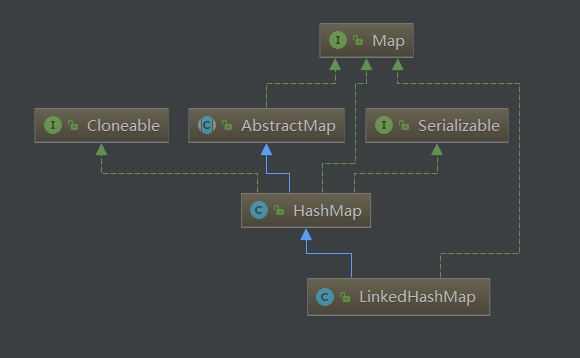

# LinkedHashMap

## UML
  


## 适用场景

    1. 由于在HashMap的基础上维护了一个链表，所以LinkedHashMap可以支持按插入顺序遍历元素，当然LinkedHashMap也支持按访问顺序排序，即访问过的元素，置于链表尾端。


## 重要属性

### LinkedHashMap

|name|value|description|
|---|---|:---|
|head|LinkedHashMap.Entry<K,V>|头节点|
|tail|LinkedHashMap.Entry<K,V>|尾节点|
|accessOrder|boolean|访问排序，默认false|

### Entry

>`Entry`继承`HashMap.Node<K,V>`

|name|value|description|
|---|---|:---|
|before|Entry<K,V>|前节点|
|after|Entry<K,V>|后节点|
|hash|int|key的hash值|
|key|K|key|
|value|V|value|
|next|Node<K,V>|链表引用，指向下一个节点|

## 原理简析

LinkedHashMap是继承HashMap，并在HashMap的基础上增加了一条整体的双向链表。而且其排序有两种方式：
1. 插入排序：accessOrder=false，默认情况下，每次新插入的节点都在尾端
2. 访问排序：accessOrder=true，在插入排序的基础上，每次访问某个元素(N)，都会把元素(N)置于尾端   

LinkedHashMap中的存储对象Entry继承了HashMap的Node，Node基础上添加了before和after两个指针
```java
static class Entry<K,V> extends HashMap.Node<K,V> {
    Entry<K,V> before, after;
    Entry(int hash, K key, V value, Node<K,V> next) {
        super(hash, key, value, next);
    }
}
```

## 新增元素

    LinkedHashMap在put时，通过覆盖部分方法实现在HashMap基础上维护一条整体的双向链表

```java
//这是HashMap中的put时的方法主体
final V putVal(int hash, K key, V value, boolean onlyIfAbsent,
                   boolean evict) {
        Node<K,V>[] tab; Node<K,V> p; int n, i;
        if ((tab = table) == null || (n = tab.length) == 0)
            n = (tab = resize()).length;
        if ((p = tab[i = (n - 1) & hash]) == null)
        //被覆盖处newNode(hash, key, value, null)
            tab[i] = newNode(hash, key, value, null);
        else {
            Node<K,V> e; K k;
            if (p.hash == hash &&
                ((k = p.key) == key || (key != null && key.equals(k))))
                e = p;
            else if (p instanceof TreeNode)
                e = ((TreeNode<K,V>)p).putTreeVal(this, tab, hash, key, value);
            else {
                for (int binCount = 0; ; ++binCount) {
                    if ((e = p.next) == null) {
                    //被覆盖处newNode(hash, key, value, null)
                        p.next = newNode(hash, key, value, null);
                        if (binCount >= TREEIFY_THRESHOLD - 1) // -1 for 1st
                            treeifyBin(tab, hash);
                        break;
                    }
                    if (e.hash == hash &&
                        ((k = e.key) == key || (key != null && key.equals(k))))
                        break;
                    p = e;
                }
            }
            if (e != null) { // existing mapping for key
                V oldValue = e.value;
                if (!onlyIfAbsent || oldValue == null)
                    e.value = value;
                //被覆盖处
                afterNodeAccess(e);
                return oldValue;
            }
        }
        ++modCount;
        if (++size > threshold)
            resize();
        //被覆盖处
        afterNodeInsertion(evict);
        return null;
    }
/**
*以下是LinkedHashMap中的override实现
*/
// newNode(int hash, K key, V value, Node<K,V> e) 覆盖处
// 此处在new新对象时，也维护了LinkedHashMap的双向链表，在插入时，将新对象置于tail末尾
Node<K,V> newNode(int hash, K key, V value, Node<K,V> e) {
    LinkedHashMap.Entry<K,V> p =
        new LinkedHashMap.Entry<K,V>(hash, key, value, e);
    linkNodeLast(p);
    return p;
}
private void linkNodeLast(LinkedHashMap.Entry<K,V> p) {
    LinkedHashMap.Entry<K,V> last = tail;
    tail = p;
    if (last == null)
        head = p;
    else {
        p.before = last;
        last.after = p;
    }
}
//此处是判断如果当前LinkedHashMap处于访问排序，则将已访问对象e置于tail末尾处
void afterNodeAccess(Node<K,V> e) { // move node to last
    LinkedHashMap.Entry<K,V> last;
    if (accessOrder && (last = tail) != e) {
        LinkedHashMap.Entry<K,V> p =
            (LinkedHashMap.Entry<K,V>)e, b = p.before, a = p.after;
        p.after = null;
        if (b == null)
            head = a;
        else
            b.after = a;
        if (a != null)
            a.before = b;
        else
            last = b;
        if (last == null)
            head = p;
        else {
            p.before = last;
            last.after = p;
        }
        tail = p;
        ++modCount;
    }
}
//插入后，判断是否要驱逐第一个节点
void afterNodeInsertion(boolean evict) { // possibly remove eldest
    LinkedHashMap.Entry<K,V> first;
    if (evict && (first = head) != null && removeEldestEntry(first)) {
        K key = first.key;
        removeNode(hash(key), key, null, false, true);
    }
}
protected boolean removeEldestEntry(Map.Entry<K,V> eldest) {
    return false;
}
```

## 访问排序

    accessOrder = true时，访问元素后，将元素放最后

```java
void afterNodeAccess(Node<K,V> e) { // move node to last
    LinkedHashMap.Entry<K,V> last;
    // 如果accessOrder = true时，且当前节点不是尾节点时，将
    if (accessOrder && (last = tail) != e) {
        LinkedHashMap.Entry<K,V> p =
            (LinkedHashMap.Entry<K,V>)e, b = p.before, a = p.after;
        // 将节点e的前节点，后节点相关联，然后再将e节点放在尾部
        p.after = null;
        if (b == null)
            head = a;
        else
            b.after = a;
        if (a != null)
            a.before = b;
        else
            last = b;
        if (last == null)
            head = p;
        else {
            p.before = last;
            last.after = p;
        }
        tail = p;
        ++modCount;
    }
}
```

## 查询元素

    用父类的HashMap的getNode方法获取节点，然后维护访问排序

```java
public V get(Object key) {
    Node<K,V> e;
    // 调用父类HashMap获取节点
    if ((e = getNode(hash(key), key)) == null)
        return null;
    // 维护访问排序
    if (accessOrder)
        afterNodeAccess(e);
    return e.value;
}

```

## 删除元素

    继承HashMap的remove方法，并实现afterNodeRemoval方法，以此维护LinkedHashMap的链表关系

```java
// 继承于HashMap的removeNode
final Node<K,V> removeNode(int hash, Object key, Object value,
                            boolean matchValue, boolean movable) {
    Node<K,V>[] tab; Node<K,V> p; int n, index;
    if ((tab = table) != null && (n = tab.length) > 0 &&
        (p = tab[index = (n - 1) & hash]) != null) {
        Node<K,V> node = null, e; K k; V v;
        if (p.hash == hash &&
            ((k = p.key) == key || (key != null && key.equals(k))))
            node = p;
        else if ((e = p.next) != null) {
            if (p instanceof TreeNode)
                node = ((TreeNode<K,V>)p).getTreeNode(hash, key);
            else {
                do {
                    if (e.hash == hash &&
                        ((k = e.key) == key ||
                            (key != null && key.equals(k)))) {
                        node = e;
                        break;
                    }
                    p = e;
                } while ((e = e.next) != null);
            }
        }
        if (node != null && (!matchValue || (v = node.value) == value ||
                                (value != null && value.equals(v)))) {
            if (node instanceof TreeNode)
                ((TreeNode<K,V>)node).removeTreeNode(this, tab, movable);
            else if (node == p)
                tab[index] = node.next;
            else
                p.next = node.next;
            ++modCount;
            --size;
            // 拓展删除节点后的逻辑
            afterNodeRemoval(node);
            return node;
        }
    }
    return null;
}

// LinkedList在删除节点后，需要重新维护链表顺序
void afterNodeRemoval(Node<K,V> e) { // unlink
    LinkedHashMap.Entry<K,V> p =
        (LinkedHashMap.Entry<K,V>)e, b = p.before, a = p.after;
    p.before = p.after = null;
    // 将待删除的节点的前后两个节点相连
    if (b == null)
        head = a;
    else
        b.after = a;
    if (a == null)
        tail = b;
    else
        a.before = b;
}
```
