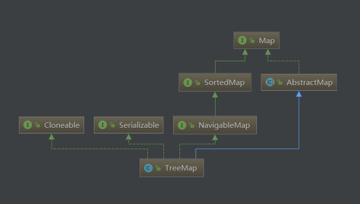

# TreeMap源码解析
  
TreeMap中元素需实现Comparable接口或者在构建TreeMap时必须添加Comparator比较器，以此进行排序。TreeMap中仅维护一颗红黑树。
```java
public V put(K key, V value) {
        Entry<K,V> t = root;
        //首先判断根节点是否为null，如果是则表明此时添加的是第一个元素
        if (t == null) {
            compare(key, key); // type (and possibly null) check

            root = new Entry<>(key, value, null);
            size = 1;
            modCount++;
            return null;
        }
        int cmp;
        Entry<K,V> parent;
        // split comparator and comparable paths
        //如果不是添加的第一个元素，则判断treeMap中是否有比较器Comparator，如果有则使用Comparator进行排序
        Comparator<? super K> cpr = comparator;
        if (cpr != null) {
            do {
                parent = t;
                cmp = cpr.compare(key, t.key);
                if (cmp < 0)
                    t = t.left;
                else if (cmp > 0)
                    t = t.right;
                else
                    return t.setValue(value);
            } while (t != null);
        }
        //如果没有Comparator，则使用元素实现Comparable接口的方法compareTo进行比较
        else {
            if (key == null)
                throw new NullPointerException();
            @SuppressWarnings("unchecked")
                Comparable<? super K> k = (Comparable<? super K>) key;
            do {
                parent = t;
                cmp = k.compareTo(t.key);
                if (cmp < 0)
                    t = t.left;
                else if (cmp > 0)
                    t = t.right;
                else
                    return t.setValue(value);
            } while (t != null);
        }
        //在添加元素时，如果整棵树比较后都没有该元素相等的存在，则new一个新元素添加进去
        Entry<K,V> e = new Entry<>(key, value, parent);
        if (cmp < 0)
            parent.left = e;
        else
            parent.right = e;
        //插入完成后，进行红黑树调整
        fixAfterInsertion(e);
        size++;
        modCount++;
        return null;
    }
```