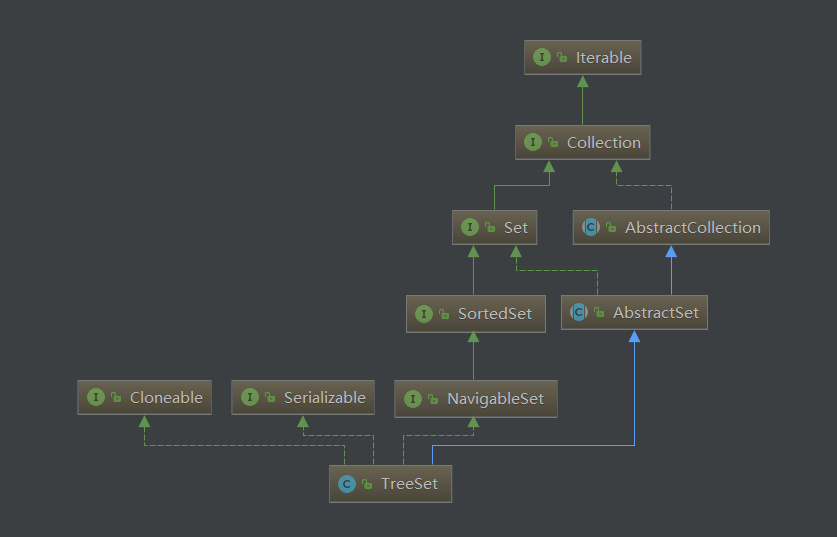

# TreeSet源码解析

## UML
  

## 重要属性

|name|value|description|
|---|---|:---|
|m|NavigableMap<E,Object>|TreeSet实际存储对象的容器|
|PRESENT|Object|m默认value|

## 原理简析

<font color='#43CD80'>TreeSet中源码实现非常简单，在其中维护了一个NavigableMap(默认使用TreeMap)，key当作Set中的元素存储，而value统一存放PRESENT（new Object（）对象）。所有的数据操作实际都是调用NavigableMap相应的方法进行处理。</font>


## 方法

```java
public TreeSet() {
    this(new TreeMap<E,Object>());
}
TreeSet(NavigableMap<E,Object> m) {
    this.m = m;
}
public boolean add(E e) {
    return m.put(e, PRESENT)==null;
}
public boolean contains(Object o) {
    return m.containsKey(o);
}
public boolean remove(Object o) {
    return m.remove(o)==PRESENT;
}
```