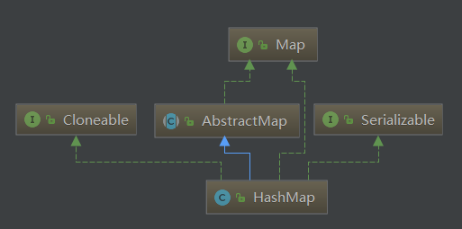

# HashMap源码解析
  
<font color='#FFA500'>HashMap属性：</font>  
* <font color='#FFA500'>loadFactor：</font><font color='#43CD80'>扩容门槛值因子</font>  
* <font color='#FFA500'>threshold：</font><font color='#43CD80'>扩容门槛值</font> 
* <font color='#FFA500'>DEFAULT_LOAD_FACTOR：</font><font color='#43CD80'>0.75f</font> 
* <font color='#FFA500'>MAXIMUM_CAPACITY：</font><font color='#43CD80'>1&lt;&lt;30</font> 
* <font color='#FFA500'>TREEIFY_THRESHOLD：</font><font color='#43CD80'>8</font> 

HashMap实现是采用数组+链表（双向链表+红黑树）实现的
## 1 HashMap构造器解析

```java
//DEFAULT_LOAD_FACTOR=0.75f
//MAXIMUM_CAPACITY=1 << 30
public HashMap() {
        this.loadFactor = DEFAULT_LOAD_FACTOR; // all other fields defaulted
    }
public HashMap(int initialCapacity) {
        this(initialCapacity, DEFAULT_LOAD_FACTOR);
    }
public HashMap(int initialCapacity, float loadFactor) {
        //判断初始化容量
        if (initialCapacity < 0)
            throw new IllegalArgumentException("Illegal initial capacity: " +
                                               initialCapacity);
        //限制最大容量为1<<30                        
        if (initialCapacity > MAXIMUM_CAPACITY)
            initialCapacity = MAXIMUM_CAPACITY;
        if (loadFactor <= 0 || Float.isNaN(loadFactor))
            throw new IllegalArgumentException("Illegal load factor: " +
                                               loadFactor);
        this.loadFactor = loadFactor;
        //由于HashMap的容量值必须为2^n，所以此方法用于获取最接近的2^n
        //此时虽然已经获取了容量值，但是并没有直接进行初始化容器，而是赋值给了threshold，以便后续真正使用HashMap时，设置容器大小
        this.threshold = tableSizeFor(initialCapacity);
    }
```

## 2 HashMap巧妙算法
``` java
//由于HashMap的容量值必须为2^n，所以此方法用于获取最接近的2^n
static final int tableSizeFor(int cap) {
    int n = cap - 1;
    n |= n >>> 1;
    n |= n >>> 2;
    n |= n >>> 4;
    n |= n >>> 8;
    n |= n >>> 16;
    return (n < 0) ? 1 : (n >= MAXIMUM_CAPACITY) ? MAXIMUM_CAPACITY : n + 1;
}
```
### 2.1 解析
        1. 这个算法的精巧之处，在于：由于hashmap中所有的capacity都必须是2的n次方，当我们预设的capacity不符合规定时，他帮我们自动调整为正确的capacity，首先-1的原因是为了把所有位都置1后加1的操作，其主要目的还是为了防止预设值为正常时，实际初始化大小却为预设值的2倍。  
        2. >>>：是逻辑右移，高位置0。>>：是算数右移，高位在正数时置0，负数时置1。  
        3. 操作过程：初始，在第一个高位为1的位置右移一位，再或运算，则高两位都置1；再高两位右移两位后进行或预算，则高四位为1，以此到右移16为，则将int的32位中以高位为1的后面位全部置1，然后再加1，将capacity变成2的n次方。  

## 3 HashMap.put解析

```java
public V put(K key, V value) {
        return putVal(hash(key), key, value, false, true);
    }
static final int hash(Object key) {
        int h;
        return (key == null) ? 0 : (h = key.hashCode()) ^ (h >>> 16);
    }
final V putVal(int hash, K key, V value, boolean onlyIfAbsent,
                   boolean evict) {
        Node<K,V>[] tab; Node<K,V> p; int n, i;
        //首先判断HashMap的容器是否初始化
        if ((tab = table) == null || (n = tab.length) == 0)
            //未初始化，则调用扩容方法进行初始化大小
            n = (tab = resize()).length;
        //此处用于获取当前需要新增的Node节点在tab数组的下标位置，当tab数组在该下标的位置为空时，则表示HashMap中没有与之相同的key，可以直接插入到tab中。
        if ((p = tab[i = (n - 1) & hash]) == null)
            tab[i] = newNode(hash, key, value, null);
        else {
            //此时，则表示当前下标存在Node节点，则需要进一步判断是否存在相同key
            Node<K,V> e; K k;
            //判断tab下的首节点p是否与待插入节点的key相同
            if (p.hash == hash &&
                ((k = p.key) == key || (key != null && key.equals(k))))
                e = p;
            //此时，首节点p与待插入节点key不相同
            //再判断p是否是红黑树节点
            else if (p instanceof TreeNode)
                //是红黑树节点，则调用红黑树的插入逻辑
                e = ((TreeNode<K,V>)p).putTreeVal(this, tab, hash, key, value);
            //此时，表示首节点p不是红黑树，且不与待插入节点key相同
            else {
                //遍历tab下的链表，寻找插入的位置
                for (int binCount = 0; ; ++binCount) {
                    //若后续节点为空，则表示整个HashMap中没有相同key，可以直接插入新节点
                    if ((e = p.next) == null) {
                        //插入新节点
                        p.next = newNode(hash, key, value, null);
                        //此处用于判断是否 将链表转换为红黑树结构
                        //满足的条件：链表长度超过8
                        if (binCount >= TREEIFY_THRESHOLD - 1) // -1 for 1st
                            treeifyBin(tab, hash);
                        break;
                    }
                    //若后续节点不为空，则判断是否与新节点key相同
                    if (e.hash == hash &&
                        ((k = e.key) == key || (key != null && key.equals(k))))
                        break;
                    p = e;
                }
            }
            //如果e不为空，则表示存在节点e的key与待插入节点的key相同
            //此时需要判断，是否需要替换value
            if (e != null) { // existing mapping for key
                V oldValue = e.value;
                if (!onlyIfAbsent || oldValue == null)
                    e.value = value;
                
                afterNodeAccess(e);
                return oldValue;
            }
        }
        ++modCount;
        //判断容器大小是否超过扩容门槛值,超过则进行容器扩容
        if (++size > threshold)
            resize();
        afterNodeInsertion(evict);
        return null;
    }
```

## 4 HashMap扩容解析
```java
final Node<K,V>[] resize() {
    Node<K,V>[] oldTab = table;
    int oldCap = (oldTab == null) ? 0 : oldTab.length;
    int oldThr = threshold;
    int newCap, newThr = 0;
    //oldCap>0，则表示已经初始化
    if (oldCap > 0) {
        //如果table已经处于最大容量，则不再进行扩容操作
        if (oldCap >= MAXIMUM_CAPACITY) {
            threshold = Integer.MAX_VALUE;
            return oldTab;
        }
        //如果table新的长度大于等于默认值，小于最大容量值，则将新的扩容门槛值调整为之前的两倍
        else if ((newCap = oldCap << 1) < MAXIMUM_CAPACITY &&
                 oldCap >= DEFAULT_INITIAL_CAPACITY)
            newThr = oldThr << 1; // double threshold
    }
    //此时table未初始化，且创建HashMap对象时，已经设了置初始化table大小
    else if (oldThr > 0) // initial capacity was placed in threshold
        newCap = oldThr;
    //此时table未初始化，且创建HashMap时，未设置table大小，进行初始化设置
    else {               // zero initial threshold signifies using defaults
        newCap = DEFAULT_INITIAL_CAPACITY;
        newThr = (int)(DEFAULT_LOAD_FACTOR * DEFAULT_INITIAL_CAPACITY);
    }
    //newThr==0，表示之前table未初始化，且创建HashMap对象时，已经设了置初始化table大小
    if (newThr == 0) {
        //此时重置扩容门槛值
        float ft = (float)newCap * loadFactor;
        newThr = (newCap < MAXIMUM_CAPACITY && ft < (float)MAXIMUM_CAPACITY ?
                  (int)ft : Integer.MAX_VALUE);
    }
    threshold = newThr;
    @SuppressWarnings({"rawtypes","unchecked"})
        Node<K,V>[] newTab = (Node<K,V>[])new Node[newCap];
    table = newTab;
    //如果oldTab==null，则表示当前属于初始化，无需将进行数据迁移到新数组中
    //oldTab!=null，则表示需要进行数据迁移
    if (oldTab != null) {
        for (int j = 0; j < oldCap; ++j) {
            Node<K,V> e;
            //不为空，则表示table在改下标中有数据需要迁移
            if ((e = oldTab[j]) != null) {
                oldTab[j] = null;
                //e.next == null，表示只有一个节点，则直接将该节点迁移到新容器中
                if (e.next == null)
                    //待解析处代码1
                    newTab[e.hash & (newCap - 1)] = e;
                //如果是红黑树节点，则调用红黑树的处理方式
                else if (e instanceof TreeNode)
                    ((TreeNode<K,V>)e).split(this, newTab, j, oldCap);
                //此时表示，当前下标下不止一个节点，且不属于红黑树结构
                else { // preserve order
                    Node<K,V> loHead = null, loTail = null;
                    Node<K,V> hiHead = null, hiTail = null;
                    Node<K,V> next;
                    do {
                        next = e.next;
                        //待解析处代码2
                        //此处用于判断扩容后，该节点是否需要迁移到另一个下标位置
                        //0：表示该节点仍在当前下标位置
                        //1：表示该节点应该迁移到j+oldCap位置处
                        if ((e.hash & oldCap) == 0) {
                            if (loTail == null)
                                loHead = e;
                            else
                                loTail.next = e;
                            loTail = e;
                        }
                        else {
                            if (hiTail == null)
                                hiHead = e;
                            else
                                hiTail.next = e;
                            hiTail = e;
                        }
                    } while ((e = next) != null);
                    if (loTail != null) {
                        loTail.next = null;
                        newTab[j] = loHead;
                    }
                    if (hiTail != null) {
                        hiTail.next = null;
                        newTab[j + oldCap] = hiHead;
                    }
                }
            }
        }
    }
    return newTab;
}
```
### 4.2 解析
``e.hash & (newCap - 1)``  
此处代码是根据 hash值来获取table中对应下标位置存放处，其原理：因为HashMap中维护的table数组的长度为2的n次方，所以取余操作，可以通过数组长度-1之后相与，可得到余数，原理表格如下:
假设table数组长度为16，则值为0b10000，某个带储存对象hash值为：0b10110111

|     |     |     |     |     |     |     |     |
| :-: | :-: | :-: | :-: | :-: | :-: | :-: | :-: |
|  1   |   0  |   1  |  1   |  0   |  1   |  1   |   1  |
|     |     |     |   1  |  0   |  0   |   0  |   0  |

若要对此进行求余，可将table长度-1（即后面位全为1），相与，则可获得当前值的余数0b0111

|     |     |     |     |     |     |     |     |
| :-: | :-: | :-: | :-: | :-: | :-: | :-: | :-: |
|  1   |   0  |   1  |  1   |  0   |  1   |  1   |   1  |
|     |     |     |   0  |  1   |  1   |   1  |   1  |
|     |     |     |     |  0   |  1   |   1  |   1  |

``(e.hash & oldCap) == 0``  
此处代码逻辑是因为在扩容后，新数组是原数组的2倍，所以取余时的相与位数要多一位，但是由于之前取余时，已经判断当时余数是一致的，所以现在我们只需要判断扩容前的最高位对应的hash值是0还是1，则可判断出，扩容后，元素存放的位置（假设下标为x，数组长度为n），为0时，则依然放置原处x，为1时，则表示应放置在下标为x+n处。其逻辑还是一样重新计算对象存储在table中的位置。
