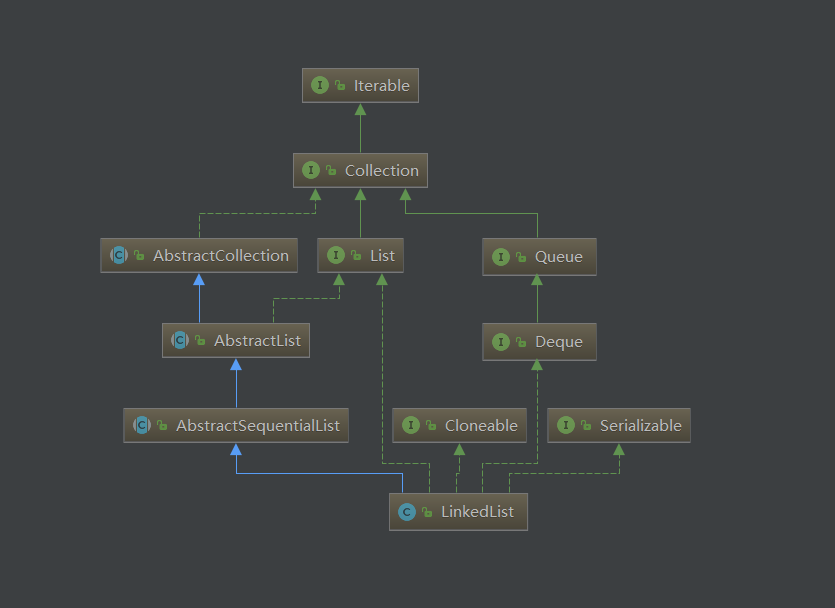
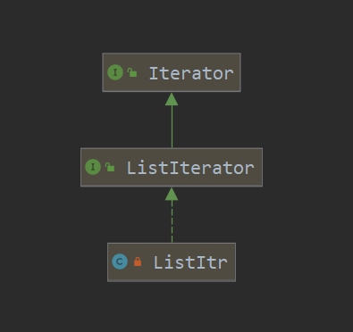
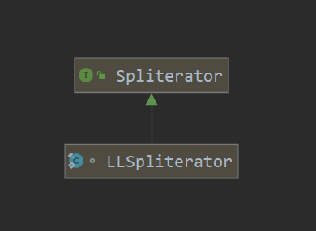

# LinkedList
## UML
  

> 从LinkedList的uml关系图中可以看到，LinkedList不仅是一个`List`集合，还是一个双端队列`Deque`接口的实现类

## 重要属性

### LinkedList
|name|value|description|
|---|---|:---|
|size|int|元素个数|
|first|Node|头节点|
|last|Node|尾节点|
|modCount|int|修改计数|

### Node
|name|value|description|
|---|---|:---|
|item|E|元素个数|
|prev|Node<E>|前节点|
|next|Node<E>|后节点|

## 原理简析

<font color='#43CD80'>`LinkedList`采用的是双向链表结构，其存储对象为`Node`，每一个`Node`对象都会包含一个`next`，`prev`的属性；</font>  
<font color='#43CD80'>双向链表的原理：`Node`元素的属性`prev`指向前一个节点，属性`next`指向后一个节点。以此衔接链表中的每一个节点`Node`</font>  

## 新增
    新增元素：向后添加新节点
```java

public boolean add(E e) {
    linkLast(e);
    return true;
}

void linkLast(E e) {
    final Node<E> l = last;
    final Node<E> newNode = new Node<>(l, e, null);
    // 将last指向新节点
    last = newNode;
    if (l == null)
        // 如果l为空，则表示未初始化，这是第一个新增的节点，将first也指向新节点
        first = newNode;
    else
        // 建立旧last与新last的关联关系
        l.next = newNode;
    size++;
    modCount++;
}
```

## 删除
### 删除头节点
    删除第一个元素
```java
public E remove() {
    return removeFirst();
}
public E removeFirst() {
    final Node<E> f = first;
    if (f == null)
        throw new NoSuchElementException();
    return unlinkFirst(f);
}

private E unlinkFirst(Node<E> f) {
    // assert f == first && f != null;
    final E element = f.item;
    final Node<E> next = f.next;
    f.item = null;
    f.next = null; // help GC
    first = next;
    if (next == null)
        last = null;
    else
        next.prev = null;
    size--;
    modCount++;
    return element;
}
```

### 删除下标
    找到下标对应的节点，然后删除节点

### 删除节点

```java
E unlink(Node<E> x) {
    // assert x != null;
    final E element = x.item;
    final Node<E> next = x.next;
    final Node<E> prev = x.prev;
    // 将当前节点的前后节点关联
    if (prev == null) {
        first = next;
    } else {
        prev.next = next;
        x.prev = null;
    }

    if (next == null) {
        last = prev;
    } else {
        next.prev = prev;
        x.next = null;
    }

    x.item = null;
    size--;
    modCount++;
    return element;
}
```

## 队列方法
1. `poll`：获取第一个元素，并移除，如果当前没有元素，则返回null
2. `peek`：仅仅获取第一个元素，不做移除，如果当前没有元素，则返回null
3. `element`：检索(但不删除)此`deque`表示的队列的头部(换句话说，是此`deque`的第一个元素)。此方法与`peek`的唯一不同之处在于，如果此队列为空，它将抛出异常。 这个方法等价于`getFirst()`。
4. `offer`：向队列最后添加一个元素
5. `pop`：移除并返回`deque`的第一个元素。 这个方法等价于`removeFirst()`。如果当前没有元素，则抛出异常`NoSuchElementException`
6. `push`：在队列最前面添加元素

## 迭代器ListItr
    迭代器的操作逻辑都是一致的，与ArrayList相比来说，并没有太大的区别，此处不再赘述
### UML



### 重要属性

|name|value|description|
|---|---|:---|
|lastReturned|Node|当前指向的节点|
|next|Node|指向下一个节点|
|nextIndex|int|指向下一个节点的下标|
|expectedModCount|int|预期modCount|

### 构造器
    必须要指定下标位置
```java
ListItr(int index) {
    // assert isPositionIndex(index);
    next = (index == size) ? null : node(index);
    nextIndex = index;
}
```

### 主要方法
    方法比较简单，不再分析
```java
public boolean hasNext() {
    return nextIndex < size;
}

public E next() {
    checkForComodification();
    if (!hasNext())
        throw new NoSuchElementException();

    lastReturned = next;
    next = next.next;
    nextIndex++;
    return lastReturned.item;
}

public boolean hasPrevious() {
    return nextIndex > 0;
}

public E previous() {
    checkForComodification();
    if (!hasPrevious())
        throw new NoSuchElementException();

    lastReturned = next = (next == null) ? last : next.prev;
    nextIndex--;
    return lastReturned.item;
}

public int nextIndex() {
    return nextIndex;
}

public int previousIndex() {
    return nextIndex - 1;
}

public void remove() {
    checkForComodification();
    if (lastReturned == null)
        throw new IllegalStateException();

    Node<E> lastNext = lastReturned.next;
    unlink(lastReturned);
    if (next == lastReturned)
        next = lastNext;
    else
        nextIndex--;
    lastReturned = null;
    expectedModCount++;
}

public void set(E e) {
    if (lastReturned == null)
        throw new IllegalStateException();
    checkForComodification();
    lastReturned.item = e;
}

public void add(E e) {
    checkForComodification();
    lastReturned = null;
    if (next == null)
        linkLast(e);
    else
        linkBefore(e, next);
    nextIndex++;
    expectedModCount++;
}

public void forEachRemaining(Consumer<? super E> action) {
    Objects.requireNonNull(action);
    while (modCount == expectedModCount && nextIndex < size) {
        action.accept(next.item);
        lastReturned = next;
        next = next.next;
        nextIndex++;
    }
    checkForComodification();
}

final void checkForComodification() {
    if (modCount != expectedModCount)
        throw new ConcurrentModificationException();
}

```

## 分割器Spliterator
>`Spliterator`是Java 8中加入的一个新接口；这个名字代表“可拆分迭代器”（`splitable iterator`）。和`Iterator`一样，`Spliterator`也用于遍历数据源中的元素，但它是为了并行执行而设计的。Java 8已经为集合框架中包含的所有数据结构提供了一个默认的`Spliterator`实现。集合实现了`Spliterator`接口，接口提供了一个`spliterator`方法。

    该类在实际工作中，应用较少。具体后续使用到了再作分析。
### UML


### 重要属性
|name|value|description|
|---|---|:---|
|BATCH_UNIT|1 << 10 = 1024|批次大小增量|
|MAX_BATCH|1 << 25 = 33554432|最大批处理数组大小|
|list|LinkedList|集合|
|current|Node|当前节点|
|est|int|sdsdsd|
|expectedModCount|int|预期modCount|
|batch|int|分割批次大小|

### 重要方法

```java
final int getEst() {
    int s; // force initialization
    final LinkedList<E> lst;
    if ((s = est) < 0) {
        if ((lst = list) == null)
            s = est = 0;
        else {
            expectedModCount = lst.modCount;
            current = lst.first;
            s = est = lst.size;
        }
    }
    return s;
}

public long estimateSize() { return (long) getEst(); }

public Spliterator<E> trySplit() {
    Node<E> p;
    int s = getEst();
    if (s > 1 && (p = current) != null) {
        int n = batch + BATCH_UNIT;
        if (n > s)
            n = s;
        if (n > MAX_BATCH)
            n = MAX_BATCH;
        Object[] a = new Object[n];
        int j = 0;
        do { a[j++] = p.item; } while ((p = p.next) != null && j < n);
        current = p;
        batch = j;
        est = s - j;
        return Spliterators.spliterator(a, 0, j, Spliterator.ORDERED);
    }
    return null;
}

public void forEachRemaining(Consumer<? super E> action) {
    Node<E> p; int n;
    if (action == null) throw new NullPointerException();
    if ((n = getEst()) > 0 && (p = current) != null) {
        current = null;
        est = 0;
        do {
            E e = p.item;
            p = p.next;
            action.accept(e);
        } while (p != null && --n > 0);
    }
    if (list.modCount != expectedModCount)
        throw new ConcurrentModificationException();
}

public boolean tryAdvance(Consumer<? super E> action) {
    Node<E> p;
    if (action == null) throw new NullPointerException();
    if (getEst() > 0 && (p = current) != null) {
        --est;
        E e = p.item;
        current = p.next;
        action.accept(e);
        if (list.modCount != expectedModCount)
            throw new ConcurrentModificationException();
        return true;
    }
    return false;
}

public int characteristics() {
    return Spliterator.ORDERED | Spliterator.SIZED | Spliterator.SUBSIZED;
}

```