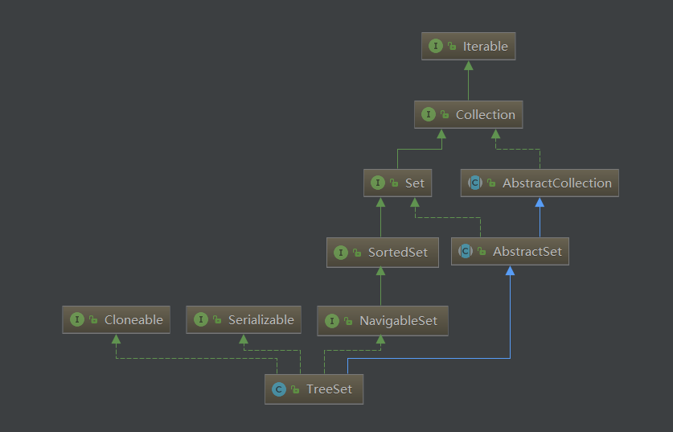

# TreeSet源码解析
  
TreeSet中实现是借助于TreeMap，在TreeSet中的属性NavigableMap，在默认构造器中会new一个TreeMap，借助实现
```java
public TreeSet() {
        this(new TreeMap<E,Object>());
    }
TreeSet(NavigableMap<E,Object> m) {
        this.m = m;
    }
public boolean add(E e) {
        return m.put(e, PRESENT)==null;
    }
```